# 🏗️ Архітектурний огляд — Energy Monitor ULTIMATE

> Версія: 3.1 STABLE · Python 3.11+ · PostgreSQL (Neon Cloud) · Streamlit · LSTM

Цей документ — швидкий технічний огляд архітектури для нових розробників і академічної комісії.

---

## 🗂️ Шари архітектури (Layered Architecture)

```mermaid
%%{init: {'theme': 'dark'}}%%
graph TB
    subgraph UI["🌐 Рівень представлення (Streamlit)"]
        direction LR
        A1["📊 KPI Панель"]
        A2["📈 ML Прогноз"]
        A3["🗺️ ГІС Карта"]
        A4["⚠️ Аварії"]
        A5["📜 Архів"]
    end

    subgraph CORE["🧠 Інтелектуальний шар"]
        direction LR
        B1["LSTM v3\npredict_v2.py"]
        B2["ARIMA Fallback\nbaseline_arima.py"]
        B3["Фізичний двигун\nphysics.py"]
        B4["Векторизатор\n(Sliding Window)"]
    end

    subgraph DATA["💾 Шар даних (OLAP)"]
        direction LR
        C1[("PostgreSQL\nNeon Cloud")]
        C2["Кеш\n(TTL 24h)"]
        C3["Цифровий двійник\nСимуляція сенсорів"]
    end

    subgraph DEVOPS["⚙️ DevOps Шар"]
        direction LR
        D1["GitHub Actions\nCI/CD"]
        D2["Docker\nКонтейнер"]
        D3["Render.com\nSaaS Розгортання"]
    end

    UI -->|"Запит даних"| CORE
    CORE -->|"SQL SELECT"| DATA
    C3 -->|"SQL INSERT телеметрія"| C1
    B1 & B2 -->|"Ланцюг Fallback"| UI
    DEVOPS -->|"Авто-розгортання"| UI

    style UI fill:#0d1117,stroke:#58a6ff
    style CORE fill:#0d1117,stroke:#ffb703
    style DATA fill:#0d1117,stroke:#00ff88
    style DEVOPS fill:#0d1117,stroke:#ff6b6b
```



---

## ⚡ Стратегія синхронізації UI (Фрагменти)
В системі реалізовано **Granular Rendering Pattern** на основі `@st.fragment`.

- **Оркестрація**: `dashboard.py` виступає як диспетчер, який передає у вкладки не масивні DataFrame, а легкі словники параметрів фільтрації.
- **Незалежність**: Карта (`tab_map`) та KPI (`live_telemetry`) оновлюються у фоні кожні 5-15 секунд, не перериваючи роботу користувача з налаштуваннями чи AI-моделями.
- **Безпека перезавантажень**: Спеціальна обробка `RerunException` та `StopException` у завантажувачах даних гарантує, що автоматичні оновлення не конфліктують з операціями запису в базу даних.

---

## 🤖 ML Pipeline (Конвеєр МН)

| Крок | Модуль | Дія |
|------|--------|-----|
| 1. Збір даних | `vectorizer.py` | SQL SELECT → DataFrame (48 рядки) |
| 2. Інженерія ознак | `vectorizer.py` | sin/cos кодування часу, ffill/bfill |
| 3. Нормалізація | `vectorizer.py` | MinMaxScaler → матриця (48, 9) |
| 4. Предикція | `predict_v2.py` | LSTM.predict() × 24 кроки |
| 5. Domain Adaptation | `predict_v2.py` | Автоскейлінг під підстанцію |
| 6. Fallback | `baseline_arima.py` | SARIMA якщо LSTM недоступний |
| 7. Бектест | `backtest.py` | RMSE / MAE / MAPE / R² + Shapiro-Wilk |

---

## 📦 Структура модулів

```text
Energy Monitor ULTIMATE
│
├── main.py                    ← Точка входу (Streamlit оркестратор)
│
├── core/                      ← Аналітичне ядро
│   ├── analytics/
│   │   ├── physics.py         ← Фізика мереж (AC/HVDC, теплові моделі)
│   │   ├── aggregator.py      ← OLAP агрегація
│   │   ├── clustering.py      ← K-Means кластеризація підстанцій
│   │   └── filter.py          ← Фільтрація DataFrame
│   └── database/
│       └── loader.py          ← Верифікований завантажувач даних
│
├── ml/                        ← AI Pipeline
│   ├── predict_v2.py          ← LSTM контролер + Domain Adaptation
│   ├── vectorizer.py          ← Sliding Window + Feature Engineering
│   ├── metrics_engine.py      ← RMSE/MAE/MAPE/R² + Статистичний аудит
│   ├── backtest.py            ← Бектест на historical даних
│   ├── baseline_arima.py      ← SARIMA Fallback
│   └── train_lstm.py          ← Навчання моделі
│
├── src/                       ← Серверні сервіси
│   ├── core/
│   │   ├── database.py        ← Підключення до Neon PostgreSQL
│   │   └── physics.py         ← Серверна фізика
│   └── services/
│       ├── sensors_db.py      ← Digital Twin симуляція сенсорів (15 хв)
│       ├── db_seeder.py       ← Генерація тестових даних
│       ├── data_generator.py  ← ETL симулятор навантаження
│       └── advanced_mining.py ← Аналіз трендів і патернів
│
├── ui/                        ← Інтерфейс (Streamlit)
│   ├── components/            ← Спільні компоненти (стилі, картки)
│   ├── segments/              ← Структурні блоки (sidebar, dashboard)
│   └── views/                 ← Сторінки (kpi, прогноз, аварії, карта...)
│
├── utils/                     ← Утиліти
│   ├── cache_manager.py       ← TTL-кеш автоочищення (24h)
│   ├── error_handlers.py      ← Декоратори (robust_ml, robust_db)
│   ├── memory_helper.py       ← Auto-GC спостереження
│   └── logging_config.py      ← Централізований логер
│
└── tests/                     ← Автоматичне тестування
    ├── test_physics.py        ← Фізична валідація (5 тестів)
    ├── test_ml_model.py       ← ML Pipeline тести (11 тестів)
    ├── test_core_analytics.py ← OLAP аналітика (11 тестів)
    ├── test_security.py       ← Тести безпеки (26 тестів)
    ├── test_utils.py          ← Утиліти (19 тестів)
    ├── test_pipeline.py       ← Інтеграційні тести (3 тести)
    └── test_database.py       ← Тести БД (4 тести)
```

---

## ⚙️ CI/CD Pipeline (GitHub Actions)

```mermaid
%%{init: {'theme': 'dark'}}%%
flowchart LR
    Push["git push\nmain"] --> Lint["🧹 Lint\nflake8 + pylint"]
    Lint --> Types["🔍 Type Check\nmypy"]
    Types --> Tests["🧪 Unit Tests\npytest (79 tests)"]
    Tests --> Security["🛡️ Security\nbandit + detect-secrets"]
    Security --> Docker["🐳 Docker Build\n& Push"]
    Docker --> Deploy["🚀 Deploy\nRender.com"]

    style Push fill:#1f2937,stroke:#58a6ff
    style Deploy fill:#065f46,stroke:#00ff88
```



---

## 🔒 Модель безпеки

| Загроза | Захист | Модуль |
|---------|--------|--------|
| SQL ін'єкції | Параметризовані запити + whitelist | `utils/validators.py` |
| Витік секретів | `.env` + GitHub Secrets | `.env.example` |
| Hardcoded creds | `detect-secrets` в CI | `.github/workflows` |
| Вразливий код | Bandit SAST сканування | CI Pipeline |
| XSS | Streamlit sandbox + санітизація | `test_security.py` |

---

## 📊 Метрики якості (Версія 3.1)

| Метрика | Значення |
|---------|----------|
| **Тести** | ✅ 79 пройдено, 0 помилок |
| **Час тестування** | 13.71s |
| **Покриття гілок** | ~65% (ціль: >90%) |
| **Type Coverage** | ~60% (ціль: >90%) |
| **Кеш (TTL 24h)** | 10 файлів (316 МБ, тільки .graphml карти) |
| **Розгортання** | Render.com + Docker (auto-deploy) |
| **Uptime** | 99%+ (SARIMA fallback) |

---

## 🚀 Швидкий старт

```bash
# Клонувати репозиторій
git clone https://github.com/Lutvunenko-Dmutro/EnergyMonitor-OLAP.git
cd EnergyMonitor-OLAP

# Встановити залежності
python -m venv .venv && .venv\Scripts\activate
pip install -r requirements.txt

# Налаштувати середовище
cp .env.example .env  # заповнити своїми DB credentials

# Запустити тести
pytest tests/ -v

# Запустити дашборд
streamlit run main.py
```

**Live Demo:** [energymonitor-olap.onrender.com](https://energymonitor-olap.onrender.com/)
