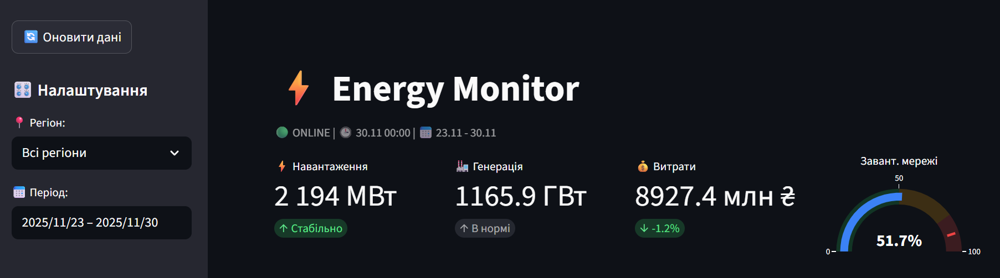
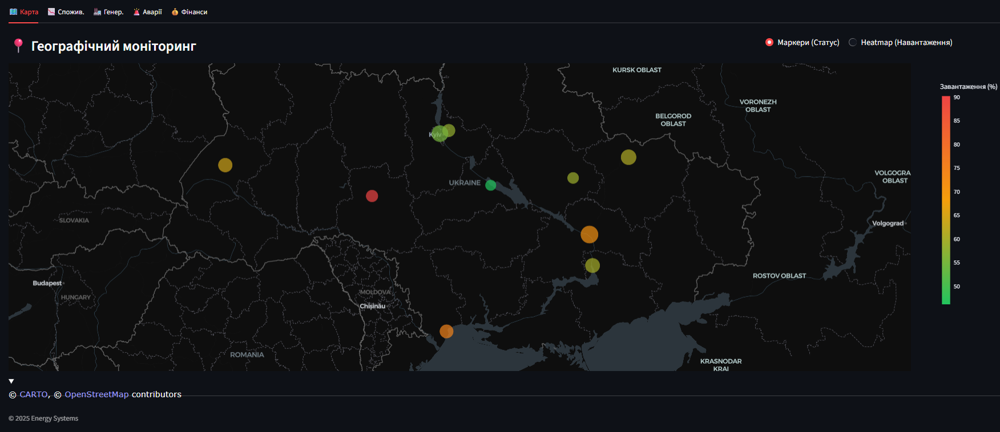
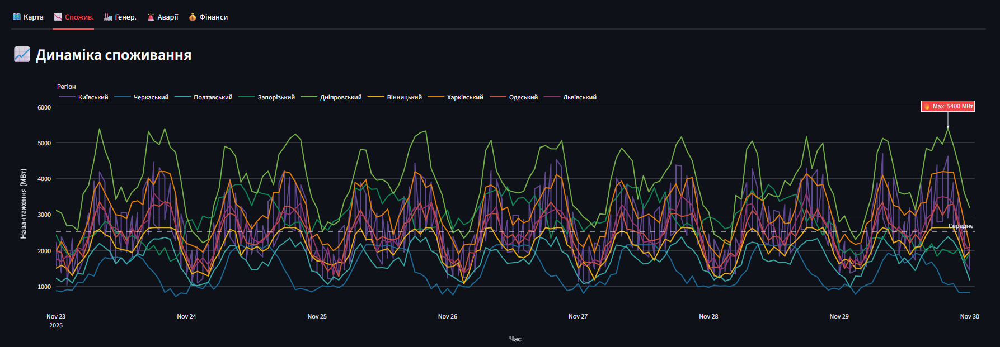
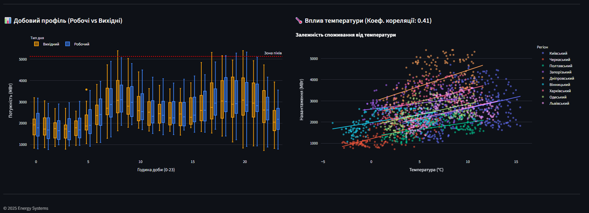
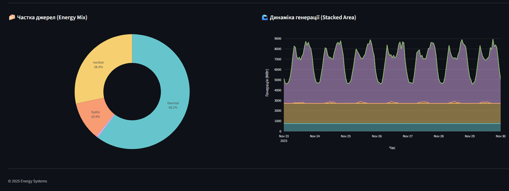
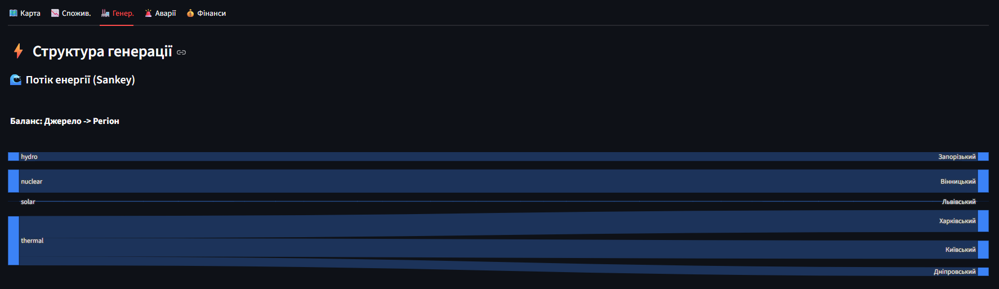
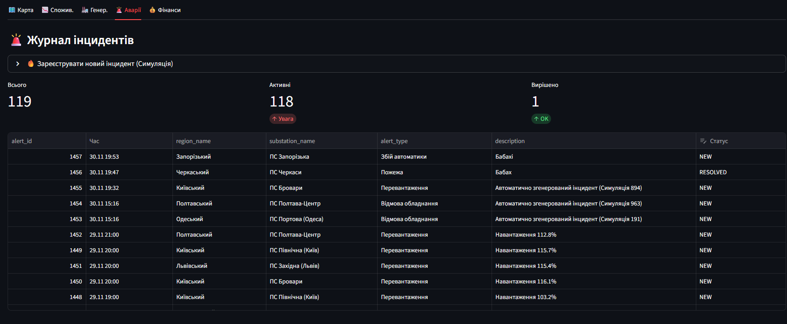
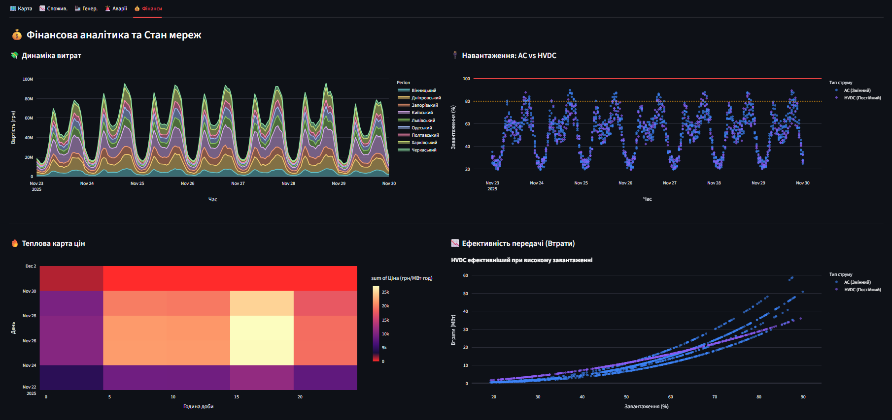

 
# ⚡ Energy Monitor ULTIMATE: Інтелектуальна система аналізу енергомережі

<div align="center">


</div>

**Energy Monitor ULTIMATE** — це комплексна, інтерактивна BI-система (Business Intelligence) нового покоління, розроблена для моніторингу, глибокого аналізу та прогнозування стану об'єднаної енергетичної системи України.

Цей проєкт виходить далеко за межі традиційних дашбордів візуалізації, пропонуючи повноцінну реалізацію архітектури **OLAP (On-Line Analytical Processing)**. Це дозволяє користувачам виконувати складний багатовимірний аналіз даних у режимі реального часу, використовуючи операції:
* **Slicing:** вибір зрізу даних за одним критерієм.
* **Dicing:** вибір підмножини даних за кількома критеріями.
* **Drill-down:** перехід від загальних показників до детальних.

Система перетворює "сирі" терабайти телеметрії на структуровані знання, необхідні для прийняття обґрунтованих управлінських рішень. Вона поєднує найкращі практики з різних доменів:
* **SCADA** — для оперативного контролю в реальному часі.
* **GIS** — для просторового аналізу інфраструктури.
* **ERP** — для фінансового аудиту та планування ресурсів.

Це створює єдину точку входу та джерело правди для диспетчерів, енергетичних аналітиків та менеджерів енергокомпаній.



---

## 🚀 Основні можливості та Модулі системи

Система побудована за модульним принципом, де кожен компонент відповідає за свій шар аналітики.

### 1. 🗺️ Географічний моніторинг (GIS-аналітика)
Цей модуль є "очима" диспетчера. Він перетворює табличні дані на інтуїтивно зрозумілу карту, дозволяючи миттєво оцінити ситуацію та локалізувати проблеми.



* **Інтерактивна візуалізація:** Використання Plotly та Mapbox для відображення підстанцій та генерації з точними координатами.
* **Маркери статусів:**
    * 🟢 **Зелений:** Нормальна робота.
    * 🟡 **Жовтий:** Підвищене навантаження.
    * 🔴 **Червоний:** Критичне перевантаження/аварія.
    * *Розмір маркера залежить від номінальної потужності (MW).*
* **Heatmap (Теплова карта):** Агрегація навантаження по кластерах для виявлення енергодефіцитних районів.
* **Drill-down:** Спливаючі вікна з повним технічним паспортом об'єкта при наведенні.

### 2. 📉 Глибока аналітика споживання (Demand Side Analysis)
Вивчення попиту, поведінкових патернів та факторів впливу.

* **Аналіз часових рядів:** Динаміка з точністю до хвилини, порівняння "план-факт", виявлення сезонності.



* **Статистичне профілювання (Box Plots):** Сегментація на "Робочі" та "Вихідні" дні для виявлення типових профілів та аномалій.
* **Кореляційний аналіз (Weather Impact):** Регресійний аналіз (OLS) залежності споживання від температури. Scatter Plot візуалізує коефіцієнт термочутливості.



### 3. 🏭 Структура та Динаміка Генерації (Supply Side)
Повна картина виробництва електроенергії для балансування системи.

* **Energy Mix:** Динамічна кругова діаграма часток джерел енергії (оцінка вуглецевого сліду та маневреності).
* **Часова динаміка (Stacked Area Chart):** Графік покриття навантаження, що демонструє роботу базової та маневрової генерації.



* **Енергетичний баланс (Sankey Diagram):** Візуалізація потоків енергії від генерації (АЕС, ТЕС, ГЕС, ВДЕ) до регіонів споживання.



### 4. 🚨 Центр керування інцидентами (Incident Management System)
Підсистема класу CRM/Service Desk для диспетчерів.

* **Симуляція аварій:** Генерація тестових інцидентів (кібератаки, розриви ліній) для стрес-тестування.
* **Інтерактивний журнал:** Workflow обробки заявки (NEW -> ACKNOWLEDGED -> RESOLVED) із записом у PostgreSQL.
* **Оперативні KPI:** Метрики ефективності (кількість аварій, час реакції).



### 5. 💰 Фінансовий та Технічний моніторинг
Поєднання економіки з фізикою мережі.

* **Економіка енергетики:** Розрахунок вартості на основі динамічних тарифів.
* **HVDC моделювання:** Порівняння ефективності ліній AC та DC, аналіз втрат.
* **Heatmap цін:** Матриця "День-Година" для планування енергоємних процесів (Demand Response).



## 🛠️ Технологічний стек та Архітектура

Проєкт побудований на сучасному, надійному стеку технологій, що забезпечує масштабованість, безпеку та високу швидкодію.

* **Мова програмування:** `Python 3.10+` — стандарт де-факто для Data Science та аналітики.
* **Frontend / BI Framework:** `Streamlit` — інноваційний фреймворк для швидкої розробки веб-додатків, орієнтованих на дані.
* **Візуалізація даних:** `Plotly Express & Graph Objects` — інтерактивні графіки з апаратним прискоренням WebGL.
* **База даних:** `PostgreSQL` — потужна об'єктно-реляційна СУБД для надійного зберігання телеметрії та журналів.
* **ETL & Data Processing:**
    * `Pandas` & `NumPy`: Очищення, агрегація та статистичний аналіз часових рядів.
    * `SQLAlchemy`: ORM для безпечної взаємодії з БД (захист від SQL-ін'єкцій).
* **Статистика та ML:** `Statsmodels` — побудова статистичних моделей (лінійна регресія OLS).

---

## ⚙️ Інструкція з Встановлення та Запуску

### Крок 1. Клонування репозиторію
```bash
git clone https://github.com/Lutvunenko-Dmutro/EnergyMonitor-OLAP.git
```
```
cd EnergyMonitor-OLAP
````

### Крок 2. Налаштування бази даних

1.  Встановіть PostgreSQL.
2.  Створіть базу даних `energy_monitor`.
3.  Виконайте SQL-скрипти з папки `sql/`:
      * `01_create_schema.sql` (Таблиці, індекси).
      * `02_insert_static_data.sql` (Довідники).

### Крок 3. Налаштування оточення

Створіть файл `.env` у корені проєкту:

```env
DB_NAME=energy_monitor
DB_USER=postgres
DB_PASSWORD=your_password
DB_HOST=localhost
DB_PORT=5432
```

### Крок 4. Встановлення залежностей

```bash
pip install -r requirements.txt
```

### Крок 5. Генерація даних та Запуск

Запустіть ETL процес для генерації історичних даних:

```bash
python 03_generate_dynamic_data.py
```

Запустіть веб-додаток:

```bash
python -m streamlit run main.py
```

Додаток відкриється за адресою: `http://localhost:8501`.

-----

## 📂 Структура проєкту

```text
├── app/
│   ├── tabs/                 # Компоненти UI (Вкладки дашборду)
│   │   ├── kpi.py            # Верхня панель метрик
│   │   ├── map.py            # GIS аналітика
│   │   ├── consumption.py    # Аналіз споживання
│   │   ├── generation.py     # Візуалізація генерації
│   │   ├── alerts.py         # Журнал аварій
│   │   └── finance.py        # Економіка та втрати
│   ├── database.py           # Підключення до БД
│   ├── queries.py            # SQL-запити
│   └── main.py               # Точка входу
├── sql/                      # SQL скрипти ініціалізації
├── requirements.txt          # Python залежності
├── screenshots/              # Зображення для README
└── README.md                 # Документація
```

-----

### Автор

**Литвиненко Дмитро**

*Розроблено в рамках лабораторної роботи з дисципліни "Інтелектуальний аналіз даних". Проєкт демонструє практичне застосування Data Mining, OLAP та веб-розробки в енергетиці.*

