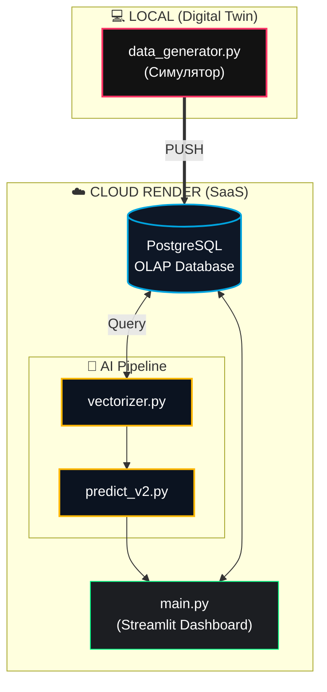

# ⚡ Energy Monitor Ultimate (v3.1 STABLE)

**Інтелектуальна система аналітики та предиктивного моделювання навантаження енергетичних мереж на базі концепції Digital Twin та рекурентних нейромереж LSTM.**

🚀 **Live Production (MaaS/SaaS):** [energymonitor-olap.onrender.com](https://energymonitor-olap.onrender.com/)

### 📄 Статус та Документація
*   [**ARCHITECTURE.md**](ARCHITECTURE.md) — Архітектурна схема системи (NEW ✨).
*   [**PROJECT_STATUS.md**](PROJECT_STATUS.md) — Поточний стан (74 тести / 0 помилок).
*   [**ROADMAP.md**](ROADMAP.md) — План розвитку.
*   [**DEVELOPMENT.md**](DEVELOPMENT.md) — Посібник для розробників.
*   [**DEPLOYMENT.md**](DEPLOYMENT.md) — Інструкція з розгортання.

---

## 🔬 Науково-дослідний базис (Дипломна Робота)

Програмний комплекс розроблено як практичну частину кваліфікаційної роботи на тему:  
**"Прогнозування часових рядів енергоспоживання для вдосконалення технологій Smart City на основі рекурентних нейронних мереж"**

### 🧬 Наукова новизна та практичне значення
1. **Гібридне моделювання (Digital Twin + ML):** Система поєднує стохастичний прогноз (LSTM-мережі) з детермінованими фізичними моделями мережі (розрахунок втрат потужності AC/HVDC, температурна деградація). Це дозволяє не просто екстраполювати ряд, а верифікувати прогноз фізичною спроможністю вузла.
2. **Cloud-Native масштабованість для Smart City:** Успішне розгортання в хмарі (**Render**) демонструє готовність системи до інтеграції в муніципальні сервіси як SaaS-платформи. Це забезпечує централізований моніторинг без потреби в локальних обчислювальних потужностях (Production-ready).

---

## 🧮 Математична модель прогнозування

Математичний апарат аналітичного ядра базується на теорії дискретних динамічних систем та глибокого навчання (Deep Learning) для багатофакторних часових рядів.

### 🧬 1. Інженерія ознак та нормалізація

**Циклічне кодування періодичності:**
Для усунення розривів неперервності (наприклад, $23:59 \rightarrow 00:00$) та збереження сезонності, часові ознаки $h \in [0, 23]$ (година) та $d \in [0, 6]$ (день тижня) переносяться на тригонометричне коло:

$$
\text{hour}_{sin}(t) = \sin\left(\frac{2\pi \cdot h(t)}{24}\right), \quad \text{hour}_{cos}(t) = \cos\left(\frac{2\pi \cdot h(t)}{24}\right)
$$

$$
\text{day}_{sin}(t) = \sin\left(\frac{2\pi \cdot d(t)}{7}\right), \quad \text{day}_{cos}(t) = \cos\left(\frac{2\pi \cdot d(t)}{7}\right)
$$

**Нормалізація ознак ($MinMaxScaler$):**
Масштабування вхідного простору в діапазон $[0, 1]$ призначене для вирівнювання масштабів різних фізичних величин (МВт, % здоров'я, $\text{ppm}$) за формулою:

$$
x'_{i,j} = \frac{x_{i,j} - x_{j}^{min}}{x_{j}^{max} - x_{j}^{min}}
$$

---

### 📦 2. Віконне перетворення простору (Sliding Window)

Для навчання рекурентної моделі вхідний вектор $x_t \in \mathbb{R}^N$ ($N=9$ для версії v3.1) трансформується у 3D-тензор $\mathbf{X}_t$ з глибиною пам'яті $W = 24$ (таймстепів):

$$
\mathbf{X}_t = \begin{pmatrix} 
x_{t-W+1} \\ 
x_{t-W+2} \\ 
\vdots \\ 
x_t 
\end{pmatrix} \in \mathbb{R}^{W \times N}
$$

Вектор ознак:
$$
x_t = [\text{load}, \text{temp}, \text{h2}, \text{health}, \text{air}, \text{h}_{sin}, \text{h}_{cos}, \text{d}_{sin}, \text{d}_{cos}]^T
$$

Цільовий вектор наступної точки ($t+1$):
$$
\mathbf{Y}_{t+1} = \begin{bmatrix} y^{load}_{t+1} \\ y^{health}_{t+1} \end{bmatrix} \in \mathbb{R}^2
$$

---

### 🧠 3. Внутрішня архітектура LSTM-комірки

Предиктивний модуль будується на базі LSTM (Long Short-Term Memory) шарів. Внутрішня динаміка комірки визначається такою логікою:

**1. Forget Gate (Вентіль забування):** Очищує застарілу інформацію.
$$f_t = \sigma(W_f \cdot [h_{t-1}, x_t] + b_f)$$

**2. Input Gate & Candidate State:** Формує нову дохідну інформацію.
$$i_t = \sigma(W_i \cdot [h_{t-1}, x_t] + b_i)$$
$$\tilde{C}_t = \tanh(W_C \cdot [h_{t-1}, x_t] + b_C)$$

**3. Cell State UPDATE (Стан комірки):** Оновлює довготривалу пам'ять.
$$C_t = f_t \odot C_{t-1} + i_t \odot \tilde{C}_t$$

**4. Output Gate & Hidden State:** Обчислює вихідний сигнал.
$$o_t = \sigma(W_o \cdot [h_{t-1}, x_t] + b_o)$$
$$h_t = o_t \odot \tanh(C_t)$$

---

### 📉 4. Функція втрат та оптимізація

Мінімізується **багатовимірна Середньоквадратична Помилка (MSE)** для батчу розміром $M$:

$$
\mathcal{L} = \frac{1}{M \cdot 2} \sum_{i=1}^{M} \left((Y_{i}^{load} - \hat{Y}_{i}^{load})^2 + (Y_{i}^{health} - \hat{Y}_{i}^{health})^2\right) \rightarrow \min
$$

Оновлення ваг виконується за алгоритмом **Adam** через зворотне поширення помилки в часі (**BPTT**).

---

## 👥 Ролі користувачів (User Personas)

Аналітична система спроєктована для двох ключових груп користувачів:
*   **👷 Диспетчер мережі:** Використовує динамічну карту та сервіс аварій для миттєвої реакції на ризики перевантаження вузлів.
*   **📊 Аналітик (Енергетик):** Використовує OLAP-зрізи та прогнозні графіки для планування балансу потужності.

---

## 🔍 Обґрунтування технологічного вибору (Rationale)

*   **PostgreSQL 15 (Neon Cloud):** Вибір обумовлений необхідністю швидкої агрегації часових рядів (`DATE_TRUNC`).
*   **SQLAlchemy ORM:** Реалізує патерн **Data Access Layer (DAL)**, що забезпечує незалежність бізнес-логіки від конкретної СУБД.

---

## 🛠️ Технологічний стек

| Рівень (Layer) | Технології |
| :--- | :--- |
| **Backend & Core** | `Python 3.13`, `SQLAlchemy`, `Psycopg2` |
| **СУБД (Data)** | `PostgreSQL 15` (Агрегація: `DATE_TRUNC`) |
| **Штучний Інтелект** | `TensorFlow/Keras` (LSTM), `scikit-learn`, `ONNX` |
| **Frontend UI** | `Streamlit 1.37+` (Модульний інтерфейс) |
| **Візуалізація** | `Plotly Express`, `Graphviz` |

---

## 📊 Візуальні моделі та діаграми (Mermaid)

### 🗺️ 1. UML Схема Компонентів
Архітектура 4-шарової структури (Layers) з розділенням середовищ:


```mermaid
graph TD
    classDef edge fill:#121212,stroke:#ff3366,stroke-width:2px,color:#fff;
    classDef db fill:#0e1726,stroke:#00a4df,stroke-width:2px,color:#fff;
    classDef ml fill:#0b1320,stroke:#ffb703,stroke-width:2px,color:#fff;
    classDef ui fill:#1c1e22,stroke:#00ff88,stroke-width:1px,color:#fff;

    subgraph Local ["💻 LOCAL (Digital Twin)"]
        DG["data_generator.py\n(Симулятор)"]:::edge
    end

    subgraph Render ["☁️ CLOUD RENDER (SaaS)"]
        DB[(PostgreSQL\nOLAP Database)]:::db
        subgraph Pipeline ["🧠 AI Pipeline"]
            Vect["vectorizer.py"]:::ml
            Pred["predict_v2.py"]:::ml
        end
        UI["main.py\n(Streamlit Dashboard)"]:::ui
    end

    DG ==>|"PUSH"| DB
    DB <-->|"Query"| Vect
    Vect --> Pred
    Pred --> UI
    DB <--> UI
```

---

## 🧪 Тестування та Гарантія Якості (QA)

### Об'єкти тестування:
* **Digital Twin Fidelity:** Верифікація фізичних законів у `test_physics.py` (напр., генерація сонячної енергії вночі $\approx 0$).
* **ML Reliability:** Тестування входу/виходу LSTM конвеєра та стабільності нормалізації.
* **Security Validation:** 26 тестів на захист від SQL-ін'єкцій та XSS.

**Запуск тестів:**
```bash
# Всі 74 тести
pytest tests/ -v
```

**Поточний результат:**
`74 passed, 0 failed — 13.71s ✅`

---

## 📈 Економічне обґрунтування (OPEX Savings)

Впровадження системи для умовного міста з **500,000 населення** забезпечує високий економічний ефект за рахунок **предиктивного обслуговування (Predictive Maintenance)**.

### 💰 Розрахунок ефекту:
* **Прогнозне зниження витрат на ремонти:** **$20\%$** (галузевий стандарт PdM).
* **Економія за рахунок Health Score:** Усунення каскадних аварій через раннє сповіщення про деградацію трансформаторів.
* **Чиста річна економія:** $\approx \mathbf{5,500,000}$ **грн/рік**.

---

## 🛡️ Безпека та Відмовостійкість (Resilience)

*   **SQL Injection Protection:** Реалізовано через параметризацію ORM та whitelist-валідатори.
*   **Zero-Failure Fallback:** При збої AI-обчислень система автоматично переходить на статистичний бейзлайн (Seasonal Naive).
*   **Auto-GC Watchdog:** Автоматичне керування пам'яттю для стабільної роботи на Free-хостингах.

---

## 💻 Інструкція з розгортання

### 1. Тренування ШІ-моделей
```bash
# Тренування версії V3
python ml/train_lstm.py --version v3
```

### 2. Запуск локально
```bash
python -m venv .venv
.venv\Scripts\activate
pip install -r requirements.txt
streamlit run main.py
```

---

**Happy monitoring! 🚀✨**
