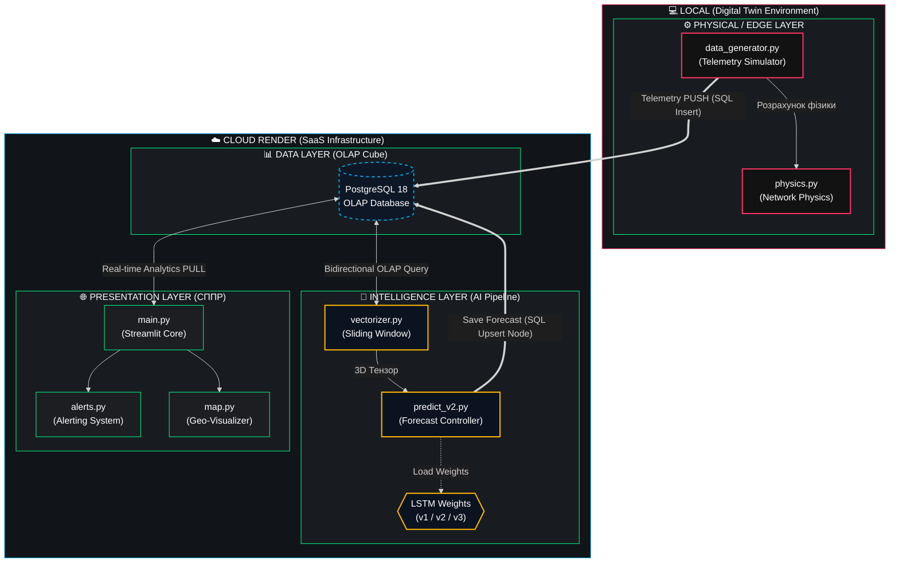

# ⚡ Energy Monitor Ultimate (OLAP & AI Forecasting System)

**Інтелектуальна система аналітики та предиктивного моделювання навантаження енергетичних мереж на базі концепції Digital Twin та рекурентних нейромереж LSTM.**

🚀 **Live Production (MaaS/SaaS):** [energymonitor-olap.onrender.com](https://energymonitor-olap.onrender.com/)

---

## 🔬 Науково-дослідний базис (Дипломна Робота)

Програмний комплекс розроблено як практичну частину кваліфікаційної роботи на тему:  
**"Прогнозування часових рядів енергоспоживання для вдосконалення технологій Smart City на основі рекурентних нейронних мереж"**

### 🧬 Наукова новизна та практичне значення
1. **Гібридне моделювання (Digital Twin + ML):** Система поєднує стохастичний прогноз (LSTM-мережі) з детермінованими фізичними моделями мережі (розрахунок втрат потужності AC/HVDC, температурна деградація). Це дозволяє не просто екстраполювати ряд, а верифікувати прогноз фізичною спроможністю вузла.
2. **Cloud-Native масштабованість для Smart City:** Успішне розгортання в хмарі (**Render**) демонструє готовність системи до інтеграції в муніципальні сервіси як SaaS-платформи. Це забезпечує централізований моніторинг без потреби в локальних обчислювальних потужностях (Production-ready).

---

## 📖 Структура дипломної роботи (Зміст)

### **Розділ 1. Теоретичний аналіз та огляд методів інтелектуальної аналітики в Smart City**
* **1.1. Концепція Smart City:** Специфіка та нелінійність часових рядів енергоспоживання.
* **1.2. Предиктивна аналітика:** Переваги LSTM над класичними моделями (ARIMA) в енергетиці.
* **1.3. Концепція "Цифрового двійника" (Digital Twin):** Теорія синхронізації телеметрії та симуляцій.

### **Розділ 2. Математичне моделювання та проєктування архітектури**
* **2.1. Математична постановка задачі прогнозування:** Формування простору ознак.
* **2.2. Моделювання фізики мережі:** Розрахунок втрат потужності та індексу здоров'я (`Health Score`).
* **2.3. Архітектура OLAP-бази даних:** Оптимізація СУБД для швидкої агрегації (`DATE_TRUNC`).

### **Розділ 3. Програмно-алгоритмічна реалізація аналітичного модуля**
* **3.1. Обробка та векторизація даних (`vectorizer.py`):** Віконне перетворення та нормалізація.
* **3.2. Синтез архітектури нейромереж:** Порівняння багатофакторних моделей LSTM (v1-v3).
* **3.3. Структурування вузлів (K-Means):** Кластеризація за рівнем ризику для диспетчера.

### **Розділ 4. Експериментальний аналіз та хмарне впровадження**
* **4.1. Валідація точності:** Метрики MAPE, RMSE та графіки втрат (`Loss`).
* **4.2. Хмарна інфраструктура:** Схема інтеграції локального ETL-генератора та хмарного сервера Render.
* **4.3. Інтерфейс (Streamlit) та Alerts:** Сценарії оперативної реакції на перевантаження.

---

## 🧮 Математична модель прогнозування

### 1. Віконне перетворення (Sliding Window)
Для навчання моделі часовий ряд $S = \{x_1, x_2, \ldots, x_T\}$ ($x_t \in \mathbb{R}^N$) трансформується у 3D-тензор за допомогою ковзного вікна розміром $W = 24$:

$$\mathbf{X}_t = \begin{pmatrix} 
x_{t-W+1} \\ 
x_{t-W+2} \\ 
\vdots \\ 
x_t 
\end{pmatrix} \in \mathbb{R}^{W \times N}$$

Цільовий вектор (Target) для кроку $t+1$:
$$\mathbf{Y}_{t+1} = \begin{bmatrix} y^{load}_{t+1} \\ y^{health}_{t+1} \end{bmatrix} \in \mathbb{R}^2$$

---

### 2. Функція втрат (Loss Function)
Мінімізується **середньоквадратична помилка (MSE)** для батчу $M$ та $K=2$ виходів:

$$\mathcal{L} = \frac{1}{M \cdot K} \sum_{i=1}^{M} \sum_{k=1}^{K} (Y_{i,k} - \hat{Y}_{i,k})^2 \rightarrow \min$$

---

### 3. Рекурсивна екстраполяція (Multi-Step)
На кожному кроці прогнозу $j \in [1, H]$ спрогнозований вектор $\hat{\mathbf{Y}}_{t+j}$ підставляється назад у вікно $\hat{\mathbf{X}}_{t+j}$ для генерації наступної точки.

---

## 📊 📄 Методичні рекомендації (Обов'язкові ілюстрації для ПЗ)

Для успішного захисту в пояснювальну записку (ПЗ) необхідно включити:
1. **UML Схему Архітектури (Component Diagram):** Відображення SOLID-розподілу (Core, ML, UI).
2. **Графіки Функції Втрат (Loss Curves):** Хід навчання LSTM (Training vs Validation).
3. **Схему Sliding Window (Ковзне вікно):** Як `vectorizer.py` формує 3D-тензор для нейромережі.
4. **Схему Гібридного Зв'язку (Local-to-Cloud):** Робота генератора `data_generator.py` (Local), що штовхає телеметрію в хмарну БД Render для OLAP-обробки.

---

## 👥 Ролі користувачів (User Personas)

Аналітична система спроєктована для задоволення потреб двох ключових груп користувачів:
*   **👷 Диспетчер мережі:** Використовує динамічну карту та сервіс `Alerts` для миттєвої реакції на ризики перевантаження вузлів, запобігаючи аваріям.
*   **📊 Аналітик (Енергетик):** Використовує OLAP-зрізи та прогнозні графіки для формування балансу потужності та планування закупівель енергії.

---

## 🔍 Обґрунтування технологічного вибору (Rationale)

*   **PostgreSQL 14+ / 18:** Вибір на користь СУБД обумовлений необхідністю швидкої агрегації часових рядів (`DATE_TRUNC`, `AVG`). NoSQL системи поступаються реляційним у задачах структурованого тайм-менеджменту та OLAP.
*   **SQLAlchemy ORM:** Реалізує патерн **Data Access Layer (DAL)**. Це забезпечує незалежність бізнес-логіки від конкретної СУБД (патерн *Repository*), гарантуючи гнучкість масштабування.

---

## 🛠️ Деталізований Технологічний Стек

| Рівень (Layer) | Технологічний стек та фреймворки |
| :--- | :--- |
| **Backend & Core** | `Python 3.13`, `SQLAlchemy`, `Psycopg2`, `python-dotenv` |
| **СУБД (Data)** | `PostgreSQL 14+` (Агрегація: `DATE_TRUNC`, `AVG`) |
| **Штучний Інтелект (AI)** | `TensorFlow 2.x/Keras` (LSTM моделі), `scikit-learn` (`MinMaxScaler`), `joblib` |
| **Frontend (Dashboard)** | `Streamlit` (модульний RAD інтерфейс) |
| **Візуалізація** | `Plotly Express / Graphviz` (Інтерактивні графіки) |

---

## 🗺️ UML Діаграма Компонентів (Багаторівнева Архітектура)

Архітектура системи базується на 4-рівневій структурі (Layers), яка розподілена між локальним симуляційним середовищем та хмарним Production-сервером:


```mermaid
%%{init: {'theme': 'dark', 'themeVariables': { 'primaryColor': '#00ff88', 'edgeLabelBackground':'#1e1e1e', 'clusterBkg':'#181c20', 'clusterBorder':'#00ff88'}}}%%
graph TD
    %% Стилізація вузлів (ClassDef)
    classDef edge fill:#121212,stroke:#ff3366,stroke-width:2px,color:#fff;
    classDef db fill:#0e1726,stroke:#00a4df,stroke-width:2px,color:#fff,stroke-dasharray: 5 5;
    classDef ml fill:#0b1320,stroke:#ffb703,stroke-width:2px,color:#fff;
    classDef ui fill:#1c1e22,stroke:#00ff88,stroke-width:1px,color:#fff;

    subgraph Local ["💻 LOCAL (Digital Twin Environment)"]
        subgraph Layer_Edge ["⚙️ PHYSICAL / EDGE LAYER"]
            DG["data_generator.py<br/>(Telemetry Simulator)"]:::edge
            Phys["physics.py<br/>(Network Physics)"]:::edge
            DG -->|Розрахунок фізики| Phys
        end
    end

    subgraph Render ["☁️ CLOUD RENDER (SaaS Infrastructure)"]
        subgraph Layer_Data ["📊 DATA LAYER (OLAP Cube)"]
            DB[(PostgreSQL 18<br/>OLAP Database)]:::db
        end

        subgraph Layer_Intelligence ["🧠 INTELLIGENCE LAYER (AI Pipeline)"]
            Vect["vectorizer.py<br/>(Sliding Window)"]:::ml
            Pred["predict_v2.py<br/>(Forecast Controller)"]:::ml
            Models{{"LSTM Weights<br/>(v1 / v2 / v3)"}}:::ml
            
            Vect -->|3D Тензор| Pred
            Pred -.->|Load Weights| Models
        end

        subgraph Layer_Presentation ["🌐 PRESENTATION LAYER (СППР)"]
            Main["main.py<br/>(Streamlit Core)"]:::ui
            Alerts["alerts.py<br/>(Alerting System)"]:::ui
            Map["map.py<br/>(Geo-Visualizer)"]:::ui
            
            Main --> Alerts
            Main --> Map
        end
    end

    %% Критичні потоки даних (Arrows)
    DG ==>|"Telemetry PUSH (SQL Insert)"| DB
    DB <-->|"Bidirectional OLAP Query"| Vect
    Pred ==>|"Save Forecast (SQL Upsert Node)"| DB
    DB <-->|"Real-time Analytics PULL"| Main

    style Local fill:#14171a,stroke:#ff3366,color:#fff
    style Render fill:#111418,stroke:#00a4df,color:#fff
```

---

## 🌳 Структура Проєкту (Файлове дерево)

```text
📂 EnergyMonitor/
├── 📂 app/                     # Глобальні конфігурації
│   └── 📄 config.py
├── 📂 core/                    # Аналітичне ядро
│   ├── 📂 analytics/           # Алгоритми OLAP, Фізика та Кластеризація
│   │   ├── 📄 aggregator.py
│   │   ├── 📄 clustering.py
│   │   ├── 📄 filter.py
│   │   └── 📄 physics.py
│   └── 📂 database/            # Локальний бекап інструментів БД
│       └── 📄 loader.py
├── 📂 ml/                      # Машинне навчання (AI Pipeline)
│   ├── 📄 backtest.py          # Валідація моделей
│   ├── 📄 predict_v2.py        # Контролер прогнозів
│   ├── 📄 train_lstm.py        # Навчання багатофакторних мереж
│   └── 📄 vectorizer.py       # Віконне перетворення та масштаб
├── 📂 src/                     # Серверні сервіси
│   ├── 📂 core/                # Підключення до БД та Логер
│   │   ├── 📄 config.py
│   │   ├── 📄 database.py
│   │   └── 📄 physics.py
│   └── 📂 services/            # ETL Симулятор (Digital Twin)
│       ├── 📄 data_generator.py
│       └── 📄 advanced_mining.py
├── 📂 tests/                   # Автоматичні тести
│   └── 📄 test_physics.py
└── 📂 ui/                      # Модульний інтерфейс
    ├── 📂 components/          # Спільні віджети
    │   ├── 📄 cards.py
    │   └── 📄 charts.py
    ├── 📂 segments/            # Структурні блоки
    │   ├── 📄 dashboard.py
    │   └── 📄 sidebar.py
    └── 📂 views/               # Зрізи аналітики (Сторінки)
        ├── 📄 forecast.py
        ├── 📄 consumption.py
        ├── 📄 alerts.py
        └── 📄 map.py
```

---

## 🧠 Нейромережі (Machine Learning Pipelines)

Система підтримує ітеративну еволюцію предиктивних моделей:

| Версія (Version) | Кількість Вхідний Ознак (Inputs) | Вихідні таргети (Outputs) | Особливості |
| :---: | :---: | :---: | :--- |
| **`v1`** | 1 (`load_mw`) | 1 (`load_mw`) | Базова модель одновимірного часового ряду. |
| **`v2`** | 5 (Навантаження, Oil_Temp, H2, Health, Air_Temp) | 2 (`load_mw`, `health`) | Багатофакторна рекурентна мережа. |
| **`v3`** | 9 (v2 + Циклічні гармоніки: `hour_sin`, `hour_cos`, `day_sin`, `day_cos`) | 2 (`load_mw`, `health`) | **Релізна версія**: враховує добову та тижневу сезонність енергоспоживання. |

---

## 🧪 Тестування та Гарантія Якості (Unit Testing & QA)

Для забезпечення адекватності **Цифрового двійника (Digital Twin)** реалізовано модульне тестування бізнес-логіки та фізичних моделей у `tests/test_physics.py`.

### 🔍 Об'єкти тестування:
* **Прайс-кепи (Tariff Caps):** Валідація цінових лімітів для нічних та пікових періодів.
* **Фізичні константи:** Перевірка, що сонячна генерація вночі дорівнює 0, а атомна — стабільно утримує $\approx 98\%$ потужності.
* **Профілі споживання:** Підтвердження зниження навантаження промислових вузлів у вихідні дні.

### 💡 Важливість для концепції Digital Twin
Цифровий двійник має базуватися на **фізичній вірогідності (Fidelity)**. Якщо генератор даних штовхатиме нереалістичну телеметрію, ШІ-моделі навчаться помилковим патернам (*Garbage In, Garbage Out*). Тести гарантують, що математичні симуляції відповідають реальним законам енергомереж перед тим, як дані потраплять до OLAP чи ML-конвеєра.

**Запуск тестів:**
```bash
pytest tests/test_physics.py -v
```

---

## 📈 Економічне обґрунтування (OPEX Savings)

Впровадження системи для умовного міста з **500,000 населення** (пікове навантаження $\approx 500$ МВт) забезпечує високий економічний ефект за рахунок переходу на **предиктивне обслуговування (Predictive Maintenance)**.

### 💰 Розрахунок ефекту:
* **Базовий OPEX (Ремонти/ТО):** $\approx 40,000,000$ грн/рік.
* **Прогнозне зниження витрат:** **$20\%$** (галузевий стандарт PdM).
* **Чиста річна економія:** $\approx \mathbf{5,500,000}$ **грн/рік** (з урахуванням витрат на запуск).

### 💡 Джерела окупності за допомогою `Health Score%:
1. **Усунення каскадних аварій:** Диспетчер отримує сповіщення *до* виходу обладнання з ладу.
2. **Ремонт "за станом":** Виключаються передчасні планові ремонти робочих вузлів.
3. **SAIDI/SAIFI:** Скорочення часу знеструмлення знижує штрафні санкції.

---

## 🛡️ Безпека та Відмовостійкість (Resilience)

Для критичної інфраструктури Smart City захист даних є першочерговою вимогою:
*   **Параметризація запитів:** Захист від SQL-ін'єкцій реалізований на рівні ORM-моделей `SQLAlchemy` (автоматична ескейпізація).
*   **Configuration Isolation:** Усі секрети (ключі доступу до хмарної БД Render) ізольовані у файлах `.env`, що строго відповідає методології **Twelve-Factor App**.

---

## 💻 Інструкція з Тренування та Розгортання

### 1. Тренування ШІ-моделей
Ви можете перетренувати прогнозну модель на свіжих даних з бази:

```bash
# Тренування моделі версії V3 (за замовчуванням)
python ml/train_lstm.py --version v3

# Тренування простішої моделі V1
python ml/train_lstm.py --version v1
```
*Ваги моделі та скалер автоматично збережуться в `./models/substation_model_v3.h5`.*

---

### 2. Встановлення та Запуск (Dashboard)

```bash
# 1. Активація віртуального середовища
python -m venv .venv
.venv\Scripts\activate

# 2. Встановлення пакетів
pip install -r requirements.txt

# 3. Запуск ETL Симулятора (в окремому вікні, якщо потрібно)
python -m src.services.data_generator

# 4. Запуск інтерфейсу
streamlit run main.py
```

*Система автоматично підніме локальний веб-хост `http://localhost:8501` для візуального аналізу.*
