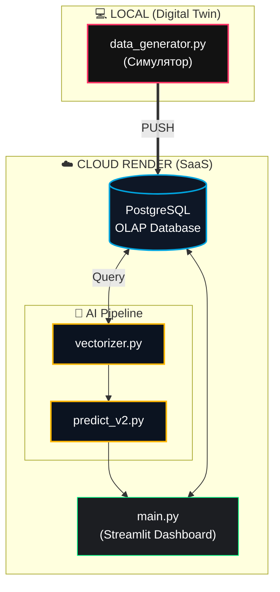

[🇺🇸 English](README.md) | [🇺🇦 Українська](README.uk.md)

---

# ⚡ Energy Monitor Ultimate (v3.1 STABLE)

<p align="left">
  <a href="https://github.com/Lutvunenko-Dmutro/EnergyMonitor-OLAP/actions"></a>
  <a href="https://www.python.org"></a>
  <a href="#-тестування-та-гарантія-якості-qa"></a>
  <a href="#-математична-модель-прогнозування"></a>
  <a href="https://opensource.org/licenses/MIT"></a>
</p>

**Інтелектуальна система аналітики та предиктивного моделювання навантаження енергетичних мереж на базі концепції Digital Twin та рекурентних нейромереж LSTM.**

🚀 **Live Production (MaaS/SaaS):** [energymonitor-olap.onrender.com](https://energymonitor-olap.onrender.com/)  
📖 **Live Documentation (ProperDocs):** [lutvunenko-dmutro.github.io/EnergyMonitor-OLAP](https://lutvunenko-dmutro.github.io/EnergyMonitor-OLAP/)

### 📂 Документація системи / System Documentation

*   📊 [**PROJECT_STATUS.md**](docs/PROJECT_STATUS.md) — Поточний стан системи (94 тести / 0 пропущено / 0 помилок).
*   🏗️ [**ARCHITECTURE.md**](docs/system/architecture.md) — Архітектурна схема та опис шарів.
*   📚 [**ProperDocs Defense Edition**](https://lutvunenko-dmutro.github.io/EnergyMonitor-OLAP/) — Офіційний вебсайт-документація проєкту (містить Глосарій, API Референс та 3D-Атлас).
*   🗺️ [**ATLAS MASTER INDEX (Live)**](https://lutvunenko-dmutro.github.io/EnergyMonitor-OLAP/system/map/ATLAS_MASTER_INDEX/) — Повний інтерактивний реєстр усіх 170+ системних паспортів проєкту.
*   📜 [**PROJECT_HISTORY.md**](docs/PROJECT_HISTORY.md) — Повна хронологія розробки (від лабораторного прототипу до аналітичного комплексу).

---

## 📌 Швидка навігація / Quick Navigation

* 💻 [**Інструкція з розгортання**](#-інструкція-з-розгортання) — Як запустити локально.
* 🧮 [**Математична модель**](#-математична-модель-прогнозування) — Формалізація LSTM та інженерії ознак.
* 💻 [**Технологічний стек**](#️-технологічний-стек) — Інструменти та архітектурне обґрунтування.
* 🖼️ [**Галерея інтерфейсу**](#️-галерея-інтерфейсу-energy-core) — Інтерактивний огляд екранів системи.
* 📊 [**Схеми та діаграми**](#-візуальні-моделі-та-діаграми-mermaid) — UML та системна архітектура.
* 🧪 [**Тестування та QA**](#-тестування-та-гарантія-якості-qa) — Валідація фізики та стійкості.

---

## 👤 Автор / Author

**Литвиненко Дмитро Сергійович (Lutvunenko Dmutro)**  
*Розробник ПЗ, Machine Learning інженер*

---

## 🛠️ Ключові можливості та Автоматизація

Для забезпечення високої надійності та швидкості розробки впроваджено такі інструменти:

*   🚀 **Modular Converter System** — масштабована архітектура конвертації MD -> DOCX (вбудований генератор звітів).
*   🧠 **Smart City Predictive Core** — гібридне моделювання, що поєднує стохастичний прогноз (LSTM-мережі) з детермінованими фізичними моделями мережі (розрахунок втрат потужності, температурна деградація).
*   📘 **ProperDocs Defense System** — автоматизована генерація статичного сайту-документації MkDocs із підтримкою авто-збірки API (`mkdocstrings`) та інтерактивних Mermaid-графів.
*   🗺️ **Atlas Auto-Mapper** — динамічне сканування вихідного коду для підтримки реєстру із 170+ "паспортів" модулів.

---

## 🧮 Математична модель прогнозування

Математичний апарат аналітичного ядра базується на теорії дискретних динамічних систем та глибокого навчання (Deep Learning) для багатофакторних часових рядів.

### 🧬 1. Інженерія ознак та нормалізація

**Циклічне кодування періодичності:**  
Для усунення розривів неперервності (наприклад, $23:59 \rightarrow 00:00$) та збереження сезонності, часові ознаки $h \in [0, 23]$ (година) та $d \in [0, 6]$ (день тижня) переносяться на тригонометричне коло:

$$
\text{hour}_{sin}(t) = \sin\left(\frac{2\pi \cdot h(t)}{24}\right), \quad \text{hour}_{cos}(t) = \cos\left(\frac{2\pi \cdot h(t)}{24}\right)
$$

$$
\text{day}_{sin}(t) = \sin\left(\frac{2\pi \cdot d(t)}{7}\right), \quad \text{day}_{cos}(t) = \cos\left(\frac{2\pi \cdot d(t)}{7}\right)
$$

**Нормалізація ознак ($MinMaxScaler$):**  
Масштабування вхідного простору в діапазон $[0, 1]$ призначене для вирівнювання масштабів різних фізичних величин (МВт, % здоров'я, $\text{ppm}$) за формулою:

$$
x'_{i,j} = \frac{x_{i,j} - x_{j}^{min}}{x_{j}^{max} - x_{j}^{min}}
$$

### 📦 2. Віконне перетворення простору (Sliding Window)

Для навчання рекурентної моделі вхідний вектор $x_t \in \mathbb{R}^N$ ($N=9$ для версії v3.1) трансформується у 3D-тензор $\mathbf{X}_t$ з глибиною пам'яті $W = 48$ (таймстепів):

$$
\mathbf{X}_t = \begin{pmatrix} 
x_{t-W+1} \\ 
x_{t-W+2} \\ 
\vdots \\ 
x_t 
\end{pmatrix} \in \mathbb{R}^{W \times N}
$$

Вектор ознак:

$$
x_t = [\text{load}, \text{temp}, \text{h2}, \text{health}, \text{air}, \text{h}_{sin}, \text{h}_{cos}, \text{d}_{sin}, \text{d}_{cos}]^T
$$

### 🧠 3. Внутрішня архітектура LSTM-комірки

Предиктивний модуль будується на базі LSTM (Long Short-Term Memory) шарів. Внутрішня динаміка комірки визначається такою логікою:

**1. Forget Gate (Гейт забуття):** Очищує застарілу інформацію.
$$f_t = \sigma(W_f \cdot [h_{t-1}, x_t] + b_f)$$

**2. Input Gate & Candidate State:** Формує нову дохідну інформацію.
$$i_t = \sigma(W_i \cdot [h_{t-1}, x_t] + b_i)$$
$$\tilde{C}_t = \tanh(W_C \cdot [h_{t-1}, x_t] + b_C)$$

**3. Cell State UPDATE (Стан комірки):** Оновлює довготривалу пам'ять.
$$C_t = f_t \odot C_{t-1} + i_t \odot \tilde{C}_t$$

**4. Output Gate & Hidden State:** Обчислює вихідний сигнал.
$$o_t = \sigma(W_o \cdot [h_{t-1}, x_t] + b_o)$$
$$h_t = o_t \odot \tanh(C_t)$$

### 📉 4. Функція втрат та оптимізація

Мінімізується **Huber Loss** ($\delta=1.0$) — адаптивна функція, що поводиться як MSE для малих помилок та MAE для великих (стійкість до викидів у телеметрії):

$$
\mathcal{L}_{\delta}(y, \hat{y}) = \begin{cases} \frac{1}{2}(y - \hat{y})^2, & |y - \hat{y}| \leq \delta \\ \delta \cdot |y - \hat{y}| - \frac{1}{2}\delta^2, & |y - \hat{y}| > \delta \end{cases} \rightarrow \min
$$

Оновлення ваг виконується за алгоритмом **Adam** через зворотне поширення помилки в часі (**BPTT**). Точність прогнозування: досягнуто стійкий показник **MAPE в межах 1.5% – 3.1%** на еталонних даних.

---

## 👥 Ролі користувачів (User Personas)

Аналітична система спроєктована для двох ключових груп користувачів:
*   **👷 Диспетчер мережі:** Використовує динамічну карту та сервіс аварій для миттєвої реакції на ризики перевантаження вузлів.
*   **📊 Аналітик (Енергетик):** Використовує OLAP-зрізи та прогнозні графіки для планування балансу потужності.

---

## 🛠️ Технологічний стек

| Рівень (Layer) | Технології (Technologies) |
| :--- | :--- |
| **Backend & Core** | `Python 3.11+`, `SQLAlchemy`, `Psycopg2` |
| **СУБД (Data)** | `PostgreSQL 15` (Агрегація: `DATE_TRUNC`) |
| **Штучний Інтелект** | `TensorFlow/Keras` (LSTM), `scikit-learn`, `ONNX` |
| **Frontend UI** | `Streamlit 1.37+` (Модульний інтерфейс) |
| **Візуалізація** | `Plotly Express`, `Graphviz` |

*Обґрунтування*: PostgreSQL (Neon Cloud) використовується для швидкої агрегації часових рядів. SQLAlchemy ORM реалізує патерн Data Access Layer (DAL) для безпеки та гнучкості.

---

## 🖼️ Галерея інтерфейсу (Energy Core)

<details>
  <summary>🔍 <b>Розгорнути повну галерею скріншотів інтерфейсу (13+ зображень)</b></summary>
  <br>

  ### 🛰️ 1. Ініціалізація системи (Splash Screen)
  Екран вибору вузла підключення: локальний вузол або хмарний кластер Neon.
  

  ### 📟 2. Energy Core Bootloader
  Процес автентифікації, перевірки цілісності даних та встановлення зв'язку з OLAP-шаром.
  

  ### 🗺️ 3. ГІС Моніторинг мережі
  Візуалізація географічного розташування вузлів та їх поточного стану (Heatmap навантаження).
  

  ### 📊 4. Динаміка споживання
  Детальний аналіз навантаження в розрізі регіонів та часових проміжків.
  

  ### ⚡ 5. Структура генерації
  Баланс енергії за джерелами (Nuclear, Hydro, Thermal, Solar, Wind).
  

  ### ⚠️ 6. Центр керування аваріями (Alerts)
  Інтелектуальна система реєстрації та управління критичними інцидентами.
  

  ### 💰 7. Фінансова аналітика
  Аналіз вартості генерації, теплові карти цін та характеристики втрат.
  

  ### 🧠 8. ШІ-Аналітика та Кластеризація
  Сегментація підстанцій за рівнем ризику за допомогою K-Means.
  

  ### 📈 9. Предиктивне Моделювання (LSTM v3.1)
  Оперативне прогнозування навантаження на 24 години з аудитом точності.
  
  

  ### 🔬 10. Детальний аудит та верифікація моделей
  Комплексна перевірка точності моделей: потокова аналітика (7д бектест), порівняння архітектур LSTM (v1, v2, v3) та статистичний аналіз розподілу помилок.
  
  
  
  

  ### 🌡️ 11. Цифровий двійник та фізичний моніторинг
  Глибокий аналіз активів: термодинамічний баланс (вплив погоди), моніторинг «здоров’я» трансформаторів за концентрацією газів (H2) та аналіз циклічності.
  
  

  ### 📈 12. Еталонне тестування (Kaggle PJM Interconnection)
  Верифікація системи на відкритих великих даних енергосистеми США (PJM). Демонстрація роботи OLAP-ядра та ШІ-прогнозів з навантаженнями в десятки гігават.
  

</details>

---

## 📊 Візуальні модели та діаграми (Mermaid)

### 🗺️ 1. UML Схема Компонентів
Архітектура 4-шарової структури (Layers) з розділенням локального та хмарного середовищ:



---

## 🧪 Тестування та Гарантія Якості (QA)

### Об'єкти тестування:
* **Digital Twin Fidelity:** Верифікація фізичних законів у `test_physics.py` (наприклад, генерація сонячної енергії вночі дорівнює нулю).
* **ML Reliability:** Тестування входу/виходу LSTM конвеєра та стабільності нормалізації даних.
* **Security Validation:** Захист від SQL-ін'єкцій, коректне маскування паролів у логах та валідація діапазонів дат.

**Запуск тестів:**
```bash
python -m pytest tests/ -v
```
*Поточний результат: 94 passed, 0 skipped — 1.41s ✅*

---

## 📈 Економічне обґрунтування (OPEX Savings)

Впровадження системи для умовного міста з **500,000 населення** забезпечує високий економічний ефект за рахунок **предиктивного обслуговування (Predictive Maintenance)**.
* **Прогнозне зниження витрат на ремонти:** **$20\%$** (галузевий стандарт PdM).
* **Економія за рахунок Health Score:** Усунення каскадних аварій.
* **Чиста річна економія:** $\approx \mathbf{5,500,000}$ **грн/рік**.

---

## 🛡️ Безпека та Відмовостійкість (Resilience)

*   **SQL Injection Protection:** Реалізовано через параметризацію ORM SQLAlchemy та whitelist-валідатори вхідних значень.
*   **Zero-Failure Fallback:** При збої AI-обчислень система автоматично переходить на статистичний бейзлайн (ARIMA).
*   **Auto-GC Watchdog:** Автоматичне керування пам'яттю для стабільної роботи на хмарних хостингах.

---

## 💻 Інструкція з розгортання

### 1. Швидкий старт (Локально)
```bash
# Створення віртуального середовища
python -m venv .venv
.venv\Scripts\activate

# Встановлення залежностей
pip install -r requirements.txt

# Запуск основного дашборду
streamlit run main.py
```

### 2. Запуск Developer Dashboard (Центр управління)
У проєкті є спеціальна панель інструментів для розробників, яка об'єднує всі скрипти (ML тренування, аналіз БД, генерація документації):
```bash
python START_DASHBOARD.py
```

### 3. Тренування ШІ-моделей
Моделі вже натреновані, але якщо ви хочете перетренувати їх з нуля на власних даних:
```bash
python src/ml/train_lstm.py --version v3
```

### 4. Запуск локальної документації
```bash
# Генерація та запуск локального сервера MkDocs
properdocs serve
# Відкрийте в браузері: http://127.0.0.1:8000
```

---

**Happy monitoring! 🚀✨**
