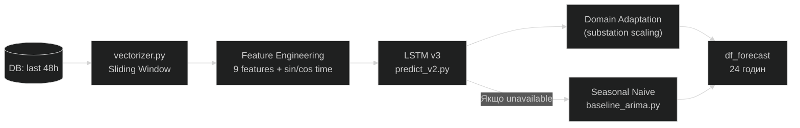

# 🏗️ Архітектура системи

## Огляд (4 шари)

```mermaid
%%{init: {'theme': 'dark'}}%%
graph TB
    subgraph UI["🌐 Presentation Layer"]
        A1["📊 KPI Dashboard\nlive_kpi.py"]
        A2["📈 ML Forecast\nforecast.py"]
        A3["🗺️ Geo Map\nmap.py"]
        A4["⚠️ Alerts\nalerts.py"]
        A5["📜 Archive\nhistorical_audit.py"]
    end

    subgraph CORE["🧠 Intelligence Layer"]
        B1["LSTM v3\npredict_v2.py"]
        B2["Fallback\nbaseline_arima.py"]
        B3["Physics\nphysics.py"]
        B4["Vectorizer\nvectorizer.py"]
    end

    subgraph DATA["💾 Data Layer"]
        C1[("PostgreSQL\nNeon Cloud")]
        C2["Cache TTL 24h\ncache_manager.py"]
        C3["Digital Twin\nsensors_db.py"]
    end

    subgraph DEVOPS["⚙️ DevOps"]
        D1["GitHub Actions\nCI/CD"]
        D2["Docker"]
        D3["Render.com"]
    end

    UI --> CORE --> DATA
    C3 --> C1
    DEVOPS --> UI

    style UI fill:#0d1117,stroke:#58a6ff
    style CORE fill:#0d1117,stroke:#ffb703
    style DATA fill:#0d1117,stroke:#00ff88
    style DEVOPS fill:#0d1117,stroke:#ff6b6b
```



---

## Presentation Layer (UI)

Реалізований на **Streamlit** як набір незалежних view-модулів.

| Модуль | Файл | Призначення |
|--------|------|-------------|
| KPI Dashboard | `ui/segments/live_kpi.py` | Live телеметрія (auto-refresh 5s) |
| ML Forecast | `ui/views/forecast.py` | LSTM прогноз на 24 год. |
| Geo Map | `ui/views/map.py` | Geomap підстанцій |
| Alerts | `ui/views/alerts.py` | Управління аваріями |
| Archive | `ui/views/historical_audit.py` | OLAP архів |
| Sidebar | `ui/segments/sidebar.py` | Фільтри + керування Digital Twin |

---

## Intelligence Layer (ML)



**Версії моделей:**

| Версія | Ознак | Таргети | Особливість |
|--------|-------|---------|-------------|
| v1 | 1 | 1 | Базова (load_mw) |
| v2 | 5 | 2 | + Погода + Health |
| v3 | 9 | 2 | + Часові гармоніки sin/cos |
| Zero-Fail | — | 2 | Seasonal Naive Fallback |

---

## Data Layer

### PostgreSQL (Neon Cloud)

```sql
-- Ключові таблиці
Regions           -- Регіони (Київ, Харків...)
Substations       -- Підстанції (підкатегорія регіону)
LoadMeasurements  -- Телеметрія (MW, Health, H2, температура)
Predictions       -- Збережені прогнози LSTM
Alerts            -- Аварійні події
WeatherReports    -- Погода по регіонах
```

### Cache Manager

```python
# utils/cache_manager.py
# TTL = 24 годин
# Захищає: *.graphml (карти міст)
# Очищає: *.json (застарілі запити)
startup_cache_cleanup(ttl_hours=24)  # викликається з main.py
```

---

## DevOps Layer

### CI/CD Pipeline

```
git push main
    │
    ├─ 🧹 flake8 + pylint (Lint)
    ├─ 🔍 mypy (Type Check)
    ├─ 🧪 pytest 74 tests (Unit Tests)
    ├─ 🛡️ bandit + detect-secrets (Security)
    ├─ 🐳 Docker build & push
    └─ 🚀 Render.com auto-deploy
```

### Ключові конфіги

| Файл | Призначення |
|------|-------------|
| `Dockerfile` | Multi-stage Docker build |
| `.github/workflows/ci-cd.yml` | GitHub Actions pipeline |
| `mkdocs.yml` | MkDocs документація |
| `.env.example` | Шаблон змінних середовища |

---

## Файлова структура

Детальну структуру з коментарями до кожного файлу дивись у [DEVELOPMENT.md](../DEVELOPMENT.md).
