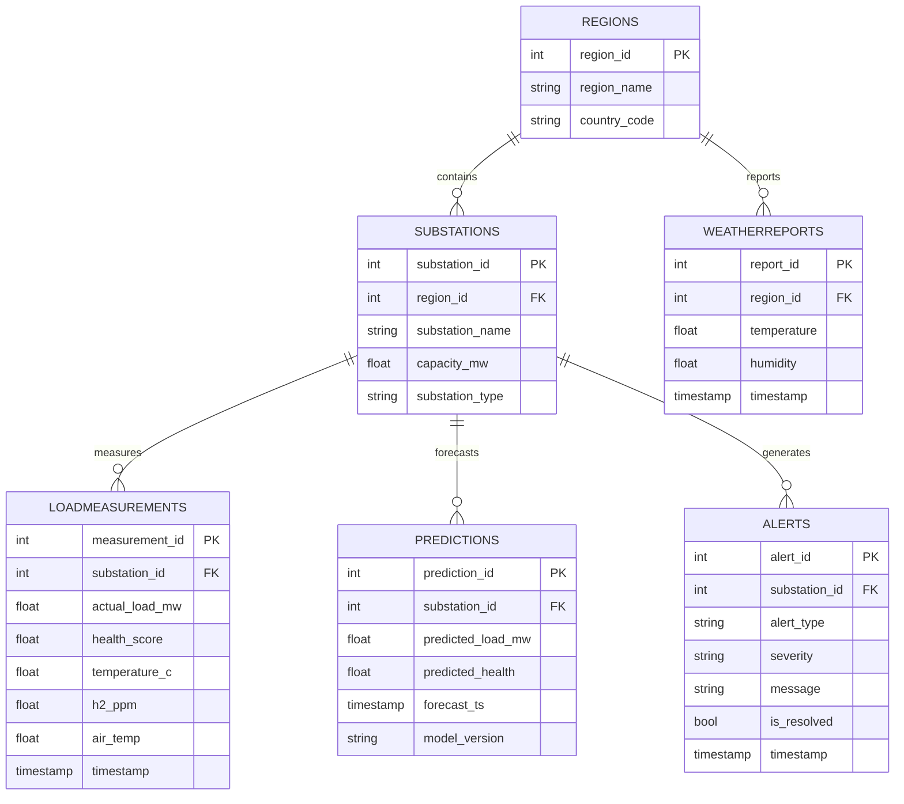

# 🗄️ База даних

## Огляд

Energy Monitor використовує **PostgreSQL 15** в хмарі [Neon](https://neon.tech) — serverless Postgres з автоматичним масштабуванням.

**Підключення:** через `SQLAlchemy` + `psycopg2` з connection pooling та автоматичними retry.

---

## ER-діаграма



---

## Ключові SQL-патерни

### OLAP агрегація (DATE_TRUNC)

```sql
-- Погодинна агрегація навантаження по регіону
SELECT
    DATE_TRUNC('hour', lm.timestamp) AS ts,
    r.region_name,
    AVG(lm.actual_load_mw) AS avg_load,
    AVG(lm.health_score) AS avg_health,
    SUM(lm.actual_load_mw) AS total_load
FROM LoadMeasurements lm
JOIN Substations s ON lm.substation_id = s.substation_id
JOIN Regions r ON s.region_id = r.region_id
WHERE lm.timestamp BETWEEN :start AND :end
GROUP BY 1, 2
ORDER BY ts ASC;
```

### Sliding Window для ML (vectorizer.py)

```sql
-- Останні 48 годин для конкретної підстанції
SELECT
    SUM(lm.actual_load_mw)      AS actual_load_mw,
    AVG(lm.temperature_c)       AS temperature_c,
    AVG(lm.h2_ppm)              AS h2_ppm,
    AVG(lm.health_score)        AS health_score,
    AVG(COALESCE(wr.temperature, 15.0)) AS air_temp,
    DATE_TRUNC('hour', lm.timestamp) AS timestamp
FROM LoadMeasurements lm
JOIN Substations s ON lm.substation_id = s.substation_id
LEFT JOIN WeatherReports wr
    ON DATE_TRUNC('hour', wr.timestamp) = DATE_TRUNC('hour', lm.timestamp)
WHERE s.substation_name = :sub
GROUP BY 6
ORDER BY timestamp DESC
LIMIT :limit OFFSET :offset;
```

### Запит бектест-реальності (metrics_engine.py)

```sql
-- Ground truth для порівняння з ML-прогнозом
SELECT
    AVG(actual_load_mw) as actual_load_mw,
    DATE_TRUNC('hour', timestamp) as ts
FROM LoadMeasurements lm
JOIN Substations s ON lm.substation_id = s.substation_id
WHERE s.substation_name = :sub
  AND lm.timestamp BETWEEN :min AND :max
GROUP BY 2
ORDER BY ts ASC;
```

---

## Підключення (src/core/database.py)

```python
from src.core.database import run_query

# Синхронний параметризований запит
df = run_query(
    "SELECT * FROM LoadMeasurements WHERE substation_id = :id LIMIT 100",
    {"id": 42}
)
# Повертає: pd.DataFrame або порожній DataFrame при помилці
```

**Захист від SQL Injection:**
- Всі параметри передаються через `:named_params` (SQLAlchemy)
- Whitelist-валідатори в `utils/validators.py` для динамічних фільтрів
- Жодних f-string SQL-запитів у коді

---

## Управління схемою

```bash
# Первинне створення схеми
psql -h $DB_HOST -U $DB_USER -d $DB_NAME -f sql/01_create_schema.sql

# Заповнення статичних довідників (регіони, підстанції)
psql -h $DB_HOST -U $DB_USER -d $DB_NAME -f sql/02_insert_static_data.sql

# Seed тестовими даними (для CI/CD)
python -m src.services.db_seeder
```

---

## Оптимізація продуктивності

### Рекомендовані індекси

```sql
-- Прискорює OLAP-запити на timestamp
CREATE INDEX idx_lm_timestamp
    ON LoadMeasurements(timestamp DESC);

-- Прискорює JOIN підстанцій
CREATE INDEX idx_lm_substation_id
    ON LoadMeasurements(substation_id);

-- Для прогнозів
CREATE INDEX idx_pred_forecast_ts
    ON Predictions(forecast_ts DESC);
```

### Нeon Cloud налаштування

| Параметр | Значення | Причина |
|----------|----------|---------|
| `DB_SSL=require` | Обов'язково | Безпека трафіку |
| Connection pooling | 5-10 connections | Render free: обмежений RAM |
| Auto-suspend | 5 хвилин | Economize serverless credits |

---

## Бекап

```bash
# Локальний дамп (Windows PowerShell)
$env:PGPASSWORD = "your_password"
pg_dump -h $env:DB_HOST -U $env:DB_USER -d neondb -F c -f backup_local.sql

# Відновлення
pg_restore -h $env:DB_HOST -U $env:DB_USER -d neondb backup_local.sql
```

> [!NOTE]
> `backup_local.sql` вже є в корені проекту — це актуальний бекап всієї БД (11 МБ).
