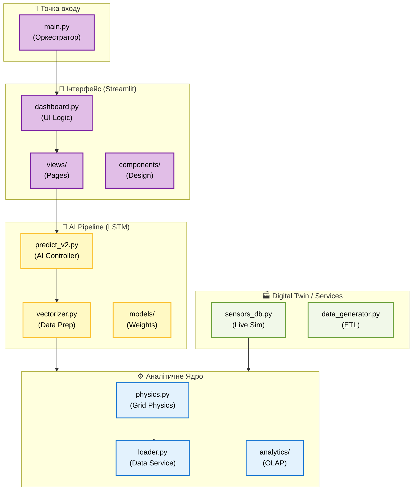

# 🗺️ Атлас Проєкту: Інтерактивна Карта

Ця сторінка є вашим навігатором по архітектурі **Energy Monitor ULTIMATE**. Кожен вузол на схемі нижче є клікабельним — він переведе вас до детального технічного розбору конкретного файлу або модуля.

---

## 🏗️ Архітектурна Схема (Інтерактивна)

---

## 🔍 Як користуватися Атласом?

1.  **Натисніть на вузол:** Вас буде перенаправлено до секції з технічним описом.
2.  **Шари системи:**
    *   🟣 **UI (Фіолетовий):** Все, що бачить користувач у браузері.
    *   🟡 **ML (Золотий):** Інтелект системи — прогнози та метрики.
    *   🔵 **CORE (Синій):** Розрахунки, фізика енергосистем та робота з БД.
    *   🟢 **SERVICES (Зелений):** Фонова симуляція (Digital Twin).

---

## 🗄️ Швидка навігація по розділах

| Шар | Детальний опис | Ключові технології |
| :--- | :--- | :--- |
| **🎨 User Interface** | [Перейти до UI Map](map/ui_map.md) | Streamlit, Plotly, Folium |
| **🧠 Machine Learning** | [Перейти до ML Map](map/ml_map.md) | TensorFlow, ONNX, Scikit-learn |
| **⚙️ Core Analytics** | [Перейти до Core Map](map/core_map.md) | NumPy, Pandas, SQLAlchemy |
| **🏭 System Services** | [Перейти до Services Map](map/services_map.md) | Digital Twin, Real-time Sim |
