# 🗺️ Інтерактивний Файловий Атлас Проєкту

Це — повна мапа вашого проєкту. Вона відображає фізичну структуру файлів та їхні взаємозв'язки. Кожен ключовий вузол є **клікабельним**: натисніть на файл, щоб дізнатися, навіщо він потрібен та як він працює.

> [!TIP]
> Натисніть на назву папки або файлу в схемі нижче для переходу до детального технічного опису.

```mermaid
graph TD
    %% Стилі
    classDef folder fill:#2d3436,stroke:#f1c40f,stroke-width:2px,color:#fff;
    classDef file fill:#2d3436,stroke:#3498db,stroke-width:1px,color:#dcdde1;
    classDef core fill:#0984e3,stroke:#74b9ff,stroke-width:1px,color:#fff;
    classDef ml fill:#e17055,stroke:#fab1a0,stroke-width:1px,color:#fff;
    classDef ui fill:#6c5ce7,stroke:#a29bfe,stroke-width:1px,color:#fff;
    classDef service fill:#00b894,stroke:#55efc4,stroke-width:1px,color:#fff;

    Root["📂 EnergyMonitor-OLAP/"]:::folder

    %% Основні гілки
    Root --> Src["📂 src/ (Джерело)"]:::folder
    Root --> Docs["📂 docs/ (Документація)"]:::folder
    Root --> Config["⚙️ Конфігурація"]:::folder

    %% Код (src)
    subgraph SystemCode ["💻 Програмний Код"]
        Src --> Core["📂 core/ (Ядро)"]:::core
        Src --> ML["📂 ml/ (ШІ)"]:::ml
        Src --> UI["📂 ui/ (Інтерфейс)"]:::ui
        Src --> Svc["📂 services/ (Сервіси)"]:::service

        %% Core Files
        Core --> FC_Phys["📄 physics.py"]:::file
        Core --> FC_DB["📄 database.py"]:::file
        Core --> FC_An["📄 analytics/ (Фільтри)"]:::file

        %% ML Files
        ML --> FM_Prd["📄 predict_v2.py"]:::file
        ML --> FM_Vec["📄 vectorizer.py"]:::file
        ML --> FM_Mod["📂 models/ (Ваги)"]:::file

        %% UI Files
        UI --> FU_Dash["📄 dashboard.py"]:::file
        UI --> FU_Views["📂 views/ (Вкладки)"]:::file

        %% Services Files
        Svc --> FS_Sim["📄 data_generator.py"]:::file
        Svc --> FS_Sens["📄 sensors.py"]:::file
    end

    %% Документація (docs)
    subgraph DocumentationArea ["📚 База Знань"]
        Docs --> D_Phys["📖 Фізична модель"]
        Docs --> D_ML["📖 Опис нейромереж"]
        Docs --> D_Atlas["🗺️ Карта Системи"]
    end

    %% Посилання (Click Events)
    click Core "map/core_map/" "Відкрити мапу ядра"
    click ML "map/ml_map/" "Відкрити мапу ШІ"
    click UI "map/ui_map/" "Відкрити мапу інтерфейсу"
    click Svc "map/services_map/" "Відкрити мапу сервісів"
    
    click FC_Phys "map/core_map/#srcphysicspy" "Про фізику розрахунків"
    click FC_DB "map/core_map/#srcdatabasepy" "Про роботу з БД"
    click FM_Prd "map/ml_map/#srcmlpredict_v2py" "Про інференс нейромережі"
    click FU_Dash "map/ui_map/#srcuidashboardpy" "Про архітектуру дашборду"
    click FS_Sim "map/services_map/#srcservicesdatageneratorpy" "Про цифрового двійника"
```

---

## 🏗️ Архітектурні Шари (Огляд)

Хоча Атлас вище показує файли, система логічно розділена на 4 функціональні рівні:

| Шар | Призначення | Ключові технології |
| :--- | :--- | :--- |
| **Ядро (Core)** | Розрахунки, база даних, стабільність | Python, PostgreSQL/SQLite, NumPy |
| **Аналітика (ML)** | Прогнозування навантаження | LSTM (Keras/TensorFlow), ONNX |
| **Сервіси (Svc)** | Цифровий двійник, симуляція сенсорів | Background Producers, FastAPI-style logic |
| **Інтерфейс (UI)** | Візуалізація, OLAP-звіти | Streamlit, Plotly, Altair |

---

## 🔗 Швидкий доступ до файлів
*   [📂 Переглянути вихідний код проєкту в GitHub](https://github.com/Lutvunenko-Dmutro/EnergyMonitor-OLAP/tree/main/src)
*   [📖 Повний технічний звіт](https://github.com/Lutvunenko-Dmutro/EnergyMonitor-OLAP/blob/main/docs/thesis/THESIS_FULL_FINAL_UTF8.md)
