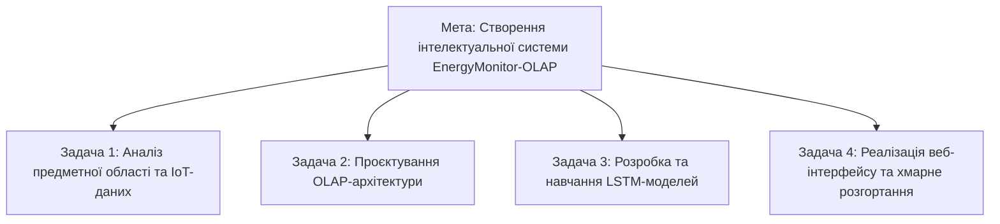

# ВСТУП

### Актуальність теми
У сучасних умовах глобальної цифровізації та зростання попиту на енергоресурси, питання підвищення енергоефективності міських інфраструктур стає критично важливим. Обмеженість ресурсів та нестабільність світових енергетичних ринків вимагають переходу від пасивного обліку споживання до систем **активного, проактивного керування** енергетичними мережами. Концепція Smart City передбачає не лише моніторинг, а й здатність системи передбачати майбутні потреби та оперативно реагувати на аномалії, що неможливо без застосування сучасних методів аналізу даних та штучного інтелекту.

### Об’єкт дослідження
Процеси моніторингу, збору телеметрії та аналізу динаміки споживання електроенергії в масштабах міської інфраструктури (районів, територіальних громад та окремих підстанцій).

### Предмет дослідження
Методології та програмні інструменти архітектури **OLAP** (для багатовимірного аналізу історичних даних) та **рекурентні нейронні мережі** (зокрема архітектура **LSTM**), як засоби високоточного прогнозування часових рядів навантаження.

### Мета роботи
Розробка та реалізація комплексної веб-платформи для інтелектуального моніторингу енергомереж. Система має забезпечувати візуалізацію історичних зрізів даних у реальному часі та генерацію короткострокових прогнозів споживання енергії, що дозволить мінімізувати пікові навантаження та підвищити стабільність енергопостачання.

#### Структура цілей та задач дослідження (Рисунок 0.1)

*Рисунок 0.1. Дерево цілей та задач кваліфікаційної роботи*

---
[Далі: Розділ 1. Огляд літератури](THESIS_1_THEORY.md)
