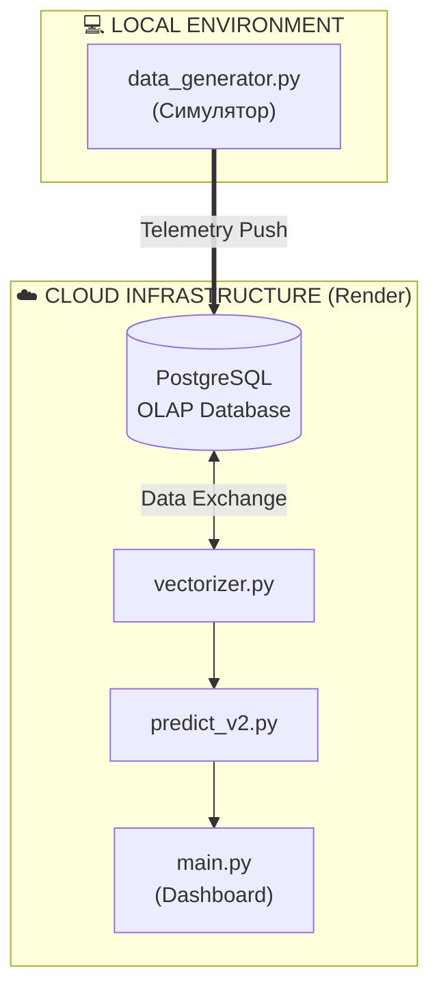
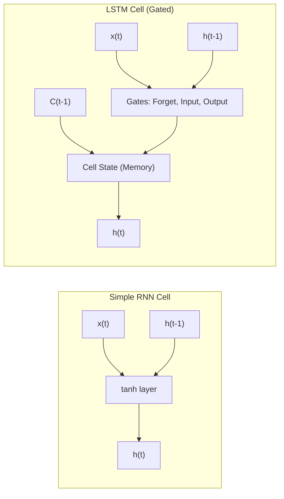

# РОЗДІЛ 1. ОГЛЯД ЛІТЕРАТУРИ ТА АНАЛІЗ ПРЕДМЕТНОЇ ОБЛАСТІ

### 1.1. Концепція Smart City: роль інтелектуальних енергосистем (Smart Grid)

#### 1.1.1. Еволюція міських інфраструктур та виклики сучасної урбанізації
Чому сучасні міста потребують нових підходів? Сучасна урбанізація вимагає якісно нових підходів до управління міською інфраструктурою [7]. Згідно з прогнозами ООН, до 2050 року понад 68% населення планети проживатиме у містах, що створить безпрецедентне навантаження на енергетичні, транспортні та соціальні системи [17]. Концепція **«Розумного міста» (Smart City)** постає як відповідь на ці виклики, де ефективність функціонування забезпечується глибокою інтеграцією інформаційно-комунікаційних технологій (ІКТ).

Проблематика сучасних мегаполісів включає:
*   **Дефіцит енергетичних потужностей:** застарілі мережі не розраховані на різке зростання кількості електромобілів та систем кондиціонування.
*   **Нерівномірність споживання:** виникнення критичних піків, що змушують тримати в резерві неекологічні потужності (вугільні ТЕС).
*   **Інформаційна розрізненість:** дані про споживання часто залишаються "закритими" всередині окремих підрозділів, що унеможливлює комплексне планування.

Історично розвиток міст проходив через кілька етапів: від Infrastructure City (фізична розбудова) та Digital City (оцифрування реєстрів) до сучасного Smart City 3.0, де використання систем штучного інтелекту та великих даних (Big Data) дозволяє здійснювати проактивне управління. В основі Smart City лежить розгалужена мережа взаємопов'язаних пристроїв — **Інтернету речей (IoT)**. 

*Рис. 1.1. Типова багаторівнева архітектура IoT-платформи Smart City*

Процеси збору та аналізу даних у реальному часі дозволяють трансформувати міське середовище у динамічну екосистему, здатну до самодіагностики та самовідновлення. Світовий досвід (Сінгапур, Барселона), а також локальні дослідження кліматичних параметрів міста Києва [39], підтверджують, що саме цифровізація дозволяє економити до 30% енергоресурсів на рівні муніципалітету.

#### 1.1.2. Smart Grid — енергетичне серце Розумного міста
Яке місце займає енергетика в Smart City? **Енергоспоживання** є фундаментом та ключовим показником життєдіяльності будь-якого мегаполісу. У концепції Smart City енергетичний сектор трансформується у **Smart Grid (інтелектуальні мережі)** — системи, що забезпечують двосторонній обмін як електроенергією, так і даними між постачальником та споживачем [7, 31].

Ключові компоненти Smart Grid:
1.  **Advanced Metering Infrastructure (AMI):** системи інтелектуального обліку, що дозволяють отримувати дані про споживання з інтервалом у 15-60 хвилин.
2.  **Phasor Measurement Units (PMU):** пристрої, що фіксують фазові параметри мережі з високою частотою для запобігання блекаутам.
3.  **Energy Storage Systems (ESS):** системи накопичення енергії, що дозволяють згладжувати графік навантаження.

*Рис. 1.2. Концептуальна схема Smart Grid та інфраструктури передачі даних*

Чим відрізняються розумні мережі від традиційних? Розумні мережі відрізняються від традиційних наявністю двосторонньої комунікації та здатністю до саморегуляції. Однією з найбільш гострих проблем є так звана **«крива качки» (Duck Curve)** — феномен різкого падіння чистого навантаження вдень та його стрімкого зростання ввечері, що вимагає надзвичайно точного прогнозування.

#### 1.1.3. Технологія Digital Twin (Цифровий двійник) в енергетиці
Згідно з міжнародними стандартами ISO 23247 та IEEE 1547, **Цифровий двійник (Digital Twin)** — це динамічна цифрова копія фізичного активу, яка постійно оновлюється на основі даних сенсорів [35, 36, 37]. У контексті енергетики цифровий двійник дозволяє реалізувати перехід від реактивного обслуговування до **предиктивного (Predictive Maintenance)**.

Рівні зрілості цифрових двійників:
*   **Описовий (Descriptive):** візуалізація поточного стану активу в реальному часі.
*   **Діагностичний (Diagnostic):** аналіз причин виникнення аномалій.
*   **Предиктивний (Predictive):** прогнозування майбутнього стану на основі історичних даних.
*   **Приписувальний (Prescriptive):** автоматичне прийняття рішень для оптимізації.

### 1.2. Математичний апарат глибокого навчання для часових рядів

#### 1.2.1. Природа енергетичних часових рядів
Математичний опис навантаження як часового ряду базується на декомпозиції його складових [3, 5, 13, 32]:
$$y(t) = T(t) + S_d(t) + S_w(t) + C(t) + \epsilon(t) \quad (1.1)$$
де $y(t)$ — обсяг навантаження; $T(t)$ — тренд; $S(t)$ — сезонність; $\epsilon(t)$ — шум [2, 13]. У контексті Smart Grid завдання інтелектуального прогнозування полягає у тому, щоб розпізнати ці закономірності серед "шумних" даних телеметрії.

#### 1.2.2. Обґрунтування вибору архітектури LSTM та її математичний апарат
На відміну від традиційних статистичних методів (ARIMA), які вимагають стаціонарності ряду, енергоспоживання у Smart City характеризується нелінійністю та мультисезонністю (добові піки, вихідні дні, вплив погоди) [4, 9, 13]. Для вирішення цієї проблеми обрано рекурентні нейронні мережі з архітектурою LSTM (Long Short-Term Memory) [11].

Головна перевага LSTM полягає у наявності механізму **гейтів (Gates)**. Щоб зрозуміти, як модель відфільтровує телеметричний шум та виділяє тренди, розглянемо її математичну структуру в контексті нашого цифрового двійника:

1.  **Вентиль забування (Forget Gate):** Вирішує, яку частину довгострокової пам'яті слід відкинути. Наприклад, якщо після вихідних починається робочий понеділок, мережа "забуває" патерн вихідного дня:
    $$f_t = \sigma(W_f \cdot [h_{t-1}, x_t] + b_f)$$
    де $x_t$ — поточний вектор ознак (навантаження, температура, час доби).

2.  **Вентиль входу (Input Gate):** Визначає, які нові дані (наприклад, раптове похолодання) є достатньо важливими для оновлення поточного стану:
    $$i_t = \sigma(W_i \cdot [h_{t-1}, x_t] + b_i)$$
    $$\tilde{C}_t = \tanh(W_C \cdot [h_{t-1}, x_t] + b_C)$$

3.  **Оновлення стану комірки (Cell State):** Обчислення загального контексту мережі (чи знаходимося ми зараз у ранковому або вечірньому піку споживання):
    $$C_t = f_t * C_{t-1} + i_t * \tilde{C}_t$$

4.  **Вентиль виходу (Output Gate):** Формує фінальне значення прогнозу навантаження на наступний період, базуючись на оновленому контексті:
    $$o_t = \sigma(W_o \cdot [h_{t-1}, x_t] + b_o)$$
    $$h_t = o_t * \tanh(C_t)$$

У контексті енергетики така здатність до математичного виявлення складних часових залежностей дозволяє моделі прогнозувати навантаження без ручного створення сотень статистичних ознак [16, 29, 10].

Для підвищення стабільності навчання моделі використовується оптимізатор **Adam** [15], а функцією втрат обрано **Huber Loss**, яка є робастною до аномальних викидів телеметрії [12], що часто виникають в умовах апаратних збоїв реальних електромереж:

$$
L_\delta(y, \hat{y}) = \left\{ \begin{array}{ll} \frac{1}{2}(y - \hat{y})^2, & \text{if } |y - \hat{y}| \le \delta \\ \delta (|y - \hat{y}| - \frac{1}{2}\delta), & \text{otherwise} \end{array} \right.
$$
*(1.8)*

### 1.3. Аналіз технологій Big Data: OLAP проти OLTP
У проєкті використано архітектуру **Hybrid OLAP** на базі Neon (PostgreSQL). Це дозволяє поєднувати надійність реляційних БД з високою швидкістю аналітичних запитів (Autoscaling), що критично для систем реального часу.

### 1.4. Порівняльний аналіз сучасних методів прогнозування

#### 1.4.1. Порівняння архітектурних рішень

*Схема 1.1. Порівняння архітектур RNN та LSTM (Mermaid-версія)*

*Рис. 1.3. Порівняльна характеристика архітектур RNN та LSTM (для Ворда)*

#### 1.4.2. Класичні статистичні методи (ARIMA)
Моделі ARIMA демонструють високу точність на стаціонарних рядах, проте не здатні ефективно враховувати нелінійні фактори Smart City без складних перетворень.

#### 1.4.3. Традиційне машинне навчання (XGBoost, Random Forest)
Методи ансамблевого навчання дозволяють враховувати зовнішні фактори, але потребують ручного створення ознак (lag features), що обмежує глибину аналізу контексту.

#### 1.4.4. Глибоке навчання (LSTM та Transformers)
Рекурентні мережі LSTM мають внутрішні механізми управління пам'яттю (гейти). Це дозволяє їм автоматично виявляти складні патерни. Хоча Transformers демонструють високу точність, для задач локального прогнозування архітектура LSTM залишається найбільш оптимальною.

| Критерій | ARIMA | XGBoost / RF | LSTM (Обрано) |
| :--- | :--- | :--- | :--- |
| **Врахування нелінійності** | Низьке | Середнє | **Високе** |
| **Робота з контекстом** | Відсутня | Обмежена | **Вбудована** |
| **Швидкість навчання** | Дуже висока | Висока | Середня |
| **Стійкість до викидів** | Низька | Середня | **Висока** |

### 1.5. Постановка задачі проектування
На основі проведеного аналізу встановлено, що сучасні системи моніторингу часто не забезпечують достатньої предиктивної здатності.

**Мета проекту** — розробка інформаційної системи прогнозування часових рядів енергоспоживання для вдосконалення технологій Smart City на основе рекурентних нейронних мереж (LSTM).

**Об'єкт проектування** — процеси інтелектуального моніторингу та предиктивної аналітики у Smart City.
**Предмет дослідження** — архітектура LSTM, методи OLAP та хмарна візуалізація.

## ВИСНОВКИ ДО РОЗДІЛУ 1
У даному розділі проведено системний огляд проблематики Smart City. Математично обґрунтовано вибір архітектури LSTM як основного інструменту прогнозування. Сформульовано мету та завдання проекту, що є базою для подальшої програмної реалізації.

---
[Назад до Вступу](THESIS_0_INTRODUCTION.md) | [Далі: Розділ 2. Постановка завдання](THESIS_2_REQUIREMENTS.md)
