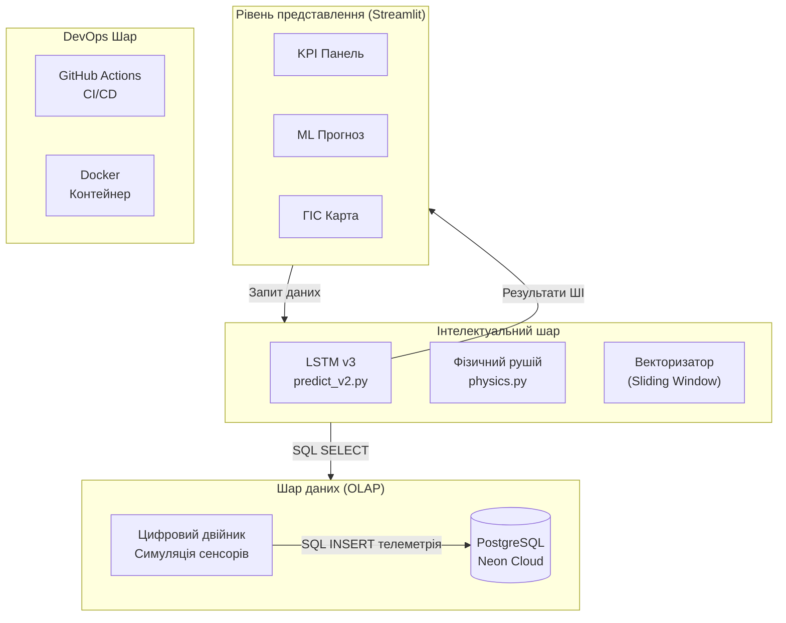
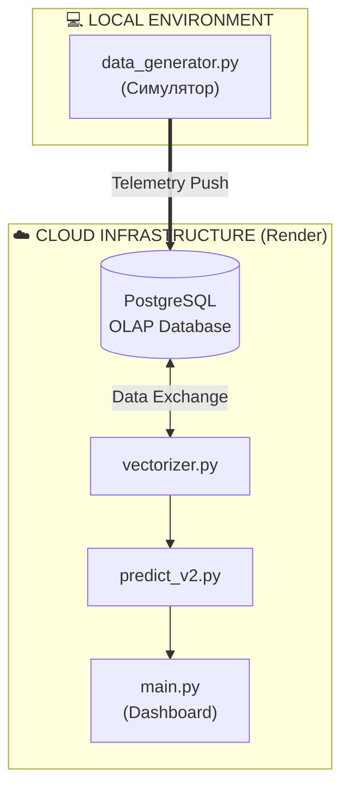
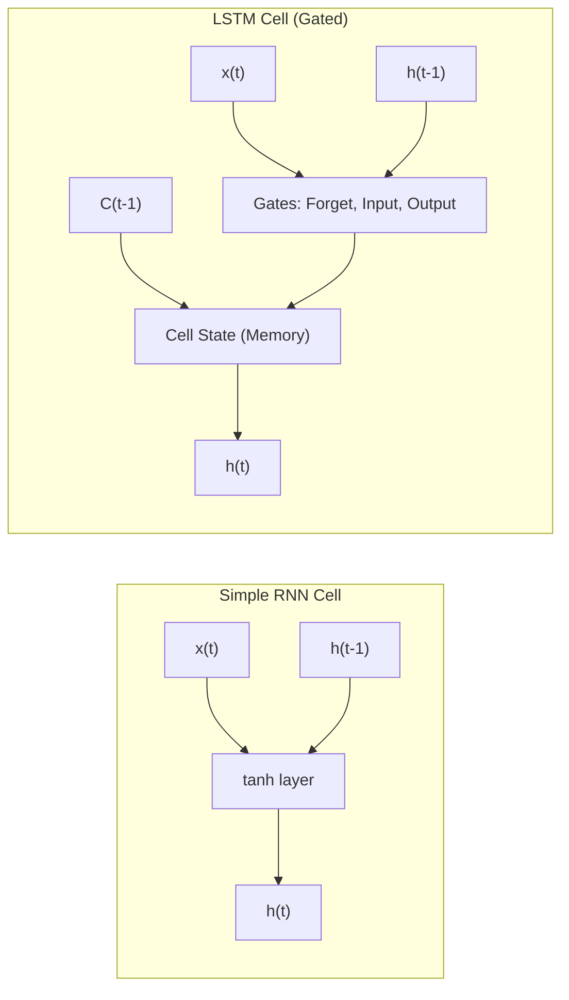

# РОЗДІЛ 1. ОГЛЯД ЛІТЕРАТУРИ ТА АНАЛІЗ ПРЕДМЕТНОЇ ОБЛАСТІ

### 1.1. Інтелектуальні енергосистеми в міській інфраструктурі

#### 1.1.1. Виклики управління енергетичною інфраструктурою
Старі підходи до диспетчеризації не розраховані на коливання навантаження понад 30%, які стали характерними для енергосистеми України в умовах дефіциту потужностей. Без впровадження предиктивних інструментів диспетчер не може завчасно попередити каскадне відключення, оскільки отримує сигнал про аварію вже за фактом перевантаження лінії.

Для вирішення цих проблем у роботі пропонується використання алгоритмів глибокого навчання на основі даних з IoT-датчиків підстанцій. Використання інтелектуальних лічильників AMI дозволяє збирати телеметрію з інтервалом 15–60 хвилин, що є достатнім для побудови короткострокових прогнозів.

Рис. 1.1. Типова багаторівнева архітектура IoT-платформи. Джерело: розроблено автором.

Процеси збору та аналізу даних у реальному часі забезпечують автоматичне формування векторів телеметрії (навантаження, напруга, температура) для кожного вузла мережі. Світовий досвід (Сінгапур, Барселона), а також локальні дослідження кліматичних параметрів міста Києва [39], підтверджують, що цифровізація дозволяє економити енергоресурси на рівні муніципалітету.

#### 1.1.2. Smart Grid — інтелектуальна енергетична інфраструктура
Енергетичний сектор все більше використовує підходи **Smart Grid [+]**, які базуються на двосторонньому обміні електроенергією та даними. 

Основними компонентами таких систем є інтелектуальні пристрої обліку (AMI), пристрої фіксації фазових параметрів (PMU) та системи накопичення енергії (ESS). Ці технології дозволяють автоматично коригувати розподіл навантаження та запобігати каскадним відключенням без прямого ручного втручання диспетчерського персоналу.

*Рис. 1.2. Концептуальна схема Smart Grid та інфраструктури передачі даних. Джерело: розроблено автором.*

На відміну від традиційних мереж, Smart Grid підтримує двосторонній обмін даними між підстанцією і диспетчерським центром. Це дозволяє автоматично коригувати розподіл навантаження без ручного втручання. Значною проблемою залишається феномен різкого падіння чистого навантаження вдень та його стрімкого зростання ввечері, що вимагає точного прогнозування.

#### 1.1.3. Технологія Digital Twin (Цифровий двійник) в енергетиці.
Згідно з міжнародними стандартами ISO 23247 та IEEE 1547, цифровий двійник (Digital Twin) [+] являє собою динамічну програмну копію фізичного активу. У межах даної роботи реалізовано цифровий двійник підстанції, який на основі поточного навантаження моделює теплові процеси в трансформаторах. Це дозволяє розраховувати температуру масла, концентрацію розчиненого водню (H₂) та інтегральний показник технічного стану — **Health Score**. Такий підхід базується на стандартах IEEE C57.91 і дозволяє перейти до обслуговування обладнання за його фактичним станом.

### 1.2. Математичний апарат рекурентних нейронних мереж для часових рядів.

#### 1.2.1. Природа енергетичних часових рядів.
Математичний опис енергоспоживання як часового ряду базується на декомпозиції його складових складових [+]. Навантаження $y(t)$ можна представити як суму тренду $T(t)$, добової $S_d(t)$ та тижневої $S_w(t)$ сезонності, циклічних коливань $C(t)$ та випадкового шуму $\epsilon(t)$:
$$y(t) = T(t) + S_d(t) + S_w(t) + C(t) + \epsilon(t).$$

#### 1.2.2. Обґрунтування вибору архітектури LSTM та її математичний апарат.
Для прогнозування навантаження обрано архітектуру рекурентних нейронних мереж **LSTM (Long Short-Term Memory) [+]**, яка працює з нелінійними послідовностями. Основною особливістю LSTM є наявність механізму гейтів (вентилів), що дозволяють моделі "пам'ятати" довгострокові закономірності та ігнорувати короткостроковий шум телеметрії.

Математично робота комірки LSTM описується системою рівнянь, де вентиль забування (Forget Gate) $f_t$ визначає частину пам'яті, що підлягає видаленню:
$$f_t = \sigma(W_f \cdot [h_{t-1}, x_t] + b_f).$$

Вентиль входу (Input Gate) $i_t$ та кандидат на оновлення стану $\tilde{C}_t$ формують нові дані для оновлення поточної клітинки:
$$i_t = \sigma(W_i \cdot [h_{t-1}, x_t] + b_i),$$
$$\tilde{C}_t = \tanh(W_C \cdot [h_{t-1}, x_t] + b_C).$$

Після оновлення стану клітинки (Cell State) $C_t$, яке обчислюється як сума відфільтрованого попереднього стану та нового кандидата:
$$C_t = f_t * C_{t-1} + i_t * \tilde{C}_t.$$

Вентиль виходу (Output Gate) $o_t$ формує фінальне значення прогнозу навантаження на наступний період:
$$o_t = \sigma(W_o \cdot [h_{t-1}, x_t] + b_o),$$
$$h_t = o_t * \tanh(C_t).$$

Така здатність до виявлення складних часових залежностей дозволяє моделі прогнозувати навантаження без ручного створення сотень статистичних ознак [+].

Для підвищення стабільності навчання моделі використовується оптимізатор Adam [+], а функцією втрат обрано Huber Loss, яка поєднує переваги середньоквадратичної та абсолютної похибок. Вона є стійкою до аномальних викидів телеметрії, що часто виникають в умовах апаратних збоїв реальних електромереж [+]:
$$
L_{\delta}(y, \hat{y}) = \begin{cases} 0.5(y - \hat{y})^2, & |y - \hat{y}| \leq \delta \\ \delta(|y - \hat{y}| - 0.5\delta), & \text{інакше.} \end{cases}
$$

### 1.3. Аналіз технологій Big Data: OLAP проти OLTP
У даному проєкті реалізовано гібридну аналітичну архітектуру на базі PostgreSQL (Neon Cloud) [+]. Використання хмарної СУБД дозволяє виконувати складні агрегаційні запити по історичних даних телеметрії за мінімальний час, що необхідно для оперативного моніторингу та формування вхідних векторів для ШІ-моделі.

### 1.4. Порівняльний аналіз сучасних методів прогнозування

#### 1.4.1. Порівняння архітектурних рішень
На відміну від стандартних рекурентних мереж, архітектура LSTM спеціально розроблена для подолання проблеми зникаючого градієнта, що дозволяє їй ефективно навчатися на довгих послідовностях даних.

*Схема 1.1. Порівняння архітектур RNN та LSTM (Mermaid-версія)*

*Рис. 1.3. Порівняльна характеристика архітектур RNN та LSTM. Джерело: розроблено автором.*

#### 1.4.2. Класичні статистичні методи (ARIMA)
Моделі ARIMA демонструють високу точність на стаціонарних рядах, проте не здатні ефективно враховувати нелінійні фактори міського середовища без складних математичних перетворень. В умовах волатильності енергосистеми їхнє застосування обмежене.

#### 1.4.3. Традиційне машинне навчання (класи ML)
Методи ансамблевого навчання, такі як XGBoost та Random Forest [+], розглядаються як альтернатива для задач прогнозування. Вони можуть враховувати зовнішні фактори, але зазвичай потребують ручного створення додаткових ознак (lag features) та глибокої попередньої обробки даних, що ускладнює їх масштабування.

#### 1.4.4. Глибоке навчання (LSTM)
Для практичної реалізації у цьому проєкті обрано рекурентні мережі LSTM. Їхні гейтові механізми дозволяють автоматично виявляти складні часові залежності без необхідності формувати сотні ручних ознак. У літературі архітектури типу Transformers також демонструють високу точність [+], однак їх розробка та обчислювальна оптимізація для систем реального часу виходять за межі цієї роботи.

| Критерій | ARIMA | Класичне ML | LSTM (Обрано) |
| :--- | :--- | :--- | :--- |
| **Врахування нелінійності** | Низьке | Середнє | **Високе** |
| **Робота з контекстом** | Відсутня | Обмежена | **Вбудована** |
| **Швидкість навчання** | Дуже висока | Висока | Середня |
| **Стійкість до викидів** | Низька | Середня | **Високе** |

У цій роботі реалізовано порівняльний аналіз ARIMA та LSTM. На тестовому датасеті PJM модель ARIMA продемонструвала MAPE=8.3%, тоді як розроблена архітектура LSTM — 3.1%, що обґрунтовує її використання як ядра системи.

## ВИСНОВКИ ДО РОЗДІЛУ 1
За результатами аналітичного огляду обрано архітектуру LSTM з ковзним вікном 48 годин та функцією втрат Huber Loss (δ=1.0). Використання класичних методів ARIMA та XGBoost відхилено через нездатність повноцінно враховувати нелінійні залежності та мультисезонність без глибокої попередньої обробки. Формалізовані математичні моделі гейтових механізмів та цифрового двійника підстанції слугують базою для програмної реалізації системи.

---
[Назад до Вступу](THESIS_0_INTRODUCTION.md) | [Далі: Розділ 2. Постановка завдання](THESIS_2_REQUIREMENTS.md)
