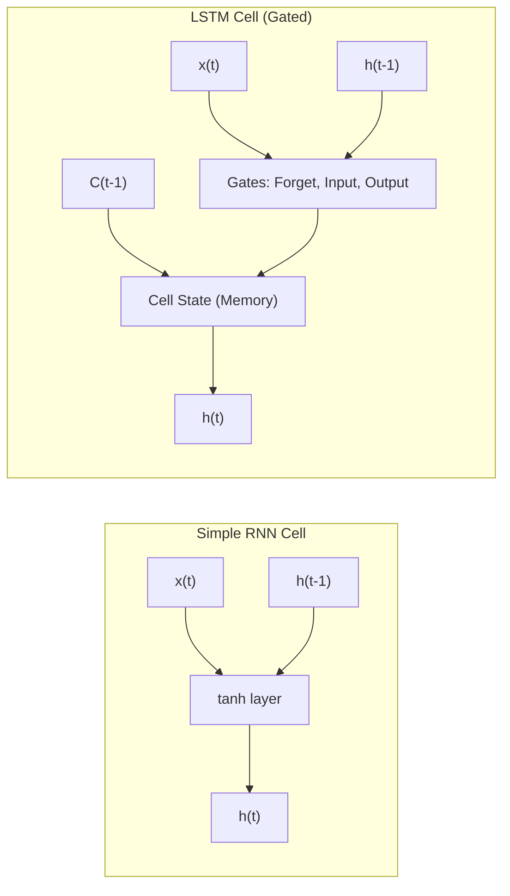

# РОЗДІЛ 1. ОГЛЯД ЛІТЕРАТУРИ ТА АНАЛІЗ ПРЕДМЕТНОЇ ОБЛАСТІ

### 1.1. Концепція Smart City: роль інтелектуальних енергосистем (Smart Grid)

#### 1.1.1. Еволюція міських інфраструктур: від індустріального міста до Smart City
Сучасна урбанізація вимагає якісно нових підходів до управління міською інфраструктурою [7]. Концепція **«Розумного міста» (Smart City)** постає як відповідь на запити сталого розвитку, де ефективність функціонування забезпечується глибокою інтеграцією інформаційно-комунікаційних технологій (ІКТ) у всі сфери життя громади.

Історично розвиток міст проходив через кілька етапів: від Infrastructure City (фізична розбудова) та Digital City (оцифрування реєстрів) до сучасного Smart City, де використання систем штучного інтелекту та великих даних дозволяє здійснювати проактивне управління. В основі Smart City лежить розгалужена мережа взаємопов’язаних пристроїв — **Інтернету речей (IoT)**. Процеси збору та аналізу даних у реальному часі дозволяють трансформувати міське середовище у динамічну екосистему, здатну до самодіагностики.

[РИСУНОК 1.1 — ТИПОВА АРХІТЕКТУРА IoT-РІВНЯ SMART CITY]
(Опис: Схема з трьома шарами: рівень сенсорів, рівень передачі даних (LoRaWAN/5G) та рівень обробки у хмарному середовищі).

#### 1.1.2. Smart Grid — енергетичне серце Розумного міста
**Енергоспоживання** є фундаментом та ключовим показником життєдіяльності будь-якого мегаполісу. У концепції Smart City енергетичний сектор трансформується у **Smart Grid (інтелектуальні мережі)** — системи, що забезпечують двосторонній обмін як електроенергією, так і даними між постачальником та споживачем. 

Розумні мережі відрізняються від традиційних наявністю двосторонньої комунікації, децентралізацією (інтеграція сонячних панелей, мікрогенерації) та здатністю до саморегуляції. Однією з найбільш гострих проблем сучасної енергетики є нерівномірність навантаження та виникнення пікових періодів споживання, що призводить до перевантаження силового обладнання. Необхідність **автоматизації збору та аналізу даних** у Smart Grid зумовлена насамперед можливістю виявлення аномальних станів мережі ще до настання критичних ситуацій.

[РИСУНОК 1.2 — КОНЦЕПТУАЛЬНА СХЕМА SMART GRID ТА ПОДОРОЖІ ДАНИХ]
(Опис: Зображення потоків енергії та інформації між розумними будинками, підстанціями та центром управління).

### 1.2. Аналіз методів прогнозування енергоспоживання

#### 1.2.1. Математична природа часових рядів енергоспоживання
$$y(t) = T(t) + S(t) + C(t) + \epsilon(t) \quad (1.1)$$
де $y(t)$ — обсяг енергоспоживання в момент часу $t$; $T(t)$ — тренд; $S(t)$ — сезонна компонента; $C(t)$ — циклічна компонента; $\epsilon(t)$ — випадкова складова.

У контексті Smart Grid особливу складність становить **мультисезонність**. Завдання інтелектуального прогнозування полягає у виявленні цих закономірностей у потоці «шумних» даних телеметрії.

#### 1.2.2. Статистичні методи (ARIMA/SARIMA) та їх обмеження
Традиційні підходи на основі ковзного середнього або моделі ARIMA [3, 5] вимагають стаціонарності ряду, що рідко зустрічається в реальних енергосистемах. Моделі SARIMA додають облік сезонності [13], проте вони базуються на лінійних припущеннях. Енергоспоживання у Smart City за своєю природою є нестаціонарним та нелінійним, що робить класичні методи менш ефективними порівняно з алгоритмами глибокого навчання.

#### 1.3.3. Математична архітектура LSTM: Механізм гейтів
На відміну від стандартних RNN, LSTM містить спеціальні блоки — **гейти (Gates)**, які дозволяють керувати інформаційними потоками всередині комірки [4, 9]. Робота LSTM на кожному кроці $t$ описується системою рівнянь, що включає гейт забуття ($f_t$), гейт входу ($i_t$) та гейт виходу ($o_t$).

Завдяки цій структурі, як зазначають автори архітектури (S. Hochreiter, J. Schmidhuber [11]), мережа може зберігати дані про енергоспоживання за тривалі ретроспективні періоди, одночасно адаптуючись до миттєвих змін вхідних факторів.

*Рис. 1.1. Схематичне порівняння архітектур Simple RNN та LSTM*

Порівняно з класичними моделями, LSTM-архітектури мають переваги у багатофакторності (обробка температури, навантаження, стану обладнання) та гнучкості до аномалій. Використання LSTM дозволяє досягти стабільно низької похибки прогнозу (RMSE), що підтверджується результатами тестування системи.

### 1.4. Концепція Digital Twin та обґрунтування вибору архітектурних рішень

Сучасним етапом розвитку систем моніторингу є перехід до концепції **Цифрових двійників (Digital Twin)**. Згідно з ISO 23247, Цифровий двійник — це цифрова копія фізичного активу, яка забезпечує двосторонній потік даних для діагностики та прогнозування. У проєкті EnergyMonitor-OLAP цифровий двійник враховує фізичні закони передачі енергії та моделювання теплової деградації трансформаторів (ISO 17359).

### 1.5. Наукова новизна та практичне значення розробки

Головною науковою задачею роботи є поєднання методів глибокого навчання (LSTM) з детермінованими фізичними моделями цифрових двійників. Наукова новизна полягає у гібридизації моделей та впровадженні тригонометричного кодування часових фіч ($\sin$/$\cos$). Практичне значення полягає у можливості запобігти перевантаженням підстанцій та мінімізувати фінансові втрати енергопостачальних компаній.

## ВИСНОВКИ ДО РОЗДІЛУ 1

У першому розділі було проведено системний огляд проблематики сучасних міських енергомереж. Встановлено, що традиційні методи диспетчеризації не здатні ефективно впоратися зі зростанням волатильності енергоспоживання. Аналіз математичних моделей виявив доцільність використання алгоритмів глибокого навчання (LSTM). Розробка платформи на стику OLAP, LSTM та технології Digital Twin є науково обґрунтованою та критично необхідною для інфраструктур типу Smart City.

---
[Назад до Вступу](THESIS_0_INTRODUCTION.md) | [Далі: Розділ 2. Постановка завдання](THESIS_2_REQUIREMENTS.md)
