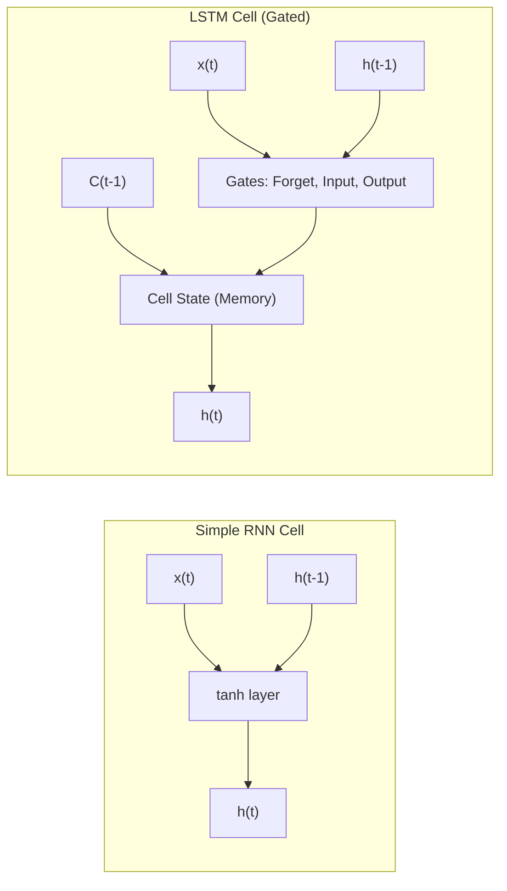

# РОЗДІЛ 1. ОГЛЯД ЛІТЕРАТУРИ ТА АНАЛІЗ ПРЕДМЕТНОЇ ОБЛАСТІ

### 1.1. Концепція Smart City: роль інтелектуальних енергосистем (Smart Grid)

Сучасна урбанізація вимагає якісно нових підходів до управління міською інфраструктурою. Концепція **«Розумного міста» (Smart City)** постає як відповідь на запити сталого розвитку, де ефективність функціонування забезпечується глибокою інтеграцією інформаційно-комунікаційних технологій (ІКТ) у всі сфери життя громади.

В основі Smart City лежить розгалужена мережа взаємопов’язаних пристроїв — **Інтернету речей (IoT)**. Ці пристрої (сенсори, інтелектуальні лічильники, контролери) формують єдиний інформаційний простір, що дозволяє збирати, передавати та аналізувати дані в режимі реального часу. Саме системна взаємодія мільйонів IoT-вузлів перетворює пасивне міське середовище на динамічну екосистему, здатну до самодіагностики та адаптивного управління.

**Енергоспоживання** є фундаментом та ключовим показником життєдіяльності будь-якого мегаполісу. Динаміка використання електроенергії відображає не лише економічну активність підприємств, а й соціальні ритми населення, стан критичної інфраструктури та екологічну ситуацію. У концепції Smart City енергетичний сектор трансформується у **Smart Grid (інтелектуальні мережі)** — системи, що забезпечують двосторонній обмін як електроенергією, так і даними між постачальником та споживачем.

Однією з найбільш гострих проблем сучасної енергетики є нерівномірність навантаження та виникнення **пікових періодів споживання**. Традиційні мережі змушені мати надлишкові потужності, які простоюють більшу частину часу, лише для того, щоб витримати ці пікові моменти. 

Необхідність **автоматизації збору та аналізу даних** у Smart Grid зумовлена трьома критичними факторами:
1.  **Оптимізація ресурсів**: Точне прогнозування дозволяє балансувати навантаження без залучення дорогих резервних потужностей.
2.  **Надійність**: Автоматизовані системи здатні миттєво ідентифікувати аномалії, запобігаючи каскадним аваріям.
3.  **Економічна стійкість**: Зменшення пікових навантажень («згладжування» графіка) дозволяє знизити тарифи та витрати на експлуатацію мереж.

### 1.2. Важливість прогнозних моделей в енергетиці

Традиційне управління об’єднаними енергосистемами тривалий час базувалося на **реактивному підході**: реакції на дисбаланс потужності вже після його виникнення. Однак, у масштабах Smart City такий підхід є неефективним і ризикованим. Використання інтелектуальних моделей дозволяє здійснити перехід до **проактивного управління**, де рішення приймаються на основі ймовірнісних сценаріїв майбутнього стану мережі.

**Економічний ефект** від впровадження прогнозних моделей проявляється у двох площинах:
*   **Оптимізація закупівель**: Енергопостачальні компанії можуть точніше планувати обсяги генерації або закупівлі енергії на ринках «на добу наперед» (Day-Ahead Market), уникаючи штрафів за небаланси.
*   **Запобігання перевантаженням**: Своєчасне прогнозування «піків» дозволяє диспетчерам завчасно перерозподіляти навантаження або залучати системи накопичення енергії (ESS), що подовжує термін експлуатації дорогого обладнання підстанцій.

Проте, створення точних прогнозних моделей супроводжується низкою технічних та наукових **викликів**:
1.  **Нелінійність та стохастичність**: Поведінка споживачів не підпорядковується простим лінійним законам.
2.  **Багаторівнева сезонність**: На споживання одночасно впливають добові ритми (година), тижневі цикли (робочі/вихідні) та річна сезонність (опалювальний сезон).
3.  **Вплив зовнішніх факторів**: Погодні умови (температура повітря, хмарність, вологість) мають вирішальний, але не завжди лінійний вплив. Наприклад, критичне зростання навантаження спостерігається як при екстремально низьких температурах (опалення), так і при високих (системи кондиціювання).

Саме ці виклики зумовлюють потребу в застосуванні архітектур глибокого навчання, здатних виявляти приховані закономірності у великих масивах даних.

### 1.3. Порівняльний аналіз архітектур нейронних мереж для часових рядів

Вибір математичного апарату для прогнозування енергоспоживання є критичним етапом проєктування системи. Традиційно для аналізу часових рядів використовувалися статистичні методи, такі як **ARIMA (Autoregressive Integrated Moving Average)** та експоненціальне згладжування. Ці методи демонструють високу ефективність на стабільних даних з чітко вираженою лінійністю та стаціонарністю. Проте, у складних міських умовах, де навантаження мережі зазнає різких стохастичних коливань, класичні методи часто виявляються обмеженими через нездатність враховувати складні нелінійні взаємозв’язки між багатьма ознаками.

Альтернативою стали **Рекурентні нейронні мережі (RNN)**. Їхньою ключовою особливістю є наявність зворотних зв’язків, що дозволяє мережі «запам’ятовувати» інформацію про попередні стани. Втім, базові RNN страждають від проблеми затухання/вибуху градієнта, що перешкоджає навчанню на довгих послідовностях.

Стандартом промислового прогнозування стали вдосконалені архітектури:
*   **LSTM (Long Short-Term Memory)**: Завдяки спеціальним механізмам гейтів (Forget, Input, Output), LSTM здатна вибірково зберігати важливу інформацію на довгих часових інтервалах та ігнорувати шуми.

#### Порівняльна структура блоків RNN та LSTM (Рис. 1.1)

*Рис. 1.1. Схематичне порівняння архітектур Simple RNN та LSTM*

Порівняно з класичними моделями, LSTM-архітектури, реалізовані у проєкті EnergyMonitor-OLAP, мають такі переваги:

Багатофакторність: Здатність одночасно обробляти навантаження, температуру, показники здоров’я обладнання та калібрувальні дані.

Гнучкість до аномалій: Нейромережі краще адаптуються до різких змін режиму роботи мережі (наприклад, під час аварійних перемикань).

Автоматичне виявлення ознак: Відсутність потреби у складному ручному підборі параметрів лагу, властивому методам ARIMA.

Таким чином, використання LSTM як основного обчислювального вузла дозволяє досягти стабільно низької похибки прогнозу (RMSE), що підтверджується результатами тестування системи.

### 1.4. Концепція Digital Twin та обґрунтування вибору архітектурних рішень

Сучасним етапом розвитку систем інтелектуального моніторингу є перехід від статичних моделей до концепції **Цифрових двійників (Digital Twin)**. Цифровий двійник — це динамічна віртуальна копія фізичного об’єкта або системи, яка функціонує паралельно з реальним прототипом, отримуючи дані від сенсорів та моделюючи його стан у режимі реального часу.

У проєкті **EnergyMonitor-OLAP** концепція Digital Twin реалізована через математичне моделювання фізичних процесів у мережі. На відміну від звичайних симуляторів, розроблений цифровий двійник враховує:

**Фізичні закони передачі енергії**: Розрахунок втрат у лініях електропередачі змінного (AC) та постійного (HVDC) струму залежно від навантаження.

**Технічний стан обладнання (Condition Monitoring)**: Моделювання теплової деградації трансформаторів, моніторинг вмісту водню (H2) та розрахунок інтегрального показника «здоров’я» (Health Score).

**Екологічний контекст**: Вплив атмосферних явищ на генерацію з відновлюваних джерел та енергоспоживання (U-подібна залежність від температури).

Така глибина моделювання дозволяє не лише накопичувати статистику, а й створювати якісні набори даних для навчання нейронних мереж, що відображають реальні фізичні обмеження енергосистеми.

**Обґрунтування архітектурних рішень**: Для реалізації описаної концепції було обрано 4-рівневу SaaS-архітектуру, що базується на таких засадах:

**Рівень даних (PostgreSQL/Neon Cloud)**: Обрано реляційну модель з OLAP-можливостями для забезпечення суворої типізації телеметрії та високої швидкості аналітичних вибірок. Використання Serverless Postgres (Neon) дозволяє динамічно масштабувати ресурси залежно від обсягу даних Smart City.

**Інтелектуальне ядро (LSTM v3)**: Вибір рекурентної архітектури зумовлений потребою виявлення складних часових залежностей, які неможливо описати класичними статистичними методами.

**Рівень представлення (Streamlit)**: Цей фреймворк забезпечує швидку побудову інтерактивних систем підтримки прийняття рішень (DSS), дозволяючи оператору візуалізувати складні багатовимірні дані у реальному часі без затримок на розробку складного Frontend-коду.

**DevOps та контейнеризація (Docker/Render)**: Це гарантує стабільність розгортання та відтворюваність середовища, що є критичним для систем критичної інфраструктури.

Отже, запропонований комплекс рішень дозволяє створити цілісну систему, яка забезпечує високу точність прогнозування та надійність управління енергетичними об’єктами в умовах сучасного Smart City.

---
[Назад до Вступу](THESIS_0_INTRODUCTION.md) | [Далі: Розділ 2. Постановка завдання](THESIS_2_REQUIREMENTS.md)
