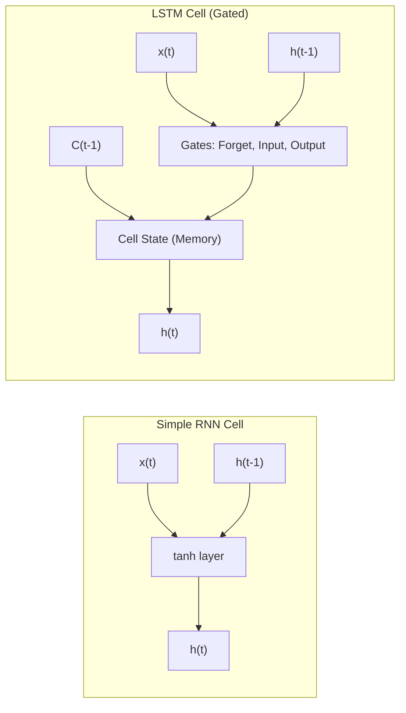

# РОЗДІЛ 1. ОГЛЯД ЛІТЕРАТУРИ ТА АНАЛІЗ ПРЕДМЕТНОЇ ОБЛАСТІ

### 1.1. Концепція Smart City: роль інтелектуальних енергосистем (Smart Grid)

#### 1.1.1. Еволюція міських інфраструктур: від індустріального міста до Smart City
Сучасна урбанізація вимагає якісно нових підходів до управління міською інфраструктурою [7]. Концепція **«Розумного міста» (Smart City)** постає як відповідь на запити сталого розвитку, де ефективність функціонування забезпечується глибокою інтеграцією інформаційно-комунікаційних технологій (ІКТ) у всі сфери життя громади.

Історично розвиток міст проходив через кілька етапів:
1. **Infrastructure City (1.0)** — фокус на фізичній розбудові (дороги, електрифікація).
2. **Digital City (2.0)** — поява перших автоматизованих систем керування (АСУ) та оцифрування реєстрів.
3. **Smart City (3.0)** — використання штучного інтелекту, великих даних та проактивного управління для покращення якості життя.

В основі Smart City лежить розгалужена мережа взаємопов’язаних пристроїв — **Інтернету речей (IoT)**. Ці пристрої (сенсори, інтелектуальні лічильники, контролери) формують єдиний інформаційний простір, що дозволяє збирати, передавати та аналізувати дані в режимі реального часу. Саме системна взаємодія мільйонів IoT-вузлів перетворює пасивне міське середовище на динамічну екосистему, здатну до самодіагностики та адаптивного управління.

#### 1.1.2. Smart Grid — енергетичне серце Розумного міста
**Енергоспоживання** є фундаментом та ключовим показником життєдіяльності будь-якого мегаполісу. Динаміка використання електроенергії відображає не лише економічну активність підприємств, а й соціальні ритми населення, стан критичної інфраструктури та екологічну ситуацію. У концепції Smart City енергетичний сектор трансформується у **Smart Grid (інтелектуальні мережі)** — системи, що забезпечують двосторонній обмін як електроенергією, так і даними між постачальником та споживачем.

Smart Grid відрізняється від традиційних мереж за такими ознаками:
* **Двостороння комунікація**: Лічильники не лише передають дані в центр, а й отримують команди на обмеження навантаження.
* **Децентралізація**: Інтеграція розподілених джерел енергії (мікрогенерація, сонячні панелі на дахах будинків).
* **Саморегуляція**: Здатність мережі до автоматичного переконфігурування та відновлення після збоїв без прямого втручання людини.
* **Гнучкість навантаження (Demand Response)**: Система може стимулювати споживачів зменшувати використання енергії в пікові години через динамічне тарифоутворення.

Однією з найбільш гострих проблем сучасної енергетики є нерівномірність навантаження та виникнення **пікових періодів споживання**. Традиційні мережі змушені будуватися з урахуванням величезного «коридору безпеки», що призводить до простою потужностей у нічні години та перевантаження обладнання (трансформаторів) під час вечірніх максимумів. 

Необхідність **автоматизації збору та аналізу даних** у Smart Grid зумовлена такими факторами:
1.  **Оптимізація ресурсів**: Точне прогнозування дозволяє балансувати навантаження без залучення дорогих маневрових потужностей (ТЕС/ГЕС).
2.  **Надійність**: Автоматизовані системи здатні ідентифікувати аномалії (флуктуації навантаження) ще до моменту виходу обладнання з ладу.
3.  **Економічна стійкість**: Зменшення пікових навантажень («згладжування» графіка) дозволяє знизити тарифи для споживачів та витрати на експлуатацію для компаній.

### 1.2. Аналіз методів прогнозування енергоспоживання

#### 1.2.1. Математична природа часових рядів енергоспоживання
$$y(t) = T(t) + S(t) + C(t) + \epsilon(t) \quad (1.1)$$
де $y(t)$ — обсяг енергоспоживання в момент часу $t$;
$T(t)$ — тренд;
$S(t)$ — сезонна компонента;
$C(t)$ — циклічна компонента;
$\epsilon(t)$ — випадкова складова (білий шум).

У контексті Smart Grid особливу складність становить **мультисезонність**. Наприклад, графік споживання однієї квартири має два піки (ранок та вечір), тоді як графік промислового об’єкта — один платоподібний пік вдень. Завдання інтелектуального прогнозування полягає у виявленні цих закономірностей у потоці «шумних» даних телеметрії.

#### 1.2.2. Статистичні методи (ARIMA/SARIMA) та їх обмеження
Традиційно для прогнозування використовувалися такі статистичні підходи:
1. **Moving Average (Ковзне середнє)** — просте згладжування даних, яке запізнюється за реальними змінами і не підходить для оперативного управління.
2. **ARIMA (Autoregressive Integrated Moving Average)** — інструмент, що враховує авторегресію та інтегроване ковзне середнє [3, 5]. Вимагає стаціонарності ряду (постійного середнього та дисперсії).
3. **SARIMA** — додає облік сезонних компонентів [13], що є критичним для циклів «день-ніч».

Основне обмеження статистичних моделей (Box-Jenkins approach) полягає в тому, що вони базуються на лінійних припущеннях. Енергоспоживання у Smart City за своєю природою є **нестаціонарним та нелінійним**, що робить класичні методи менш ефективними порівняно з алгоритмами глибокого навчання при прогнозуванні на довгі горизонти планування.

Саме ці виклики зумовлюють потребу в застосуванні архітектур глибокого навчання, здатних виявляти приховані закономірності у великих масивах даних.

#### 1.3.3. Математична архітектура LSTM: Механізм гейтів
На відміну від стандартних RNN, LSTM містить спеціальні блоки — **гейти (Gates)**, які дозволяють керувати інформаційними потоками всередині комірки [4, 9]. Математично робота LSTM на кожному кроці $t$ описується системою рівнянь:

1. **Forget Gate (Гейт забуття)**: 
$$f_t = \sigma(W_f \cdot [h_{t-1}, x_t] + b_f) \quad (1.2)$$
2. **Input Gate (Гейт входу)**: 
$$i_t = \sigma(W_i \cdot [h_{t-1}, x_t] + b_i) \quad (1.3)$$
$$\tilde{C}_t = \tanh(W_C \cdot [h_{t-1}, x_t] + b_C) \quad (1.4)$$
3. **Update Cell State (Оновлення стану комірки)**: 
$$C_t = f_t * C_{t-1} + i_t * \tilde{C}_t \quad (1.5)$$
4. **Output Gate (Гейт виходу)**: 
$$o_t = \sigma(W_o \cdot [h_{t-1}, x_t] + b_o) \quad (1.6)$$
$$h_t = o_t * \tanh(C_t) \quad (1.7)$$
де $\sigma$ — сигмоїдна функція активації;
$W$ — матриці ваг;
$b$ — вектори зміщення (bias);
$h_t$ — прихований стан комірки;
$C_t$ — стан пам’яті комірки.

Завдяки цій структурі, як зазначають автори архітектури [11], мережа може зберігати дані про енергоспоживання за минулі тижні, одночасно реагуючи на миттєві зміни факторів.

#### Порівняльна структура блоків RNN та LSTM (Рис. 1.1)

*Рис. 1.1. Схематичне порівняння архітектур Simple RNN та LSTM*

Порівняно з класичними моделями, LSTM-архітектури, реалізовані у проєкті EnergyMonitor-OLAP, мають такі переваги:

Багатофакторність: Здатність одночасно обробляти навантаження, температуру, показники здоров’я обладнання та калібрувальні дані.

Гнучкість до аномалій: Нейромережі краще адаптуються до різких змін режиму роботи мережі (наприклад, під час аварійних перемикань).

Автоматичне виявлення ознак: Відсутність потреби у складному ручному підборі параметрів лагу, властивому методам ARIMA.

Таким чином, використання LSTM як основного обчислювального вузла дозволяє досягти стабільно низької похибки прогнозу (RMSE), що підтверджується результатами тестування системи.

### 1.4. Концепція Digital Twin та обґрунтування вибору архітектурних рішень

#### 1.4.1. Визначення та міжнародні стандарти Цифрових двійників
Сучасним етапом розвитку систем інтелектуального моніторингу є перехід від статичних моделей до концепції **Цифрових двійників (Digital Twin)**. Згідно з визначенням ISO 23247, Цифровий двійник — це цифрова копія фізичного активу, яка забезпечує двосторонній потік даних для моніторингу, діагностики та прогнозування стану об’єкта.

У проєкті **EnergyMonitor-OLAP** концепція Digital Twin реалізована через математичне моделювання фізичних процесів у мережі [18]. На відміну від звичайних симуляторів, розроблений цифровий двійник враховує:
* **ISO 23247 Compliance**: Використання стандартних рівнів моделювання (спостереження, аналіз, контроль).
* **Фізичні закони передачі енергії**: Розрахунок втрат у лініях електропередачі залежно від навантаження.
* **Condition Monitoring (ISO 17359)**: Моделювання теплової деградації трансформаторів та розрахунок інтегрального показника «здоров’я» (Health Score) [20].

Така глибина моделювання дозволяє не лише накопичувати статистику, а й створювати якісні набори даних для навчання нейронних мереж, що відображають реальні фізичні обмеження енергосистеми.

### 1.5. Наукова новизна та практичне значення розробки

#### 1.5.1. Постановка наукової задачі
Головною науковою задачею роботи є поєднання методів глибокого навчання (LSTM) з детермінованими фізичними моделями цифрових двійників для підвищення точності прогнозування в умовах високої волатильності енергоспоживання Smart City.

#### 1.5.2. Наукова новизна
Наукова новизна отриманих результатів полягає у:
1. **Гібридизації моделей**: Запропоновано підхід, де вихідні дані фізичного симулятора (Digital Twin) використовуються для калібрування ШІ-прогнозів.
2. **Впровадженні тригонометричного кодування часових фіч**: На відміну від стандартних підходів, у роботі використано кодування циклічності часу за допомогою функцій $\sin$ та $\cos$, що дозволяє моделі сприймати час як безперервну циклічну величину.

#### 1.5.3. Практичне значення
Результати роботи можуть бути використані:
* Диспетчерськими службами для запобігання перевантаженням підстанцій.
* Енергопостачальними компаніями для мінімізації фінансових втрат на ринку «на добу наперед».
* Муніципальними структурами для планування розвитку енергомереж Розумного міста.

---
[Назад до Вступу](THESIS_0_INTRODUCTION.md) | [Далі: Розділ 2. Постановка завдання](THESIS_2_REQUIREMENTS.md)
