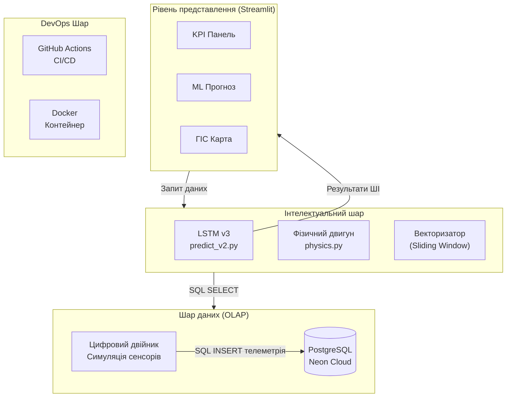
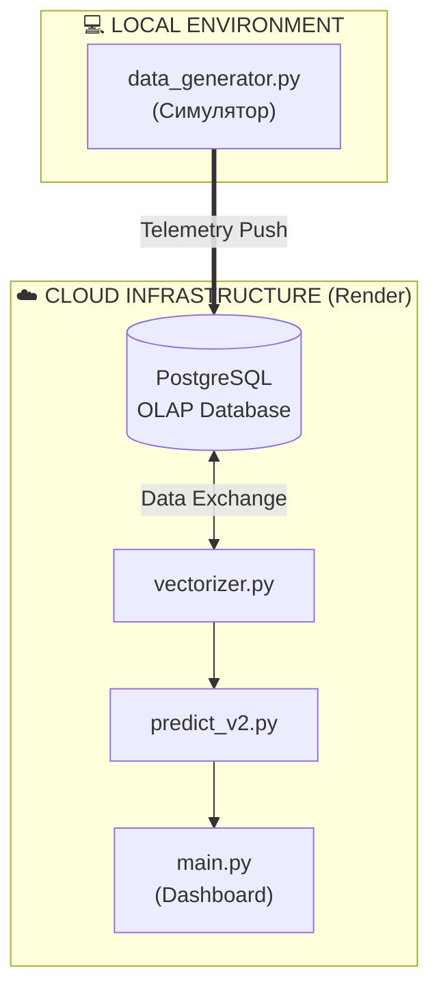
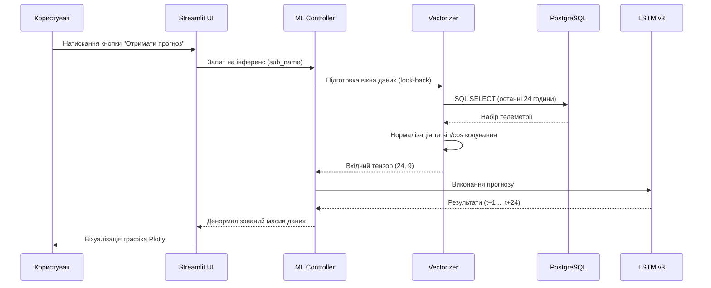
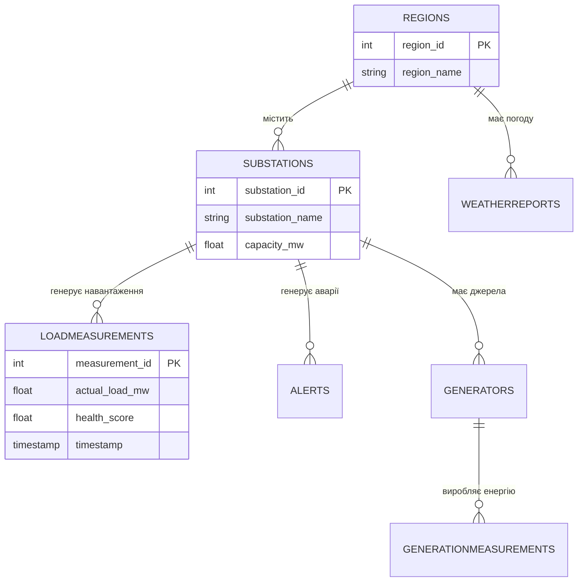

# РОЗДІЛ 2. ПРОЄКТУВАННЯ АРХІТЕКТУРИ СИСТЕМИ ENERGYMONITOR-OLAP

### 2.1. Опис архітектури платформи

Проєктування архітектури інтелектуальної системи EnergyMonitor-OLAP базується на принципах модульності, масштабованості та розділення відповідальності (Separation of Concerns). Для забезпечення стабільної роботи у хмарному середовищі та високої швидкості аналітичних обчислень було обрано **багатошарову архітектуру (Layered Architecture)**, що складається з чотирьох основних рівнів.

#### Логічна структура шарів (Layered Model)
Нижче наведено ієрархічну схему взаємодії основних компонентів системи (Рисунок 2.1):


*Рисунок 2.1. Багатошарова архітектура інтелектуальної системи EnergyMonitor-OLAP*

#### Компонентна схема та середовища розгортання
Система спроєктована для роботи у гібридному середовищі, де генерація даних може відбуватися локально, а аналітика та прогнозування — у хмарному кластері (Рисунок 2.2):


*Рисунок 2.2. UML-діаграма компонентів та розподілу середовищ*

#### Діаграма послідовності обробки прогнозу
Для глибшого розуміння динаміки системи розглянемо процес обробки запиту користувача на отримання прогнозу споживання (Рисунок 2.3):


*Рисунок 2.3. Sequence Diagram процесу інтелектуального прогнозування*

### 2.2. Реалізація аналітичної бази даних

Центральним сховищем системи є реляційна база даних PostgreSQL 15. Вибір реляційної моделі зумовлений необхідністю суворої типізації даних телеметрії та складною структурою взаємозв’язків між об’єктами енергосистеми.

#### Схема даних (ER-діаграма)
Структура бази даних спроєктована за принципом «зірка» (Star Schema). Центром схеми є таблиці фактів (вимірювання), які пов’язані з таблицями вимірів (довідники об’єктів).



#### SQL-запити та OLAP-обробка
Для забезпечення швидкодії інтерфейсу система використовує складні SQL-запити з поєднанням даних (JOIN) на рівні серверу БД. Прикладом є запит для кореляції навантаження та погодних умов:

```sql
SELECT 
    lm.timestamp,
    r.region_name,
    lm.actual_load_mw,
    s.substation_name,
    wr.temperature
FROM LoadMeasurements lm
JOIN Substations s ON lm.substation_id = s.substation_id
JOIN Regions r ON s.region_id = r.region_id
LEFT JOIN WeatherReports wr ON 
    lm.timestamp = wr.timestamp 
    AND r.region_id = wr.region_id
WHERE lm.timestamp >= NOW() - INTERVAL '30 days'
ORDER BY lm.timestamp ASC;
```

### 2.3. Проєктування модуля інтелектуального прогнозування

Архітектура модуля прогнозування побудована як замкнений ETL-конвеєр (Extraction, Transformation, Loading), що інтегрує фізичне моделювання та методи глибокого навчання.

#### Механізм «Цифрового двійника»
Для генерації потоку даних реалізовано модуль спеціальної симуляції, що виконує роль цифрового аналога енергомережі. Система використовує фонові процеси та механізми контролю станів (lock-файли) для забезпечення цілісності даних.

#### Конвеєр підготовки даних
Взаємодія симулятора з прогнозуючим ядром відбувається через наступні етапи:
1.  **Extraction**: Вилучення історичного вікна даних з бази.
2.  **Transformation**: Застосування методу ковзного вікна для формування вхідних тензорів.
3.  **Inference**: Обробка даних LSTM-моделлю та видача результату.

---
[⬅️ Назад до Розділу 1](THESIS_1_THEORY.md) | [Далі: Розділ 3 ➡️](THESIS_3_ML_CORE.md)
