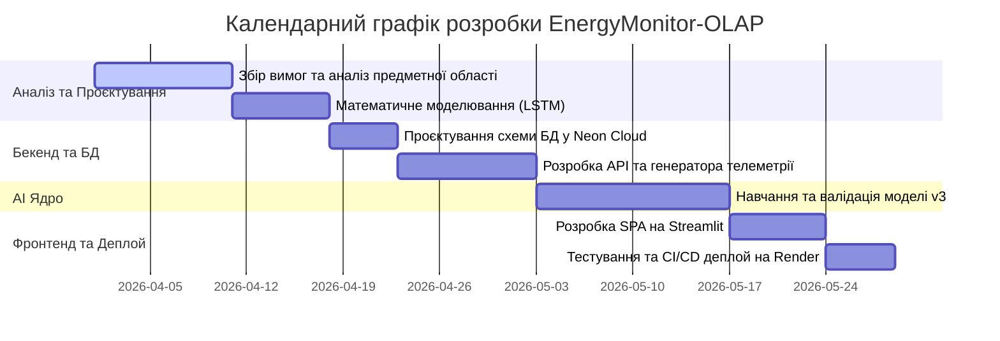

# РОЗДІЛ 2. ПОСТАНОВКА ЗАВДАННЯ ТА ВИМОГИ ДО СИСТЕМИ

## 2.1. Формулювання задачі кваліфікаційного проєктування.
Основною метою цього проєкту є створення хмарної SaaS-платформи EnergyMonitor-OLAP, призначеної для оперативного моніторингу, симуляції фізичних станів та предиктивного аналізу часових рядів енергоспоживання в міській інфраструктурі. 

Традиційні системи моніторингу зазвичай фіксують аварійний стан постфактум. Розроблена платформа формує прогноз навантаження на 24–48 годин наперед, що дає змогу диспетчерському персоналу приймати рішення до виникнення перевантаження мережі. Для досягнення цієї мети система використовує поєднання рекурентних нейронних мереж архітектури LSTM [10, 11] та аналітичних інструментів OLAP.

Функціональні вимоги до системи:
1. Автоматична генерація прогнозів навантаження на 24–48 годин за допомогою розробленої моделі LSTM з корекцією помилок на основі зовнішніх факторів.
2. Розрахунок термічного зносу ізоляції трансформаторів та втрат потужності (концепція Digital Twin [35, 36]).
3. Побудова інтерактивних ГІС-шарів із кольоровою індикацією технічного стану вузлів енергосистеми.
4. Автоматична ідентифікація аномалій у телеметрії на основі аналізу відхилень від прогнозного фону.
5. Формування критичних сповіщень при перевищенні лімітів навантаження або критичному зниженні показника Health Score (< 40%).

Нефункціональні вимоги до системи:
1. Архітектура повинна підтримувати масштабування бази даних (PostgreSQL) [23] та модульне додавання нових предиктивних моделей.
2. Забезпечення відмовостійкості інтерфейсу при тимчасовій втраті зв'язку з хмарною БД Neon за рахунок механізмів локального кешування.
3. Час обробки одного аналітичного запиту не повинен перевищувати 350 мс.
4. Повна контейнеризація за допомогою Docker для розгортання в середовищі Render.com [24].
5. Модель LSTM повинна забезпечувати похибку на еталонних наборах даних не більше 4.0% за показником MAPE [13].

## 2.2. Вхідна та вихідна інформація системи

Для функціонування моделей прогнозування та механізмів цифрового двійника система використовує комбінований набір історичної телеметрії та поточних показників.

Вхідна інформація:
1. Набори даних з даними погодинного споживання (CSV та дампи SQL) у мегаватах (МВт), що використовуються для навчання та тестування [21].
2. Потоки телеметрії з частотою 15–60 хвилин від віртуальних сенсорів (навантаження, температура масла, концентрація H₂).
3. Погодні параметри: температура навколишнього середовища, вологість та атмосферний стан.

Вимоги до інформаційної безпеки:
Згідно з міжнародним стандартом ISO/IEC 27001, система повинна гарантувати цілісність та конфіденційність телеметричних даних [14]. Реалізовано захист від несанкціонованого доступу до предиктивних алгоритмів та параметрів конфігурації моделі.

Вихідна інформація:
1. Прогнози навантаження $F_t$ на глибину до 48 годин з розрахунком довірчого інтервалу (95%).
2. Показник технічного стану обладнання (Health Score) у діапазоні 0–100% на основі теплової моделі та аналізу газів.
3. Статистичні метрики якості передбачення (RMSE, MAPE).
4. Звіти щодо потенційних втрат енергії при перевищенні номінальних режимів роботи.

## 2.3. Аналіз середовища розробки

Для комплексної оцінки розробленої системи та визначення стратегічних напрямків її розвитку проведено SWOT-аналіз. Він дає змогу виявити внутрішні фактори (сильні та слабкі сторони), а також зовнішні можливості та загрози для платформи EnergyMonitor-OLAP.

Таблиця 2.1. SWOT-аналіз системи EnergyMonitor-OLAP

| Сильні сторони (Strengths) | Слабкі сторони (Weaknesses) |
| :--- | :--- |
| 1. Висока точність прогнозу. | 1. Залежність від стабільності інтернет-каналу. |
| 2. Низька вартість експлуатації (Neon Cloud). | 2. Значне споживання RAM моделями LSTM. |
| 3. Автоматична діагностика Health Score. | 3. Відсутність інтеграції з мобільними ОС. |
| **Можливості (Opportunities)** | **Загрози (Threats)** |
| 1. Масштабування на промислові об'єкти. | 1. Кібератаки на хмарну інфраструктуру [17]. |
| 2. Прогнозування генерації ВДЕ. | 2. Зміни в тарифікації хмарних провайдерів. |
| 3. Інтеграція з міськими ГІС-порталами. | 3. Конкуренція з боку закритих корпоративних рішень. |

## 2.4. Порівняльний аналіз хмарних СУБД для предиктивного моніторингу

У процесі проєктування було проведено порівняння хмарних рішень для зберігання та аналізу телеметрії. Основним критерієм вибору була підтримка OLAP-запитів та гнучкість масштабування ресурсів при зміні кількості об'єктів моніторингу.

Вибір Neon PostgreSQL [18] обґрунтований його serverless-архітектурою, яка дає змогу динамічно масштабувати обчислювальні потужності. Такий підхід дає змогу оперативно реагувати на пікові навантаження під час масової генерації прогнозу та забезпечує раціональне використання ресурсів у періоди низької активності мережі.

Таблиця 2.2. Порівняльна характеристика хмарних СУБД.

| Параметр | Neon (Обрано) | AWS RDS | Google Cloud SQL |
| :--- | :--- | :--- | :--- |
| Архітектура | Serverless PostgreSQL | Managed Instance | Managed Instance |
| Масштабування | Автоматичне (on-demand) | Вертикальне (ручне) | Вертикальне (ручне) |
| Модель оплати | За фактичні ресурси | Фіксована (Instance-based) | Фіксована (Instance-based) |
| Продуктивність OLAP | Висока (Storage/Compute split) | Середня | Середня |

## 2.5. Математична постановка задачі та метрики якості

Задача короткострокового прогнозування енергоспоживання формулюється як задача аналізу часового ряду $X = \{x_1, x_2, ..., x_t\}$. Метою проєкту є побудова відображення $f: X \to Y$, де $Y = \{y_{t+1}, ..., y_{t+n}\}$ – прогноз на горизонт $n$ кроків вперед (до 48 годин). 

Модель має мінімізувати комбінований функціонал похибки, що забезпечує стабільність прогнозу як при плавних змінах, так і при різких стрибках навантаження. Основними метриками оцінки якості визначено:

1. Середня абсолютна відсоткова похибка (MAPE):
$$MAPE = \frac{100}{n} \sum_{i=1}^{n} \left| \frac{y_i - \hat{y}_i}{y_i} \right| \quad (2.1)$$
де $y_i$ – фактичне значення, $\hat{y}_i$ – прогноз. Ця метрика обрана через її інтуїтивну інтерпретацію та незалежність від масштабу потужності конкретної підстанції.

2. Середньоквадратична похибка (RMSE):
$$RMSE = \sqrt{\frac{1}{n} \sum_{i=1}^{n} (y_i - \hat{y}_i)^2} \quad (2.2)$$
Дана метрика акцентує увагу на значних відхиленнях (штрафує великі помилки), що дає змогу завчасно виявити ризики перевантаження силового обладнання [13].

3. Функція втрат (Huber Loss):
Для навчання нейронної мережі використано функцію Huber Loss, яка поєднує стійкість до викидів та диференційованість:
$$L_{\delta}(a) = \begin{cases} 0.5 a^2, & |a| \leq \delta \\ \delta(|a| - 0.5\delta), & \text{інакше} \end{cases} \quad (2.3)$$
Використання Huber Loss [12] дає змогу стабілізувати градієнти при наявності шумів у вхідних даних телеметрії.

## 2.6. Специфікація форматів обміну даними

Для забезпечення сумісності з IoT-шлюзами та зовнішніми аналітичними системами, вхідна та вихідна інформація передається у форматі JSON.

Приклад структури вхідного пакету телеметрії (`telemetry_payload`):
```json
{
  "substation_id": 10,
  "timestamp": "2026-05-08T15:00:00Z",
  "metrics": {
    "actual_load_mw": 124.5,
    "temperature_c": 62.1,
    "h2_ppm": 15.2
  },
  "status": "online"
}
```

Вихідна інформація для візуалізації та API формується у вигляді об'єкта прогнозної серії:
```json
{
  "forecast_id": "F_20260508_04",
  "prediction_horizon": "48h",
  "data_points": [
    {
      "timestamp": "2026-05-08T16:00:00Z", 
      "predicted_load_mw": 130.2, 
      "lower_bond": 128.5, 
      "upper_bond": 132.1
    },
    {
      "timestamp": "2026-05-08T17:00:00Z", 
      "predicted_load_mw": 145.8, 
      "lower_bond": 142.0, 
      "upper_bond": 149.5
    }
  ]
}
```

## 2.7. Обґрунтування видів забезпечення системи

Згідно з державними стандартами до інженерного проєктування, розробка системи EnergyMonitor-OLAP базується на чотирьох взаємопов'язаних видах забезпечення.

### 2.7.1. Математичне забезпечення
Математичне забезпечення являє собою сукупність математичних методів, моделей та алгоритмів, що забезпечують реалізацію інтелектуальних функцій системи, зокрема короткострокового прогнозування навантаження та моделювання фізичних процесів для оцінки технічного стану обладнання. Даний вид забезпечення включає:
- багатошарова архітектура LSTM із механізмом тригонометричного кодування часових міток (Sin/Cos);
- алгоритми регуляризації Dropout [9] та механізм EarlyStopping для запобігання перенавчанню моделі;
- стійка функція втрат Huber Loss [12] для обробки аномалій.

### 2.7.2. Технічне забезпечення
Технічне забезпечення – це комплекс технічних та хмарних засобів, необхідних для безперебійного збору телеметрії, високопродуктивних обчислень та віддаленого доступу користувачів до аналітичних панелей:
- обчислювальні потужності платформи Render.com [24] (512 МБ RAM, оптимізовано під ліміти безкоштовного тарифного плану);
- хмарне сховище Neon Cloud із підтримкою serverless-масштабування обсягу даних;
- клієнтські пристрої (ПК диспетчера) з підтримкою сучасних веб-браузерів.

### 2.7.3. Програмне забезпечення
Програмне забезпечення складається з сукупності системних та спеціалізованих програмних засобів, що забезпечують виконання нейромережевих моделей, управління базами даних та візуалізацію результатів:
- системне ПЗ: ОС Linux у Docker-контейнерах для забезпечення ідентичності середовища розробки та виконання;
- мова розробки: Python 3.11+ (через наявність розвиненої екосистеми спеціалізованих бібліотек аналізу даних);
- бібліотеки ML: TensorFlow/Keras для побудови нейронної мережі та NumPy/Pandas для високопродуктивної обробки векторів даних;
- веб-інтерфейс: Streamlit та Plotly для візуалізації.

### 2.7.4. Інформаційне забезпечення
Інформаційне забезпечення визначає методи організації інформаційної бази, структуру збереження даних та протоколи їх передачі між компонентами хмарної платформи:
- реляційна схема PostgreSQL, оптимізована для агрегаційних аналітичних запитів (OLAP-сховище);
- специфікація таблиць LoadMeasurements, WeatherReports та довідників об'єктів;
- протоколи безпечної передачі даних HTTPS та шифрування на рівні СУБД.

## 2.8. Високорівневі моделі та етапи розробки системи

Для документування архітектури та опису взаємодії користувачів із системою використано методологію UML. Основним актором є диспетчер енергомережі, який здійснює контроль через веб-інтерфейс.


Рис. 2.1. Діаграма прецедентів системи EnergyMonitor-OLAP. Джерело: розроблено автором.

Діаграма прецедентів (рис. 2.1) описує межі системи та основні ролі. Користувач має доступ до функціональних підсистем моніторингу в реальному часі та AI-прогнозування.

Для деталізації процесу обробки даних та формування прогнозу використано діаграму активності. Вона відображає процес нормалізації вхідного вектора та механізм валідації результатів.


Рис. 2.3. Процес підготовки та нормалізації даних. Джерело: розроблено автором.


Рис. 2.4. Процес передбачення та валідації прогнозу. Джерело: розроблено автором.

Діаграма активності (рис. 2.2) деталізує внутрішній процес обробки даних при отриманні прогнозу. Процеси підготовки та передбачення (рис. 2.3, 2.4) включають етапи нормалізації ознак та активації резервного алгоритму у разі виявлення пропущених значень у часовому ряді.

Розробка платформи здійснюється за ітеративною моделлю. Графік виконання основних етапів проєктування та впровадження наведено у формі діаграми Ганта.



Рис. 2.5. Календарний графік етапів розробки системи. Джерело: розроблено автором.

Етапи реалізації включають:
1. Аналітично-проєктна фаза: вивчення патернів споживання, обрання датасету, формалізація математичних моделей.
2. Фаза побудови бекенду: розробка реляційної структури БД у PostgreSQL, налаштування середовища (Neon Cloud) та створення генератора симулятивної телеметрії.
3. Фаза дослідження AI: експерименти над архітектурами мереж від базової LSTM до мультифакторної моделі з функцією Huber Loss.
4. Інтеграційна фаза: створення панелі на базі Streamlit, об'єднання ML-ядра та інтерфейсу.
5. Тестування та інфраструктура: написання Unit-тестів на фреймворку `pytest`, налаштування CI/CD конвеєра, контейнеризація за допомогою Docker та розгортання.

## ВИСНОВКИ ДО РОЗДІЛУ 2
У другому розділі проведено постановку завдання на проєктування системи EnergyMonitor-OLAP та визначено основні вимоги до її функціонування. Отримано результати:
1. Сформовано перелік технічних та функціональних вимог до системи, зокрема визначено граничний час обробки аналітичного запиту (до 350 мс) та цільову похибку передбачення (MAPE < 4.0%).
2. Проведено порівняльне дослідження хмарних СУБД та обґрунтовано вибір Neon PostgreSQL для забезпечення швидкодії аналітичних запитів. Конкретизовано формати обміну даними (JSON) для забезпечення їх повної синхронізації між модулями.
3. Визначено склад чотирьох видів забезпечення (математичне, технічне, програмне та інформаційне), зокрема обґрунтовано використання архітектури LSTM у поєднанні з функцією втрат Huber Loss.
4. Візуалізовано логіку роботи системи та календарний графік впровадження за допомогою UML-діаграм та діаграми Ганта.

Отримані результати є основою для створення технічного завдання для детальної реалізації програмного комплексу, опис якої наведено у наступному розділі.

---
[Назад до Розділу 1](THESIS_1_THEORY.md) | [Далі: Розділ 3](THESIS_3_DESIGN_AND_IMPLEMENTATION.md)
