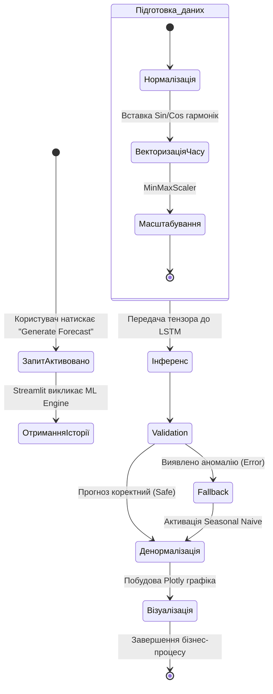

# РОЗДІЛ 2. ПОСТАНОВКА ЗАВДАННЯ ТА ВИМОГИ ДО СИСТЕМИ

## 2.1. Формулювання задачі кваліфікаційного проєктування.
Основною метою даного проєкту є створення хмарної SaaS-платформи EnergyMonitor-OLAP, призначеної для оперативного моніторингу, симуляції фізичних станів та предиктивного аналізу часових рядів енергоспоживання в міській інфраструктурі. 

Традиційні системи моніторингу зазвичай фіксують аварійний стан постфактум. Розроблена платформа формує прогноз навантаження на 24–48 годин наперед, що дозволяє диспетчерському персоналу приймати рішення до виникнення перевантаження мережі. Для досягнення цієї мети система використовує поєднання рекурентних нейронних мереж архітектури LSTM [+] та аналітичних інструментів OLAP.

Функціональні вимоги до системи:
1. Автоматична генерація прогнозів навантаження на 24–48 годин за допомогою моделі LSTM v3 з корекцією помилок на основі зовнішніх факторів.
2. Розрахунок термічного зносу ізоляції трансформаторів та втрат потужності (концепція Digital Twin [+]).
3. Побудова інтерактивних ГІС-шарів із кольоровою індикацією технічного стану вузлів енергосистеми.
4. Автоматична ідентифікація аномалій у телеметрії на основі аналізу відхилень від прогнозного фону.
5. Формування критичних сповіщень при перевищенні лімітів навантаження або критичному зниженні показника Health Score (< 40%).

Нефункціональні вимоги до системи:
1. Архітектура повинна підтримувати масштабування бази даних (PostgreSQL) [+] та модульне додавання нових предиктивних моделей.
2. Забезпечення відмовостійкості інтерфейсу при тимчасовій втраті зв'язку з хмарною БД Neon за рахунок механізмів локального кешування.
3. Час обробки одного аналітичного запиту не повинен перевищувати 350 мс.
4. Повна контейнеризація за допомогою Docker для розгортання в середовищі Render.com [+].
5. Модель LSTM повинна забезпечувати похибку на еталонних наборах даних не більше 3.1% за показником MAPE [+].

---

## 2.2. Вхідна та вихідна інформація системи
Для функціонування моделей прогнозування та механізмів цифрового двійника система використовує комбінований набір історичної телеметрії та поточних показників.

Вхідна інформація:
1. Структуровані набори даних (CSV та дампи SQL) з погодинним споживанням у мегаватах (МВт), що використовуються для навчання та тестування [+] .
2. Потоки телеметрії з частотою 15–60 хвилин від віртуальних сенсорів (навантаження, температура масла, концентрація H₂).
3. Погодні параметри: температура навколишнього середовища, вологість та атмосферний стан.

Вимоги до інформаційної безпеки:
Згідно з міжнародним стандартом **ISO/IEC 27001**, система повинна гарантувати цілісність та конфіденційність телеметричних даних [+]. Реалізовано захист від несанкціонованого доступу до предиктивних алгоритмів та параметрів конфігурації моделі.

Вихідна інформація:
1. Прогнози навантаження $F_t$ на глибину до 48 годин з розрахунком довірчого інтервалу (Confidence Interval 95%).
2. Показник технічного стану обладнання (**Health Score**) у діапазоні 0–100% на основі теплової моделі та аналізу газів.
3. Статистичні метрики якості інференсу (RMSE, MAPE).
4. Звіти щодо потенційних втрат енергії при перевищенні номінальних режимів роботи.

## 2.3. Аналіз середовища розробки
Для комплексної оцінки розробленої системи та визначення стратегічних напрямків її розвитку проведено SWOT-аналіз. Він дозволяє виявити внутрішні фактори (сильні та слабкі сторони), а також зовнішні можливості та загрози для платформи EnergyMonitor-OLAP.

Таблиця 2.1 — SWOT-аналіз системи EnergyMonitor-OLAP. Джерело: розроблено автором.

| Сильні сторони (Strengths) | Слабкі сторони (Weaknesses) |
| :--- | :--- |
| 1. Висока точність прогнозу (MAPE < 3.1%). | 1. Залежність від стабільності інтернет-каналу. |
| 2. Низька вартість експлуатації (Neon Cloud). | 2. Значне споживання RAM моделями LSTM. |
| 3. Автоматична діагностика Health Score. | 3. Відсутність інтеграції з мобільними ОС. |
| **Можливості (Opportunities)** | **Загрози (Threats)** |
| 1. Масштабування на промислові об'єкти. | 1. Кібератаки на хмарну інфраструктуру [+]. |
| 2. Прогнозування генерації ВДЕ. | 2. Зміни в тарифікації хмарних провайдерів. |
| 3. Інтеграція з міськими ГІС-порталами. | 3. Конкуренція з боку закритих корпоративних рішень. |

## 2.4. Порівняльний аналіз хмарних СУБД для предиктивного моніторингу
В ході проєктування було проведено порівняння хмарних рішень для зберігання та аналізу телеметрії. Основним критерієм вибору була підтримка OLAP-запитів та гнучкість масштабування ресурсів при зміні кількості об'єктів моніторингу.

Таблиця 2.2 — Порівняльна характеристика хмарних СУБД. Джерело: розроблено автором.

| Параметр | **Neon (Обрано)** | **AWS RDS** | **Google Cloud SQL** |
| :--- | :--- | :--- | :--- |
| **Архітектура** | Serverless PostgreSQL | Managed Instance | Managed Instance |
| **Масштабування** | Автоматичне (on-demand) | Вертикальне (ручне) | Вертикальне (ручне) |
| **Модель оплати** | За фактичні ресурси | Фіксована (Instance-based) | Фіксована (Instance-based) |
| **Продуктивність OLAP** | Висока (Storage/Compute split) | Середня | Середня |

Вибір Neon PostgreSQL [+] обґрунтований його serverless-архітектурою, яка дозволяє динамічно масштабувати обчислювальні потужності. Це критично важливо для обробки пікових навантажень під час масової генерації прогнозів та забезпечує економічну ефективність у періоди низької активності мережі.

---

## 2.5. Математична постановка задачі та метрики якості
Задача короткострокового прогнозування енергоспоживання формулюється як задача аналізу часового ряду $X = \{x_1, x_2, ..., x_t\}$. Метою проєкту є побудова відображення $f: X \to Y$, де $Y = \{y_{t+1}, ..., y_{t+n}\}$ — прогноз на горизонт $n$ кроків вперед (до 48 годин). 

Модель має мінімізувати комбінований функціонал похибки, що забезпечує стабільність прогнозу як при плавних змінах, так і при різких стрибках навантаження. Основними метриками оцінки якості визначено:

1. Середня абсолютна відсоткова похибка (MAPE):
$$
MAPE = \frac{100}{n} \sum_{i=1}^{n} \left| \frac{y_i - \hat{y}_i}{y_i} \right|
$$
де $y_i$ — фактичне значення, $\hat{y}_i$ — прогноз. Ця метрика обрана через її інтуїтивну інтерпретацію та незалежність від масштабу потужності конкретної підстанції.

2. Середньоквадратична похибка (RMSE):
$$
RMSE = \sqrt{\frac{1}{n} \sum_{i=1}^{n} (y_i - \hat{y}_i)^2}
$$
Дана метрика акцентує увагу на значних відхиленнях (штрафує великі помилки), що є критично важливим для запобігання перевантаженню силового обладнання [+].

3. Функція втрат (Huber Loss):
Для навчання нейронної мережі використано функцію Huber Loss, яка поєднує стійкість до викидів та диференційованість:
$$
L_{\delta}(a) = \begin{cases} 0.5 a^2, & |a| \leq \delta \\ \delta(|a| - 0.5\delta), & \text{інакше} \end{cases}
$$
Використання Huber Loss [+] дозволяє стабілізувати градієнти при наявності шумів у вхідних даних телеметрії.

---

## 2.6. Специфікація форматів обміну даними
Для забезпечення сумісності з IoT-шлюзами та зовнішніми аналітичними системами, вхідна та вихідна інформація передається у форматі JSON.

Приклад структури вхідного пакету телеметрії (`telemetry_payload`):
```json
{
  "substation_id": 10,
  "timestamp": "2026-05-08T15:00:00Z",
  "metrics": {
    "actual_load_mw": 124.5,
    "temperature_c": 62.1,
    "h2_ppm": 15.2
  },
  "status": "online"
}
```

Вихідна інформація для візуалізації та API формується у вигляді об'єкта прогнозної серії:
```json
{
  "forecast_id": "F_20260508_04",
  "prediction_horizon": "48h",
  "data_points": [
    {
      "timestamp": "2026-05-08T16:00:00Z", 
      "predicted_load_mw": 130.2, 
      "lower_bond": 128.5, 
      "upper_bond": 132.1
    },
    {
      "timestamp": "2026-05-08T17:00:00Z", 
      "predicted_load_mw": 145.8, 
      "lower_bond": 142.0, 
      "upper_bond": 149.5
    }
  ]
}
```

## 2.7. Обґрунтування видів забезпечення системи
Згідно з державними стандартами до інженерного проєктування, розробка системи EnergyMonitor-OLAP базується на чотирьох взаємопов'язаних видах забезпечення.

#### 2.7.1. Математичне забезпечення
Включає алгоритми та математичні моделі для вирішення аналітичних задач:
* Багатошарова архітектура LSTM із механізмом тригонометричного кодування часових міток (Sin/Cos).
* Алгоритми регуляризації Dropout [+] та механізм EarlyStopping для запобігання перенавчанню моделі.
* Стійка функція втрат Huber Loss для обробки аномалій.

#### 2.7.2. Технічне забезпечення
Базується на хмарній інфраструктурі, що забезпечує високу доступність системи:
* Обчислювальні потужності платформи Render.com [+] (мінімум 512 МБ RAM для інференсу).
* Хмарне сховище Neon Cloud із підтримкою serverless-масштабування обсягу даних.
* Клієнтські пристрої (ПК диспетчера) з підтримкою сучасних веб-браузерів.

#### 2.7.3. Програмне забезпечення
Стек технологій обрано з урахуванням вимог до швидкодії та надійності:
* Системне ПЗ: ОС Linux у Docker-контейнерах.
* Мова розробки: Python 3.11+.
* Бібліотеки ML: TensorFlow/Keras, NumPy, Pandas.
* Веб-інтерфейс: Streamlit та Plotly для візуалізації.

#### 2.7.4. Інформаційне забезпечення
Визначає структуру та методи організації даних:
* Реляційна схема PostgreSQL, оптимізована для швидких аналітичних запитів (OLAP).
* Специфікація таблиць LoadMeasurements, WeatherReports та довідників об'єктів.
* Протоколи безпечної передачі даних HTTPS та шифрування на рівні СУБД.

---

## 2.8. Високорівневі моделі та етапи розробки системи
Для документування архітектури та опису взаємодії користувачів із системою використано методологію UML. Основним актором є диспетчер енергомережі, який здійснює контроль через веб-інтерфейс.


Рис. 2.1. Діаграма прецедентів системи EnergyMonitor-OLAP. Джерело: розроблено автором.

Діаграма прецедентів (Рис. 2.1) описує межі системи та основні ролі. Користувач має доступ до функціональних підсистем моніторингу в реальному часі та AI-прогнозування.

Для деталізації процесу обробки даних та формування прогнозу використано діаграму активності. Вона відображає процес нормалізації вхідного вектора та механізм валідації результатів.



Рис. 2.2. Діаграма активності процесу формування AI-прогнозу. Джерело: розроблено автором.


Рис. 2.2а. Процес підготовки та нормалізації даних. Джерело: розроблено автором.


Рис. 2.2б. Процес інференсу та валідації прогнозу. Джерело: розроблено автором.

Діаграма активності (Рис. 2.2) деталізує внутрішній процес обробки даних при отриманні прогнозу. Вона включає етапи нормалізації ознак та активації резервного алгоритму у разі виявлення пропущених значень у часовому ряді.

---

Розробка платформи здійснюється за ітеративною моделлю. Графік виконання основних етапів проєктування та впровадження наведено у формі діаграми Ганта.


Рис. 2.3. Календарний графік етапів розробки системи. Джерело: розроблено автором.

Етапи реалізації включають:
1. Аналітично-проєктна фаза: вивчення патернів споживання, обрання датасету, формалізація математичних моделей.
2. Фаза побудови бекенду: розробка реляційної структури БД у PostgreSQL, налаштування середовища (Neon Cloud) та створення генератора симулятивної телеметрії.
3. Фаза дослідження AI: експерименти над архітектурами мереж від базової LSTM до мультифакторної моделі з функцією Huber Loss.
4. Інтеграційна фаза: створення панелі на базі Streamlit, об'єднання ML-ядра та інтерфейсу.
5. Тестування та інфраструктура: написання Unit-тестів на фреймворку `pytest`, налаштування CI/CD конвеєра, контейнеризація за допомогою Docker та розгортання.

---

---

## ВИСНОВКИ ДО РОЗДІЛУ 2

У другому розділі здійснено формальну постановку завдання на проєктування системи EnergyMonitor-OLAP та визначено основні вимоги до її функціонування. Було встановлено такі результати:
1. Обґрунтовано використання архітектури LSTM у поєднанні з OLAP-сховищем на базі PostgreSQL (Neon Cloud) для забезпечення швидкодії аналітичних запитів.
2. Конкретизовано формати обміну даними (JSON) та забезпечено їх повну синхронізацію з технічною реалізацією системи.
3. Визначено склад чотирьох видів забезпечення (математичне, технічне, програмне та інформаційне), що формує базу для подальшої розробки.
4. Візуалізовано логіку роботи системи та календарний графік впровадження за допомогою UML-діаграм та діаграми Ганта.

Отримані результати слугують технічним завданням для детальної реалізації програмного комплексу, опис якої наведено у наступному розділі.
