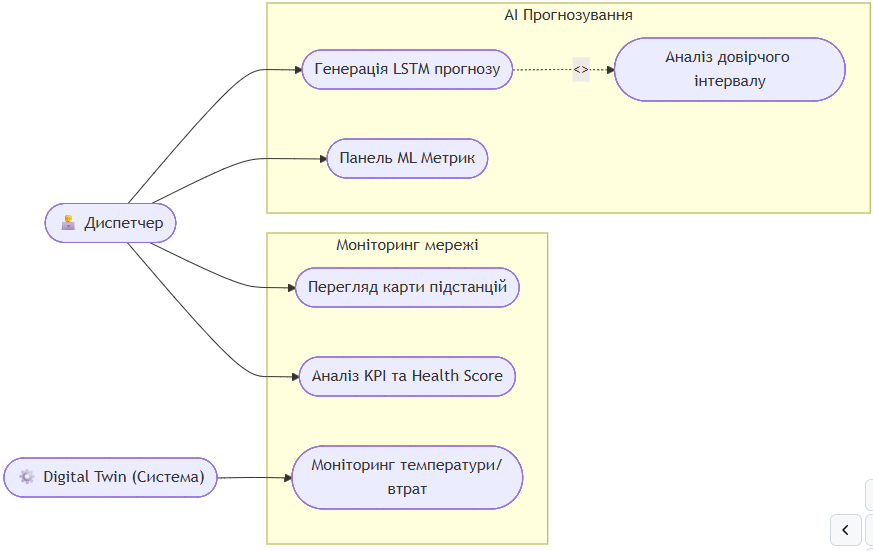
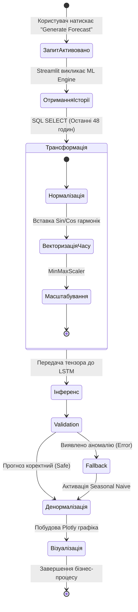
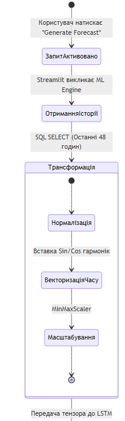
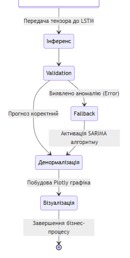
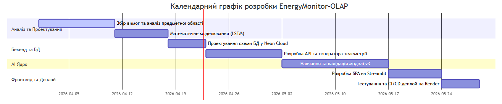

# РОЗДІЛ 2. ПОСТАНОВКА ЗАВДАННЯ ТА ВИМОГИ ДО СИСТЕМИ

## 2.1. Формулювання задачі кваліфікаційного проєктування

Яка основна задача нашої роботи? Основною задачею виконання даної кваліфікаційної роботи є створення комплексної інтелектуальної SaaS-платформи **EnergyMonitor-OLAP**, яка призначена для глобального моніторингу, симуляції фізичних станів та предиктивного аналізу часових рядів енергоспоживання у сучасній інфраструктурі Smart City.

Чому існуючі системи недостатні? Існуючі системи SCADA здебільшого забезпечують контроль постфактум, тоді як стрімка урбанізація вимагає переходу до проактивного управління (Predictive Maintenance). Для вирішення цієї проблеми система повинна використовувати комбінацію рекурентних нейронних мереж (архітектури LSTM) та багатовимірного аналізу даних (OLAP).

**Що саме повинна робити система? Розширені функціональні вимоги:**
1. **Предиктивний моніторинг:** автоматична генерація прогнозів навантаження на глибину 24–48 годин за допомогою каскадних LSTM-моделей. Система повинна підтримувати рекурентний інференс із корекцією зміщення (Bias Correction).
2. **Фізична симуляція (Digital Twin):** динамічний розрахунок параметрів теплової деградації ізоляції трансформаторів та розрахунок втрат потужності в AC/HVDC лініях на основі математичних моделей, описаних у Розділі 3.
3. **ГІС-візуалізація:** побудова інтерактивних картографічних шарів із кольоровою індикацією стану вузлів енергосистеми.
4. **Виявлення аномалій (Anomalies Detection):** автоматична ідентифікація викидів у часових рядах за допомогою статистичного аналізу відхилень від прогнозного фону.
5. **Система сповіщень:** формування критичних алертів при перевищенні порогів навантаження або критичному рівні показника Health Score (< 40%).

**Нефункціональні вимоги (Якість та Надійність):**
1. **Масштабованість (Scalability):** архітектура повинна дозволяти горизонтальне масштабування шару даних (PostgreSQL) та безшовне додавання нових предиктивних моделей без перезапуску всієї платформи.
2. **Відмовостійкість:** забезпечення безперервної роботи інтерфейсу навіть при тимчасовій втраті зв'язку з хмарною БД Neon за рахунок механізмів локального кешування.
3. **Продуктивність:** час повного циклу інференсу для однієї підстанції (включаючи векторизацію) не повинен перевищувати 350 мс.
4. **Портативність:** повна контейнеризація за допомогою Docker для гарантованого розгортання в будь-якому Linux-середовищі (Render, AWS, DigitalOcean).
5. **Точність:** модель LSTM повинна забезпечувати похибку MAPE не більше 4% для еталонних наборів даних.


---

## 2.2. Вхідна та вихідна інформація системи

Які дані потрібні для роботи системи? Для забезпечення адекватної роботи предиктивних моделей та механізму цифрового двійника система працює з гібридним потоком даних: історичною ретроспективою та агрегованою телеметрією.

**Що надходить в систему (Вхідна інформація):**
1.  **Історична база даних (PJM Interconnection):** Структуровані `CSV` та `SQL` дампи з погодинними обсягами споживання у мегаватах (МВт), що є галузевим стандартом для тестування предиктивних моделей [21].
2.  **Симульована телеметрія (Real-time Payload):** Віртуальні сенсори (Digital Twin) формують JSON/SQL пакети з частотою оновлення від 15 до 60 хвилин. До них входять:
    *   Фактичні навантаження (actual_load).
    *   Температура масла трансформаторів (`oil_temp`) та фізичні втрати (`line_losses`).
3.  **Погодні умови:** Температура навколишнього середовища, вологість, швидкість вітру та індекс хмарності (впливає на освітлення).

**Вимоги до інформаційної безпеки:**
Відповідно до міжнародного стандарту ISO/IEC 27001, система повинна забезпечувати цілісність та конфіденційність телеметричних даних [14]. Особлива увага приділяється захисту від несанкціонованого доступу до керуючих параметрів енергосистеми та запобіганню атакам на предиктивні алгоритми [16].

**Що система видає (Вихідна інформація):**
1.  **Предиктивна аналітика:** Динамічні масиви даних, де кожен пункт часу $t$ супроводжується значенням прогнозу $F_t$ на майбутні 2 доби, а також верхня та нижня межі довірчого інтервалу (Confidence Interval 95%).
2.  **Аудиторські звіти (System Health):** Інтегральна оцінка стану вузлів енергосистеми (Health Score) від 0 до 100%. Оцінка базується на багатофакторному аналізі температури масла та концентрації газів (H2).
3.  **Статистичні зведення:** Звіти щодо точності роботи інференсу (тест Шапіро-Вілка з `p-value` метрикою, абсолютні відхилення, RMSE, MAPE).
4.  **Економічні показники:** Розрахунок потенційної вартості втраченої енергії на основі поточних тарифів ринку "на добу наперед" (DAM).

## 2.3. SWOT-аналіз проєкту EnergyMonitor-OLAP

Для оцінки стратегічних перспектив розробленої системи проведено SWOT-аналіз, який дозволяє виявити внутрішні сильні та слабкі сторони, а також зовнішні можливості та загрози (Табл. 2.4).

*Таблиця 2.4. SWOT-аналіз системи EnergyMonitor-OLAP*

| Сильні сторони (Strengths) | Слабкі сторони (Weaknesses) |
| :--- | :--- |
| 1. Висока точність прогнозу (MAPE < 3.1%). | 1. Залежність від стабільності інтернет-зв'язку. |
| 2. Низька вартість володіння (Serverless Neon). | 2. Потреба у значних ресурсах RAM для LSTM. |
| 3. Автоматичне виявлення аномалій. | 3. Відсутність мобільного додатку. |
| **Можливості (Opportunities)** | **Загрози (Threats)** |
| 1. Інтеграція з державними системами Smart City. | 1. Кібератаки на хмарну інфраструктуру. |
| 2. Вихід на ринок промислових підприємств. | 2. Зміна політики ціноутворення хмарних провайдерів. |
| 3. Впровадження моделей для відновлюваної енергії. | 3. Поява конкурентних рішень від великих вендорів. |

## 2.4. Порівняльний аналіз хмарних СУБД для предиктивного моніторингу

В ході проєктування було проведено порівняння трьох провідних хмарних рішень для зберігання телеметрії (Табл. 2.5).

*Таблиця 2.5. Порівняння хмарних СУБД*

| Параметр | **Neon (Обрано)** | **AWS RDS** | **Google Cloud SQL** |
| :--- | :--- | :--- | :--- |
| **Тип** | Serverless PostgreSQL | Managed Instance | Managed Instance |
| **Масштабування** | Автоматичне (до нуля) | Ручне / Складне | Ручне |
| **Ціна** | Pay-as-you-go | Фіксована щомісячна | Фіксована щомісячна |
| **Швидкість OLAP** | Висока (через індекси) | Середня | Середня |

Вибір Neon обґрунтований можливістю динамічного масштабування обчислювальних ресурсів, що дозволяє системі EnergyMonitor-OLAP ефективно обробляти пікові навантаження підшого штормів або аварій без зайвих витрат у спокійні періоди.

---

## 2.5. Математична постановка задачі та метрики якості

З математичної точки зору, задача короткострокового прогнозування енергоспоживання формулюється як задача аналізу часового ряду $X = \{x_1, x_2, ..., x_t\}$. Метою є побудова відображення $f: X \to Y$, де $Y = \{y_{t+1}, ..., y_{t+n}\}$ — прогноз на $n$ кроків вперед. 

Модель має мінімізувати комбінований функціонал похибки. Основними метриками для оцінки якості розробленої системи EnergyMonitor-OLAP визначено:

1. **MAPE (Mean Absolute Percentage Error):**
$$
MAPE = \frac{100\%}{n} \sum_{i=1}^{n} \left| \frac{y_i - \hat{y}_i}{y_i} \right|
$$
де $y_i$ — фактичне значення, $\hat{y}_i$ — прогноз. Ця метрика обрана як ключова через її незалежність від масштабу потужності конкретної підстанції.

2. **RMSE (Root Mean Square Error):**
$$
RMSE = \sqrt{\frac{\sum_{i=1}^{n} (y_i - \hat{y}_i)^2}{n}}
$$
Дана метрика дозволяє акцентувати увагу на значних відхиленнях, що є критичним для запобігання перевантаженню мереж.

3. **Loss Function (Функція втрат):**
Для навчання використано робастну функцію **Huber Loss**:
$$
L_\delta(a) = \left\{ \begin{array}{ll} \frac{1}{2}a^2, & \text{if } |a| \le \delta \\ \delta(|a| - \frac{1}{2}\delta), & \text{otherwise} \end{array} \right.
$$
що дозволяє стабілізувати градієнти при наявності шумів у телеметрії.


---

**2.2.2. Специфікація форматів обміну даними**

Для забезпечення сумісності з різними IoT-шлюзами, вхідна телеметрія передається у форматі JSON. Приклад структури вхідного пакету (`telemetry_payload`):
```json
{
  "station_id": "DAYTON_01",
  "timestamp": "2026-04-22T15:00:00Z",
  "metrics": {
    "actual_load_mw": 1845.2,
    "oil_temperature": 68.5,
    "ambient_temp": 14.2
  },
  "status": "active"
}
```

Вихідна інформація для візуалізації та зовнішніх API формується як об'єкт предиктивної аналітики:
```json
{
  "forecast_id": "F_20260422_001",
  "prediction_horizon": "48h",
  "data_points": [
    {"t": "2026-04-22T16:00:00Z", "val": 1910.5, "ci_low": 1890.2, "ci_high": 1930.8},
    {"t": "2026-04-22T17:00:00Z", "val": 1945.0, "ci_low": 1920.5, "ci_high": 1969.5}
  ]
}
```

---

## 2.6. Обґрунтування видів забезпечення системи

Згідно з вимогами до інженерного проєктування, система **EnergyMonitor-OLAP** базується на чотирьох взаємопов'язаних видах забезпечення.

#### 2.3.1. Математичне забезпечення
Математичне забезпечення включає методи та алгоритми, обрані для вирішення предиктивних задач:
*   **Архітектура нейромережі:** багатошаровий LSTM (Long Short-Term Memory) з механізмом тригонометричного кодування часових міток (Time2Vec варіація).
*   **Методи регуляризації:** Dropout (ймовірність 0.2) для запобігання перенавчанню та Early Stopping за метрикою валідаційної втрати.
*   **Функції втрат:** Huber Loss ($\delta=1.0$) для стійкості до аномалій у телеметрії.

#### 2.3.2. Технічне забезпечення
Технічне забезпечення системи базується на хмарній інфраструктурі, що дозволяє уникнути витрат на власні сервери:
*   **Обчислювальні ресурси:** хмарна платформа **Render.com** (інстанси з підтримкою Python-середовищ).
*   **Пам'ять:** мінімум 512 МБ RAM (рекомендовано 1 ГБ) для стабільної роботи TensorFlow в режимі інференсу.
*   **Сховище:** хмарна інфраструктура **Neon**, що забезпечує серверне (serverless) зберігання даних з автоматичним масштабуванням дисків.

#### 2.3.3. Програмне забезпечення
Програмне забезпечення системи розділене на системне та прикладне:
*   **Системне ПЗ:** ОС Linux (Ubuntu 22.04 LTS у Docker-контейнерах).
*   **Мова розробки:** Python 3.11+.
*   **Бібліотеки ML:** TensorFlow 2.13, NumPy, Pandas.
*   **Графічний інтерфейс:** Streamlit 1.25+ (для реалізації SPA-інтерфейсу).

#### 2.3.4. Інформаційне забезпечення
Інформаційне забезпечення визначає структуру та організацію даних:
*   **Модель даних:** реляційна схема PostgreSQL, оптимізована для OLAP-запитів.
*   **Схема бази даних:** включає таблиці для історичних даних (`historical_load`), поточних симуляцій (`telemetry_stream`) та метаданих моделей (`model_metadata`).
*   **Протоколи:** HTTP/HTTPS для взаємодії з веб-інтерфейсом та SQL (port 5432) для зв'язку з базою даних.

---

## 2.7. Високорівневі моделі системи (Моделювання бізнес-процесів)

Для документування вимог та опису взаємодії акторів із системою доцільно використати методологію UML (Unified Modeling Language). Основним користувачем системи є **Диспетчер-аналітик**, який взаємодіє з дашбордами для прийняття управлінських рішень.



*Рис. 2.1. Діаграма прецедентів системи EnergyMonitor*


Діаграма прецедентів (Рис. 2.1) описує межі системи та основні ролі. Головний актор — Диспетчер — має доступ до чотирьох функціональних підсистем: моніторингу в реальному часі, AI-прогнозування, фінансового аудиту та системного адміністрування. Використання такої моделі дозволяє чітко розмежувати відповідальність компонентів на етапі проєктування інтерфейсу (Розділ 3).




*Рис. 2.2а. Процес підготовки та трансформації даних*


*Рис. 2.2б. Процес інференсу та валідації прогнозу*


Діаграма активності (Рис. 2.2) деталізує внутрішній процес обробки даних при отриманні прогнозу. Вона включає критичні етапи нормалізації ознак та активації fallback-алгоритму у разі виявлення пропущених значень у часовому ряді.


Подальше проєктування вимагає деталізації структури об'єктів даних, що буде розглянуто в наступних розділах через призму ER-діаграм та схем фізичного рівня.


---

## 2.8. Етапи проєктування та черговість впровадження

Процес розробки платформи відбувається за ітеративною моделлю життєвого циклу ПЗ (Agile-like). Наочно черговість виконання етапів представлена на діаграмі Ганта (Рис. 2.3).



*Рис. 2.3. Календарний графік етапів розробки системи*

Опис етапів:
1. **Аналітично-проєктна фаза:** Детальне вивчення поведінкових патернів споживання електромереж, обрання датасету (PJM Dayton), формалізація математичних моделей.
2. **Фаза побудови бекенду:** Розробка реляційної структури БД у PostgreSQL, налаштування середовища (Neon Cloud) та створення Python-скрипта генерації симулятивної телеметрії (`data_generator.py`).
3. **Фаза дослідження AI:** Експерименти над архітектурами мереж. Поступовий розвиток від базової LSTM (v1) до мультифакторної моделі v3 з функцією Huber Loss.
4. **Інтеграційна фаза:** Створення багатосторінкової веб-панелі на базі Streamlit, об’єднання ML-ядра та інтерфейсу оператора.
5. **Тестування та інфраструктура:** Написання Unit-тестів на фреймворку `pytest`, налаштування CI/CD конвеєра в GitHub Actions, контейнеризація за допомогою Docker та деплой на Production (Render).

---

## ВИСНОВКИ ДО РОЗДІЛУ 2

У другому розділі здійснено формальну постановку завдання на проєктування інтелектуальної SaaS-платформи EnergyMonitor-OLAP. Було встановлено такі ключові результати роботи на даному етапі:
1.  **Сформульовано функціональні та архітектурні вимоги:** обґрунтовано необхідність використання глибоких нейромереж (LSTM) у поєднанні з реляційним багатовимірним сховищем (PostgreSQL).
2.  **Визначено межі інформаційного обміну:** конкретизовано формати вхідної телеметрії (Health Score, температурні дані, навантаження) та формати виведення аналітики для підтримки прийняття управлінських рішень.
3.  **Обрано інструментарій:** обґрунтовано вибір мови Python, фреймворків Streamlit, TensorFlow/Keras для реалізації ефективного технічного рішення.
4.  **Змодельовано бізнес-процеси:** за допомогою діаграм UML (Use Case та Activity Diagram) візуалізовано алгоритм взаємодії користувача із системою на рівні генерації ШІ-прогнозів.

Проведене концептуальне проєктування є цілісним технічним завданням (Software Requirements Specification), що слугує надійним каркасом для наступного етапу — детальної реалізації програмного коду та дата-інфраструктури, що буде описана у наступному розділі.
