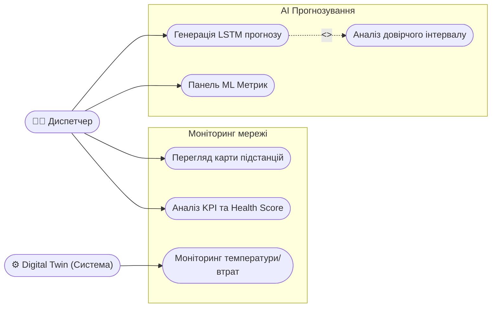
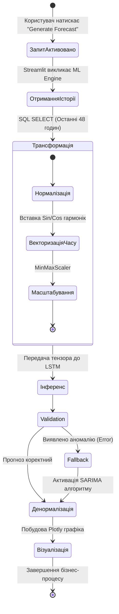

# РОЗДІЛ 2. ПОСТАНОВКА ЗАВДАННЯ ТА ВИМОГИ ДО СИСТЕМИ

## 2.1. Формулювання задачі кваліфікаційного проєктування

Яка основна задача нашої роботи? Основною задачею виконання даної кваліфікаційної роботи є створення комплексної інтелектуальної SaaS-платформи **EnergyMonitor-OLAP**, яка призначена для глобального моніторингу, симуляції фізичних станів та предиктивного аналізу часових рядів енергоспоживання у сучасній інфраструктурі Smart City.

Чому існуючі системи недостатні? Існуючі системи SCADA здебільшого забезпечують контроль постфактум, тоді як стрімка урбанізація вимагає переходу до проактивного управління (Predictive Maintenance). Для вирішення цієї проблеми система повинна використовувати комбінацію рекурентних нейронних мереж (архітектури LSTM) та багатовимірного аналізу даних (OLAP).

**Що саме повинна робити система? Функціональні вимоги до системи:**
1. Предиктивний моніторинг: генерація прогнозів навантаження на глибину 24–48 годин за допомогою моделей LSTM з MAPE < 5%.
2. Фізична симуляція: розрахунок параметрів теплової деградації та втрат у лініях електропередачі (Digital Twin).
3. Аналітичне візуалізація: побудова інтерактивних часових рядів та геоінформаційних карт стану підстанцій.
4. Верифікація точності: автоматизований розрахунок статистичних метрик та журналювання аномалій.

**Нефункціональні вимоги:**
1. **Масштабованість:** Можливість додавання нових підстанцій до багатовимірного сховища без зміни архітектури.
2. **Відмовостійкість:** Наявність fallback-механізму (SARIMA) на випадок збою генерації нейромережевих прогнозів.
3. **Швидкодія:** Відгук інтерфейсу (модуль Streamlit) під час побудови інтерактивних графіків не повинен перевищувати 2 секунди.

---

## 2.2. Вхідна та вихідна інформація системи

Які дані потрібні для роботи системи? Для забезпечення адекватної роботи предиктивних моделей та механізму цифрового двійника система працює з гібридним потоком даних: історичною ретроспективою та агрегованою телеметрією.

**Що надходить в систему (Вхідна інформація):**
1.  **Історична база даних (PJM Interconnection):** Структуровані `CSV` та `SQL` дампи з погодинними обсягами споживання у мегаватах (МВт).
2.  **Симульована телеметрія (Real-time Payload):** Віртуальні сенсори (Digital Twin) формують JSON/SQL пакети з частотою оновлення від 15 до 60 хвилин. До них входять:
    *   Фактичні навантаження (actual_load).
    *   Температура масла трансформаторів (`oil_temp`) та фізичні втрати (`line_losses`).
3.  **Погодні умови:** Температура навколишнього середовища, вологість, швидкість вітру та індекс хмарності (впливає на освітлення).

**Що система видає (Вихідна інформація):**
1.  **Предиктивна аналітика:** Динамічні масиви даних, де кожен пункт часу $t$ супроводжується значенням прогнозу $F_t$ на майбутні 2 доби.
2.  **Аудиторські звіти (System Health):** Інтегральна оцінка стану вузлів енергосистеми (Health Score) від 0 до 100%.
3.  **Статистичні зведення:** Звіти щодо точності роботи інференсу (тест Шапіро-Вілка з `p-value` метрикою, абсолютні відхилення).

---

## 2.3. Вимоги до технічного забезпечення та інструментарію розробки

Як ми будемо це реалізовувати? Спроєктований програмний комплекс функціонує за хмарною моделлю SaaS із дотриманням принципів безперервного розгортання.

**Які технології ми використовуємо? Програмний інструментарій (Software Stack):**
*   **Мова програмування:** `Python 3.11+` (забезпечує доступ до екосистеми аналітики даних та машинного навчання).
*   **Машинне навчання:** `TensorFlow/Keras` (для модулів глибокого навчання) та `Scikit-learn` (для масштабування та класичних ML алгоритмів).
*   **СУБД:** `PostgreSQL 15+` розгорнута в ієрархії Cloud Neon для оптимального обслуговування OLAP-схем.
*   **Розробка інтерфейсу:** Фреймворк `Streamlit` (дозволяє створювати Data-driven Single Page Applications без необхідності використання React/Vue).
*   **Контейнеризація та CI/CD:** `Docker` (ізоляція бібліотек), скрипти автоматизації `GitHub Actions`.

**Вимоги до апаратного та хмарного середовища:**
*   Мінімальний обсяг оперативної пам'яті сервера (RAM) — 1 ГБ для підтримки інференсу в пам'яті.
*   При розгортанні у середовищі Render.com необхідна наявність Environment Variables (`.env`) для прихованого зберігання ключів доступу до бази даних.

---

## 2.4. Високорівневі моделі системи (Моделювання бізнес-процесів)

Для документування вимог та опису взаємодії акторів із системою доцільно використати методологію UML (Unified Modeling Language). Основним користувачем системи є **Диспетчер-аналітик**, який взаємодіє з дашбордами для прийняття управлінських рішень.

[РИСУНОК 2.1 — ДІАГРАМА ПРЕЦЕДЕНТІВ (USE CASE DIAGRAM)]
(Опис: Візуалізація взаємодії Диспетчера з функціональними блоками моніторингу, прогнозування та аналізу аномалій).

[РИСУНОК 2.2 — ДІАГРАМА АКТИВНОСТІ (ACTIVITY DIAGRAM)]
(Опис: Алгоритм процесу генерації ШІ-прогнозу: від SQL-запиту до денормалізації та візуалізації графіка).

---

## 2.5. Етапи проєктування та черговість впровадження

Процес розробки платформи відбувається за ітеративною моделлю життєвого циклу ПЗ (Agile-like), що складається з таких фаз:
1. **Аналітично-проєктна фаза:** Детальне вивчення поведінкових патернів споживання електромереж, обрання датасету (PJM Dayton), формалізація математичних моделей.
2. **Фаза побудови бекенду:** Розробка реляційної структури БД у PostgreSQL, налаштування середовища (Neon Cloud) та створення Python-скрипта генерації симулятивної телеметрії (`data_generator.py`).
3. **Фаза дослідження AI:** Експерименти над архітектурами мереж. Поступовий розвиток від базової LSTM (v1) до мультифакторної моделі v3 з функцією Huber Loss.
4. **Інтеграційна фаза:** Створення багатосторінкової веб-панелі на базі Streamlit, об’єднання ML-ядра та інтерфейсу оператора.
5. **Тестування та інфраструктура:** Написання Unit-тестів на фреймворку `pytest`, налаштування CI/CD конвеєра в GitHub Actions, контейнеризація за допомогою Docker та деплой на Production (Render).

---

## ВИСНОВКИ ДО РОЗДІЛУ 2

У другому розділі здійснено формальну постановку завдання на проєктування інтелектуальної SaaS-платформи EnergyMonitor-OLAP. Було встановлено такі ключові результати роботи на даному етапі:
1.  **Сформульовано функціональні та архітектурні вимоги:** обґрунтовано необхідність використання глибоких нейромереж (LSTM) у поєднанні з реляційним багатовимірним сховищем (PostgreSQL).
2.  **Визначено межі інформаційного обміну:** конкретизовано формати вхідної телеметрії (Health Score, температурні дані, навантаження) та формати виведення аналітики для підтримки прийняття управлінських рішень.
3.  **Обрано інструментарій:** обґрунтовано вибір мови Python, фреймворків Streamlit, TensorFlow/Keras для реалізації ефективного технічного рішення.
4.  **Змодельовано бізнес-процеси:** за допомогою діаграм UML (Use Case та Activity Diagram) візуалізовано алгоритм взаємодії користувача із системою на рівні генерації ШІ-прогнозів.

Проведене концептуальне проєктування є цілісним технічним завданням (Software Requirements Specification), що слугує надійним каркасом для наступного етапу — детальної реалізації програмного коду та дата-інфраструктури, що буде описана у наступному розділі.
