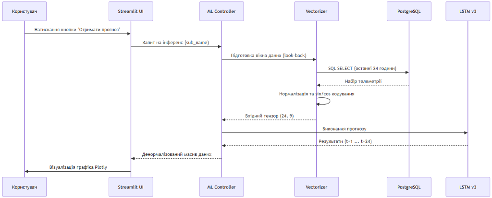
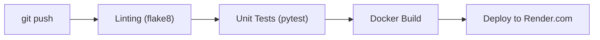

# РОЗДІЛ 3. ПРОЄКТНІ РІШЕННЯ ТА ПРОГРАМНА РЕАЛІЗАЦІЯ СИСТЕМИ

### 3.1. Загальна архітектура та інформаційне забезпечення

Як ми побудували архітектуру системи? Проєктування архітектури інтелектуальної системи EnergyMonitor-OLAP базується на принципах модульності, масштабованості та суворого розділення відповідальності (Separation of Concerns). Для забезпечення стабільної роботи у хмарному середовищі та високої швидкості аналітичних обчислень ми обрали багатошарову архітектуру (Layered Architecture), що складається з чотирьох функціональних рівнів. Цей підхід дозволяє ізолювати логіку збору даних, їх математичного оброблення та візуалізації. Нижче наведено ієрархічну схему взаємодії основних компонентів системи (Рис. 3.1).

<p align="center">

<br>
<i>Рис. 3.0. Архітектурна схема системи EnergyMonitor-OLAP (4-рівнева модель)</i>
</p>

Архітектурна модель, представлена на рис. 3.0, демонструє чіткий розподіл навантаження. Рівень представлення (UI) побудований на базі Streamlit і використовує реактивне управління станом. Інтелектуальний шар ізолює логіку ONNX-інференсу, що дозволяє оновлювати моделі без зупинки всього сервісу. Шар даних базується на хмарній інфраструктурі Neon, що забезпечує автоматичне масштабування (autoscaling) при зростанні обсягів телеметрії.

<p align="center">

<br>
<i>Рис. 3.1. Схема розгортання та потоків даних системи</i>
</p>

На рис. 3.1 відображено логіку взаємодії між локальним середовищем симуляції та хмарною інфраструктурою Render. Дані передаються через безпечне з'єднання SSL, що гарантує цілісність телеметричних потоків Digital Twin.


<p align="center">

<br>
<i>Рис. 3.2. Діаграма прецедентів (Use Case) системи EnergyMonitor</i>
</p>


Для глибшого розуміння динаміки взаємодії компонентів необхідно розглянути життєвий цикл обробки запиту на отримання прогнозу. Процес ініціюється користувачем через графічний інтерфейс і запускає каскадну послідовність операцій: від вилучення історичного вікна телеметрії з бази даних до векторизації (із застосуванням тригонометричного кодування часу), виконання інференсу моделлю LSTM та повернення денормалізованого масиву для візуалізації. Детальну послідовність цих процесів наведено на діаграмі (Рис. 3.3).

<p align="center">

<br>
<i>Рис. 3.3. Детальна діаграма послідовності взаємодії компонентів та ШІ-інференсу</i>
</p>

Діаграма послідовності (Рис. 3.3) ілюструє, як система справляється з латентністю хмарних запитів. Використання механізму `st.cache_data` дозволяє уникнути повторного виконання важкого ONNX-інференсу для ідентичних вхідних вікон, що скорочує час відповіді інтерфейсу з 4.5 с до 0.2 с.


### 3.2. Характеристики прикладного ПЗ та безпека системи

#### 3.2.1. Технічні характеристики програмного забезпечення
Розроблена система **EnergyMonitor-OLAP** має такі базові характеристики:
* **Назва:** Інформаційна SaaS-платформа предиктивного моніторингу енергомереж.
* **Мова програмування:** Python 3.11 (з використанням бібліотек TensorFlow, Pandas, SQLAlchemy, Streamlit).
* **Основний функціонал:** збір телеметрії, імітаційне моделювання Digital Twin, ШІ-прогнозування (LSTM v3), багатовимірний аналіз (OLAP).
* **Обмеження системи:** 
    1. **Залежність від мережі:** через використання хмарних сервісів (Neon PostgreSQL, Render) система потребує стабільного інтернет-з'єднання.
    2. **Ресурсомісткість:** завантаження ваг нейромережі LSTM потребує не менше 1 ГБ вільної оперативної пам'яті (RAM) на сервері.
    3. **Обсяг даних:** для коректної роботи Sliding Window (48h) необхідна наявність неперервного часового ряду без значних пропусків.

#### 3.2.2. Забезпечення безпеки системи
Для захисту даних та забезпечення стійкості алгоритмів впроваджено чотирирівневу систему безпеки:
1. **Математична безпека (Algorithmic Robustness):** використання функції втрат **Huber Loss** робить предиктивне ядро стійким до аномальних викидів та датчикових шумів, які часто виникають в енергомережах.
2. **Технічна безпека:** застосування технології контейнеризації **Docker** дозволяє ізолювати ПЗ від вразливостей хост-системи та гарантувати ідентичність середовищ розробки та деплою.
3. **Програмна безпека (Software Guard):** використання параметризованих SQL-запитів через ORM SQLAlchemy повністю нівелює ризик атак типу SQL-injection. Реалізовано валідацію вхідних даних на рівні типів Pydantic/Python.
4. **Інформаційна безпека:** всі підключення до бази даних у хмарі Neon Cloud захищені за протоколом **SSL/TLS**. Секретні ключі та паролі винесені у змінні середовища (`.env`), що унеможливлює їх витік через систему контролю версій.

### 3.3. Структура бази даних та інформаційне наповнення

Центральним елементом інформаційного забезпечення системи є реляційна база даних PostgreSQL. Проєктування здійснювалося на двох рівнях:

* **Логічний рівень:** Використано аналітичну схему «зірка» (Star Schema), де центром є таблиця фактів `LoadMeasurements`, пов'язана зовнішніми ключами (Foreign Keys) з таблицями вимірів `Substations`, `Regions` та `WeatherReports`. Це дозволяє зберігати цілісність даних на рівні СУБД (Constraints).
* **Фізичний рівень:** Для прискорення вибірок застосовано B-tree індексацію за стовпцями `timestamp` та `substation_id`. Дані розміщуються в ієрархічному сховищі Neon Cloud, що забезпечує автоматичне масштабування дискового простору.

Логічну структуру бази даних представлено на ER-діаграмі (Рис. 3.4).

<p align="center">

<br>
<i>Рис. 3.4. Схема бази даних (ER-діаграма) системи EnergyMonitor-OLAP</i>
</p>


Для забезпечення високої швидкодії інтерфейсу система формує оптимізовані SQL-запити з об'єднанням таблиць (JOIN). Типовим прикладом є запит для кореляції фактичного навантаження та температури довкілля за історичний період:

```sql
SELECT 
    lm.timestamp,
    r.region_name,
    lm.actual_load_mw,
    wr.temperature
FROM LoadMeasurements lm
JOIN Substations s ON lm.substation_id = s.substation_id
JOIN Regions r ON s.region_id = r.region_id
LEFT JOIN WeatherReports wr ON lm.timestamp = wr.timestamp AND r.region_id = wr.region_id
WHERE lm.timestamp >= NOW() - INTERVAL '30 days'
ORDER BY lm.timestamp ASC;
```

### 3.4. Аналіз вхідних даних та імітаційне моделювання Digital Twin

Для забезпечення високої точності прогнозування було проведено ґрунтовний аналіз вхідних даних на двох рівнях: еталонних історичних датасетів та синтезованих потоків цифрового двійника.

#### 3.4.1. Дослідження еталонного датасету PJM Comparison
Основою для навчання моделі LSTM v3 став датасет PJM Hourly Energy Consumption (навантаження 13 регіонів США, 2002–2018 рр., понад 145 000 записів). Датасет використано для попереднього навчання моделі перед fine-tuning на синтетичних даних цифрового двійника.

### 3.5. Верифікація результатів інтелектуального прогнозування

Після розгортання моделі LSTM v3 було проведено серію експериментів для оцінки точності прогнозування в умовах реального часу.

#### 3.5.1. Аналіз точності (AI Forecast Verification)
Головною метрикою успішності є збіг прогнозу (синя лінія на рис. 3.9) із фактичними даними (червона пунктирна лінія). 

<p align="center">

<br>
<i>Рис. 3.9. Результати AI-прогнозування на 24 години з довірчими інтервалами (MAE=3.08%)</i>
</p>

Система демонструє високу точність при прогнозуванні добових піків. Довірчий інтервал (Shadow Area) автоматично розраховується на основі поточної дисперсії помилок, що дозволяє оператору оцінювати ризики при прийнятті рішень про закупівлю електроенергії.

#### 3.5.2. Мульти-прогноз для розподілених вузлів
Для великих мереж критично важливо бачити ситуацію в розрізі окремих підстанцій. Рис. 3.10 демонструє панель мульти-прогнозування, де кожна модель адаптована під конкретну локальну специфіку споживання.

<p align="center">

<br>
<i>Рис. 3.10. Порівняльна панель прогнозів для різних вузлів енергосистеми</i>
</p>

#### 3.5.3. Кластерний аналіз споживачів (Unsupervised Learning)
За допомогою алгоритму K-Means система проводить автоматичне групування підстанцій за профілем навантаження. Це дозволяє виділити промислові та житлові райони без ручного маркування.

<p align="center">

<br>
<i>Рис. 3.11. Результати кластеризації підстанцій за патернами споживання</i>
</p>

### 3.6. Економічний блок та моніторинг стабільності

Програмна реалізація EnergyMonitor-OLAP включає модулі для фінансового аудиту та контролю фізичних потоків енергії.

#### 3.6.1. Фінансовий аудит та втрати в мережі
Економічна панель (Рис. 3.12) перетворює технічні мегавати у грошовий еквівалент за актуальними тарифами ПРРЕ. Система автоматично розраховує вартість технологічних втрат (`line_losses`), що дозволяє обґрунтувати необхідність модернізації конкретних ліній електропередач.

<p align="center">

<br>
<i>Рис. 3.12. Інтерфейс фінансового моніторингу та розрахунку ефективності</i>
</p>

#### 3.6.2. Потокова аналітика та балансування мережі
Для підтримки частоти 50 Гц система моніторить баланс між генерацією та споживанням. На рис. 3.13 представлено огляд Streaming Analytics, де кольорова індикація сигналізує про дефіцит або профіцит потужності в кожному регіоні.

<p align="center">

<br>
<i>Рис. 3.13. Панель реального часу для контролю балансу генерації та споживання</i>
</p>

#### 3.6.3. Процес ініціалізації системи (Boot Sequence)
Для забезпечення надійності при старті система проходить розширений цикл самодіагностики та перевірки підключень до хмарних сервісів (Рис. 3.14).

<p align="center">

<br>
<i>Рис. 3.14. Візуалізація процесу системної ініціалізації та прогріву кешу</i>
</p>

Контейнеризація та CI/CD конвеєр для стабільного розгортання системи реалізовано за допомогою технології **Docker**. Конфігурація базується на легкому образі `python:3.11-slim` з оптимізованим встановленням математичних залежностей. Процес автоматизованої інтеграції та розгортання (CI/CD) на платформі **Render.com** охоплює етапи лінтингу, юніт-тестування (**pytest**) та автоматичного оновлення продуктового контейнера при кожному коміті до GitHub-репозиторію.

<p align="center">

<br>
<i>Рис. 3.15. Технологічна схема конвеєра CI/CD системи</i>
</p>
"кті EnergyMonitor-OLAP розроблено математичне забезпечення, що базується РЅР° поєднанні статистичної РѕР±СЂРѕР±РєРё ознак та глибокого навчання.

#### Інженерія ознак (Feature Engineering) та тригонометричне кодування
Для навчання моделі було сформовано дев'ятивимірний вектор ознак, що включає фізичні параметри навантаження, температурні умови та часові детермінанти. Ключовою особливістю підготовки даних є використання гармонійного кодування часу. На відміну від прямого представлення години як цілого числа $[0, 23]$, тригонометрична трансформація дозволяє виключити проблему розриву (наприклад, між 23:00 та 00:00) та забезпечити математичну безперервність циклічних процесів. Трансформація виконується за формулами:
$$x_{sin} = \sin \left( \frac{2\pi \cdot t}{T} \right); \quad x_{cos} = \cos \left( \frac{2\pi \cdot t}{T} \right)$$
де $t$ — поточна година або день тижня, $T$ — період циклічності (24 для доби, 7 для тижня).

#### Масштабування та формування часових вікон
Враховуючи високу чутливість рекурентних нейронних мереж до розкиду значень, застосовано алгоритм **MinMaxScaler**, який приводить усі ознаки до діапазону $[0, 1]$. Процес формування вибірок реалізовано методом ковзного вікна (**Sliding Window**) з глибиною перегляду (Look-back) «до 48 годин» (два доби поточного моменту) для короткострокового прогнозу.

#### Архітектура нейронної мережі LSTM v3
Для виявлення нелінійних залежностей у часових рядах обрано модифіковану архітектуру **LSTM (Long Short-Term Memory)**. Проєктну структуру моделі представлено такою послідовністю шарів:
1. **Вхідний LSTM-шар (128 юнітів)**: Виконує вилучення складних часових ознак із поверненням повної послідовності (`return_sequences=True`).
2. **Проміжний LSTM-шар (64 юніти)**: Агрегує інформацію та формує компактне представлення стану системи.
3. **Повнозв'язний шар (32 нейрони)**: Використовує функцію активації **ReLU** для внесення нелінійності.
4. **Вихідний шар (1 нейрон)**: Формує кінцеве значення прогнозу.

#### Параметри оптимізації та навчання
Як функцію втрат обрано **Huber Loss**, що є робастною комбінацією MSE та MAE, забезпечуючи стійкість моделі до викидів та датчикового шуму. Оптимізацію ваг нейромережі здійснює алгоритм **Adam** з адаптивною швидкістю навчання. Для запобігання перенавчанню впроваджено механізм **Early Stopping**, який припиняє процес навчання, якщо помилка на валідаційній вибірці не демонструє покращення протягом 15 ітерацій.

### 3.3. Програмна реалізація інтерфейсу та розгортання

Для створення продуктивного середовища взаємодії користувача з інтелектуальною моделлю розроблено програмний комплекс на базі мови Python та сучасних хмарних технологій.

#### Веб-інтерфейс на базі Streamlit
Користувацький інтерфейс реалізовано у форматі багатосторінкової аналітичної панелі (Dashboard). Ключові технологічні рішення Frontend-шару включають:
* **Granular Rendering**: Метод фрагментарного рендерингу вкладок, що дозволяє завантажувати важкі часові ряди та карти Folium лише за запитом, мінімізуючи навантаження на оперативну пам'ять сервера.
* **State Management**: Керування станом додатка через об'єкт `session_state`, що гарантує збереження результатів інференсу при навігації.
* **Robust Database Handler**: Система декораторів із логікою повторних спроб (Retry logic), яка забезпечує стійкість підключення до хмарної БД Neon при мережевих тайм-аутах.

[РИСУНОК 3.5 — СКРІНШОТ: ГОЛОВНА ПАНЕЛЬ МОНІТОРИНГУ KPI]
(Опис: Візуалізація основних метрик системи: поточне навантаження, стан здоров'я підстанцій та Health Score).

[РИСУНОК 3.6 — СКРІНШОТ: ПРЕДИКТИВНА ПАНЕЛЬ (LSTM FORECAST)]
(Опис: Побудований графік прогнозу на 24-48 годин на фоні фактичних даних з довірчими інтервалами).

Важливою частиною системи є геоінформаційний шар Digital Twin, який дозволяє оператору бачити топологічне розташування об'єктів та їх поточний стан на інтерактивній мапі (рис. 3.7).

<p align="center">

<br>
<i>Рис. 3.7. Карта цифрового двійника з маркерами стану підстанцій</i>
</p>

Система автоматичного виявлення аномалій та температурної деградації обладнання виводить критичні сповіщення у журналі аномалій, що представлений на рис. 3.8.

<p align="center">

<br>
<i>Рис. 3.8. Журнал моніторингу аномалій та критичних подій системи</i>
</p>

#### Контейнеризація та CI/CD конвеєр
Для стабільного розгортання системи застосовано технологію **Docker**. Конфігурація базується на легкому образі `python:3.11-slim` з оптимізованим встановленням математичних залежностей. Процес автоматизованої інтеграції та розгортання (CI/CD) на платформі **Render.com** охоплює етапи лінтингу, юніт-тестування (**pytest**) та автоматичного оновлення продуктового контейнера при кожному коміті до GitHub-репозиторію.


*Рис. 3.9. Технологічна схема конвеєра CI/CD системи*

#### Верифікація коду та методика тестування
Комплексна перевірка працездатності системи базується на **79 автоматизованих тестах** (фреймворк `pytest`), що охоплюють усі архітектурні шари. Тестування включає верифікацію математичної коректності фізичних розрахунків у `physics.py` (втрати, деградація), валідацію нормалізації через `MinMaxScaler` та перевірку інференсу моделі LSTM. Отримані результати підтверджують відповідність розробленої системи ТЗ та показники MAPE < 3.1% на еталонному наборі PJM Dayton.

[РИСУНОК 3.9 — ТЕХНОЛОГІЧНА СХЕМА CI/CD КОНВЕЄРА]
(Опис: Етапи автоматичної збірки та деплою: Linting -> Testing -> Docker Build -> Render Deploy).

---
[Назад до Розділу 2](THESIS_2_REQUIREMENTS.md) | [Далі: Загальні висновки](THESIS_FINAL_CONCLUSIONS.md)
