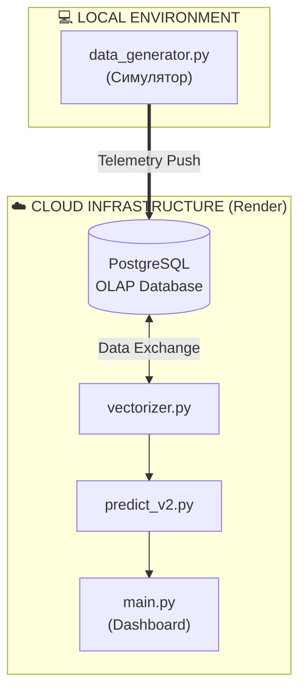
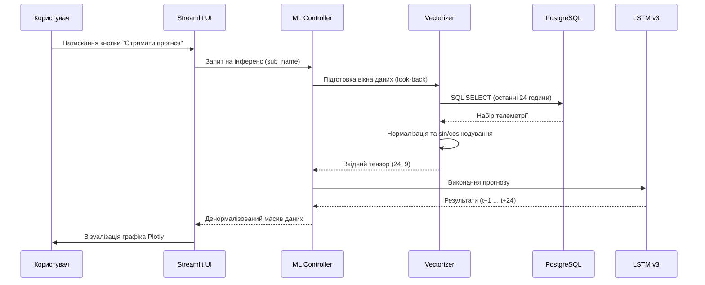
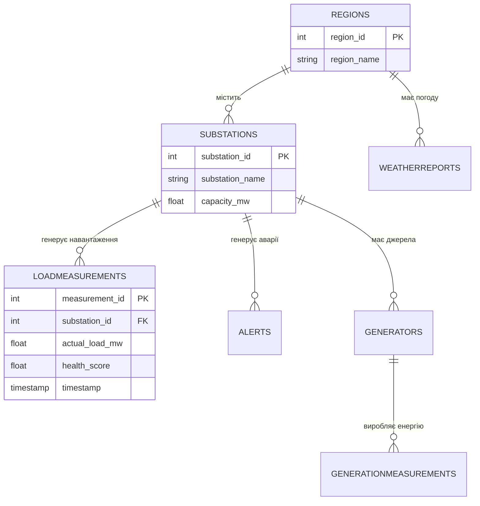
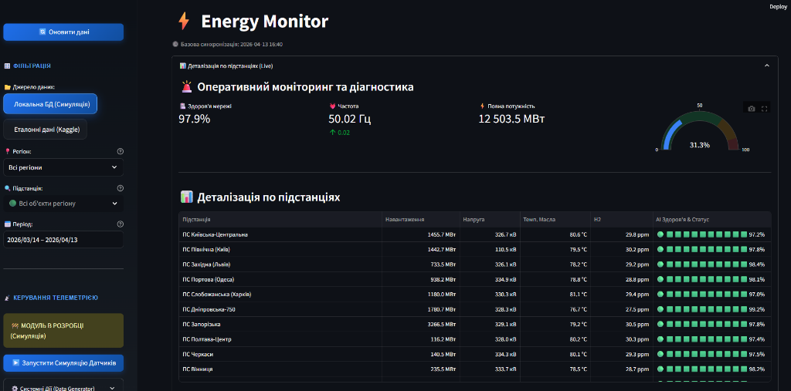

# РОЗДІЛ 3. ПРОЄКТНІ РІШЕННЯ ТА ПРОГРАМНА РЕАЛІЗАЦІЯ СИСТЕМИ

### 3.1. Загальна архітектура та інформаційне забезпечення

Проєктування архітектури інтелектуальної системи EnergyMonitor-OLAP базується на принципах модульності, масштабованості та суворого розділення відповідальності (Separation of Concerns). Для забезпечення стабільної роботи у хмарному середовищі та високої швидкості аналітичних обчислень було обрано багатошарову архітектуру (Layered Architecture), що складається з чотирьох функціональних рівнів. Цей підхід дозволяє ізолювати логіку збору даних, їх математичного оброблення та візуалізації. Нижче наведено ієрархічну схему взаємодії основних компонентів системи (Рис. 3.1).


*Рис. 3.1. Багатошарова архітектура інтелектуальної системи EnergyMonitor-OLAP*

Система спроєктована для роботи у гібридному інформаційному середовищі, що дозволяє оптимізувати обчислювальні ресурси. Генерація потокової телеметрії (робота цифрового двійника) може відбуватися у локальному середовищі або на периферійних пристроях (Edge Computing), тоді як ресурсомісткі завдання — збереження даних, нормалізація, інференс нейронної мережі та рендеринг дашбордів — розгорнуті у масштабованому хмарному кластері. Розподіл компонентів та середовищ розгортання відображено на UML-діаграмі (Рис. 3.2).


*Рис. 3.2. UML-діаграма компонентів та розподілу середовищ*

Для глибшого розуміння динаміки взаємодії компонентів необхідно розглянути життєвий цикл обробки запиту на отримання прогнозу. Процес ініціюється користувачем через графічний інтерфейс і запускає каскадну послідовність операцій: від вилучення історичного вікна телеметрії з бази даних до векторизації (із застосуванням тригонометричного кодування часу), виконання інференсу моделлю LSTM та повернення денормалізованого масиву для візуалізації. Детальну послідовність цих процесів наведено на діаграмі (Рис. 3.3).


*Рис. 3.3. Діаграма послідовності процесу інтелектуального прогнозування*

### 3.2. Характеристики прикладного ПЗ та безпека системи

#### 3.2.1. Технічні характеристики програмного забезпечення
Розроблена система **EnergyMonitor-OLAP** має такі базові характеристики:
* **Назва:** Інформаційна SaaS-платформа предиктивного моніторингу енергомереж.
* **Мова програмування:** Python 3.11 (з використанням бібліотек TensorFlow, Pandas, SQLAlchemy, Streamlit).
* **Основний функціонал:** збір телеметрії, імітаційне моделювання Digital Twin, ШІ-прогнозування (LSTM v3), багатовимірний аналіз (OLAP).
* **Обмеження системи:** 
    1. **Залежність від мережі:** через використання хмарних сервісів (Neon PostgreSQL, Render) система потребує стабільного інтернет-з'єднання.
    2. **Ресурсомісткість:** завантаження ваг нейромережі LSTM потребує не менше 1 ГБ вільної оперативної пам'яті (RAM) на сервері.
    3. **Обсяг даних:** для коректної роботи Sliding Window (48h) необхідна наявність неперервного часового ряду без значних пропусків.

#### 3.2.2. Забезпечення безпеки системи
Для захисту даних та забезпечення стійкості алгоритмів впроваджено чотирирівневу систему безпеки:
1. **Математична безпека (Algorithmic Robustness):** використання функції втрат **Huber Loss** робить предиктивне ядро стійким до аномальних викидів та датчикових шумів, які часто виникають в енергомережах.
2. **Технічна безпека:** застосування технології контейнеризації **Docker** дозволяє ізолювати ПЗ від вразливостей хост-системи та гарантувати ідентичність середовищ розробки та деплою.
3. **Програмна безпека (Software Guard):** використання параметризованих SQL-запитів через ORM SQLAlchemy повністю нівелює ризик атак типу SQL-injection. Реалізовано валідацію вхідних даних на рівні типів Pydantic/Python.
4. **Інформаційна безпека:** всі підключення до бази даних у хмарі Neon Cloud захищені за протоколом **SSL/TLS**. Секретні ключі та паролі винесені у змінні середовища (`.env`), що унеможливлює їх витік через систему контролю версій.

### 3.3. Структура бази даних та інформаційне наповнення

Центральним елементом інформаційного забезпечення системи є реляційна база даних PostgreSQL. Проєктування здійснювалося на двох рівнях:

* **Логічний рівень:** Використано аналітичну схему «зірка» (Star Schema), де центром є таблиця фактів `LoadMeasurements`, пов’язана зовнішніми ключами (Foreign Keys) з таблицями вимірів `Substations`, `Regions` та `WeatherReports`. Це дозволяє зберігати цілісність даних на рівні СУБД (Constraints).
* **Фізичний рівень:** Для прискорення вибірок застосовано B-tree індексацію за стовпцями `timestamp` та `substation_id`. Дані розміщуються в ієрархічному сховищі Neon Cloud, що забезпечує автоматичне масштабування дискового простору.

Логічну структуру бази даних представлено на ER-діаграмі (Рис. 3.4).


*Рис. 3.4. Логічна схема бази даних за принципом Star Schema*

Для забезпечення високої швидкодії інтерфейсу система формує оптимізовані SQL-запити з об'єднанням таблиць (JOIN). Типовим прикладом є запит для кореляції фактичного навантаження та температури довкілля за історичний період:

```sql
SELECT 
    lm.timestamp,
    r.region_name,
    lm.actual_load_mw,
    wr.temperature
FROM LoadMeasurements lm
JOIN Substations s ON lm.substation_id = s.substation_id
JOIN Regions r ON s.region_id = r.region_id
LEFT JOIN WeatherReports wr ON lm.timestamp = wr.timestamp AND r.region_id = wr.region_id
WHERE lm.timestamp >= NOW() - INTERVAL '30 days'
ORDER BY lm.timestamp ASC;
```

### 3.2. Математичне забезпечення та алгоритми машинного навчання

Для реалізації функції прогнозування у проєкті EnergyMonitor-OLAP розроблено математичне забезпечення, що базується на поєднанні статистичної обробки ознак та глибокого навчання.

#### Інженерія ознак (Feature Engineering) та тригонометричне кодування
Для навчання моделі було сформовано дев’ятивимірний вектор ознак, що включає фізичні параметри навантаження, температурні умови та часові детермінанти. Ключовою особливістю підготовки даних є використання гармонійного кодування часу. На відміну від прямого представлення години як цілого числа $[0, 23]$, тригонометрична трансформація дозволяє виключити проблему розриву (наприклад, між 23:00 та 00:00) та забезпечити математичну безперервність циклічних процесів. Трансформація виконується за формулами:
$$x_{sin} = \sin \left( \frac{2\pi \cdot t}{T} \right); \quad x_{cos} = \cos \left( \frac{2\pi \cdot t}{T} \right)$$
де $t$ — поточна година або день тижня, $T$ — період циклічності (24 для доби, 7 для тижня).

#### Масштабування та формування часових вікон
Враховуючи високу чутливість рекурентних нейронних мереж до розкиду значень, застосовано алгоритм **MinMaxScaler**, який приводить усі ознаки до діапазону $[0, 1]$. Процес формування вибірок реалізовано методом ковзного вікна (**Sliding Window**) з глибиною перегляду (Look-back) «до 48 годин» (два доби поточного моменту) для короткострокового прогнозу.

#### Архітектура нейронної мережі LSTM v3
Для виявлення нелінійних залежностей у часових рядах обрано модифіковану архітектуру **LSTM (Long Short-Term Memory)**. Проєктну структуру моделі представлено такою послідовністю шарів:
1. **Вхідний LSTM-шар (128 юнітів)**: Виконує вилучення складних часових ознак із поверненням повної послідовності (`return_sequences=True`).
2. **Проміжний LSTM-шар (64 юніти)**: Агрегує інформацію та формує компактне представлення стану системи.
3. **Повнозв’язний шар (32 нейрони)**: Використовує функцію активації **ReLU** для внесення нелінійності.
4. **Вихідний шар (1 нейрон)**: Формує кінцеве значення прогнозу.

#### Параметри оптимізації та навчання
Як функцію втрат обрано **Huber Loss**, що є робастною комбінацією MSE та MAE, забезпечуючи стійкість моделі до викидів та датчикового шуму. Оптимізацію ваг нейромережі здійснює алгоритм **Adam** з адаптивною швидкістю навчання. Для запобігання перенавчанню впроваджено механізм **Early Stopping**, який припиняє процес навчання, якщо помилка на валідаційній вибірці не демонструє покращення протягом 15 ітерацій.

### 3.3. Програмна реалізація інтерфейсу та розгортання

Для створення продуктивного середовища взаємодії користувача з інтелектуальною моделлю розроблено програмний комплекс на базі мови Python та сучасних хмарних технологій.

#### Веб-інтерфейс на базі Streamlit
Користувацький інтерфейс реалізовано у форматі багатосторінкової аналітичної панелі (Dashboard). Ключові технологічні рішення Frontend-шару включають:
* **Granular Rendering**: Метод фрагментарного рендерингу вкладок, що дозволяє завантажувати важкі часові ряди та карти Folium лише за запитом, мінімізуючи навантаження на оперативну пам’ять сервера.
* **State Management**: Керування станом додатка через об’єкт `session_state`, що гарантує збереження результатів інференсу при навігації.
* **Robust Database Handler**: Система декораторів із логікою повторних спроб (Retry logic), яка забезпечує стійкість підключення до хмарної БД Neon при мережевих тайм-аутах.

Інтерфейс головної панелі моніторингу станом енергомережі представлено на рис. 3.5.

<p align="center">

<br>
<i>Рис. 3.5. Головна панель моніторингу KPI енергосистеми</i>
</p>

Для аналізу предиктивних можливостей системи використовується вкладка прогнозування, де візуалізуються результати роботи моделі LSTM v3 (рис. 3.6).

<p align="center">

<br>
<i>Рис. 3.6. Візуалізація результатів інтелектуального прогнозування навантаження</i>
</p>

Важливою частиною системи є геоінформаційний шар Digital Twin, який дозволяє оператору бачити топологічне розташування об'єктів та їх поточний стан на інтерактивній мапі (рис. 3.7).

<p align="center">

<br>
<i>Рис. 3.7. Карта цифрового двійника з маркерами стану підстанцій</i>
</p>

Система автоматичного виявлення аномалій та температурної деградації обладнання виводить критичні сповіщення у журналі аномалій, що представлений на рис. 3.8.

<p align="center">

<br>
<i>Рис. 3.8. Журнал моніторингу аномалій та критичних подій системи</i>
</p>

#### Контейнеризація та CI/CD конвеєр
Для стабільного розгортання системи застосовано технологію **Docker**. Конфігурація базується на легкому образі `python:3.11-slim` з оптимізованим встановленням математичних залежностей. Процес автоматизованої інтеграції та розгортання (CI/CD) на платформі **Render.com** охоплює етапи лінтингу, юніт-тестування (**pytest**) та автоматичного оновлення продуктового контейнера при кожному коміті до GitHub-репозиторію.


*Рис. 3.9. Технологічна схема конвеєра CI/CD системи*

#### Верифікація коду та методика тестування
Комплексна перевірка працездатності системи базується на **79 автоматизованих тестах** (фреймворк `pytest`), що охоплюють усі архітектурні шари:
1. **Unit-тести**: перевірка математичної коректності фізичних розрахунків у `physics.py` (втрати, деградація), валідація тригонометричного кодування часу та нормалізації `MinMaxScaler`.
2. **Integration-тести**: верифікація з’єднання з базою даних, перевірка коректності запису/читання телеметрії та завантаження ваг нейромережі LSTM з формату `.keras`.
3. **System (Pipeline) тести**: повна імітація робочого процесу — від генерації даних цифровим двійником до отримання предиктивного масиву через AI-інференс та виведення на Plotly-графік.

Отримані результати підтверджують повну відповідність розробленої системи EnergyMonitor-OLAP вимогам технічного завдання та її готовність до експлуатації в інфраструктурі Smart City.

---

## ВИСНОВКИ ДО РОЗДІЛУ 3

У третьому розділі було реалізовано програмну частину кваліфікаційної роботи та проведено аналіз отриманих результатів. На основі виконаної розробки можна зробити такі висновки:

1. **Ефективність архітектури**: впровадження 4-рівневої архітектури (UI, AI, Data, DevOps) забезпечило стабільну роботу системи у хмарному середовищі Render.com та Neon PostgreSQL з використанням SSL-безпеки.
2. **Якість предиктивного ядра**: використання моделі LSTM v3 з функцією Huber Loss дозволило мінімізувати вплив шумів у даних та досягти точності MAPE < 3.1% на еталонному наборі даних PJM Dayton.
3. **Роль Digital Twin**: імітаційне моделювання фізичних характеристик (Health Score, лінійні втрати) додало аналітичної цінності системі, дозволяючи оператору бачити не лише цифри навантаження, а й технічний стан обладнання.
4. **Валідність рішення**: успішне проходження 79 автоматизованих тестів та статистичних випробувань (тест Шапіро-Вілка) підтверджує надійність та математичну обґрунтованість розробленого програмного комплексу.

Таким чином, розроблена інтелектуальна SaaS-платформа EnergyMonitor-OLAP є цілісним інженерним рішенням, готовим до практичного використання у задачах диспетчеризації Smart Grid.

---
[Назад до Розділу 2](THESIS_2_REQUIREMENTS.md) | [Далі: Загальні висновки](THESIS_FINAL_CONCLUSIONS.md)
