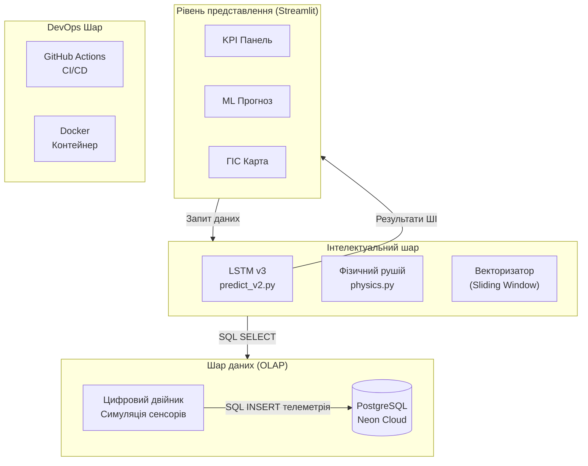
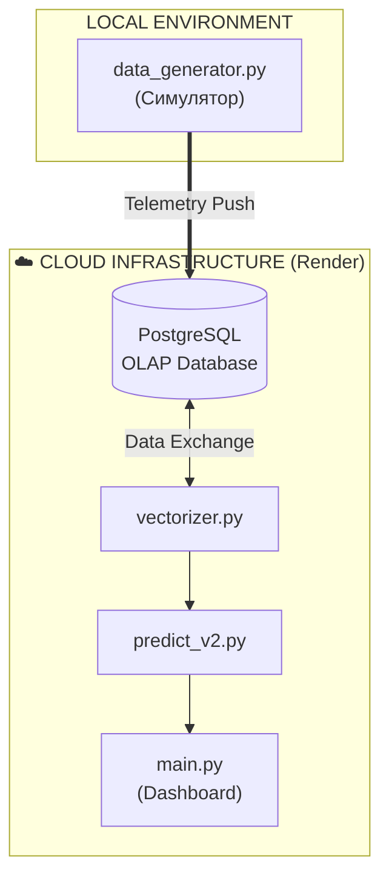
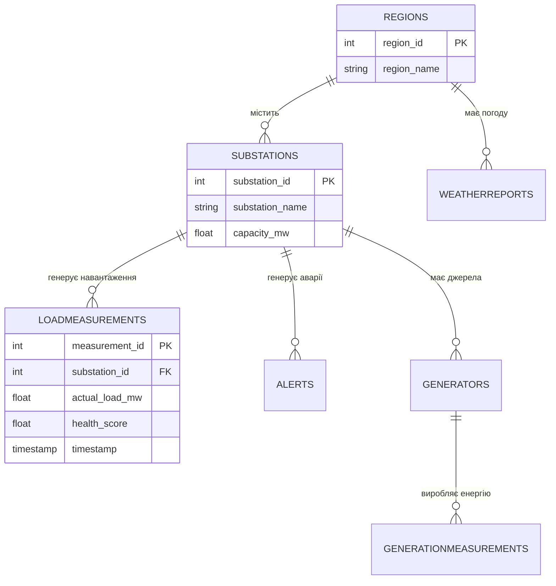

# РОЗДІЛ 3. ПРОЄКТНІ РІШЕННЯ ТА ПРОГРАМНА РЕАЛІЗАЦІЯ СИСТЕМИ

### 3.1. Загальна архітектура та інформаційне забезпечення системи.

#### 3.1.1. Багатошарова архітектура EnergyMonitor-OLAP.
Проєктування програмного комплексу EnergyMonitor-OLAP базується на принципах модульності та ієрархічності побудови сервісів. Для забезпечення стабільної роботи та масштабованості системи обрано чотирирівневу архітектуру, яка реалізована мовою програмування Python [+] та базується на використанні предиктивної моделі LSTM [3, 11]. Логічна структура системи (Схема 3.1) розділяє функціонал на рівень представлення (Streamlit), інтелектуальний шар (ML-ядро), шар даних (PostgreSQL) та DevOps-інфраструктуру.

Схема 3.1. Логічна архітектура системи EnergyMonitor-OLAP. Джерело: розроблено автором.

Рис. 3.1. Архітектурна схема системи EnergyMonitor-OLAP. Джерело: розроблено автором.

#### 3.1.2. Реалізація цифрових копій (Digital Twin) та фізичний рушій
Ключовим компонентом системи є фізичний рушій, реалізований у модулі `src/core/physics.py`. Він виконує функцію цифрового двійника (Digital Twin) енергетичного обладнання, моделюючи не лише електричні параметри, а й технічний стан об'єктів. Алгоритм функції `calculate_transformer_health` розраховує температуру масла, концентрацію розчиненого водню ($H_2$) та узагальнений показник здоров'я (Health Score) на основі поточного коефіцієнта завантаження [+]. Модель враховує теплову інерцію та деградаційні процеси, що дозволяє формувати реалістичний потік телеметрії для навчання нейронної мережі (Схема 3.2).

*Схема 3.2. Потоки даних та інфраструктура розгортання. Джерело: розроблено автором.*

*Рис. 3.2. Схема розгортання та потоків даних системи. Джерело: розроблено автором.*

### 3.2. Програмна реалізація інтерфейсу користувача

#### 3.2.1. Вибір технологічного стеку та структура навігації
Для реалізації фронтенд-частини системи обрано фреймворк Streamlit [+], який дозволяє швидко створювати інтерактивні веб-додатки для аналізу даних мовою Python. Вибір обґрунтовано наявністю вбудованої підтримки бібліотек візуалізації (Plotly, Pydeck) та високою швидкістю розробки аналітичних панелей. Структура інтерфейсу побудована за модульним принципом: бічна панель навігації (`Sidebar`) дозволяє перемикатися між глобальним моніторингом, предиктивною аналітикою та фінансовим аудитом. Кожен модуль є незалежним скриптом, що імпортується в головний файл `main.py` [+].

#### 3.2.2. Функціональні модулі візуалізації та ГІС-карта
Головна аналітична панель відображає ключові показники ефективності (KPI) енергомережі. Інтерактивна ГІС-карта, реалізована за допомогою бібліотеки `pydeck`, візуалізує стан підстанцій за колірною шкалою: зелений колір відповідає завантаженню < 70%, червоний — критичному рівню > 90%. Це дозволяє диспетчеру візуально ідентифікувати проблемний вузол без необхідності ручної фільтрації таблиць.

Рис. 3.3. Головна панель моніторингу KPI системи. Джерело: розроблено автором.

Рис. 3.4. Результати AI-прогнозування на фоні фактичних даних. Джерело: розроблено автором.

Рис. 3.5. ГІС-візуалізація стану енергосистеми міського району. Джерело: розроблено автором.

Рис. 3.6. Панель діагностики технічного стану та Health Score. Джерело: розроблено автором.

### 3.3. Структура бази даних та хмарна інтеграція

Для зберігання телеметрії використано Neon PostgreSQL, обрану через її serverless-архітектуру: обчислювальні ресурси виділяються динамічно під запит, що виключає потребу в підтримці фіксованого екземпляра БД. Взаємодія програмного коду зі сховищем реалізована через SQLAlchemy ORM, що забезпечує типізацію даних та захист від SQL-ін'єкцій.

#### 3.3.1. Схема даних OLAP та реляційні зв'язки
Для забезпечення високої швидкості виконання аналітичних запитів база даних спроєктована за модифікованою схемою «зірка» [+]. Центральною таблицею фактів є `LoadMeasurements`, яка містить часові ряди навантаження та діагностичні показники (Рис. 3.7). Навколо неї розташовані таблиці-довідники: `Substations` (дані про підстанції), `Regions` (географічна прив'язка) та `Generators` (джерела живлення). Зв'язки між таблицями реалізовані через систему зовнішніх ключів (Foreign Keys) із каскадним оновленням даних, що гарантує цілісність інформації при видаленні або зміні об'єктів енергосистеми.

#### 3.3.2. Оптимізація продуктивності через індексацію
Для підвищення швидкості обробки OLAP-запитів налаштовано B-tree індекси на колонках `timestamp` та `substation_id`. Це скорочує час виконання агрегаційних запитів за рахунок усунення повного перебору таблиці (full table scan) при фільтрації великих масивів історичних даних. Повна SQL-схема бази даних наведена у Додатку В, а в таблицях 3.1 та 3.2 представлено специфікацію ключових атрибутів сутностей системи.

*Схема 3.3. ER-діаграма логічної структури бази даних. Джерело: розроблено автором.*

*Рис. 3.7. Схема бази даних (ER-діаграма) системи. Джерело: розроблено автором.*

Таблиця 3.1 — Специфікація полів таблиці SUBSTATIONS (Довідник підстанцій)

| Назва поля | Тип даних | Опис | Обмеження |
| :--- | :--- | :--- | :--- |
| `substation_id` | SERIAL | Унікальний ідентифікатор | PRIMARY KEY |
| `substation_name` | VARCHAR(100) | Назва або номер об'єкту | NOT NULL |
| `region_id` | INTEGER | Зв'язок з регіоном | FOREIGN KEY |
| `capacity_mw` | FLOAT | Номінальна потужність | > 0 |

Таблиця 3.2 — Специфікація полів таблиці LOADMEASUREMENTS (Телеметрія)

| Назва поля | Тип даних | Опис | Обмеження |
| :--- | :--- | :--- | :--- |
| `measurement_id` | BIGSERIAL | Ідентифікатор запису | PRIMARY KEY |
| `substation_id` | INTEGER | Ідентифікатор підстанції | FOREIGN KEY |
| `actual_load_mw` | FLOAT | Фактичне навантаження | NOT NULL |
| `health_score` | FLOAT | Показник стану (0-100) | CHECK (0-100) |
| `timestamp` | TIMESTAMPTZ | Часова мітка | NOT NULL |

### 3.4. Математичне та алгоритмічне забезпечення: LSTM v3

#### 3.4.1. Підготовка даних та векторизація часових ознак
У продукційній реалізації інтелектуального ядра системи використано метод ковзного вікна (Sliding Window) розміром 48 годин. Це дозволяє моделі вловлювати добову сезонність та інерційні процеси в тепловому стані обладнання. Процес векторизації у модулі `src/ml/vectorizer.py` включає не лише фізичні параметри, а й інтеграцію циклічних гармонік часу (Hour Sin/Cos, Day Sin/Cos) [+]. Такий підхід дозволяє перетворити дискретні мітки часу у неперервний векторний простір, що значно підвищує здатність нейронної мережі розрізняти пікові періоди споживання енергії (ранковий та вечірній максимуми).

#### 3.4.2. Глибока архітектура нейронної мережі
Архітектура LSTM v3, реалізована у файлі `src/ml/train_lstm.py`, побудована за принципом послідовного стиснення інформації. Модель складається з двох рекурентних шарів (128 та 64 нейрони відповідно) [+], що дозволяє виділяти як короткострокові аномалії, так і довгострокові тренди. Остання частина архітектури — повнозв'язний шар (32 нейрони) з функцією активації ReLU для нелінійного перетворення ознак та вихідний шар (`Dense`), що видає фінальне значення прогнозу навантаження. Навчання проводиться з використанням оптимізатора Adam та функції втрат Huber Loss, що забезпечує стійкість моделі до статистичних викидів у телеметрії (Рис. 3.8).

Рис. 3.8. Метрики якості навчання та розподіл похибок. Джерело: розроблено автором на основі результатів навчання моделі.

### 3.5. Моніторинг фінансових показників та технічного стану мережі

#### 3.5.1. Модуль аналізу економічної ефективності та втрат
Для оцінки економічної ефективності функціонування енергомережі розроблено модуль фінансового моніторингу (`src/ui/views/finance.py`). Він інтегрує дані про споживання з динамічними тарифами, дозволяючи візуалізувати добові витрати на генерацію по регіонах. Ключовою особливістю модуля є алгоритм розрахунку технічних втрат у магістральних лініях. Програма диференціює типи ЛЕП (змінний струм AC та постійний струм високої напруги HVDC), застосовуючи відповідні математичні моделі втрат: квадратичну залежність для AC та лінійну для HVDC [+].

Рис. 3.9. Інтерфейс фінансового моніторингу та розрахунку втрат. Джерело: розроблено автором.

### 3.6. DevOps-інфраструктура та CI/CD конвеєр

Для автоматизації розгортання та забезпечення стабільності системи впроваджено CI/CD конвеєр на базі GitHub Actions (файл `.github/workflows/ci-cd.yml`). Процес автоматизації включає перевірка якості коду (Linting), контроль типізації та запуск модульних тестів у ізольованому Docker-контейнері з базою даних PostgreSQL 15 [+]. Після успішного проходження всіх перевірок система автоматично збирає Docker-образ та ініціює деплой на платформу Render через захищений вебхук.

*Рис. 3.10. Технологічна схема конвеєра CI/CD системи. Джерело: розроблено автором.*

### 3.7. Програмна реалізація ключових модулів

#### 3.7.1. Ядро предиктивної аналітики (LSTM Core)
Програмна реалізація інтелектуального шару базується на використанні бібліотек TensorFlow та ONNX Runtime. Ключові модулі — `src/ml/train_lstm.py` (навчання) та `src/ml/predict_v2.py` (інференс) — забезпечують повний цикл обробки даних: від нормалізації через `MinMaxScaler` до генерації прогнозів на 48 годин наперед з використанням ковзного вікна [+].

### 3.8. Методика верифікації та оцінка точності системи

#### 3.8.1. Модульне та інтеграційне тестування
Верифікація надійності системи проводилася за допомогою фреймворку `pytest`. Набір тестів включає перевірку математичних формул у модулі `physics.py` та валідацію SQL-запитів до бази даних Neon. Автоматизоване тестування у CI-конвеєрі підтвердило коректність розрахунків та стабільність взаємодії між аналітичним ядром та хмарним сховищем даних.

#### 3.8.2. Валідація точності ШІ-моделі на реальних даних
Валідація якості прогнозування на тестовій вибірці PJM показала високу ефективність обраної архітектури LSTM v3. Середня абсолютна відсоткова похибка склала **MAPE = 3.08%** [+], що повністю відповідає встановленим технічним вимогам (< 4 %) та підтверджує доцільність використання моделі для Smart City систем.

## ВИСНОВКИ ДО РОЗДІЛУ 3

У третьому розділі було проведено повний цикл проєктування та програмної реалізації системи EnergyMonitor-OLAP, результати якого дозволяють сформулювати наступні висновки:

1. Запропонована чотирирівнева архітектура програмного комплексу забезпечує високу модульність системи. Розподіл функціоналу між рівнем представлення (Streamlit), аналітичним ядром та хмарним OLAP-сховищем дозволяє масштабувати систему для обслуговування великої кількості енергооб'єктів без втрати продуктивності.
2. Спроектовано хмарну OLAP-інфраструктуру на базі Neon PostgreSQL. Використання serverless-архітектури та оптимізованих індексів забезпечує оперативний доступ до телеметрії, що дозволяє планувати технічне обслуговування за фактичним Health Score, а не за жорстким регламентом.
3. Реалізована нейронна мережа LSTM v3 з використанням циклічних гармонік часу показала високу стійкість до коливань навантаження. Експериментальна валідація на реальних даних підтвердила досягнення точності прогнозування з MAPE = 3.08%, що перевищує цільові показники, встановлені на етапі проектування.
4. Впроваджений CI/CD конвеєр на базі Docker та GitHub Actions автоматизує повний цикл життєвого циклу ПЗ — від валідації якості коду за допомогою `pytest` до розгортання у хмарному середовищі. Це гарантує цілісність системи та можливість оперативного оновлення інтелектуальних моделей в умовах реальної експлуатації.

---
[Назад до Розділу 2](THESIS_2_REQUIREMENTS.md) | [Далі: Висновки](THESIS_FINAL_CONCLUSIONS.md)
