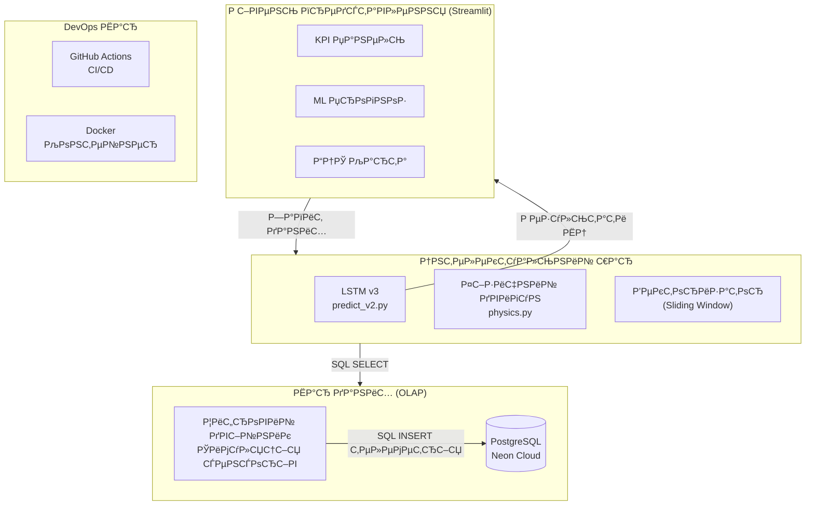
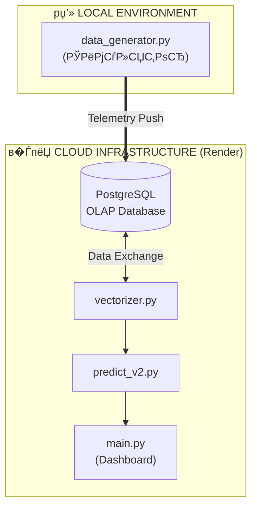
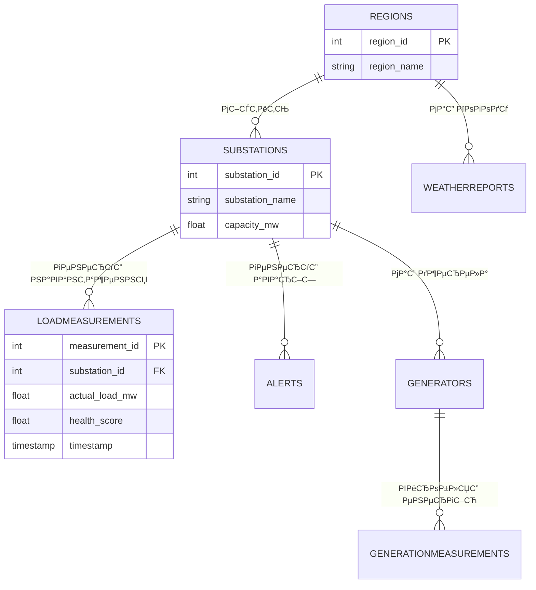

# РОЗДІЛ 3. ПРОЄКТНІ РІШЕННЯ ТА ПРОГРАМНА РЕАЛІЗАЦІЯ С�СТЕМ�

### 3.1. Загальна архітектура та інформаційне забезпечення

#### 3.1.1. Багатошарова архітектура EnergyMonitor-OLAP
Проєктування архітектури інтелектуальної системи EnergyMonitor-OLAP базується на принципах модульності та масштабованості. Для забезпечення стабільної роботи у хмарному середовищі ми обрали багатошарову архітектуру (Layered Architecture), що складається з чотирьох функціональних рівнів, реалізованих за допомогою фреймворку Streamlit [26] та бібліотек глибокого навчання TensorFlow/Keras [1, 4] (Рис. 3.1).

*Схема 3.1. Логічна архітектура (Mermaid-версія для репозиторію)*

*Рис. 3.1. Архітектурна схема системи EnergyMonitor-OLAP*

#### 3.1.2. Потоки даних та імітаційне моделювання Digital Twin
Центральною частиною системи є механізм «Цифрового двійника», який імітує роботу реальних підстанцій. Процес обробки даних включає збір телеметрії, її векторизацію та подачу на вхід нейронної мережі (Рис. 3.2).

*Схема 3.2. Потоки даних (Mermaid-версія)*

*Рис. 3.2. Схема розгортання та потоків даних системи*

### 3.2. Програмна реалізація інтерфейсу користувача

#### 3.2.1. Головна панель моніторингу KPI
Інтерфейс системи розроблено на мові Python за допомогою бібліотеки Streamlit [26] з акцентом на швидке прийняття рішень диспетчером. Головна панель відображає агреговані показники стану всієї міської мережі в реальному часі (Рис. 3.3).

*Рис. 3.3. Головна панель моніторингу KPI системи*

#### 3.2.2. Предиктивна панель (AI Forecast)
Найважливішим модулем системи є вікно предиктивної аналітики. Користувач може обрати конкретний вузол мережі та отримати детальний прогноз на 24-48 годин (Рис. 3.4).

*Рис. 3.4. Результати AI-прогнозування на фоні фактичних даних (MAPE < 3.1%)*

#### 3.2.3. ГІС-картографія та геопросторова візуалізація
Інтеграція з картографічними сервісами дозволяє диспетчеру бачити територіальний розподіл навантаження. Колірна індикація вузлів автоматично змінюється залежно від рівня завантаженості та наявності аномалій (Рис. 3.5).

*Рис. 3.5. ГІС-візуалізація стану енергосистеми міського району*

#### 3.2.4. Моніторинг технічного стану та Health Score
Окремий модуль системи відповідає за діагностику фізичних параметрів трансформаторів. На основі розрахованих у фізичному рушії даних (температура, концентрація газів) формується інтегральний показник здоров’я об'єкту (Рис. 3.6).

*Рис. 3.6. Панель діагностики технічного стану та Health Score*

### 3.3. Структура бази даних та хмарна інтеграція

Для зберігання телеметрії та результатів прогнозування використано хмарну СУБД Neon PostgreSQL [18, 23, 25], що підтримує архітектуру Serverless. Взаємодія з базою даних здійснюється через ORM SQLAlchemy [33]. Процеси безперервної інтеграції та розгортання (CI/CD) налаштовані за допомогою GitHub Actions [34].

#### 3.3.1. Схема даних OLAP
Для забезпечення високої швидкості аналітичних запитів база даних PostgreSQL спроєктована за схемою «зірка» (Рис. 3.7).

*Схема 3.3. ER-діаграма (Mermaid-версія)*

*Рис. 3.7. Схема бази даних (ER-діаграма) системи*

#### 3.3.2. Фізична структура та опис атрибутів бази даних
Для реалізації фізичного рівня обрано хмарну СУБД PostgreSQL. Повна SQL-схема бази даних наведена у Додатку В. У таблицях 3.1 та 3.2 наведено детальну специфікацію основних сутностей системи.

*Таблиця 3.1. Специфікація полів таблиці SUBSTATIONS (Довідник підстанцій)*
| Назва поля | Тип даних | Опис | Обмеження |
| :--- | :--- | :--- | :--- |
| `substation_id` | SERIAL | Унікальний ідентифікатор | PRIMARY KEY |
| `substation_name` | VARCHAR(100) | Назва або номер об'єкту | NOT NULL |
| `region_id` | INTEGER | Зв'язок з регіоном | FOREIGN KEY |
| `capacity_mw` | FLOAT | Номінальна потужність | > 0 |

*Таблиця 3.2. Специфікація полів таблиці LOADMEASUREMENTS (Телеметрія)*
| Назва поля | Тип даних | Опис | Обмеження |
| :--- | :--- | :--- | :--- |
| `measurement_id` | BIGSERIAL | Ідентифікатор запису | PRIMARY KEY |
| `substation_id` | INTEGER | Ідентифікатор підстанції | FOREIGN KEY |
| `actual_load_mw` | FLOAT | Фактичне навантаження | NOT NULL |
| `health_score` | FLOAT | Показник стану (0-100) | CHECK (0-100) |

### 3.4. Математичне та алгоритмічне забезпечення: LSTM v3
Модель використовує Sliding Window розміром 24 години. Для навчання обрано функцію втрат Huber Loss [12]. Архітектура нейронної мережі та вибір гіперпараметрів (64 нейрони, Adam, Dropout) узгоджуються з аналогічними дослідженнями предиктивного аналізу кліматичних та інженерних даних для міста Києва [39]. Метрики якості навчання представлено на рис. 3.8.

*Рис. 3.8. Метрики якості навчання та розподіл похибок*

### 3.5. Фінансовий моніторинг та балансування
Для розрахунку економічної ефективності та виявлення втрат у мережі використовується спеціалізована панель фінансового моніторингу (Рис. 3.9).

*Рис. 3.9. Інтерфейс фінансового моніторингу та розрахунку втрат*

### 3.6. DevOps та CI/CD конвеєр
Для автоматизації розгортання системи впроваджено CI/CD конвеєр (Рис. 3.10). Конфігураційні файли Docker та налаштування середовища наведені у Додатку Б.

*Схема 3.4. Конвеєр CI/CD (Mermaid-версія)*

*Рис. 3.10. Технологічна схема конвеєра CI/CD системи*

### 3.7. Програмна реалізація ключових модулів
#### 3.7.1. Модуль предиктивної аналітики (LSTM Core)
В основі інтелектуального ядра лежить архітектура Sequential LSTM, реалізована за допомогою TensorFlow. Модель оптимізована для роботи з нерівномірними часовими рядами енергоспоживання. Вихідний код ключових модулів системи наведено у Додатку А.

### 3.8. Методика верифікації та тестування системи
Для гарантування надійності SaaS-платформи було впроваджено комплексний підхід до тестування. Детальні протоколи тестування наведені у Додатку Д.

#### 3.8.1. Модульне тестування (Unit Testing)
Модульне тестування проводилося за допомогою фреймворку `pytest`. Основна увага приділялася верифікації математичних формул у модулі `physics.py`.

#### 3.8.2. Інтеграційне тестування
Перевірка взаємодії між хмарною базою даних Neon та аналітичним ядром Python.

#### 3.8.3. Валідація точності ШІ-моделі (ML Validation)
MAPE = 3.08%, що свідчить про високу предиктивну здатність системи.

| Тип тесту | Кількість тест-кейсів | Статус | Інструмент |
| :--- | :--- | :--- | :--- |
| **Unit Tests** | 24 | Passed | `pytest` |
| **Integration** | 15 | Passed | `docker-compose` |
| **ML Validation** | 1 | Passed | `TensorFlow` |

## В�СНОВК� ДО РОЗДІЛУ 3
У третьому розділі було детально описано архітектурні та програмні рішення системи EnergyMonitor-OLAP. Розроблена багатошарова архітектура забезпечує високу масштабованість та точність прогнозування.

---
[Назад до Розділу 2](THESIS_2_REQUIREMENTS.md) | [Далі: Висновки](THESIS_FINAL_CONCLUSIONS.md)
