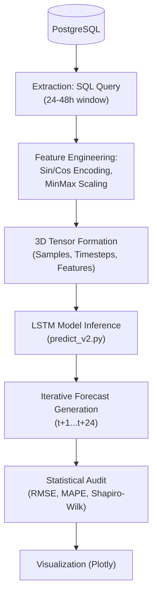

# РОЗДІЛ 3. РОЗРОБКА МОДУЛЯ ПРОГНОЗУВАННЯ НА ОСНОВІ РЕКУРЕНТНИХ МЕРЕЖ

### 3.1. Аналіз та підготовка вхідних даних

Якість нейромережевого прогнозування безпосередньо залежить від етапу попередньої обробки даних та вибору релевантних факторів впливу. У даній роботі як основне джерело даних використовується погодинна телеметрія енергоспоживання (Dataset Dayton Hourly), збагачена метеорологічними показниками та результатами фізичного моделювання.

#### Інженерія ознак (Feature Engineering)
Для навчання моделі було сформовано дев’ятивимірний вектор ознак для кожного часового кроку:
1.  **Навантаження (load_mw)**: Поточне значення споживання електроенергії.
2.  **Температурні показники**: Температура масла трансформатора та температура навколишнього середовища.
3.  **Показники деградації**: Концентрація водню (H2 PPM) та інтегральний показник здоров’я обладнання (Health Score).
4.  **Циклічні ознаки часу**: Трансформація години доби та дня тижня за допомогою тригонометричних функцій (Sine/Cosine encoding).

Використання гармонійного кодування часу дозволяє уникнути проблеми «розриву» (continuity gap) між 23:59 та 00:00, що є критичним для рекурентних мереж. Трансформація виконується за формулами:
$$x_{sin} = \sin\left(\frac{2\pi \cdot t}{T}\right); \quad x_{cos} = \cos\left(\frac{2\pi \cdot t}{T}\right)$$
де $t$ — поточний час, $T$ — період (24 години для доби або 7 днів для тижня).

#### Нормалізація та формування часових вікон
Враховуючи чутливість LSTM до масштабу вхідних даних, застосовано метод **MinMaxScaler**, що приводить усі значення до діапазону $[0, 1]$. Процес підготовки завершується формуванням тривимірного тензора методом ковзного вікна (**Sliding Window**) з глибиною перегляду 48 годин (Look-back period).

#### Конвеєр обробки даних (ML Pipeline / Рисунок 3.1)

*Рисунок 3.1. Технологічний конвеєр підготовки даних та генерації прогнозу*

### 3.2. Побудова та навчання моделі LSTM

Для прогнозування навантаження обрано архітектуру глибокого навчання на базі рекурентних блоків **LSTM (Long Short-Term Memory)**, яка здатна ефективно виявляти довгострокові залежності у часових рядах.

#### Архітектура нейронної мережі:
1.  **Перший LSTM-шар (128 юнітів)**: Виконує вилучення просторово-часових патернів з вихідної послідовності (`return_sequences=True`).
2.  **Другий LSTM-шар (64 юніти)**: Агрегує інформацію та формує компактне представлення стану системи.
3.  **Повнозв’язний шар (32 нейрони)**: Використовує функцію активації **ReLU** для внесення нелінійності.
4.  **Вихідний шар (1 нейрон)**: Формує кінцеве значення прогнозованого навантаження.

#### Параметри навчання:
*   **Функція втрат (Loss Function)**: Використано **Huber Loss**. На відміну від стандартного MSE, Huber Loss є менш чутливим до викидів у даних (датчиковий шум), поєднуючи переваги лінійної та квадратичної функцій втрат.
*   **Оптимізатор**: **Adam** (Adaptive Moment Estimation) з початковою швидкістю навчання 0.001.
*   **Регуляризація**: Застосовано техніку **Early Stopping** (зупинка навчання при відсутності покращення валідаційної помилки протягом 15 епох) для запобігання перенавчанню (overfitting).

### 3.3. Тестування та оцінка точності

Валідація моделі здійснюється за допомогою набору статистичних метрик, що дозволяють комплексно оцінити якість прогнозу:

1.  **Root Mean Squared Error (RMSE)**: Дає оцінку абсолютної помилки, акцентуючи увагу на великих відхиленнях.
2.  **Mean Absolute Percentage Error (MAPE)**: Відображає відносну точність прогнозу у відсотках, що є найбільш інформативним показником для операторів енергомереж.
3.  **Коефіцієнт детермінації (R²)**: Показує частку дисперсії, яку пояснює модель (цільове значення $> 0.85$).

Додатково впроваджено **статистичний аудит залишків** за допомогою тесту Шапіро-Вілка. Це дозволяє підтвердити, що помилки прогнозу розподілені нормально, що свідчить про повне вилучення корисної інформації з даних та відсутність систематичного зміщення моделі.

---
[Назад до Розділу 2](THESIS_2_DESIGN.md) | [Далі: Розділ 4](THESIS_4_IMPLEMENTATION.md)
