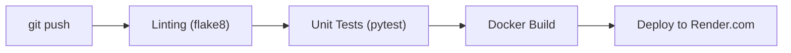

# РОЗДІЛ 4. ПРОГРАМНА РЕАЛІЗАЦІЯ ТА ІНТЕРФЕЙС КОРИСТУВАЧА

### 4.1. Реалізація Frontend-частини та засобів візуалізації

Програмний інтерфейс системи EnergyMonitor-OLAP реалізований на базі мови програмування Python та фреймворку **Streamlit**, що дозволяє будувати високопродуктивні аналітичні панелі. Організація інтерфейсу базується на компонентному підході, де кожен елемент (графік, картка показників, панель керування) є незалежним модулем.

#### Архітектура взаємодії з користувачем
Керування станом додатка здійснюється через об’єкт `session_state`, що дозволяє зберігати результати обчислень ШІ-моделей при навігації між вкладками. Для запобігання конфліктів під час тривалих обчислень впроваджено механізм моніторингу активності (`engine_active`), який блокує паралельні запити та інформує користувача про стан обробки даних.

#### Візуалізація прогнозів
Побудова графіків реалізована за допомогою бібліотеки **Plotly**. Використання інтерактивної графіки дозволяє оператору не лише бачити прогнозовану криву, а й детально аналізувати значення в кожній точці, порівнювати довірчі інтервали та виявляти аномалії за допомогою масштабування.

### 4.2. Інтеграція алгоритмів з базою даних та обробка винятків

Зв’язок інтелектуальних модулів з аналітичним сховищем PostgreSQL реалізований через обгортку на базі бібліотеки **SQLAlchemy/psycopg2**.

#### Забезпечення стійкості (Robust Design)
Одним із ключових викликів при роботі з хмарними базами даних є нестабільність мережевого з’єднання. Для вирішення цієї проблеми у проекті реалізовано систему декораторів `robust_database_handler`. Цей механізм автоматично перехоплює помилки тайм-ауту та виконує повторні спроби запиту (Retry logic) з експоненціальною затримкою, що гарантує цілісність даних навіть при короткочасних розривах зв’язку.

#### Оптимізація обчислень
Для мінімізації навантаження на базу даних та оперативну пам’ять сервера застосовано багаторівневе кешування:
1.  **DataFrame Caching**: Результати важких SQL-запитів зберігаються у пам’яті (`@st.cache_data`) з часом життя (TTL) 300 секунд.
2.  **ML Model Caching**: Навчені нейромережі завантажуються в пам’ять одноразово (Singleton pattern), що значно скорочує час до видачі першого прогнозу (Inference latency).

### 4.3. Контейнеризація та розгортання системи

Для забезпечення переносимості та стабільності роботи системи в різних середовищах застосовано технологію **Docker**.

#### Docker-конфігурація
Процес побудови образу системи описаний у `Dockerfile` і включає наступні етапи:
- Використання базового образу на базі `python:3.13-slim` для зменшення об’єму контейнера.
- Встановлення системних залежностей, необхідних для роботи математичних бібліотек (numpy, scipy).
- Конфігурація середовища виконання через змінні оточення для безпечного зберігання секретних даних (Credentials).

#### Хмарне розгортання
Систему розгорнуто на платформі **Render.com** за моделлю PaaS (Platform as a Service). Конвеєр розгортання налаштовано таким чином, що кожна зміна у репозиторії на GitHub автоматично запускає процес тестування (CI) та оновлення продуктового контейнера (CD).

#### Схема автоматизованого розгортання (CI/CD Pipeline / Рисунок 4.1)

*Рисунок 4.1. Схема конвеєра автоматизованої інтеграції та розгортання*

Це дозволяє оперативно впроваджувати оновлення та виправлення, не перериваючи роботу користувачів.

---
[Назад до Розділу 3](THESIS_3_ML_CORE.md) | [Далі: Розділ 5](THESIS_5_RESULTS.md)
