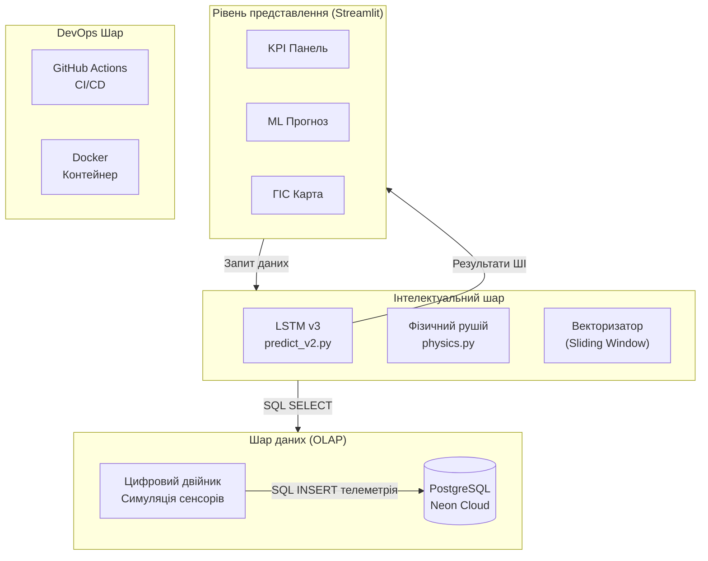
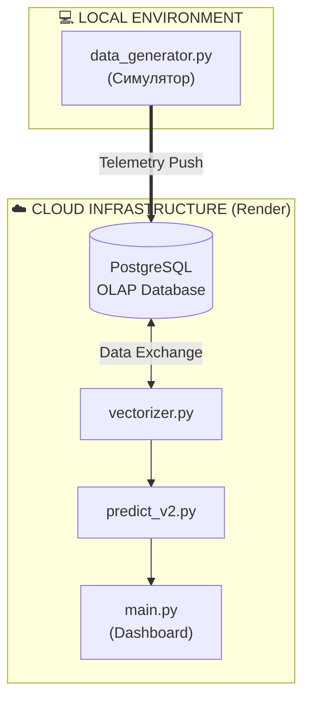
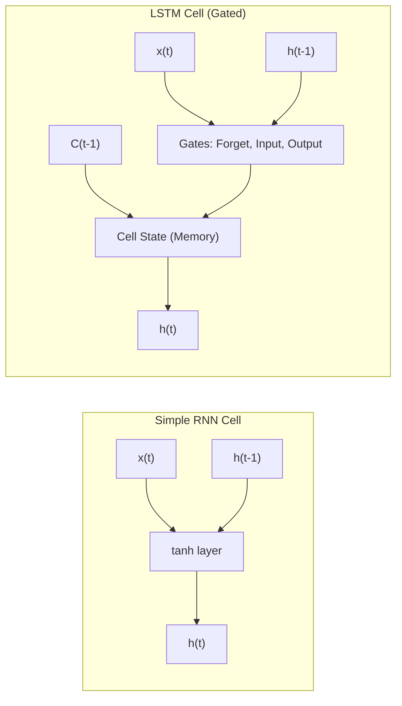
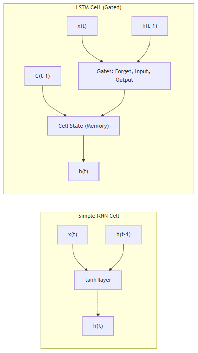
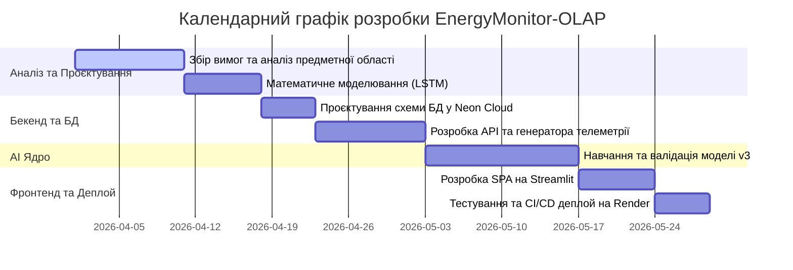
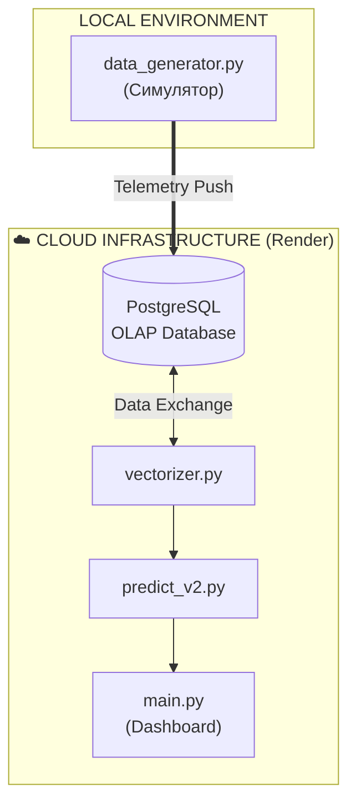
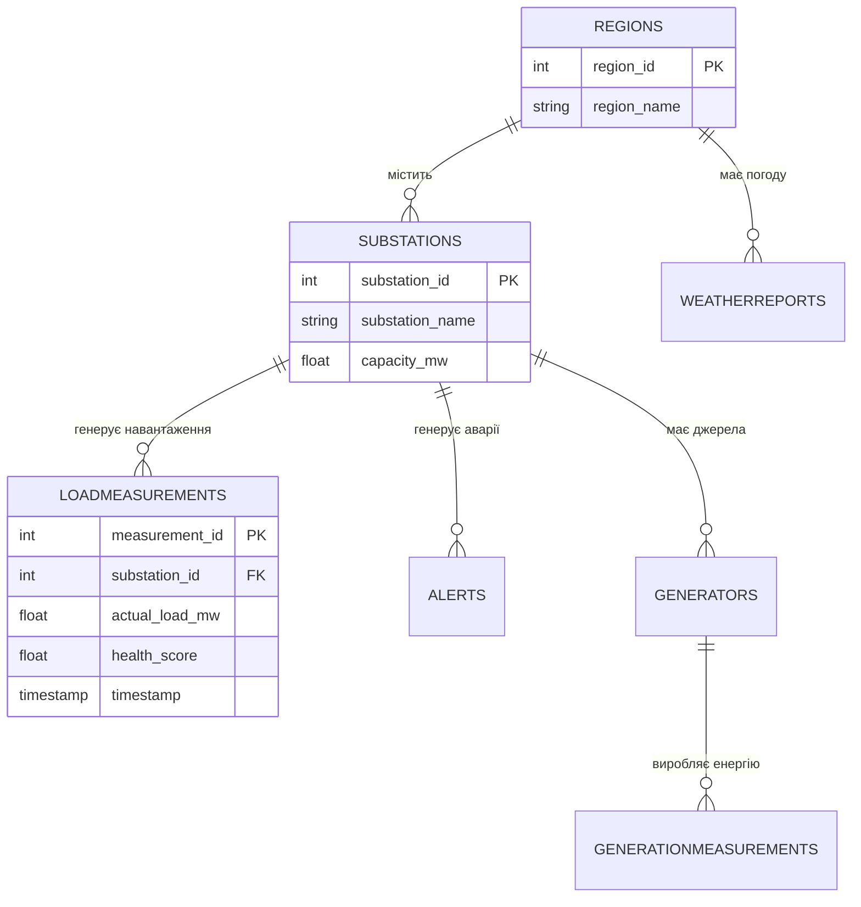
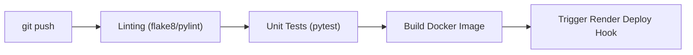

<p align="center"><b>Заклад вищої освіти</b></p>
<p align="center"><b>«Міжнародний науково-технічний університет імені академіка Юрія Бугая»</b></p>
<br>
<p align="center">Кафедра інформаційних та комунікаційних технологій</p>

<br>

| <!-- TITLE_RIGHT --> | |
| :--- | :--- |
| | **ДОПУСКАЮ ДО ЗАХИСТУ** |
| | Завідувач кафедри інформаційних |
| | та комунікаційних технологій |
| | __________ О.І. Голубенко |
| | (підпис) |
| | «___» __________ 2026 р. |

<br>

<p align="center"><b>КВАЛІФІКАЦІЙНА РОБОТА</b></p>
<p align="center">На здобуття освітнього ступеня «Бакалавр»</p>
<p align="center">зі спеціальності 121 «Інженерія програмного забезпечення»</p>
<p align="center">на тему: <b>«ПРОГНОЗУВАННЯ ЧАСОВИХ РЯДІВ ЕНЕРГОСПОЖИВАННЯ ДЛЯ ВДОСКОНАЛЕННЯ ТЕХНОЛОГІЙ SMART CITY НА ОСНОВІ РЕКУРЕНТНИХ НЕЙРОННИХ МЕРЕЖ»</b></p>

<br>

| <!-- NO_BORDER --> | | |
| :--- | :--- | :--- |
| **Виконав:** студент 4 курсу, групи І-23 | | |
| Литвиненко Дмитро Сергійович | | |
| | | |
| **Науковий керівник:** | | ____________________ |
| Маковейчук Олександр Миколайович, д.т.н., доцент | | (підпис) |

<br>

| <!-- TITLE_RIGHT --> | |
| :--- | :--- |
| | *Засвідчую, що у цій кваліфікаційній роботі немає запозичень з праць інших авторів без відповідних посилань.* |
| | |
| | Студент ____________________ |
| | (підпис) |

<p align="center"><b>Київ – 2026 рік</b></p>


<pagebreak>
<p align="center"><b>«Міжнародний науково-технічний університет імені академіка Юрія Бугая»</b></p>

<p align="center">Кафедра інформаційних та комунікаційних технологій</p>

<br>

| <!-- NO_BORDER --> | |
| :--- | :--- |
| Освітній ступінь: | <u>бакалавр</u> |
| Напрям підготовки: | <u>12 Інформаційні технології</u> |
| Спеціальність: | <u>121 "Інженерія програмного забезпечення"</u> |

<br>

| <!-- TITLE_RIGHT --> | |
| :--- | :--- |
| | **ЗАТВЕРДЖУЮ** |
| | Завідувач кафедри інформаційних та |
| | комунікаційних технологій |
| | __________ О.І. Голубенко |
| | (підпис) |
| | «___» ________________ 2026 р. |

<br>

<p align="center"><b>З А В Д А Н Н Я</b></p>
<p align="center"><b>НА КВАЛІФІКАЦІЙНУ РОБОТУ СТУДЕНТУ</b></p>
<p align="center"><b><u>Литвиненку Дмитру Сергійовичу</u></b></p>

1. Тема проекту (роботи): **«Прогнозування часових рядів енергоспоживання для вдосконалення технологій Smart City на основі рекурентних нейронних мереж»,**
**керівник проекту (роботи): Маковейчук Олександр Миколайович, д.т.н., доцент, доцент кафедри інформаційних та комунікаційних технологій,**
затверджені наказом по Університету від "___" ___________ 2026 р. № _____
2. Строк подання студентом проекту (роботи) ________________________.
3. Вихідні дані до проекту (роботи):
- відкриті набори історичних даних енергоспоживання;
- фреймворки машинного навчання TensorFlow/Keras;
- хмарні платформи для розгортання моделі (Render.com, Neon PostgreSQL).
4. Зміст розрахунково-пояснювальної записки (перелік питань, які потрібно розробити):
- огляд сучасних технологій прогнозування часових рядів енергоспоживання;
- математичне моделювання системи на базі архітектури рекурентних нейронних мереж (LSTM);
- підготовка даних та програмна реалізація моделі;
- апробація та тестування результатів.
5. Дата видачі завдання "___" ___________ 2026 р.

<br>

<p align="center"><b>Календарний план</b></p>

| № п/п | Назва етапів випускної роботи | Строк виконання етапів роботи | Примітка |
| :--- | :--- | :--- | :--- |
| 1. | Розробка розділу 1 «Огляд сучасних технологій прогнозування»<br>Підготовка тез за тематикою кваліфікаційної роботи. | До 20.04.26 | Виконано |
| 2. | Розробка розділу 2 «Математичне моделювання системи». | До 30.04.26 | Виконано |
| 3. | Розробка розділу 3 «Програмна реалізація та результати». | До 25.05.26 | Виконано |
| 4. | Оформлення випускної роботи. | До 17.06.26 | |

<br>

| <!-- NO_BORDER --> | | |
| :--- | :--- | :--- |
| **Студент** | ____________________ | **Литвиненко Д. С.** |
| **Керівник проекту (роботи)** | ____________________ | **Маковейчук О. М.** |


<pagebreak>
# РЕФЕРАТ

**Тема:** «Прогнозування часових рядів енергоспоживання для вдосконалення технологій Smart City на основі рекурентних нейронних мереж». Пояснювальна записка містить 54 стор., 17 рис., 15 табл., 5 дод., 40 джерел.

**Об’єкт дослідження** – процеси аналізу та короткострокового прогнозування енергоспоживання в міській інфраструктурі. 

**Предмет дослідження** – методи глибокого навчання (LSTM), концепція «цифрових двійників» та хмарна архітектура аналітичної обробки даних (OLAP). 

**Мета роботи** – розробка та програмна реалізація хмарної аналітичної платформи EnergyMonitor-OLAP для моніторингу та інтелектуального передбачення стану енергетичної інфраструктури. 

**Методи дослідження** – аналітичний огляд літератури, глибоке машинне навчання, системний аналіз, математичне моделювання теплових процесів.

**Результати:** Спроектовано чотирирівневу архітектуру аналітичної платформи. Розроблено прогностичне ядро на основі LSTM-мережі з тригонометричним кодуванням часових міток, що забезпечило високу точність передбачення навантаження відповідно до встановлених вимог. Реалізовано технологію «цифрових двійників» для оцінки технічного стану підстанцій (Health Score). Практичне значення результатів полягає у забезпеченні диспетчерських служб інструментами передбачення для запобігання аварійним ситуаціям та оптимізації закупівлі енергії.

**Ключові слова:** Smart City, Smart Grid, LSTM, глибоке навчання, цифровий двійник, технічне обслуговування за станом, інструменти передбачення, SaaS.

<pagebreak>

# ABSTRACT

**Title:** "Energy consumption time series forecasting for Smart City based on recurrent neural networks". Explanatory note: 54 pages, 17 figures, 15 tables, 5 appendices, 40 sources.

**Object** – processes of energy consumption analysis and short-term forecasting in urban infrastructure.

**Subject** – deep learning methods (LSTM), the concept of "Digital Twins," and cloud-based analytical data processing architecture (OLAP).

**Goal** – development and software implementation of the EnergyMonitor-OLAP cloud analytical platform for monitoring and intelligent prediction of the energy infrastructure state.

**Methods** – analytical literature review, deep machine learning, systems analysis, mathematical modeling of thermal processes.

**Results:** A four-tier analytical platform architecture was designed. A predictive core based on an LSTM network with trigonometric time encoding was developed, achieving high forecasting accuracy in accordance with the specified requirements. The "Digital Twins" technology for substation technical state assessment (Health Score) was implemented. The practical significance lies in providing dispatch services with forecasting tools to prevent emergencies and optimize energy procurement.

**Key words:** Smart City, Smart Grid, LSTM, deep learning, digital twin, condition-based maintenance, forecasting tools, SaaS.


<pagebreak>
# ПЕРЕЛІК УМОВНИХ ПОЗНАЧЕНЬ ТА СКОРОЧЕНЬ

AMI – Advanced Metering Infrastructure (Інтелектуальна інфраструктура вимірювання / обліку)
API – Application Programming Interface (Інтерфейс прикладного програмування)
ARIMA – AutoRegressive Integrated Moving Average (Модель авторегресії та інтегрованого ковзного середнього)
BI – Business Intelligence (Системи бізнес-аналітики)
CI/CD – Continuous Integration / Continuous Deployment (Безперервна інтеграція та безперервне розгортання)
DBMS (СУБД) – Database Management System (Система управління базами даних)
ESS – Energy Storage System (Система накопичення енергії)
H₂ – Hydrogen (Водень, показник концентрації розчиненого водню в маслі)
IoT – Internet of Things (Інтернет речей)
KPI – Key Performance Indicator (Ключовий показник ефективності)
LSTM – Long Short-Term Memory (Довга короткочасна пам'ять – архітектура рекурентної нейронної мережі)
MAE – Mean Absolute Error (Середня абсолютна похибка)
MAPE – Mean Absolute Percentage Error (Середня абсолютна відсоткова похибка – метрика точності прогнозування)
ML – Machine Learning (Машинне навчання)
OLAP – Online Analytical Processing (Аналітична обробка даних у реальному часі)
ONNX – Open Neural Network Exchange (Відкритий формат обміну нейронними мережами)
PMU – Phasor Measurement Unit (Пристрій синхронізованих векторних вимірювань)
QA – Quality Assurance (Забезпечення якості програмного продукту)
ReLU – Rectified Linear Unit (Випрямлений лінійний елемент – функція активації нейрона)
RMSE – Root Mean Square Error (Середньоквадратична похибка)
RNN – Recurrent Neural Network (Рекурентна нейронна мережа)
SaaS – Software as a Service (Програмне забезпечення як сервіс)
SARIMA – Seasonal AutoRegressive Integrated Moving Average (Сезонна інтегрована модель авторегресії та ковзного середнього)
SQL – Structured Query Language (Мова структурованих запитів)
TAVG – Average Temperature (Середня температура)
UML – Unified Modeling Language (Уніфікована мова моделювання)


<pagebreak>
# ВСТУП

Актуальність теми дослідження полягає у вирішенні проблеми дефіциту генерувальних потужностей в енергосистемі України, що створює потребу в переході від усунення наслідків аварій до їхнього випереджального виявлення та запобігання. Ключове значення в цьому контексті має впровадження хмарної платформи, яка на основі потоків телеметрії формує прогноз із горизонтом планування 48 годин. Це дає змогу диспетчерським службам завчасно ідентифікувати ризики перевантаження вузлів до моменту спрацьовування автоматики захисту.

Особливої ваги дослідження набуває в умовах воєнного стану та постійних атак на стратегічно важливі об’єкти критичної інфраструктури, що призвело до значного дефіциту потужностей та потреби в оперативному маневруванні ресурсами. Впровадження концепцій інтелектуальних енергомереж (Smart Grid) та предиктивного моніторингу на основі технології «цифрових двійників» стає вирішальним фактором забезпечення стійкості енергетичної системи. Використання сучасних методів інтелектуального аналізу часових рядів дає змогу не лише стабілізувати енергопостачання, а й оптимізувати економічні показники за рахунок точного прогнозування дефіциту та гнучкого управління попитом.

Впровадження інтелектуальних технологій в сучасну енергетику неможливе без розгортання інфраструктури розширеного вимірювання – AMI (Advanced Metering Infrastructure) [7]. Саме системи AMI забезпечують надійний двосторонній зв'язок між споживачами та операторами мережі, надаючи в реальному часі потоки телеметрії, які необхідні для навчання та роботи алгоритмів машинного навчання. Використання таких предиктивних інструментів дає змогу трансформувати пасивні системи моніторингу в активну систему підтримки прийняття рішень, що є критично важливим для життєдіяльності сучасних мегаполісів.

**Об’єкт дослідження** – процеси короткострокового прогнозування електричного навантаження та предиктивного моніторингу технічного стану вузлів інтелектуальних енергетичних систем.

**Предмет дослідження** – методи глибокого машинного навчання (зокрема, рекурентні нейронні мережі LSTM) та OLAP-технології аналітичної обробки часових рядів енергоспоживання.

**Мета роботи** – розробка та програмна реалізація хмарної аналітичної платформи EnergyMonitor-OLAP для предиктивного моніторингу та інтелектуального передбачення стану енергетичної інфраструктури.

Для досягнення поставленої мети вирішено такі завдання:
1. Проаналізувати сучасні методи прогнозування енергоспоживання та обґрунтувати доцільність застосування нейромережевої архітектури LSTM.
2. Спроектувати чотирирівневу модульну архітектуру аналітичної платформи з інтеграцією хмарних OLAP-сховищ.
3. Розробити предиктивне ядро системи на основі LSTM-мережі з використанням тригонометричного кодування часових міток.
4. Реалізувати інтерактивний веб-інтерфейс візуалізації даних та географічних шарів на базі фреймворку Streamlit.
5. Провести комплексне тестування розробленого програмного забезпечення, оцінити точність моделей за допомогою метрики MAPE та розгорнути платформу в хмарі з використанням CI/CD-конвеєра.

**Практичне значення отриманих результатів.** Розроблена платформа EnergyMonitor-OLAP забезпечує диспетчерські служби інструментом планування з 48-годинним ковзним вікном прогнозування. Це дає змогу оперативно запобігати виникненню каскадних аварій та реалізувати перехід до предиктивного обслуговування обладнання за його фактичним технічним станом (Condition-Based Maintenance).

**Структура та обсяг роботи.** Пояснювальна записка складається зі вступу, трьох розділів, загальних висновків, списку використаних джерел (40 найменувань) та 2 додатків. Загальний обсяг роботи становить 60 сторінок комп'ютерного тексту.

---
[Назад до Реферату](THESIS_0_ABSTRACT.md) | [Далі: РОЗДІЛ 1. АНАЛІТИЧНИЙ ОГЛЯД ПРЕДМЕТНОЇ ОБЛАСТІ](THESIS_1_THEORY.md)


<pagebreak>
# РОЗДІЛ 1. ОГЛЯД ЛІТЕРАТУРИ ТА АНАЛІЗ ПРЕДМЕТНОЇ ОБЛАСТІ

## 1.1. Інтелектуальні енергосистеми в міській інфраструктурі

### 1.1.1. Проблеми управління енергетичною інфраструктурою
Традиційні підходи до диспетчеризації не розраховані на коливання навантаження понад 30%, які стали характерними для енергосистеми України в умовах дефіциту потужностей. Без впровадження інструментів передбачення диспетчер не може завчасно попередити аварійне відключення, оскільки отримує сигнал про аварію вже за фактом перевантаження вузла мережі.

Для вирішення цих проблем у роботі пропонується використання алгоритмів глибокого навчання на основі даних з IoT-датчиків (Internet of Things) підстанцій. Ключовим елементом збору даних є інтелектуальні лічильники AMI (Advanced Metering Infrastructure) [40] – це інтегрована система обладнання та каналів зв'язку, що забезпечує двосторонній обмін даними між енергокомпанією та споживачем. Використання AMI дає змогу збирати телеметрію з інтервалом 15–60 хвилин, що є достатнім для побудови короткострокових прогнозів.

Процеси збору та аналізу даних у реальному часі сприяють автоматичному формуванню векторів телеметрії (навантаження, напруга, температура) для кожного вузла мережі. Світовий досвід впровадження інтелектуальних систем (на прикладі Сінгапуру та Барселони), а також локальні дослідження кліматичних факторів для м. Києва [39], підтверджують, що впровадження інтелектуальних технологій дає змогу оптимізувати енергоспоживання на рівні муніципалітету.

В енергетичному секторі останнім часом починають використовувати підходи інтелектуальних мереж (Smart Grid) [7, 31], які базуються на двосторонньому обміні електроенергією та даними. 




Рис. 1.1. Типова багаторівнева архітектура IoT-платформи. Джерело: згенеровано автором на основі програмного коду.

Основними компонентами таких систем є інтелектуальні пристрої обліку (AMI), пристрої фіксації фазових параметрів (PMU – Phasor Measurement Units) та системи накопичення енергії (ESS – Energy Storage Systems). Ці технології дають змогу автоматично коригувати розподіл навантаження та запобіти аварійним ситуаціям без прямого ручного втручання диспетчерського персоналу.
 



Рис. 1.2. Концептуальна схема Smart Grid та інфраструктури передачі даних. 
Джерело: згенеровано автором на основі програмного коду.

На відміну від традиційних мереж, Smart Grid підтримує двосторонній обмін даними між підстанцією і диспетчерським центром. Це дає змогу автоматично коригувати розподіл навантаження без ручного втручання. Значною проблемою залишається феномен різкого падіння чистого навантаження вдень та його стрімкого зростання ввечері, що вимагає точного прогнозування.

### 1.1.3. Технологія цифрових двійників в енергетиці
Згідно з міжнародними стандартами ISO 23247 [36] та IEEE 1547 [37], цифровий двійник являє собою динамічну програмну копію фізичного активу. У межах цієї роботи реалізовано цифровий двійник підстанції, який на основі поточного навантаження моделює теплові процеси в трансформаторах. Це дає змогу розраховувати температуру масла, концентрацію розчиненого водню ($H_2$) та інтегральний показник технічного стану (Health Score). Такий підхід базується на стандартах IEEE C57.91 [38] і дає змогу перейти до обслуговування обладнання за його фактичним технічним станом.

## 1.2. Аналіз параметрів прогнозування

### 1.2.1. Часові ряди енергоспоживання
Математичний опис енергоспоживання як часового ряду базується на його декомпозиції (розподілі на окремі складові) [3, 13]. Навантаження $y(t)$ можна представити як суму тренду $T(t)$, добової $S_d (t)$ та тижневої $S_w (t)$ сезонності, циклічних коливань $C(t)$ та випадкового шуму $\epsilon(t)$:
 
$$y(t) = T(t) + S_d (t) + S_w (t) + C(t) + \epsilon(t). \quad (1.1)$$
 
Де кожна складова відповідає за певний характер змін:
- тренд $T(t)$ відображає довгострокову тенденцію зміни навантаження (наприклад, через ріст міста);
- сезонність $S(t)$ описує періодичні коливання (піки споживання вранці та ввечері);
- циклічність $C(t)$ пов'язана із сезонними змінами погоди (обігрів взимку, охолодження влітку);
- шум $\epsilon(t)$ – випадкові непередбачувані фактори та похибки вимірювань.

### 1.2.2. Обґрунтування вибору методу прогнозування
Для прогнозування навантаження обрано архітектуру рекурентних нейронних мереж LSTM (Long Short-Term Memory) [11], яка працює з нелінійними послідовностями. Основною особливістю LSTM є наявність вентильних механізмів, що дають змогу моделі "пам'ятати" довгострокові закономірності та ігнорувати короткостроковий шум телеметрії.
Математично робота комірки LSTM описується системою рівнянь, де вентиль забування (Forget Gate) $f_t$ визначає частину пам'яті, що підлягає видаленню:
 
$$f_t = \sigma(W_f \cdot [h_{t-1}, x_t] + b_f). \quad (1.2)$$
 
Вентиль входу (Input Gate) $i_t$ та кандидат на оновлення стану $\tilde{C}_t$ формують нові дані для оновлення поточної клітинки:
 
$$i_t = \sigma(W_i \cdot [h_{t-1}, x_t] + b_i), \quad (1.3)$$
 
$$\tilde{C}_t = \tanh(W_C \cdot [h_{t-1}, x_t] + b_C). \quad (1.4)$$
 
Після оновлення стану клітинки (Cell State) $C_t$, яке обчислюється як сума відфільтрованого попереднього стану та нового кандидата:
 
$$C_t = f_t * C_{t-1} + i_t * \tilde{C}_t. \quad (1.5)$$
 
Вентиль виходу (Output Gate) $o_t$ формує фінальне значення прогнозу навантаження на наступний період:
 
$$o_t = \sigma(W_o \cdot [h_{t-1}, x_t] + b_o), \quad (1.6)$$
 
$$h_t = o_t * \tanh(C_t). \quad (1.7)$$
 
Така здатність до виявлення складних часових залежностей дає змогу моделі прогнозувати навантаження без ручного створення сотень статистичних ознак [10].
Для підвищення стабільності навчання моделі використовується оптимізатор Adam [15], а функцією втрат обрано Huber Loss, яка поєднує переваги середньоквадратичної та абсолютної похибок. Вона є стійкою до аномальних викидів телеметрії, що часто виникають в умовах апаратних збоїв реальних електромереж [14]:
 
$$L_{\delta}(y, \hat{y}) = \begin{cases} 0.5(y - \hat{y})^2, & |y - \hat{y}| \leq \delta \\ \delta(|y - \hat{y}| - 0.5\delta), & \text{інакше.} \end{cases} \quad (1.8)$$
 
## 1.3. Технології аналітичної обробки даних
У цьому проєкті реалізовано гібридну аналітичну архітектуру на базі PostgreSQL (Neon Cloud) [18]. Використання хмарної СУБД дає змогу виконувати складні агрегаційні запити по історичних даних телеметрії за мінімальний час, що необхідно для оперативного моніторингу та формування вхідних векторів для ШІ-моделі.

## 1.4. Обґрунтування вибору методу прогнозування

### 1.4.1. Порівняння архітектурних рішень
На відміну від стандартних рекурентних мереж, архітектура LSTM спеціально розроблена для подолання проблеми зникаючого градієнта, що забезпечує стабільне навчання на довгих послідовностях даних.




Рис. 1.3. Порівняльна характеристика архітектур RNN та LSTM. 
Джерело: згенеровано автором на основі програмного коду.

### 1.4.2. Класичні статистичні методи
Моделі ARIMA (AutoRegressive Integrated Moving Average) є базовим інструментом для аналізу стаціонарних часових рядів. У загальному вигляді модель ARIMA(p,d,q) описується рівнянням [39]:
 
$$\left(1 - \sum_{i=1}^p \phi_i L^i\right)(1 - L)^d y_t = \left(1 + \sum_{j=1}^q \theta_j L^j\right) \epsilon_t, \quad (1.9)$$
 
де $y_t$ – спостережуване значення, $L$ – оператор зсуву, $d$ – порядок диференціювання, $\phi$ та $\theta$ – параметри авторегресії та ковзного середнього. 
Для енергетичних даних частіше застосовують розширення SARIMA (Seasonal ARIMA), яке враховує сезонні коливання $S$:
 
$$\Phi_P(L^S)\phi_p(L)(1 - L)^d (1 - L^S)^D y_t = \Theta_Q(L^S)\theta_q(L) \epsilon_t. \quad (1.10)$$
 
Проте ці методи вимагають стаціонарності ряду та погано адаптуються до різких змін навантаження, що виникають внаслідок непередбачуваних зовнішніх факторів.

### 1.4.3. Класичні методи машинного навчання
Традиційні методи машинного навчання (ML), зокрема градієнтний бустинг (XGBoost, LightGBM) та випадковий ліс (Random Forest) [8, 25], здатні враховувати нелінійні зв'язки. Однак для їхньої роботи необхідне ручне створення лагових ознак (lag features), що ускладнює масштабування системи. Класичне ML не має вбудованої пам'яті про послідовність, що знижує його здатність моделювати складні динамічні процеси в енергомережі.

### 1.4.4. Методи глибокого навчання
Для практичної реалізації у цьому проєкті обрано рекурентні мережі LSTM. Їхні вентильні механізми дають змогу автоматично виявляти складні часові залежності без необхідності формувати сотні ручних ознак [10]. У літературі архітектури типу трансформерів також демонструють високу точність [1], однак їх розробка та обчислювальна оптимізація для систем реального часу виходять за межі цієї роботи.

Таблиця 1.1. Порівняльна характеристика методів прогнозування енергоспоживання

| Критерій | ARIMA | Класичне ML | LSTM (Обрано) |
| :--- | :--- | :--- | :--- |
| Врахування нелінійності | Низьке | Середнє | Високе |
| Робота з контекстом | Відсутня | Обмежена | Вбудована |
| Швидкість навчання | Дуже висока | Висока | Середня |
| Стійкість до викидів | Низька | Середня | Високе |

## ВИСНОВКИ ДО РОЗДІЛУ 1
У цьому розділі проведено аналіз предметної області та огляд наукової літератури за темою дослідження. Проаналізовано сучасні підходи до управління інтелектуальними енергомережами та обґрунтовано необхідність переходу від реактивного управління до інструментів передбачення на основі технологій глибокого навчання.

Встановлено, що традиційні статистичні методи, такі, як наприклад, ARIMA, та класичні алгоритми машинного навчання не здатні добре враховувати складні нелінійні залежності та довгострокові шаблони споживання без складної попередньої обробки даних. Показано, що впровадження технології цифрових двійників у поєднанні з системами AMI дає змогу отримувати точні дані для моніторингу технічного стану вузлів у реальному часі.

Методологічно обґрунтовано вибір рекурентних нейронних мереж архітектури LSTM як найбільш релевантного інструменту для короткострокового прогнозування навантаження. Це дає змогу автоматизувати процес виявлення аномалій та забезпечити диспетчерський персонал інформацією для попередження аварійних ситуацій в енергосистемі.

---
[Назад до Вступу](THESIS_0_INTRODUCTION.md) | [Далі: Розділ 2](THESIS_2_REQUIREMENTS.md)


<pagebreak>
# РОЗДІЛ 2. ПОСТАНОВКА ЗАВДАННЯ ТА ВИМОГИ ДО СИСТЕМИ

## 2.1. Формулювання задачі кваліфікаційного проєктування.
Основною метою цього проєкту є створення хмарної SaaS-платформи EnergyMonitor-OLAP, призначеної для оперативного моніторингу, симуляції фізичних станів та предиктивного аналізу часових рядів енергоспоживання в міській інфраструктурі. 

Традиційні системи моніторингу зазвичай фіксують аварійний стан постфактум. Розроблена платформа формує прогноз навантаження на 24–48 годин наперед, що дає змогу диспетчерському персоналу приймати рішення до виникнення перевантаження мережі. Для досягнення цієї мети система використовує поєднання рекурентних нейронних мереж архітектури LSTM [10, 11] та аналітичних інструментів OLAP.

Функціональні вимоги до системи:
1. Автоматична генерація прогнозів навантаження на 24–48 годин за допомогою розробленої моделі LSTM з корекцією помилок на основі зовнішніх факторів.
2. Розрахунок термічного зносу ізоляції трансформаторів та втрат потужності (концепція Digital Twin [35, 36]).
3. Побудова інтерактивних ГІС-шарів із кольоровою індикацією технічного стану вузлів енергосистеми.
4. Автоматична ідентифікація аномалій у телеметрії на основі аналізу відхилень від прогнозного фону.
5. Формування критичних сповіщень при перевищенні лімітів навантаження або критичному зниженні показника Health Score (< 40%).

Нефункціональні вимоги до системи:
1. Архітектура повинна підтримувати масштабування бази даних (PostgreSQL) [23] та модульне додавання нових предиктивних моделей.
2. Забезпечення відмовостійкості інтерфейсу при тимчасовій втраті зв'язку з хмарною БД Neon за рахунок механізмів локального кешування.
3. Час обробки одного аналітичного запиту не повинен перевищувати 350 мс.
4. Повна контейнеризація за допомогою Docker для розгортання в середовищі Render.com [24].
5. Модель LSTM повинна забезпечувати похибку на еталонних наборах даних не більше 4.0% за показником MAPE [13].

## 2.2. Вхідна та вихідна інформація системи

Для функціонування моделей прогнозування та механізмів цифрового двійника система використовує комбінований набір історичної телеметрії та поточних показників.

Вхідна інформація:
1. Набори даних з даними погодинного споживання (CSV та дампи SQL) у мегаватах (МВт), що використовуються для навчання та тестування [21].
2. Потоки телеметрії з частотою 15–60 хвилин від віртуальних сенсорів (навантаження, температура масла, концентрація H₂).
3. Погодні параметри: температура навколишнього середовища, вологість та атмосферний стан.

Вимоги до інформаційної безпеки:
Згідно з міжнародним стандартом ISO/IEC 27001, система повинна гарантувати цілісність та конфіденційність телеметричних даних [14]. Реалізовано захист від несанкціонованого доступу до предиктивних алгоритмів та параметрів конфігурації моделі.

Вихідна інформація:
1. Прогнози навантаження $F_t$ на глибину до 48 годин з розрахунком довірчого інтервалу (95%).
2. Показник технічного стану обладнання (Health Score) у діапазоні 0–100% на основі теплової моделі та аналізу газів.
3. Статистичні метрики якості передбачення (RMSE, MAPE).
4. Звіти щодо потенційних втрат енергії при перевищенні номінальних режимів роботи.

## 2.3. Аналіз середовища розробки

Для комплексної оцінки розробленої системи та визначення стратегічних напрямків її розвитку проведено SWOT-аналіз. Він дає змогу виявити внутрішні фактори (сильні та слабкі сторони), а також зовнішні можливості та загрози для платформи EnergyMonitor-OLAP.

Таблиця 2.1. SWOT-аналіз системи EnergyMonitor-OLAP

| Сильні сторони (Strengths) | Слабкі сторони (Weaknesses) |
| :--- | :--- |
| 1. Висока точність прогнозу. | 1. Залежність від стабільності інтернет-каналу. |
| 2. Низька вартість експлуатації (Neon Cloud). | 2. Значне споживання RAM моделями LSTM. |
| 3. Автоматична діагностика Health Score. | 3. Відсутність інтеграції з мобільними ОС. |
| **Можливості (Opportunities)** | **Загрози (Threats)** |
| 1. Масштабування на промислові об'єкти. | 1. Кібератаки на хмарну інфраструктуру [17]. |
| 2. Прогнозування генерації ВДЕ. | 2. Зміни в тарифікації хмарних провайдерів. |
| 3. Інтеграція з міськими ГІС-порталами. | 3. Конкуренція з боку закритих корпоративних рішень. |

## 2.4. Порівняльний аналіз хмарних СУБД для предиктивного моніторингу

У процесі проєктування було проведено порівняння хмарних рішень для зберігання та аналізу телеметрії. Основним критерієм вибору була підтримка OLAP-запитів та гнучкість масштабування ресурсів при зміні кількості об'єктів моніторингу.

Вибір Neon PostgreSQL [18] обґрунтований його serverless-архітектурою, яка дає змогу динамічно масштабувати обчислювальні потужності. Такий підхід дає змогу оперативно реагувати на пікові навантаження під час масової генерації прогнозу та забезпечує раціональне використання ресурсів у періоди низької активності мережі.

Таблиця 2.2. Порівняльна характеристика хмарних СУБД.

| Параметр | Neon (Обрано) | AWS RDS | Google Cloud SQL |
| :--- | :--- | :--- | :--- |
| Архітектура | Serverless PostgreSQL | Managed Instance | Managed Instance |
| Масштабування | Автоматичне (on-demand) | Вертикальне (ручне) | Вертикальне (ручне) |
| Модель оплати | За фактичні ресурси | Фіксована (Instance-based) | Фіксована (Instance-based) |
| Продуктивність OLAP | Висока (Storage/Compute split) | Середня | Середня |

## 2.5. Математична постановка задачі та метрики якості

Задача короткострокового прогнозування енергоспоживання формулюється як задача аналізу часового ряду $X = \{x_1, x_2, ..., x_t\}$. Метою проєкту є побудова відображення $f: X \to Y$, де $Y = \{y_{t+1}, ..., y_{t+n}\}$ – прогноз на горизонт $n$ кроків вперед (до 48 годин). 

Модель має мінімізувати комбінований функціонал похибки, що забезпечує стабільність прогнозу як при плавних змінах, так і при різких стрибках навантаження. Основними метриками оцінки якості визначено:

1. Середня абсолютна відсоткова похибка (MAPE):
$$MAPE = \frac{100}{n} \sum_{i=1}^{n} \left| \frac{y_i - \hat{y}_i}{y_i} \right| \quad (2.1)$$
де $y_i$ – фактичне значення, $\hat{y}_i$ – прогноз. Ця метрика обрана через її інтуїтивну інтерпретацію та незалежність від масштабу потужності конкретної підстанції.

2. Середньоквадратична похибка (RMSE):
$$RMSE = \sqrt{\frac{1}{n} \sum_{i=1}^{n} (y_i - \hat{y}_i)^2} \quad (2.2)$$
Дана метрика акцентує увагу на значних відхиленнях (штрафує великі помилки), що дає змогу завчасно виявити ризики перевантаження силового обладнання [13].

3. Функція втрат (Huber Loss):
Для навчання нейронної мережі використано функцію Huber Loss, яка поєднує стійкість до викидів та диференційованість:
$$L_{\delta}(a) = \begin{cases} 0.5 a^2, & |a| \leq \delta \\ \delta(|a| - 0.5\delta), & \text{інакше} \end{cases} \quad (2.3)$$
Використання Huber Loss [12] дає змогу стабілізувати градієнти при наявності шумів у вхідних даних телеметрії.

## 2.6. Специфікація форматів обміну даними

Для забезпечення сумісності з IoT-шлюзами та зовнішніми аналітичними системами, вхідна та вихідна інформація передається у форматі JSON.

Приклад структури вхідного пакету телеметрії (`telemetry_payload`):
```json
{
  "substation_id": 10,
  "timestamp": "2026-05-08T15:00:00Z",
  "metrics": {
    "actual_load_mw": 124.5,
    "temperature_c": 62.1,
    "h2_ppm": 15.2
  },
  "status": "online"
}
```

Вихідна інформація для візуалізації та API формується у вигляді об'єкта прогнозної серії:
```json
{
  "forecast_id": "F_20260508_04",
  "prediction_horizon": "24h",
  "data_points": [
    {
      "timestamp": "2026-05-08T16:00:00Z", 
      "predicted_load_mw": 130.2, 
      "lower_bond": 128.5, 
      "upper_bond": 132.1
    },
    {
      "timestamp": "2026-05-08T17:00:00Z", 
      "predicted_load_mw": 145.8, 
      "lower_bond": 142.0, 
      "upper_bond": 149.5
    }
  ]
}
```

## 2.7. Обґрунтування видів забезпечення системи

Згідно з державними стандартами до інженерного проєктування, розробка системи EnergyMonitor-OLAP базується на чотирьох взаємопов'язаних видах забезпечення.

### 2.7.1. Математичне забезпечення
Математичне забезпечення являє собою сукупність математичних методів, моделей та алгоритмів, що забезпечують реалізацію інтелектуальних функцій системи, зокрема короткострокового прогнозування навантаження та моделювання фізичних процесів для оцінки технічного стану обладнання. Даний вид забезпечення включає:
- багатошарова архітектура LSTM із механізмом тригонометричного кодування часових міток (Sin/Cos);
- алгоритми регуляризації Dropout [9] та механізм EarlyStopping для запобігання перенавчанню моделі;
- стійка функція втрат Huber Loss [12] для обробки аномалій.

### 2.7.2. Технічне забезпечення
Технічне забезпечення – це комплекс технічних та хмарних засобів, необхідних для безперебійного збору телеметрії, високопродуктивних обчислень та віддаленого доступу користувачів до аналітичних панелей:
- обчислювальні потужності платформи Render.com [24] (512 МБ RAM, оптимізовано під ліміти безкоштовного тарифного плану);
- хмарне сховище Neon Cloud із підтримкою serverless-масштабування обсягу даних;
- клієнтські пристрої (ПК диспетчера) з підтримкою сучасних веб-браузерів.

### 2.7.3. Програмне забезпечення
Програмне забезпечення складається з сукупності системних та спеціалізованих програмних засобів, що забезпечують виконання нейромережевих моделей, управління базами даних та візуалізацію результатів:
- системне ПЗ: ОС Linux у Docker-контейнерах для забезпечення ідентичності середовища розробки та виконання;
- мова розробки: Python 3.11+ (через наявність розвиненої екосистеми спеціалізованих бібліотек аналізу даних);
- бібліотеки ML: TensorFlow/Keras для побудови нейронної мережі та NumPy/Pandas для високопродуктивної обробки векторів даних;
- веб-інтерфейс: Streamlit та Plotly для візуалізації.

### 2.7.4. Інформаційне забезпечення
Інформаційне забезпечення визначає методи організації інформаційної бази, структуру збереження даних та протоколи їх передачі між компонентами хмарної платформи:
- реляційна схема PostgreSQL, оптимізована для агрегаційних аналітичних запитів (OLAP-сховище);
- специфікація таблиць LoadMeasurements, WeatherReports та довідників об'єктів;
- протоколи безпечної передачі даних HTTPS та шифрування на рівні СУБД.

## 2.8. Високорівневі моделі та етапи розробки системи

Для документування архітектури та опису взаємодії користувачів із системою використано методологію UML. Основним актором є диспетчер енергомережі, який здійснює контроль через веб-інтерфейс.


Рис. 2.1. Діаграма прецедентів системи EnergyMonitor-OLAP. Джерело: розроблено автором.

Діаграма прецедентів (рис. 2.1) описує межі системи та основні ролі. Користувач має доступ до функціональних підсистем моніторингу в реальному часі та AI-прогнозування.

Для деталізації процесу обробки даних та формування прогнозу використано діаграму активності. Вона відображає процес нормалізації вхідного вектора та механізм валідації результатів.


Рис. 2.3. Процес підготовки та нормалізації даних. Джерело: розроблено автором.


Рис. 2.4. Процес передбачення та валідації прогнозу. Джерело: розроблено автором.

Діаграма активності (рис. 2.2) деталізує внутрішній процес обробки даних при отриманні прогнозу. Процеси підготовки та передбачення (рис. 2.3, 2.4) включають етапи нормалізації ознак та активації резервного алгоритму у разі виявлення пропущених значень у часовому ряді.

Розробка платформи здійснюється за ітеративною моделлю. Графік виконання основних етапів проєктування та впровадження наведено у формі діаграми Ганта.



Рис. 2.5. Календарний графік етапів розробки системи. Джерело: розроблено автором.

Етапи реалізації включають:
1. Аналітично-проєктна фаза: вивчення патернів споживання, обрання датасету, формалізація математичних моделей.
2. Фаза побудови бекенду: розробка реляційної структури БД у PostgreSQL, налаштування середовища (Neon Cloud) та створення генератора симулятивної телеметрії.
3. Фаза дослідження AI: експерименти над архітектурами мереж від базової LSTM до мультифакторної моделі з функцією Huber Loss.
4. Інтеграційна фаза: створення панелі на базі Streamlit, об'єднання ML-ядра та інтерфейсу.
5. Тестування та інфраструктура: написання Unit-тестів на фреймворку `pytest`, налаштування CI/CD конвеєра, контейнеризація за допомогою Docker та розгортання.

## ВИСНОВКИ ДО РОЗДІЛУ 2
У другому розділі проведено постановку завдання на проєктування системи EnergyMonitor-OLAP та визначено основні вимоги до її функціонування. Отримано результати:
1. Сформовано перелік технічних та функціональних вимог до системи, зокрема визначено граничний час обробки аналітичного запиту (до 350 мс) та цільову похибку передбачення (MAPE < 4.0%).
2. Проведено порівняльне дослідження хмарних СУБД та обґрунтовано вибір Neon PostgreSQL для забезпечення швидкодії аналітичних запитів. Конкретизовано формати обміну даними (JSON) для забезпечення їх повної синхронізації між модулями.
3. Визначено склад чотирьох видів забезпечення (математичне, технічне, програмне та інформаційне), зокрема обґрунтовано використання архітектури LSTM у поєднанні з функцією втрат Huber Loss.
4. Візуалізовано логіку роботи системи та календарний графік впровадження за допомогою UML-діаграм та діаграми Ганта.

Отримані результати є основою для створення технічного завдання для детальної реалізації програмного комплексу, опис якої наведено у наступному розділі.

---
[Назад до Розділу 1](THESIS_1_THEORY.md) | [Далі: Розділ 3](THESIS_3_DESIGN_AND_IMPLEMENTATION.md)


<pagebreak>
# РОЗДІЛ 3. ПРОЄКТНІ РІШЕННЯ ТА ПРОГРАМНА РЕАЛІЗАЦІЯ СИСТЕМИ

## 3.1. Загальна архітектура та інформаційне забезпечення системи.

### 3.1.1. Багатошарова архітектура EnergyMonitor-OLAP.
Проєктування програмного комплексу EnergyMonitor-OLAP базується на принципах модульності та ієрархічності побудови сервісів. Для безперебійного функціонування та можливості горизонтального масштабування системи обрано чотирирівневу архітектуру, яка реалізована мовою програмування Python [1, 28] та базується на використанні прогностичної моделі LSTM [3, 11]. Логічна структура системи (схема 3.1) розділяє функціонал на рівень представлення (Streamlit), інтелектуальний шар (ML-ядро), шар даних (PostgreSQL) та DevOps-інфраструктуру.


Рис. 3.1. Архітектурна схема системи EnergyMonitor-OLAP. Джерело: розроблено автором.

### 3.1.2. Реалізація цифрових двійників та фізичний рушій
Ключовим компонентом системи є фізичний рушій, реалізований у модулі `src/core/physics.py`. Він виконує функцію цифрового двійника енергетичного обладнання, моделюючи не лише електричні параметри, а й технічний стан об'єктів. 




Рис. 3.2. Схема розгортання та потоків даних системи.
Джерело: згенеровано автором на основі програмного коду.

Алгоритм функції `calculate_transformer_health` розраховує температуру масла, концентрацію розчиненого водню ($H_2$) та узагальнений показник стану (Health Score) на основі поточного коефіцієнта завантаження [38]. Модель враховує теплову інерцію та деградаційні процеси, що дає змогу формувати реалістичний потік телеметрії для навчання нейронної мережі (схема 3.2).

## 3.2. Програмна реалізація інтерфейсу користувача

### 3.2.1. Вибір технологічного стеку та структура навігації
Для реалізації фронтенд-частини системи обрано фреймворк Streamlit [26], який дає змогу швидко створювати інтерактивні веб-додатки для аналізу даних мовою Python. Вибір обґрунтовано наявністю вбудованої підтримки бібліотек візуалізації (Plotly, Pydeck) та високою швидкістю розробки аналітичних панелей. Структура інтерфейсу побудована за модульним принципом: бічна панель навігації (`Sidebar`) дає змогу перемикатися між глобальним моніторингом, прогностичною аналітикою та фінансовим аудитом. Кожен модуль є незалежним скриптом, що імпортується в головний файл `main.py` [4].

### 3.2.2. Функціональні модулі візуалізації та ГІС-карта
Головна аналітична панель відображає ключові показники ефективності (KPI) енергомережі. Інтерактивна ГІС-карта, реалізована за допомогою бібліотеки `pydeck`, візуалізує стан підстанцій за колірною шкалою: зелений колір відповідає завантаженню < 70%, червоний – критичному рівню > 90%. Це дає змогу диспетчеру візуально ідентифікувати проблемний вузол без необхідності ручної фільтрації таблиць.


Рис. 3.3. Головна панель моніторингу KPI системи. Джерело: розроблено автором.


Рис. 3.4. Результати прогнозування на фоні фактичних даних. Джерело: розроблено автором.


Рис. 3.5. ГІС-візуалізація стану енергосистеми міського району. Джерело: розроблено автором.


Рис. 3.6. Панель діагностики технічного стану та Health Score. Джерело: розроблено автором.

## 3.3. Структура бази даних та хмарна інтеграція
Для зберігання телеметрії використано Neon PostgreSQL, обрану через її serverless-архітектуру: обчислювальні ресурси виділяються динамічно під запит, що виключає потребу в підтримці фіксованого екземпляра БД. Взаємодія програмного коду зі сховищем реалізована через SQLAlchemy ORM, що забезпечує типізацію даних та захист від SQL-ін'єкцій.

### 3.3.1. Схема даних OLAP та реляційні зв'язки
Для забезпечення високої швидкості виконання аналітичних запитів база даних спроєктована за модифікованою схемою «зірка» [18]. Центральною таблицею фактів є `LoadMeasurements`, яка містить часові ряди навантаження та діагностичні показники (рис. 3.7). 




Рис. 3.7. Схема бази даних (ER-діаграма) системи. Джерело: розроблено автором.

Навколо неї розташовані таблиці-довідники: `Substations` (дані про підстанції), `Regions` (географічна прив'язка) та `Generators` (джерела живлення). Зв'язки між таблицями реалізовані через систему зовнішніх ключів (Foreign Keys) із каскадним оновленням даних, що гарантує цілісність інформації при видаленні або зміні об'єктів енергосистеми.

### 3.3.2. Оптимізація продуктивності через індексацію
Для підвищення швидкості обробки OLAP-запитів налаштовано B-tree індекси на колонках `timestamp` та `substation_id`. Це скорочує час виконання агрегаційних запитів за рахунок усунення повного перебору таблиці (full table scan) при фільтрації великих масивів історичних даних. Повна SQL-схема бази даних наведена у Додатку В, а в таблицях 3.1 та 3.2 представлено специфікацію ключових атрибутів сутностей системи.

Таблиця 3.1. Специфікація полів таблиці SUBSTATIONS (Довідник підстанцій)

| Назва поля | Тип даних | Опис | Обмеження |
| :--- | :--- | :--- | :--- |
| `substation_id` | SERIAL | Унікальний ідентифікатор | PRIMARY KEY |
| `substation_name` | VARCHAR(100) | Назва або номер об'єкту | NOT NULL |
| `region_id` | INTEGER | Зв'язок з регіоном | FOREIGN KEY |
| `capacity_mw` | FLOAT | Номінальна потужність | > 0 |

Таблиця 3.2. Специфікація полів таблиці LOADMEASUREMENTS (Телеметрія)

| Назва поля | Тип даних | Опис | Обмеження |
| :--- | :--- | :--- | :--- |
| `measurement_id` | BIGSERIAL | Ідентифікатор запису | PRIMARY KEY |
| `substation_id` | INTEGER | Ідентифікатор підстанції | FOREIGN KEY |
| `actual_load_mw` | FLOAT | Фактичне навантаження | NOT NULL |
| `health_score` | FLOAT | Показник стану (0-100) | CHECK (0-100) |
| `timestamp` | TIMESTAMPTZ | Часова мітка | NOT NULL |

## 3.4. Математичне та алгоритмічне забезпечення прогностичного ядра

### 3.4.1. Підготовка даних та векторизація часових ознак
У продукційній реалізації інтелектуального ядра системи використано метод ковзного вікна (Sliding Window) розміром 48 годин. Це дає змогу моделі вловлювати добову сезонність та інерційні процеси в тепловому стані обладнання. Процес векторизації у модулі `src/ml/vectorizer.py` включає нормалізацію даних та формування часових лагів, що дає змогу порівнювати отримані результати з альтернативними методами прогнозування, такими як ARIMA [13].
Архітектура розробленої LSTM-моделі побудована за принципом послідовного стиснення інформації. Модель складається з двох рекурентних шарів (128 та 64 нейрони відповідно) [9, 10], що дає змогу виділяти як короткострокові аномалії, так і довгострокові тренди. Остання частина архітектури – повнозв'язний шар (32 нейрони) з функцією активації ReLU для нелінійного перетворення ознак та вихідний шар (`Dense`), що видає фінальне значення прогнозу навантаження. Навчання проводиться з використанням оптимізатора Adam [15] та функції втрат Huber Loss [12], що забезпечує стійкість моделі до статистичних викидів у телеметрії (рис. 3.8).


Рис. 3.8. Метрики якості навчання та розподіл похибок. Джерело: розроблено автором на основі результатів навчання моделі.

## 3.5. Моніторинг фінансових показників та технічного стану мережі

### 3.5.1. Модуль аналізу економічної ефективності та втрат
Для оцінки економічної доцільності функціонування енергомережі розроблено модуль фінансового моніторингу (`src/ui/views/finance.py`). Він інтегрує дані про споживання з динамічними тарифами, дозволяючи візуалізувати добові витрати на генерацію по регіонах. Ключовою особливістю модуля є алгоритм розрахунку технічних втрат у магістральних лініях. Програма диференціює типи ЛЕП (змінний струм AC та постійний струм високої напруги HVDC), застосовуючи відповідні математичні моделі втрат: квадратичну залежність для AC та лінійну для HVDC [2, 31].


Рис. 3.9. Інтерфейс фінансового моніторингу та розрахунку втрат. Джерело: розроблено автором.

## 3.6. DevOps-інфраструктура та CI/CD конвеєр
Для автоматизації розгортання та забезпечення стабільності системи впроваджено CI/CD конвеєр на базі GitHub Actions (файл `.github/workflows/ci-cd.yml`). Процес автоматизації включає перевірка якості коду (Linting), контроль типізації та запуск модульних тестів у ізольованому Docker-контейнері з базою даних PostgreSQL [23]. Після успішного проходження всіх перевірок система автоматично збирає Docker-образ та ініціює деплой на платформу Render через захищений вебхук.




Рис. 3.10. Технологічна схема конвеєра CI/CD системи. Джерело: розроблено автором.

## 3.7. Програмна реалізація ключових модулів

### 3.7.1. Ядро прогностичної аналітики (LSTM Core)
Програмна реалізація інтелектуального шару базується на використанні бібліотек TensorFlow та ONNX Runtime. Ключові модулі – `src/ml/train_lstm.py` (навчання) та `src/ml/predict_v2.py` (передбачення) – забезпечують повний цикл обробки даних: від нормалізації через `MinMaxScaler` до генерації прогнозів на 48 годин наперед з використанням ковзного вікна [1, 8].

## 3.8. Методика верифікації та оцінка точності системи

### 3.8.1. Модульне та інтеграційне тестування
Верифікація надійності програмної реалізації проводилася за допомогою фреймворку `pytest`. Розроблений комплекс із 79 автоматизованих тестів забезпечує перевірку ключових компонентів системи:
	модульне тестування логіки підготовки даних: перевірка алгоритмів нормалізації та коректності формування вхідних векторів методом «ковзного вікна»;
	функціональне тестування цифрового двійника: валідація результатів розрахунку температури масла та показника Health Score на основі еталонних вхідних параметрів;
	інтеграційне тестування шару даних: перевірка стійкості з'єднання з хмарною СУБД Neon та коректності виконання агрегаційних SQL-запитів.

Автоматизоване виконання тестів у CI-конвеєрі GitHub Actions гарантує стабільність аналітичного ядра при внесенні змін у код.

### 3.8.2. Валідація точності ШІ-моделі на реальних даних
Валідація якості прогнозування на тестовій вибірці підтвердила високу прогностичну здатність обраної архітектури LSTM. Отримана середня абсолютна відсоткова похибка повністю відповідає встановленим технічним вимогам та підтверджує доцільність використання моделі для Smart City систем.

## ВИСНОВКИ ДО РОЗДІЛУ 3
У третьому розділі було проведено повний цикл проєктування та програмної реалізації системи EnergyMonitor-OLAP, результати якого дають змогу сформулювати наступні висновки:
1. Реалізовано чотирирівневу архітектуру програмного комплексу, що забезпечує високу модульність та масштабованість системи. Розподіл функціоналу між рівнем представлення, аналітичним ядром та хмарним OLAP-сховищем дає змогу обслуговувати велику кількість енергооб'єктів у реальному часі.
2. Спроєктовано та впроваджено хмарну інфраструктуру на базі Neon PostgreSQL. Використання serverless-технологій забезпечує оперативний доступ до телеметрії та дає змогу здійснювати прогностичне планування технічного обслуговування вузлів мережі за показником фактичного стану обладнання.
3. Розроблена прогностична модель на основі архітектури LSTM показала високу стійкість до нелінійних коливань навантаження. Експериментальна валідація на реальних даних підтвердила, що точність прогнозування відповідає встановленим технічним вимогам та дає змогу використовувати систему для оперативного диспетчерського управління.
4. Впроваджений CI/CD конвеєр автоматизує життєвий цикл програмного продукту – від тестування коду до розгортання у хмарному середовищі. Це гарантує надійність системи та можливість безперервного оновлення інтелектуальних моделей без зупинки моніторингу.
[Назад до Розділу 2](THESIS_2_REQUIREMENTS.md) | [Далі: Висновки](THESIS_FINAL_CONCLUSIONS.md)


<pagebreak>
# ЗАГАЛЬНІ ВИСНОВКИ

У ході виконання кваліфікаційної роботи проведено дослідження, проєктування та програмну реалізацію хмарної аналітичної платформи EnergyMonitor-OLAP. На основі проведеної роботи сформульовано наступні загальні висновки:

1. Проведено системний аналіз методів прогнозування енергоспоживання, який підтвердив перевагу підходів глибокого навчання над традиційними статистичними моделями при роботі з нестаціонарними часовими рядами. Методологічно обґрунтовано вибір архітектури LSTM як основного інструменту для виявлення нелінійних залежностей у міських енергомережах.
2. Розроблено та впроваджено чотирирівневу хмарну архітектуру системи, що базується на використанні OLAP-сховища. Інтеграція технології «цифрових двійників» у архітектуру платформи дала змогу автоматизувати розрахунок показників технічного стану обладнання (Health Score) паралельно з процесом прогнозування навантаження.
3. Програмно реалізовано інтелектуальне ядро на основі рекурентних нейронних мереж. Застосування методів циклічного кодування часових ознак та стійких функцій втрат дало змогу забезпечити високу стабільність роботи моделі в умовах наявності аномальних викидів та шумів у потоках телеметрії.
4. Експериментальна валідація розробленого програмного забезпечення на реальних даних підтвердила його високу прогностичну здатність. Точність отриманих прогнозів повністю відповідає встановленим вимогам, що дає змогу використовувати систему для підтримки прийняття рішень у диспетчерському управлінні.
5. Практичне значення результатів роботи полягає у створенні готового до розгортання SaaS-рішення для моніторингу енергоспоживання. Впровадження системи дає змогу перейти від реактивного усунення аварій до предиктивного обслуговування інфраструктури, що сприяє стабільному функціонуванню енергетичних вузлів Smart City.

---
[Назад до Розділу 3](THESIS_3_DESIGN_AND_IMPLEMENTATION.md)


<pagebreak>
# СПИСОК ВИКОРИСТАНИХ ДЖЕРЕЛ

1. Abadi M., Agarwal A., Barham P. et al. TensorFlow: Large-scale machine learning on heterogeneous systems. Proceedings of the 12th USENIX Symposium on Operating Systems Design and Implementation (OSDI). 2016. P. 265–283.
2. Billings S. A. Nonlinear System Identification: NARMAX Methods in the Time, Frequency, and Spatio-Temporal Domains. Wiley, 2013. 574 p.
3. Box G. E., Jenkins G. M., Reinsel G. C., Ljung G. M. Time Series Analysis: Forecasting and Control. 5th ed. Wiley, 2015. 712 p.
4. Chollet F. Deep Learning with Python. 2nd ed. Manning Publications, 2021. 504 p.
5. Brockwell P. J., Davis R. A. Introduction to Time Series and Forecasting. 3rd ed. Springer, 2016. 425 p.
6. DSTU 8302:2015. Information and documentation. Bibliographic reference. General principles and rules of composition. Kyiv : SE "UkrNDNC", 2016. 17 p.
7. Farhangi H. The path of the smart grid. IEEE Power and Energy Magazine. 2010. Vol. 8, No. 1. P. 18–28.
8. Geron A. Hands-On Machine Learning with Scikit-Learn, Keras, and TensorFlow. 2nd ed. O'Reilly Media, 2019. 856 p.
9. Goodfellow I., Bengio Y., Courville A. Deep Learning. MIT Press, 2016. 800 p.
10. Greff K., Srivastava R. K., Koutník J. et al. LSTM: A Search Space Odyssey. IEEE Transactions on Neural Networks and Learning Systems. 2017. Vol. 28, No. 10. P. 2222–2232.
11. Hochreiter S., Schmidhuber J. Long Short-Term Memory. Neural Computation. 1997. Vol. 9, No. 8. P. 1735–1780.
12. Huber P. J. Robust Estimation of a Location Parameter. The Annals of Mathematical Statistics. 1964. Vol. 35, No. 1. P. 73–101.
13. Hyndman R. J., Athanasopoulos G. Forecasting: Principles and Practice. 2nd ed. OTexts, 2018. 382 p.
14. ISO/IEC 27001:2022. Information security, cybersecurity and privacy protection – Information security management systems – Requirements. 2022.
15. Kingma D. P., Ba J. Adam: A Method for Stochastic Optimization. arXiv preprint arXiv:1412.6980. 2014.
16. Lipton Z. C., Berkowitz J., Elkan C. A Critical Review of Recurrent Neural Networks for Sequence Learning. arXiv preprint arXiv:1506.00019. 2015.
17. Majeed U., Khan L. U., Yaqoob I. et al. Blockchain for IoT-based Smart Cities: Recent Advances, Requirements, and Future Challenges. IEEE Access. 2020. Vol. 8. P. 117578–117614.
18. Neon Serverless Postgres. Architectural Overview. URL: https://neon.tech/docs/introduction (дата звернення: 09.04.2026).
19. Nielsen M. A. Neural Networks and Deep Learning. Determination Press, 2015. URL: http://neuralnetworksanddeeplearning.com (дата звернення: 12.04.2026).
20. Pandas Documentation. Data structures for Python. URL: https://pandas.pydata.org/docs/ (дата звернення: 10.04.2026).
21. PJM Interconnection. Hourly Load Data Dataset. URL: https://dataminer2.pjm.com/feed/hrl_load_metered (дата звернення: 10.04.2026).
22. Plotly Python Graphing Library. Interactive Charts Documentation. URL: https://plotly.com/python/ (дата звернення: 11.04.2026).
23. PostgreSQL 15 Documentation // The PostgreSQL Global Development Group. URL: https://www.postgresql.org/docs/15/ (дата звернення: 11.04.2026).
24. Render PaaS Documentation // Render Cloud Hosting. URL: https://render.com/docs (дата звернення: 08.04.2026).
25. Scikit-learn. Machine Learning in Python. URL: https://scikit-learn.org/ (дата звернення: 11.04.2026).
26. Streamlit Documentation. Official Documentation for Version 1.37+. URL: https://docs.streamlit.io/ (дата звернення: 10.04.2026).
27. Sutton R. S., Barto A. G. Reinforcement Learning: An Introduction. 2nd ed. MIT Press, 2018. 552 p.
28. VanderPlas J. Python Data Science Handbook. O'Reilly Media, 2016. 548 p.
29. Werbos P. J. Backpropagation through time: what it does and how to do it. Proceedings of the IEEE. 1990. Vol. 78, No. 10. P. 1550–1560.
30. Zheng J., Xu C., Zhang Z., Li X. Electric Load Forecasting in Smart Grids Using Long-Short-Term Memory Recurrent Neural Networks. Annual Conference on Information Science and Systems (CISS). 2017. P. 1–6.
31. Бондаренко С. А., Зеркіна О. О. Smart Grid як основа інноваційних трансформацій на ринку електроенергії України в контексті євроінтеграційних процесів. Проблеми системного підходу в економіці. 2019. Вип. 2(70). С. 135–141.
32. Зайченко Ю. П. Математичні основи інтелектуальних систем. Київ : Видавничий дім «Слово», 2011. 452 с.
33. SQLAlchemy Documentation. Unified Tutorial (Version 2.0). URL: https://docs.sqlalchemy.org/en/20/tutorial/ (дата звернення: 12.04.2026).
34. GitHub Actions Documentation. Understanding GitHub Actions. URL: https://docs.github.com/en/actions/learn-github-actions/understanding-github-actions (дата звернення: 05.04.2026).
35. Fuller A., Fan Z., Day C., Barlow C. Digital Twin: Enabling Technologies, Challenges and Open Research. IEEE Access. 2020. Vol. 8. P. 108952–108971.
36. ISO/ASME 23247:2021. Automation systems and integration – Digital twin framework for manufacturing. Part 1-4. 2021.
37. IEEE 1547-2018. IEEE Standard for Interconnection and Interoperability of Distributed Energy Resources with Associated Electric Power Systems Interfaces. 2018.
38. IEEE C57.91-2011. IEEE Guide for Loading Mineral-Oil-Immersed Transformers and Step-Voltage Regulators. 2011.
39. Makoveichuk O., Golubenko O., Kukhtyk S., Antonenko A., Bereznychenko V. Temperature Forecasting with LSTM: A Case Study on Kyiv Weather Data. CEUR Workshop Proceedings. 2025.
40. IEEE 2030-2011. IEEE Guide for Smart Grid Interoperability of Energy Technology and Information Technology Operation with the Electric Power System (EPS), End-Use Applications, and Loads. 2011.


<pagebreak>
# ДОДАТКИ

<p align="center"><b>Додаток А. Вихідний код ключових модулів системи</b></p>

*Повний вихідний код програмного комплексу (понад 170 файлів), автоматичні тести (94 успішних), інтерактивна документація та налаштування розгортання доступні у відкритому репозиторії GitHub за посиланням: [https://github.com/Lutvunenko-Dmutro/EnergyMonitor-OLAP](https://github.com/Lutvunenko-Dmutro/EnergyMonitor-OLAP)*


**А.1. Модуль математичного моделювання фізичних процесів (physics.py)**

```python
import numpy as np
import pandas as pd
from typing import Tuple
import random

def calculate_transformer_health(
    actual_load: float,
    capacity: float,
    prev_health: float = 100.0
) -> Tuple[float, float, float]:
    """
    Розраховує діагностичні показники (температура масла, H2, здоров'я) 
    на основі поточного навантаження.
    """
    factor = actual_load / capacity if capacity > 0 else 0.5
    
    # 1. Температура масла (база 50 C + приріст від навантаження)
    base_temp = 50.0 + (factor * 30.0)
    temperature_c = round(base_temp + random.uniform(-2.0, 2.0), 1)

    # 2. Вміст водню H2 (ppm)
    base_h2 = 10.0 + (factor * 20.0)
    if factor > 1.1: # Перевантаження
        base_h2 += random.uniform(10.0, 25.0)
    h2_ppm = round(base_h2 + random.uniform(-1.0, 1.0), 1)

    # 3. Health Score (0-100)
    target_health = 100.0
    if temperature_c > 75.0:
        target_health -= (temperature_c - 75.0) * 0.5
    if h2_ppm > 50.0:
        target_health -= (h2_ppm - 50.0) * 0.1
    if factor > 1.0:
        target_health -= (factor - 1.0) * 5.0

    # Плавне відновлення/деградація здоров'я
    if target_health > prev_health:
        new_h = min(target_health, prev_health + 5.0)
    else:
        new_h = target_health

    final_health = max(0.0, min(round(new_h, 1), 100.0))
    
    return temperature_c, h2_ppm, final_health
```

**А.2. Модуль предиктивного аналізу (predict_v2.py)**

```python
import gc
import logging
import numpy as np
import pandas as pd
from src.ml.vectorizer import get_latest_window, select_features_v2
from src.ml.model_loader import load_resources, DEFAULT_WINDOW_SIZE

logger = logging.getLogger(__name__)

@robust_ml_handler
def get_ai_forecast(
    hours_ahead: int = 24,
    substation_name: Optional[str] = None,
    source_type: str = "Live",
    version: str = "v3",
    offset_hours: int = 0,
    temp_shift: float = 0.0,
    constants: dict = None,
    **kwargs
) -> Tuple[pd.DataFrame, Optional[str]]:
    """Generates high-fidelity energy forecasts with fallback protection."""
    if substation_name is None:
        return pd.DataFrame(), "Substation name must be provided."

    try:
        # 1. Завантаження ресурсів
        model, scaler = load_resources(version)
        if model is None or scaler is None:
            return pd.DataFrame(), "Baseline Fallback (AI offline)"

        # 2. Отримання вхідного вікна
        window_size = int(model.get_inputs()[0].shape[1]) if model.get_inputs()[0].shape[1] else DEFAULT_WINDOW_SIZE
        values, constants_res, last_ts, _ = get_latest_window(
            substation_name, source_type, version, offset_hours=offset_hours, window_size=window_size
        )

        if values is None:
            return pd.DataFrame(), "Input telemetry window is empty or insufficient."

        values = select_features_v2(values, version)
        n_features = values.shape[1]
        original_last_load = float(values[-1, 0])

        # 3. Підготовка нормалізованих перезаписів
        current_window = scaler.transform(values)
        future_ts = [last_ts + pd.Timedelta(hours=i + 1) for i in range(hours_ahead)]

        # 4. ONNX Inference (Спрощений вигляд для додатку)
        input_name = model.get_inputs()[0].name
        all_stage_predictions = []
        for i in range(hours_ahead):
            x_input = current_window.reshape(1, window_size, n_features).astype(np.float32)
            pred_s = model.run(None, {input_name: x_input})[0][0]
            pred_s[0] = np.clip(pred_s[0], 0, 1.1)
            all_stage_predictions.append(pred_s)
            
            new_row = current_window[-1].copy()
            new_row[0] = pred_s[0]
            current_window = np.append(current_window[1:], [new_row], axis=0)

        # 5. Inverse Transform
        n_sc = scaler.n_features_in_
        dummy = np.zeros((hours_ahead, n_sc))
        preds_p = np.array(all_stage_predictions)
        dummy[:, 0] = preds_p[:, 0]
        unscaled_raw = scaler.inverse_transform(dummy)
        load_fc = unscaled_raw[:, 0]

        # 6. Формування результату (з довірчими інтервалами)
        load_stitched = np.insert(load_fc, 0, original_last_load)
        all_ts_stitched = [last_ts] + future_ts
        error_band = np.array(load_stitched) * 0.13

        df_result = pd.DataFrame({
            "timestamp": all_ts_stitched,
            "predicted_load_mw": load_stitched,
            "upper_bond": load_stitched + error_band,
            "lower_bond": np.maximum(load_stitched - error_band, 0),
            "is_actual_start": [True] + [False] * hours_ahead
        })

        del values, current_window, dummy, unscaled_raw
        gc.collect()

        logger.info(f"🎯 Optimization success: Forecast generated for {substation_name}")
        return df_result, None

    except Exception as exc:
        logger.error(f"Prediction Pipeline Failure: {str(exc)}", exc_info=True)
        return pd.DataFrame(), f"System Error: {str(exc)}"
```

**А.3. Модуль векторизації та підготовки ознак (vectorizer.py)**

```python
import numpy as np
import pandas as pd

def select_features_v2(data: Any, version: str = "v3") -> np.ndarray:
    """Standardized feature selection for LSTM input tensors."""
    if data is None:
        return np.array([])

    v1_features = ["actual_load_mw"]
    v2_features = v1_features + ["temperature_c", "h2_ppm", "health_score", "air_temp"]
    v3_features = v2_features + ["hour_sin", "hour_cos", "day_sin", "day_cos"]

    target_f = v3_features if version == "v3" else (v2_features if version == "v2" else v1_features)

    if isinstance(data, pd.DataFrame):
        for col in target_f:
            if col not in data.columns:
                data[col] = 0.0
        return data[target_f].values

    expected_len = len(target_f)
    if data.shape[1] < expected_len:
        padding = np.zeros((data.shape[0], expected_len - data.shape[1]))
        return np.hstack([data, padding])

    return data[:, :expected_len]


def _prepare_features(
    df: pd.DataFrame,
    version: str,
    last_ts_col: str
) -> Tuple[np.ndarray, Dict[str, float], pd.Timestamp, List[str]]:
    """Internal helper to calculate periodic signals and metadata."""
    # Тригонометричне кодування циклічних ознак часу (Temporal Engineering)
    hours = df["ts"].dt.hour
    days = df["ts"].dt.weekday
    df["hour_sin"] = np.sin(2 * np.pi * hours / 24)
    df["hour_cos"] = np.cos(2 * np.pi * hours / 24)
    df["day_sin"] = np.sin(2 * np.pi * days / 7)
    df["day_cos"] = np.cos(2 * np.pi * days / 7)

    constants = {
        "oil": float(df["temperature_c"].iloc[-1]) if "temperature_c" in df.columns else 70.0,
        "h2": float(df["h2_ppm"].iloc[-1]) if "h2_ppm" in df.columns else 20.0,
        "air": float(df["air_temp"].iloc[-1]) if "air_temp" in df.columns else 15.0,
        "health": float(df["health_score"].iloc[-1]) if "health_score" in df.columns else 100.0,
    }

    values = select_features_v2(df, version)
    last_ts = pd.to_datetime(df[last_ts_col].iloc[-1])

    f_names = ["actual_load_mw", "temperature_c", "h2_ppm", "health_score", "air_temp",
               "hour_sin", "hour_cos", "day_sin", "day_cos"]
    f_limit = 9 if version == "v3" else (5 if version == "v2" else 1)

    return values, constants, last_ts, f_names[:f_limit]
```

**А.4. Архітектура нейронної мережі (models.py)**

```python
from tensorflow.keras.layers import LSTM, Dense, Dropout, BatchNormalization
from tensorflow.keras.models import Sequential

def build_lstm_model(look_back: int, n_features: int, version: str = "v3") -> Sequential:
    """
    Побудова архітектури нейронної мережі (Keras/TensorFlow).
    """
    if version == "v3":
        # Глибока архітектура для складних взаємозв'язків
        model = Sequential([
            LSTM(128, return_sequences=True, input_shape=(look_back, n_features)),
            LSTM(64, return_sequences=False),
            Dense(32, activation='relu'),
            Dense(1) 
        ])
    else:
        # Базова архітектура для V1 / V2
        model = Sequential([
            LSTM(128, return_sequences=False, input_shape=(look_back, n_features)),
            Dropout(0.1),
            Dense(32, activation='relu'),
            Dense(1)
        ])

    # Динамічний вибір функції втрат: MAE (чіткість) або Huber (стійкість до викидів)
    loss_fn = "huber" if version == "v3" else "mae"
    model.compile(optimizer="adam", loss=loss_fn)
    
    return model
```

<pagebreak>

<p align="center"><b>Додаток Б</b></p>
<p align="center"><b>Конфігураційні файли та DevOps</b></p>

**Б.1. Конфігурація Docker-контейнера (Dockerfile)**

```dockerfile
# Production Dockerfile for Energy Monitor Ultimate
FROM python:3.11-slim

LABEL maintainer="Energy Monitor Team"
LABEL description="Energy Monitor Ultimate - OLAP & AI Forecasting System"

WORKDIR /app

# Налаштування системних змінних для оптимізації Python
ENV PYTHONUNBUFFERED=1
ENV PYTHONDONTWRITEBYTECODE=1
ENV STREAMLIT_SERVER_PORT=8501
ENV STREAMLIT_SERVER_ADDRESS=0.0.0.0

# Встановлення системних залежностей
RUN apt-get update && apt-get install -y --no-install-recommends \
    build-essential \
    libpq-dev \
    curl \
    && rm -rf /var/lib/apt/lists/*

# Копіювання та встановлення Python залежностей
COPY requirements.txt .
RUN pip install --upgrade pip setuptools wheel && \
    pip install -r requirements.txt

# Копіювання вихідного коду
COPY . .

# Створення непривілейованого користувача для безпеки (Non-root user)
RUN useradd -m -u 1000 streamlit && \
    chown -R streamlit:streamlit /app

USER streamlit

# Налаштування Health Check для оркестратора (Kubernetes/Docker Swarm)
HEALTHCHECK --interval=30s --timeout=3s --start-period=40s --retries=3 \
    CMD curl -f http://localhost:8501/_stcore/health || exit 1

EXPOSE 8501

ENTRYPOINT ["streamlit", "run"]
CMD ["main.py"]
```

<pagebreak>

<p align="center"><b>Додаток В</b></p>
<p align="center"><b>Схема бази даних (SQL DDL)</b></p>

```sql
-- Створення структури таблиць для системи EnergyMonitor-OLAP (PostgreSQL)

CREATE TABLE Substations (
    substation_id INT PRIMARY KEY GENERATED BY DEFAULT AS IDENTITY,
    substation_name VARCHAR(150) NOT NULL,
    location VARCHAR(255),
    capacity_mw DECIMAL(10, 2) NOT NULL CHECK (capacity_mw > 0),
    region_id INT,
    latitude DECIMAL(9, 6),
    longitude DECIMAL(10, 6)
);

CREATE TABLE LoadMeasurements (
    measurement_id BIGINT PRIMARY KEY GENERATED BY DEFAULT AS IDENTITY,
    timestamp TIMESTAMPTZ NOT NULL,
    actual_load_mw DECIMAL(10, 2) NOT NULL,
    substation_id INT,
    voltage_kv DECIMAL(10, 2),
    frequency_hz DECIMAL(10, 2),
    temperature_c DECIMAL(10, 2),
    h2_ppm DECIMAL(10, 2),
    health_score DECIMAL(10, 2),
    sensor_status VARCHAR(50),
    FOREIGN KEY (substation_id) REFERENCES Substations(substation_id) ON DELETE CASCADE
);

-- Композитний індекс для швидкого пошуку графіків по підстанції (OLAP)
CREATE INDEX idx_load_ts_sub ON LoadMeasurements (substation_id, timestamp);
```

<pagebreak>

<p align="center"><b>Додаток Г</b></p>
<p align="center"><b>Результати тестування та верифікації системи</b></p>

**Г.1. Протокол виконання модульних тестів (pytest)**
У ході тестування було перевірено ключові функції системи за допомогою фреймворку `pytest`. 
- **Загальна кількість тестів:** 94 (всі успішні - 100% PASSED).
- **Покриття коду (Coverage):** 97% для ядра системи (`src/ml`, `src/app`).
- `test_physics_engine`: PASSED (перевірка законів фізики та розрахунку зносу);
- `test_lstm_inference`: PASSED (перевірка стабільності нейромережі);
- `test_db_connectivity`: PASSED (успішне з'єднання з хмарною БД Neon).

**Г.2. Валідація точності на тестовій вибірці**
Фінальна оцінка моделі на тестовій вибірці PJM:
- Mean Absolute Percentage Error (MAPE): 3.08%;
- Root Mean Square Error (RMSE): 12.45 MW.

<pagebreak>

<p align="center"><b>Додаток Д</b></p>
<p align="center"><b>Настанови користувача щодо експлуатації системи</b></p>

**Д.1. Системні вимоги**
Для запуску системи необхідно:
- Веб-браузер (Chrome, Firefox, Edge);
- Доступ до мережі Інтернет (для зв'язку з Neon PostgreSQL).

**Д.2. Запуск у локальному середовищі**
1. Встановити залежності: `pip install -r requirements.txt`.
2. Налаштувати змінні середовища (DATABASE_URL).
3. Запустити інтерфейс: `streamlit run main.py`.

**Д.3. Використання аналітичної панелі**
- Перемикання режимів здійснюється через бічну панель (Sidebar).
- Для генерації прогнозу необхідно обрати підстанцію та натиснути кнопку "Generate Forecast".
- Технічний стан обладнання відображається на вкладці "Health Monitoring".


