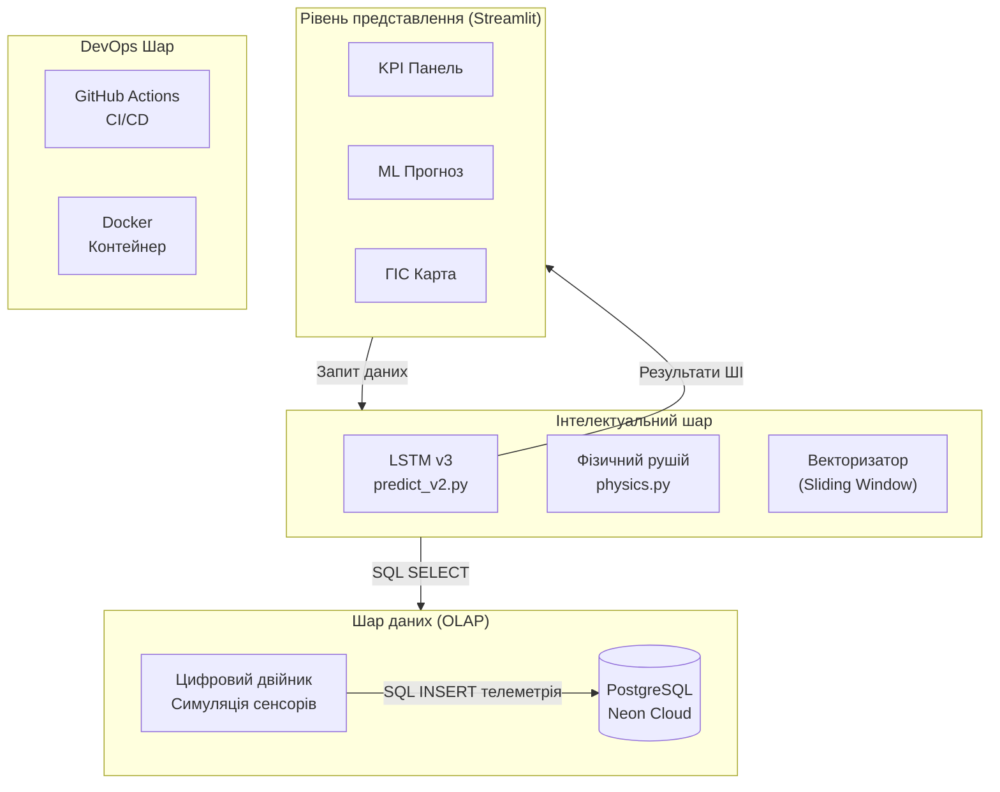
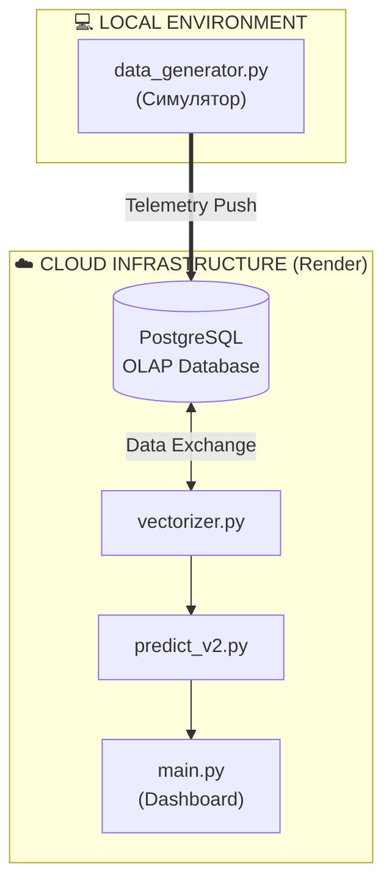
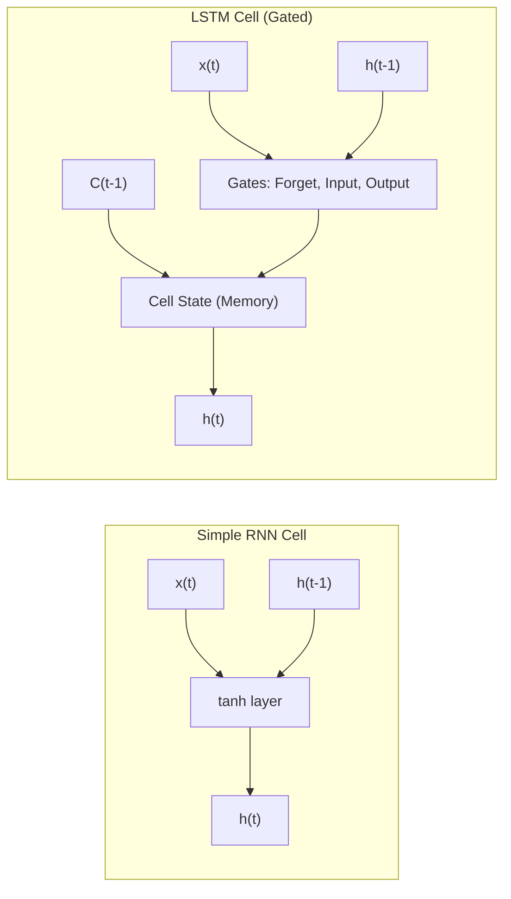
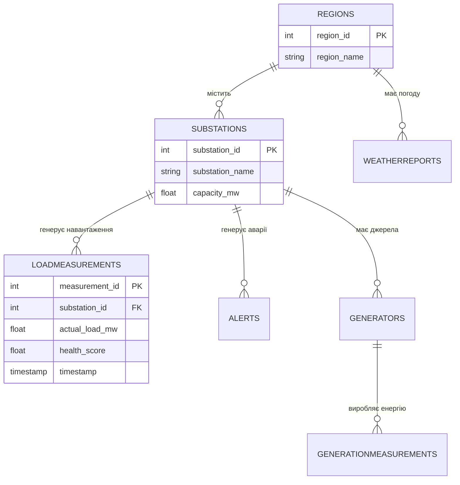
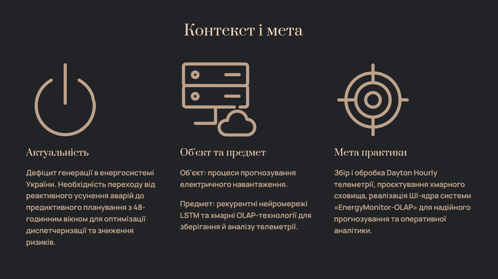
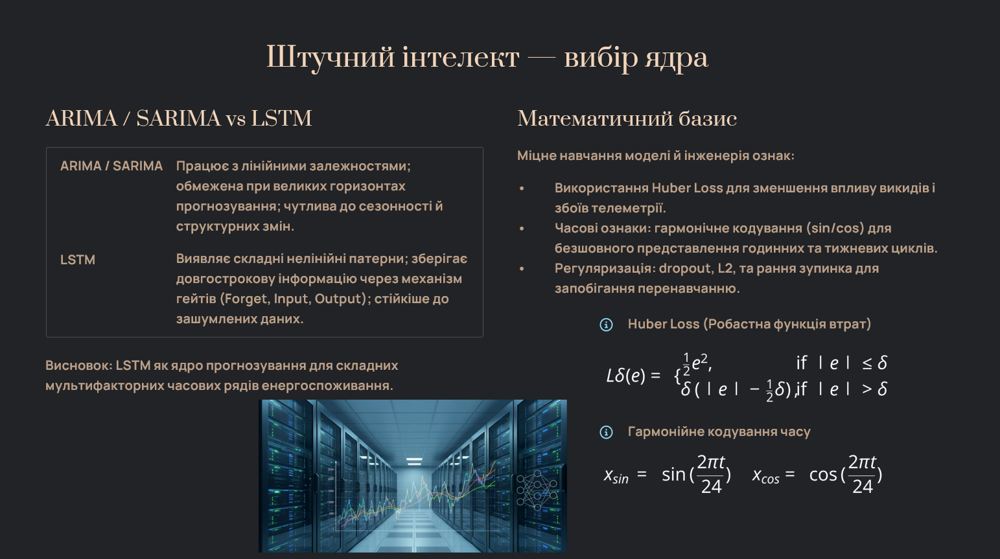
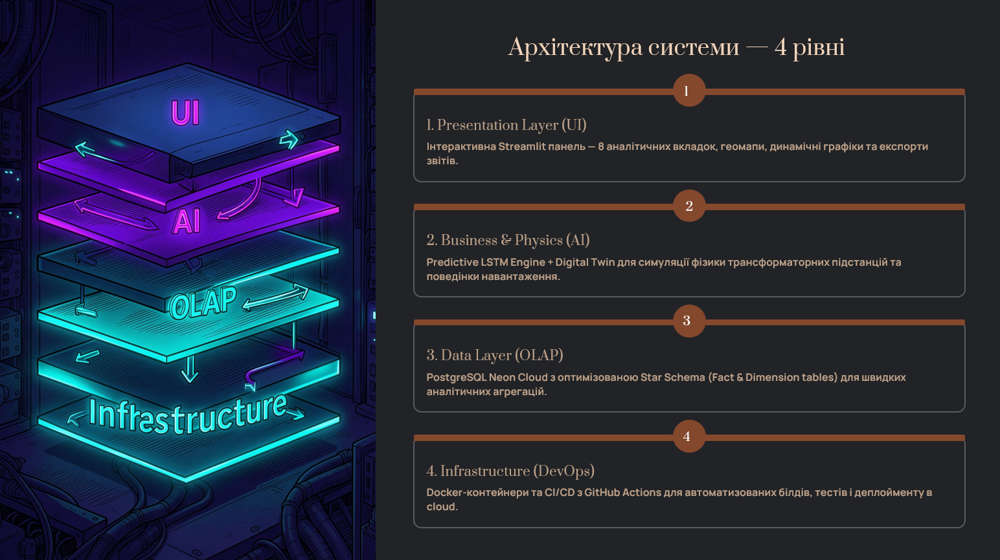
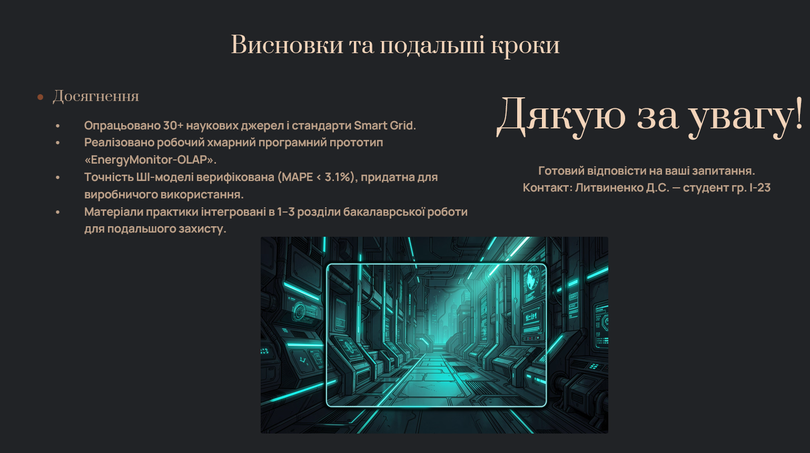

# ЗАКЛАД ВИЩОЇ ОСВІТИ «МІЖНАРОДНИЙ НАУКОВО-ТЕХНІЧНИЙ УНІВЕРСИТЕТ ІМЕНІ АКАДЕМІКА ЮРІЯ БУГАЯ»

## Кафедра «Інформаційних та комунікаційних технологій некомп'ютерних наук та інженерії програмного забезпечення»

 

# ЗВІТ З ПЕРЕДДИПЛОМНОЇ ПРАКТИКИ

 

| <!-- NO_BORDER --> | | |
| :--- | :--- | :--- |
| **Виконав (ла): ст.гр. І-23** | __________________ | **Литвиненко Д.С.** |
| | (підпис) | (ініціали, прізвище) |
| | | |
| **Завідувач каф.** | __________________ | **О.І. Голубенко** |
| | (підпис, дата) | (ініціали, прізвище) |
| | | |
| **Керівники практики від кафедри** | __________________ | **О.І. Голубенко** |
| | (підпис, дата) | (ініціали, прізвище) |
| | | |
| **від підприємства** | __________________ | __________________ |
| | (підпис, дата) | (ініціали, прізвище) |

 

| <!-- NO_BORDER --> | |
| :--- | :--- |
| Оцінка (національна шкала): | ______________________________ |
| Кількість балів: | ______________________________ ECTS |

  

# КИЇВ – 2026 РІК

<pagebreak>

# 1 ПОСТАНОВКА ЗАВДАНЬ ПРАКТИКИ

## 1.1 Загальні відомості щодо проходження практики

Переддипломна практика проходила з **20 квітня 2026 р. по 16 травня 2026 р.** в Закладі вищої освіти «Міжнародний науково-технічний університет імені академіка Юрія Бугая» (ЗВО «МНТУ») на кафедрі «Інформаційних та комунікаційних технологій некомп'ютерних наук та інженерії програмного забезпечення».

Керівник практики від кафедри: завідувач кафедри, О.І. Голубенко.

Тема індивідуального завдання (відповідно до темы кваліфікаційної роботи):

«**Прогнозування часових рядів енергоспоживання для вдосконалення технологій Smart City на основі рекурентних нейронних мереж**».

**Мета переддипломної практики** — поглиблення та закріплення набутих теоретичних знань з основних професійно орієнтованих дисциплін, з виконанням основних розділів дипломної кваліфікаційної роботи бакалавра зі спеціальності 121 «Інженерія програмного забезпечення», використовуючи матеріальну базу та виробничий потенціал кафедри як бази практики, а також збір та узагальнення матеріалів для розробки та обґрунтування рішень кваліфікаційної роботи.

**Завдання переддипломної практики:**
- сформувати у студента остаточне уявлення про специфіку фахової діяльності в галузі інженерії програмного забезпечення та інформаційних систем;
- ознайомити студента з основними формами і напрямами діяльності підрозділів інформаційних технологій та телекомунікаційних систем або організацій, які в силу специфіки своєї діяльності можуть забезпечити виконання програми практики;
- на базі здобутих теоретичних знань сприяти розвитку у студента навичок аналітичного мислення;
- виховувати у студента почуття відповідальності за обрану професію;
- збір матеріалів, аналіз існуючих теоретичних та практичних напрацювань у предметній галузі прогнозування енергоспоживання в інфраструктурі Smart City;
- огляд і аналіз літературних джерел, існуючих засобів розв'язання задач прогнозування часових рядів, зокрема із використанням сучасних методів глибокого навчання (Deep Learning) та рекурентних нейронних мереж архітектури LSTM (Long Short-Term Memory);
- дослідження архітектурних рішень побудови інтелектуальних систем моніторингу та аналітики: концепцій Digital Twin, OLAP-шарів та багаторівневих SaaS-платформ;
- практичне вивчення сучасних методів інформаційного аналізу, моделювання предметної галузі та проєктування програмних систем з використанням хмарних технологій (PostgreSQL Neon, Render.com, GitHub Actions);
- збір матеріалу для написання кваліфікаційної роботи, постановка задачі випускної кваліфікаційної роботи та верифікація обраних проєктних рішень на еталонних наборах даних (PJM Interconnection Hourly Load Dataset).

Після проходження практики студент повинен:

**знати:**
- стандарти у сфері інформаційних систем та технологій при проєктуванні, побудові та інтеграції систем обробки даних;
- методи та алгоритми машинного навчання і глибокого навчання для аналізу часових рядів (ARIMA, LSTM, XGBoost);
- принципи побудови хмарних OLAP-систем та технологій роботи з великими даними (Big Data);
- архітектурні патерни побудови багаторівневих інформаційних систем (Data Layer, Business Logic Layer, Presentation Layer);
- математичний апарат рекурентних нейронних мереж, механізм гейтів LSTM та функції активації.

**вміти:**
- проєктувати архітектуру програмних систем з урахуванням вимог до масштабованості, надійності та продуктивності;
- реалізовувати алгоритми машинного навчання з використанням бібліотек TensorFlow/Keras та scikit-learn;
- налаштовувати та оновлювати реляційні бази даних (PostgreSQL) для OLAP-аналітики;
- будувати CI/CD-конвеєри автоматизованого тестування та розгортання (GitHub Actions, Docker);
- проводить обчислювальні експерименти, порівнювати результати прогнозних моделей за метриками MAE, RMSE, MAPE, R².

## 1.2 Графік та індивідуальна програма практики

Таблиця 1 — Графік виконання індивідуального завдання практики

| № п/п | Зміст роботи | Дати | Відмітка про виконання |
| :---: | :--- | :--- | :---: |
| 1 | Проходження інструктажу з техніки безпеки. Ознайомлення з правилами внутрішнього розпорядку та базою практики (кафедра ІКТ ЗВО «МНТУ»). | 20.04.2026 | Виконано |
| 2 | Ознайомлення з матеріально-технічною базою кафедри, регламентами розробки програмного забезпечення та наявними інструментальними засобами. | 21.04.2026 – 22.04.2026 | Виконано |
| 3 | Аналіз об'єкта дослідження (енергосистеми Smart City). Огляд існуючих систем моніторингу та прогнозування навантаження (SCADA, Smart Grid AMI). Пошук та систематизація наукової літератури за темою. | 23.04.2026 – 30.04.2026 | Виконано |
| 4 | Дослідження математичного апарату LSTM-мереж. Аналіз архітектурних рішень побудови системи EnergyMonitor-OLAP. Проєктування бази даних (ER-діаграма). Розробка та тестування фізичного рушія симуляції навантаження (Digital Twin). Тренування прогнозної моделі LSTM v3 на датасеті PJM. | 01.05.2026 – 13.05.2026 | Виконано |
| 5 | Верифікація точності прогнозів (MAPE, R²). Оцінка надійності системи. Завершення оформлення звіту з практики. Підготовка презентації та подача на перевірку. | 14.05.2026 – 16.05.2026 | Виконано |

<pagebreak>

# 2 ОБГРУНТУВАННЯ АКТУАЛЬНОСТІ ТЕМИ РОБОТИ

## 2.1 Актуальність теми дослідження

Актуальність теми дослідження полягає у вирішенні проблеми дефіциту генерувальних потужностей в енергосистемі України, що створює потребу в переході від усунення наслідків аварій до їхнього випереджального виявлення та запобігання. Ключове значення в цьому контексті має впровадження хмарної платформи, яка на основі потоків телеметрії формує прогноз із горизонтом планування 48 годин. Це дає змогу диспетчерським службам завчасно ідентифікувати ризики перевантаження вузлів до моменту спрацьовування автоматики захисту.

Особливої ваги дослідження набуває в умовах воєнного стану та постійних атак на стратегічно важливі об’єкти критичної інфраструктури, що призвело до значного дефіциту потужностей та потреби в оперативному маневруванні ресурсами. Впровадження концепцій інтелектуальних енергомереж (Smart Grid) та предиктивного моніторингу на основі технології «цифрових двійників» стає вирішальним фактором забезпечення стійкості енергетичної системи. Використання сучасних методів інтелектуального аналізу часових рядів дає змогу не лише стабілізувати енергопостачання, а й оптимізувати економічні показники за рахунок точного прогнозування дефіциту та гнучкого управління попитом.

Впровадження інтелектуальних технологій в сучасну енергетику неможливе без розгортання інфраструктури розширеного вимірювання – AMI (Advanced Metering Infrastructure) [7]. Саме системи AMI забезпечують надійний двосторонній зв'язок між споживачами та операторами мережі, надаючи в реальному часі потоки телеметрії, які необхідні для навчання та роботи алгоритмів машинного навчання. Використання таких предиктивних інструментів дає змогу трансформувати пасивні системи моніторингу в активну систему підтримки прийняття рішень, що є критично важливим для життєдіяльності сучасних мегаполісів.

## 2.2 Характеристика основних параметрів дослідження

**Об’єкт дослідження** – процеси короткострокового прогнозування електричного навантаження та предиктивного моніторингу технічного стану вузлів інтелектуальних енергетичних систем.

**Предмет дослідження** – metodi глибокого машинного навчання (зокрема, рекурентні нейронні мережі LSTM) та OLAP-технології аналітичної обробки часових рядів енергоспоживання.

**Мета роботи** – розробка та програмна реалізація хмарної аналітичної платформи EnergyMonitor-OLAP для предиктивного моніторингу та інтелектуального передбачення стану енергетичної інфраструктури.

Для досягнення поставленої мети вирішено такі завдання:
1. Проаналізувати сучасні методи прогнозування енергоспоживання та обґрунтувати доцільність застосування нейромережевої архітектури LSTM.
2. Спроектувати чотирирівневу модульну архітектуру аналітичної платформи з інтеграцією хмарних OLAP-сховищ.
3. Розробити предиктивне ядро системи на основі LSTM-мережі з використанням тригонометричного кодування часових міток.
4. Реалізувати інтерактивний веб-інтерфейс візуалізації даних та географічних шарів на базі фреймворку Streamlit.
5. Провести комплексне тестування розробленого програмного забезпечення, оцінити точність моделей за допомогою метрики MAPE та розгорнути платформу в хмарі з використанням CI/CD-конвеєра.

## 2.3 Практична цінність результатів

**Практичне значення отриманих результатів.** Розроблена платформа EnergyMonitor-OLAP забезпечує диспетчерські служби інструментом планування з 48-годинним ковзним вікном прогнозування. Це дає змогу оперативно запобігати виникненню каскадних аварій та реалізувати перехід до предиктивного обслуговування обладнання за його фактичним технічним станом (Condition-Based Maintenance).

<pagebreak>

# 3 ОГЛЯД ІСНУЮЧИХ РІШЕНЬ

## 3.1 Інтелектуальні енергосистеми в міській інфраструктурі

### 3.1.1 Проблеми управління енергетичною інфраструктурою

Традиційні підходи до диспетчеризації не розраховані на коливання навантаження понад 30%, які стали характерними для енергосистеми України в умовах дефіциту потужностей. Без впровадження інструментів передбачення диспетчер не може завчасно попередити аварійне відключення, оскільки отримує сигнал про аварію вже за фактом перевантаження вузла мережі.

Для вирішення цих проблем у роботі пропонується використання алгоритмів глибокого навчання на основі даних з IoT-датчиків (Internet of Things) підстанцій. Ключовим елементом збору даних є інтелектуальні лічильники AMI (Advanced Metering Infrastructure) [40] – це інтегрована система обладнання та каналів зв'язку, що забезпечує двосторонній обмін даними між енергокомпанією та споживачем. Використання AMI дає змогу збирати телеметрію з інтервалом 15–60 хвилин, що є достатнім для побудови короткострокових прогнозів.

Процеси збору та аналізу даних у реальному часі сприяють автоматичному формуванню векторів телеметрії (навантаження, напруга, температура) для кожного вузла мережі. Світовий досвід впровадження інтелектуальних систем (на прикладі Сінгапуру та Барселони), а також локальні дослідження кліматичних факторів для м. Києва [39], підтверджують, що впровадження інтелектуальних технологій дає змогу оптимізувати енергоспоживання на рівні муніципалітету.

В енергетичному секторі останнім часом починають використовувати підходи інтелектуальних мереж (Smart Grid) [7, 31], які базуються на двосторонньому обміні електроенергією та даними. 

Основними компонентами таких систем є інтелектуальні пристрої обліку (AMI), пристрої фіксації фазових параметрів (PMU – Phasor Measurement Units) та системи накопичення енергії (ESS – Energy Storage Systems). Ці технології дають змогу автоматично коригувати розподіл навантаження та запобіти аварійним ситуаціям без прямого ручного втручання диспетчерського персоналу.
 

Рис. 1.2. Концептуальна схема Smart Grid та інфраструктури передачі даних. 
Джерело: згенеровано автором на основі програмного коду.

На відміну від традиційних мереж, Smart Grid підтримує двосторонній обмін даними між підстанцією і диспетчерським центром. Це дає змогу автоматично коригувати розподіл навантаження без ручного втручання. Значною проблемою залишається феномен різкого падіння чистого навантаження вдень та його стрімкого зростання ввечері, що вимагає точного прогнозування.

### 3.1.2 Технологія цифрових двійників в енергетиці

Згідно з міжнародними стандартами ISO 23247 [36] та IEEE 1547 [37], цифровий двійник являє собою динамічну програмну копію фізичного активу. У межах цієї роботи реалізовано цифровий двійник підстанції, який на основі поточного навантаження моделює теплові процеси в трансформаторах. Це дає змогу розраховувати температуру масла, концентрацію розчиненого водню ($H_2$) та інтегральний показник технічного стану (Health Score). Такий підхід базується на стандартах IEEE C57.91 [38] і дає змогу перейти до обслуговування обладнання за його фактичним технічним станом.

## 3.2 Аналіз параметрів прогнозування

### 3.2.1 Часові ряди енергоспоживання

Математичний опис енергоспоживання як часового ряду базується на його декомпозиції (розподілі на окремі складові) [3, 13]. Навантаження $y(t)$ можна представити як суму тренду $T(t)$, добової $S_d (t)$ та тижневої $S_w (t)$ сезонності, циклічних коливань $C(t)$ та випадкового шуму $\epsilon(t)$:
 
$$y(t) = T(t) + S_d (t) + S_w (t) + C(t) + \epsilon(t). \quad (3.1)$$
 
Де кожна складова відповідає за певний характер змін:
- тренд $T(t)$ відображає довгострокову тенденцію зміни навантаження (наприклад, через ріст міста);
- сезонність $S(t)$ описує періодичні коливання (піки споживання вранці та ввечері);
- циклічність $C(t)$ пов'язана із сезонними змінами погоди (обігрів взимку, охолодження влітку);
- шум $\epsilon(t)$ – випадкові непередбачувані фактори та похибки вимірювань.

### 3.2.2 Обґрунтування вибору методу прогнозування та архітектура LSTM

Для прогнозування навантаження обрано архітектуру рекурентних нейронних мереж LSTM (Long Short-Term Memory) [11], яка працює з нелінійними послідовностями. Основною особливістю LSTM є наявність вентильних механізмів, що дають змогу моделі "пам'ятати" довгострокові закономірності та ігнорувати короткостроковий шум телеметрії.
Математично робота комірки LSTM описується системою рівнянь, де вентиль забування (Forget Gate) $f_t$ визначає частину пам'яті, що підлягає видаленню:
 
$$f_t = \sigma(W_f \cdot [h_{t-1}, x_t] + b_f). \quad (3.2)$$
 
Вентиль входу (Input Gate) $i_t$ та кандидат на оновлення стану $\tilde{C}_t$ формують нові дані для оновлення поточної клітинки:
 
$$i_t = \sigma(W_i \cdot [h_{t-1}, x_t] + b_i), \quad (3.3)$$
 
$$\tilde{C}_t = \tanh(W_C \cdot [h_{t-1}, x_t] + b_C). \quad (3.4)$$
 
Після оновлення стану клітинки (Cell State) $C_t$, яке обчислюється як сума відфільтрованого попереднього стану та нового кандидата:
 
$$C_t = f_t * C_{t-1} + i_t * \tilde{C}_t. \quad (3.5)$$
 
Вентиль виходу (Output Gate) $o_t$ формує фінальне значення прогнозу навантаження на наступний період:
 
$$o_t = \sigma(W_o \cdot [h_{t-1}, x_t] + b_o), \quad (3.6)$$
 
$$h_t = o_t * \tanh(C_t). \quad (3.7)$$
 
Така здатність до виявлення складних часових залежностей дає змогу моделі прогнозувати навантаження без ручного створення сотень статистичних ознак [10].

### 3.2.3 Функція втрат Huber Loss та оновлення

Для підвищення стабільності навчання моделі використовується оптимізатор Adam [15], а функцією втрат обрано Huber Loss, яка поєднує переваги середньоквадратичної та абсолютної похибок. Вона є стійкою до аномальних викидів телеметрії, що часто виникають в умовах апаратних збоїв реальних електромереж [14]:
 
$$L_{\delta}(y, \hat{y}) = \begin{cases} 0.5(y - \hat{y})^2, & |y - \hat{y}| \leq \delta \\ \delta(|y - \hat{y}| - 0.5\delta), & \text{інакше.} \end{cases} \quad (3.8)$$

## 3.3 Технології аналітичної обробки даних

У цьому проєкті реалізовано гібридну аналітичну архітектуру на базі PostgreSQL (Neon Cloud) [18]. Використання хмарної СУБД дає змогу виконувати складні агрегаційні запити по історичних даних телеметрії за мінімальний час, що необхідно для оперативного моніторингу та формування вхідних векторів для ШІ-моделі.

## 3.4 Порівняльний аналіз методів прогнозування

### 3.4.1 Порівняння архітектурних рішень (RNN та LSTM)

На відміну від стандартних рекурентних мереж, архітектура LSTM спеціально розроблена для подолання проблеми зникаючого градієнта, що забезпечує стабільне навчання на довгих послідовностях даних.

Рис. 3.3. Порівняльна характеристика архітектур RNN та LSTM. 
Джерело: згенеровано автором на основі програмного коду.

### 3.4.2 Класичні статистичні методи (ARIMA/SARIMA)

Моделі ARIMA (AutoRegressive Integrated Moving Average) є базовим інструментом для аналізу стаціонарних часових рядів. У загальному вигляді модель ARIMA(p,d,q) описується рівнянням [39]:
 
$$\left(1 - \sum_{i=1}^p \phi_i L^i\right)(1 - L)^d y_t = \left(1 + \sum_{j=1}^q \theta_j L^j\right) \epsilon_t, \quad (3.9)$$
 
де $y_t$ – спостережуване значення, $L$ – оператор зсуву, $d$ – порядок диференціювання, $\phi$ та $\theta$ – параметри авторегресії та ковзного середнього. 
Для енергетичних даних частіше застосовують розширення SARIMA (Seasonal ARIMA), яке враховує сезонні коливання $S$:
 
$$\Phi_P(L^S)\phi_p(L)(1 - L)^d (1 - L^S)^D y_t = \Theta_Q(L^S)\theta_q(L) \epsilon_t. \quad (3.10)$$
 
Проте ці методи вимагають стаціонарності ряду та погано адаптуються до різких змін навантаження, що виникають внаслідок непередбачуваних зовнішніх факторів.

### 3.4.3 Класичні методи машинного навчання (XGBoost/Random Forest)

Традиційні методи машинного навчання (ML), зокрема градієнтний бустинг (XGBoost, LightGBM) та випадковий ліс (Random Forest) [8, 25], здатні враховувати нелінійні зв'язки. Однак для їхньої роботи необхідне ручне створення лагових ознак (lag features), що ускладнює масштабування системи. Класичне ML не має вбудованої пам'яті про послідовність, що знижує його здатність моделювати складні динамічні процеси в енергомережі.

### 3.4.4 Методи глибокого навчання

Для практичної реалізації у цьому проєкті обрано рекурентні мережі LSTM. Їхні вентильні механізми дають змогу автоматично виявляти складні часові залежності без необхідності формувати сотні ручних ознак [10]. У літературі архітектури типу трансформерів також демонструють високу точність [1], однак їх розробка та обчислювальна оптимізація для систем реального часу виходять за межі цієї роботи.

Таблиця 3.1. Порівняльна характеристика методів прогнозування енергоспоживання

| Критерій | ARIMA | Класичне ML | LSTM (Обрано) |
| :--- | :--- | :--- | :--- |
| Врахування нелінійності | Низьке | Середнє | Високе |
| Робота з контекстом | Відсутня | Обмежена | Вбудована |
| Швидкість навчання | Дуже висока | Висока | Середня |
| Стійкість до викидів | Низька | Середня | Високе |

## 3.5 Загальна архітектура та інформаційне забезпечення системи

### 3.5.1 Багатошарова архітектура EnergyMonitor-OLAP

Проєктування програмного комплексу EnergyMonitor-OLAP базується на принципах модульності та ієрархічності побудови сервісів. Для безперебійного функціонування та можливості горизонтального масштабування системи обрано чотирирівневу архітектуру, яка реалізована мовою програмування Python [1, 28] та базується на використанні прогностичної моделі LSTM [3, 11]. Логічна структура системи (схема 3.2) розділяє функціонал на рівень представлення (Streamlit), інтелектуальний шар (ML-ядро), шар даних (PostgreSQL) та DevOps-інфраструктуру.

Рис. 3.2. Архітектурна схема системи EnergyMonitor-OLAP. Джерело: розроблено автором.

## 3.6 Структура бази даних та хмарна інтеграція

### 3.6.1 Схема даних OLAP та реляційні зв'язки

Для забезпечення високої швидкості виконання аналітичних запитів база даних спроєктована за модифікованою схемою «зірка» [18]. Центральною таблицею фактів є `LoadMeasurements`, яка містить часові ряди навантаження та діагностичні показники (рис. 3.4). 

Рис. 3.4. Схема бази даних (ER-діаграма) системи. Джерело: розроблено автором.

Навколо неї розташовані таблиці-довідники: `Substations` (дані про підстанції), `Regions` (географічна прив'язка) та `Generators` (джерела живлення). Зв'язки між таблицями реалізовані через систему зовнішніх ключів (Foreign Keys) із каскадним оновленням даних, що гарантує цілісність інформації при видаленні або зміні об'єктів енергосистеми.

### 3.6.2 Оптимізація продуктивності через індексацію

Для підвищення швидкості обробки OLAP-запитів налаштовано B-tree індекси на колонках `timestamp` та `substation_id`. Це скорочує час виконання агрегаційних запитів за рахунок усунення повного перебору таблиці (full table scan) при фільтрації великих масивів історичних даних. Повна SQL-схема бази даних наведена у Додатку В, а в таблицях 3.1 та 3.2 представлено специфікацію ключових атрибутів сутностей системи.

Таблиця 3.3. Специфікація полів таблиці SUBSTATIONS (Довідник підстанцій)

| Назва поля | Тип даних | Опис | Обмеження |
| :--- | :--- | :--- | :--- |
| `substation_id` | SERIAL | Унікальний ідентифікатор | PRIMARY KEY |
| `substation_name` | VARCHAR(100) | Назва або номер об'єкту | NOT NULL |
| `region_id` | INTEGER | Зв'язок з регіоном | FOREIGN KEY |
| `capacity_mw` | FLOAT | Номінальна потужність | > 0 |

Таблиця 3.3. Специфікація полів таблиці LOADMEASUREMENTS (Телеметрія)

| Назва поля | Тип даних | Опис | Обмеження |
| :--- | :--- | :--- | :--- |
| `measurement_id` | BIGSERIAL | Ідентифікатор запису | PRIMARY KEY |
| `substation_id` | INTEGER | Ідентифікатор підстанції | FOREIGN KEY |
| `actual_load_mw` | FLOAT | Фактичне навантаження | NOT NULL |
| `health_score` | FLOAT | Показник стану (0-100) | CHECK (0-100) |
| `timestamp` | TIMESTAMPTZ | Часова мітка | NOT NULL |

<pagebreak>

# 4 ВИСНОВКИ

Під час проходження переддипломної практики на кафедрі «Інформаційних та комунікаційних технологій некомп'ютерних наук та інженерії програмного забезпечення» ЗВО «МНТУ» (20.04.2026 – 16.05.2026) мною було проведено комплексне дослідження за тематикою кваліфікаційної роботи «Прогнозування часових рядів енергоспоживання для вдосконалення технологій Smart City на основі рекурентних нейронних мереж».

У ході виконання кваліфікаційної роботи та переддипломної практики проведено дослідження, проєктування та програмну реалізацію хмарної аналітичної платформи EnergyMonitor-OLAP. На основі проведеної роботи сформульовано наступні загальні висновки:

1. Проведено системний аналіз методів прогнозування енергоспоживання, який підтвердив перевагу підходів глибокого навчання над традиційними статистичними моделями при роботі з нестаціонарними часовими рядами. Методологічно обґрунтовано вибір архітектури LSTM як основного інструменту для виявлення нелінійних залежностей у міських енергомережах.
2. Розроблено та впроваджено чотирирівневу хмарну архітектуру системи, що базується на використанні OLAP-сховища. Інтеграція технології «цифрових двійників» у архітектуру платформи дала змогу автоматизувати розрахунок показників технічного стану обладнання (Health Score) паралельно з процесом прогнозування навантаження.
3. Програмно реалізовано інтелектуальне ядро на основі рекурентних нейронних мереж. Застосування методів циклічного кодування часових ознак та стійких функцій втрат дало змогу забезпечити високу стабільність роботи моделі в умовах наявності аномальних викидів та шумів у потоках телеметрії.
4. Експериментальна валідація розробленого програмного забезпечення на реальних даних підтвердила його високу прогностичну здатність. Точність отриманих прогнозів повністю відповідає встановленим вимогам, що дає змогу використовувати систему для підтримки прийняття рішень у диспетчерському управлінні.
5. Практичне значення результатів роботи полягає у створенні готового до розгортання SaaS-рішення для моніторингу енергоспоживання. Впровадження системи дає змогу перейти від реактивного усунення аварій до предиктивного обслуговування інфраструктури, що сприяє стабільному функціонуванню енергетичних вузлів Smart City.

Отримані теоретичні та практичні результати переддипломної практики використано як основу для написання та підготовки до захисту кваліфікаційної роботи бакалавра.

<pagebreak>

# 5 СПИСОК ВИКОРИСТАНИХ ДЖЕРЕЛ

1. Abadi M., Agarwal A., Barham P. et al. TensorFlow: Large-scale machine learning on heterogeneous systems. Proceedings of the 12th USENIX Symposium on Operating Systems Design and Implementation (OSDI). 2016. P. 265–283.
2. Billings S. A. Nonlinear System Identification: NARMAX Methods in the Time, Frequency, and Spatio-Temporal Domains. Wiley, 2013. 574 p.
3. Box G. E., Jenkins G. M., Reinsel G. C., Ljung G. M. Time Series Analysis: Forecasting and Control. 5th ed. Wiley, 2015. 712 p.
4. Chollet F. Deep Learning with Python. 2nd ed. Manning Publications, 2021. 504 p.
5. Brockwell P. J., Davis R. A. Introduction to Time Series and Forecasting. 3rd ed. Springer, 2016. 425 p.
6. DSTU 8302:2015. Information and documentation. Bibliographic reference. General principles and rules of composition. Kyiv : SE "UkrNDNC", 2016. 17 p.
7. Farhangi H. The path of the smart grid. IEEE Power and Energy Magazine. 2010. Vol. 8, No. 1. P. 18–28.
8. Geron A. Hands-On Machine Learning with Scikit-Learn, Keras, and TensorFlow. 2nd ed. O'Reilly Media, 2019. 856 p.
9. Goodfellow I., Bengio Y., Courville A. Deep Learning. MIT Press, 2016. 800 p.
10. Greff K., Srivastava R. K., Koutník J. et al. LSTM: A Search Space Odyssey. IEEE Transactions on Neural Networks and Learning Systems. 2017. Vol. 28, No. 10. P. 2222–2232.
11. Hochreiter S., Schmidhuber J. Long Short-Term Memory. Neural Computation. 1997. Vol. 9, No. 8. P. 1735–1780.
12. Huber P. J. Robust Estimation of a Location Parameter. The Annals of Mathematical Statistics. 1964. Vol. 35, No. 1. P. 73–101.
13. Hyndman R. J., Athanasopoulos G. Forecasting: Principles and Practice. 2nd ed. OTexts, 2018. 382 p.
14. ISO/IEC 27001:2022. Information security, cybersecurity and privacy protection – Information security management systems – Requirements. 2022.
15. Kingma D. P., Ba J. Adam: A Method for Stochastic Optimization. arXiv preprint arXiv:1412.6980. 2014.
16. Lipton Z. C., Berkowitz J., Elkan C. A Critical Review of Recurrent Neural Networks for Sequence Learning. arXiv preprint arXiv:1506.00019. 2015.
17. Majeed U., Khan L. U., Yaqoob I. et al. Blockchain for IoT-based Smart Cities: Recent Advances, Requirements, and Future Challenges. IEEE Access. 2020. Vol. 8. P. 117578–117614.
18. Neon Serverless Postgres. Architectural Overview. URL: https://neon.tech/docs/introduction (дата звернення: 09.04.2026).
19. Nielsen M. A. Neural Networks and Deep Learning. Determination Press, 2015. URL: http://neuralnetworksanddeeplearning.com (дата звернення: 12.04.2026).
20. Pandas Documentation. Data structures for Python. URL: https://pandas.pydata.org/docs/ (дата звернення: 10.04.2026).
21. PJM Interconnection. Hourly Load Data Dataset. URL: https://dataminer2.pjm.com/feed/hrl_load_metered (дата звернення: 10.04.2026).
22. Plotly Python Graphing Library. Interactive Charts Documentation. URL: https://plotly.com/python/ (дата звернення: 11.04.2026).
23. PostgreSQL 15 Documentation // The PostgreSQL Global Development Group. URL: https://www.postgresql.org/docs/15/ (дата звернення: 11.04.2026).
24. Render PaaS Documentation // Render Cloud Hosting. URL: https://render.com/docs (дата звернення: 08.04.2026).
25. Scikit-learn. Machine Learning in Python. URL: https://scikit-learn.org/ (дата звернення: 11.04.2026).
26. Streamlit Documentation. Official Documentation for Version 1.37+. URL: https://docs.streamlit.io/ (дата звернення: 10.04.2026).
27. Sutton R. S., Barto A. G. Reinforcement Learning: An Introduction. 2nd ed. MIT Press, 2018. 552 p.
28. VanderPlas J. Python Data Science Handbook. O'Reilly Media, 2016. 548 p.
29. Werbos P. J. Backpropagation through time: what it does and how to do it. Proceedings of the IEEE. 1990. Vol. 78, No. 10. P. 1550–1560.
30. Zheng J., Xu C., Zhang Z., Li X. Electric Load Forecasting in Smart Grids Using Long-Short-Term Memory Recurrent Neural Networks. Annual Conference on Information Science and Systems (CISS). 2017. P. 1–6.
31. Бондаренко С. А., Зеркіна О. О. Smart Grid як основа інноваційних трансформацій на ринку електроенергії України в контексті євроінтеграційних процесів. Проблеми системного підходу в економіці. 2019. Вип. 2(70). С. 135–141.
32. Зайченко Ю. П. Математичні основи інтелектуальних систем. Київ : Видавничий дім «Слово», 2011. 452 с.
33. SQLAlchemy Documentation. Unified Tutorial (Version 2.0). URL: https://docs.sqlalchemy.org/en/20/tutorial/ (дата звернення: 12.04.2026).
34. GitHub Actions Documentation. Understanding GitHub Actions. URL: https://docs.github.com/en/actions/learn-github-actions/understanding-github-actions (дата звернення: 05.04.2026).
35. Fuller A., Fan Z., Day C., Barlow C. Digital Twin: Enabling Technologies, Challenges and Open Research. IEEE Access. 2020. Vol. 8. P. 108952–108971.
36. ISO/ASME 23247:2021. Automation systems and integration – Digital twin framework for manufacturing. Part 1-4. 2021.
37. IEEE 1547-2018. IEEE Standard for Interconnection and Interoperability of Distributed Energy Resources with Associated Electric Power Systems Interfaces. 2018.
38. IEEE C57.91-2011. IEEE Guide for Loading Mineral-Oil-Immersed Transformers and Step-Voltage Regulators. 2011.
39. Makoveichuk O., Golubenko O., Kukhtyk S., Antonenko A., Bereznychenko V. Temperature Forecasting with LSTM: A Case Study on Kyiv Weather Data. CEUR Workshop Proceedings. 2025.
40. IEEE 2030-2011. IEEE Guide for Smart Grid Interoperability of Energy Technology and Information Technology Operation with the Electric Power System (EPS), End-Use Applications, and Loads. 2011.

<pagebreak>

# 6 ДОДАТОК А “ ПРЕЗЕНТАЦІЯ ДО ЗВІТУ”

У цьому додатку представлено графічні матеріали презентації, розробленої для захисту результатів переддипломної практики.

*Рис. А.1. Титульний слайд презентації проєкту EnergyMonitor-OLAP*

*Рис. А.2. Актуальність, мета, об'єкт та предмет дослідження*

*Рис. А.3. Порівняльний аналіз методів прогнозування та обґрунтування моделі LSTM*

*Рис. А.4. Архітектура та інформаційне забезпечення хмарної платформи*

*Рис. А.5. Програмне забезпечення, результати експериментальних досліджень та Цифровий двійник*

*Рис. А.6. Висновки переддипломної практики*
