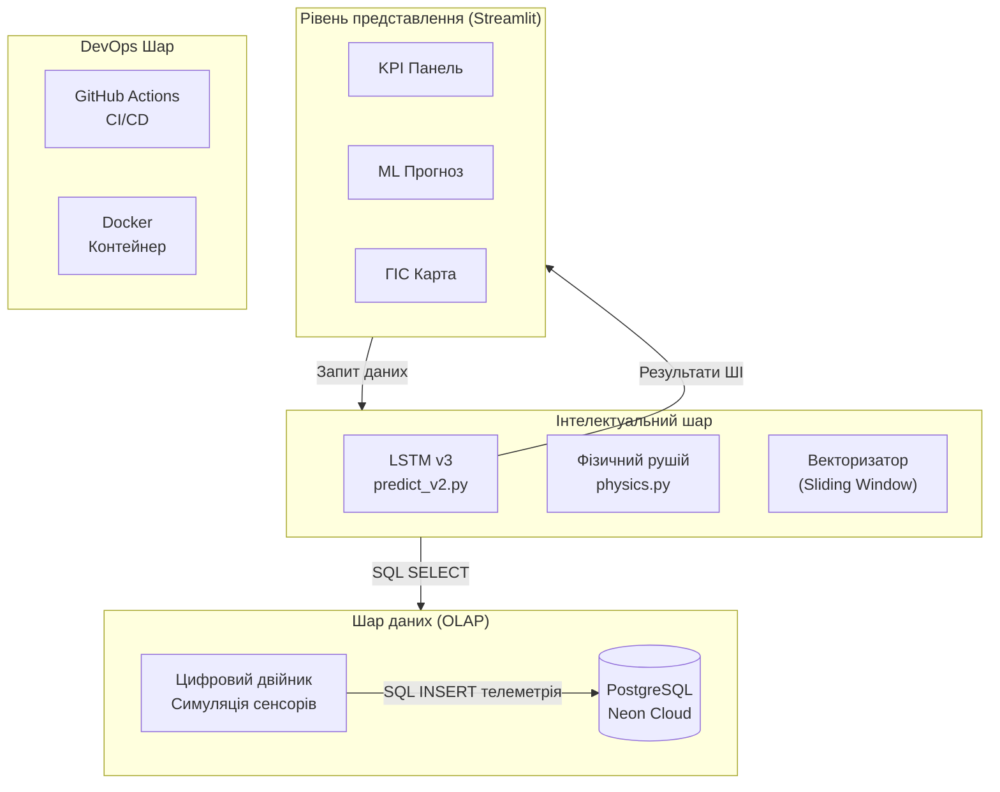
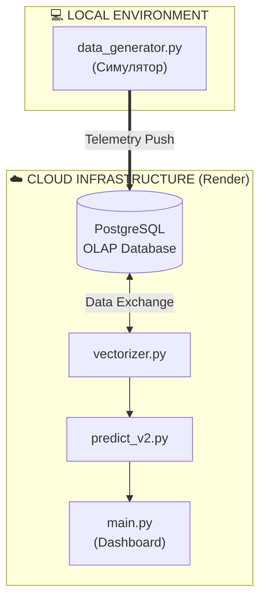
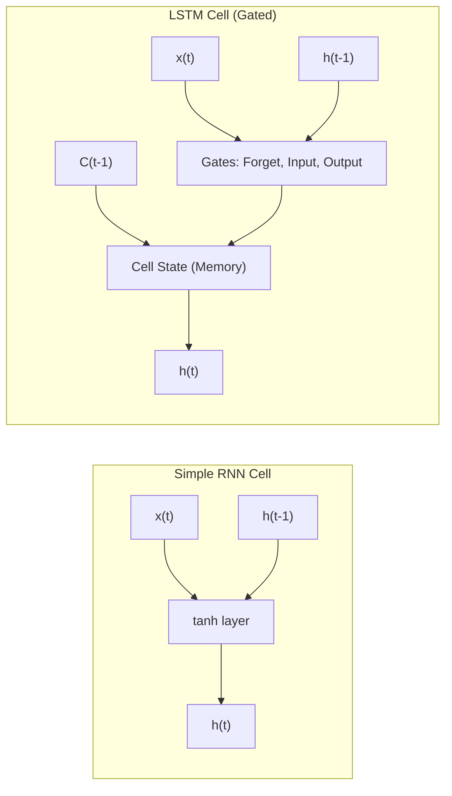
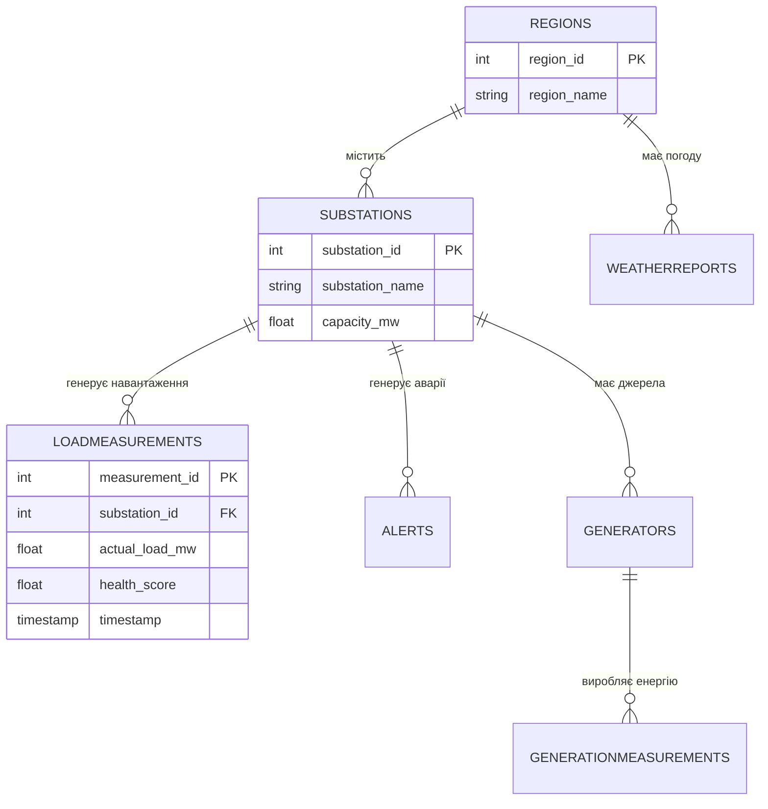

# 3 ОГЛЯД ІСНУЮЧИХ РІШЕНЬ

## 3.1 Інтелектуальні енергосистеми в міській інфраструктурі

### 3.1.1 Проблеми управління енергетичною інфраструктурою

Традиційні підходи до диспетчеризації не розраховані на коливання навантаження понад 30%, які стали характерними для енергосистеми України в умовах дефіциту потужностей. Без впровадження інструментів передбачення диспетчер не може завчасно попередити аварійне відключення, оскільки отримує сигнал про аварію вже за фактом перевантаження вузла мережі.

Для вирішення цих проблем у роботі пропонується використання алгоритмів глибокого навчання на основі даних з IoT-датчиків (Internet of Things) підстанцій. Ключовим елементом збору даних є інтелектуальні лічильники AMI (Advanced Metering Infrastructure) [40] – це інтегрована система обладнання та каналів зв'язку, що забезпечує двосторонній обмін даними між енергокомпанією та споживачем. Використання AMI дає змогу збирати телеметрію з інтервалом 15–60 хвилин, що є достатнім для побудови короткострокових прогнозів.

Процеси збору та аналізу даних у реальному часі сприяють автоматичному формуванню векторів телеметрії (навантаження, напруга, температура) для кожного вузла мережі. Світовий досвід впровадження інтелектуальних систем (на прикладі Сінгапуру та Барселони), а також локальні дослідження кліматичних факторів для м. Києва [39], підтверджують, що впровадження інтелектуальних технологій дає змогу оптимізувати енергоспоживання на рівні муніципалітету.

В енергетичному секторі останнім часом починають використовувати підходи інтелектуальних мереж (Smart Grid) [7, 31], які базуються на двосторонньому обміні електроенергією та даними. 

Основними компонентами таких систем є інтелектуальні пристрої обліку (AMI), пристрої фіксації фазових параметрів (PMU – Phasor Measurement Units) та системи накопичення енергії (ESS – Energy Storage Systems). Ці технології дають змогу автоматично коригувати розподіл навантаження та запобіти аварійним ситуаціям без прямого ручного втручання диспетчерського персоналу.
 

Рис. 1.2. Концептуальна схема Smart Grid та інфраструктури передачі даних. 
Джерело: згенеровано автором на основі програмного коду.

На відміну від традиційних мереж, Smart Grid підтримує двосторонній обмін даними між підстанцією і диспетчерським центром. Це дає змогу автоматично коригувати розподіл навантаження без ручного втручання. Значною проблемою залишається феномен різкого падіння чистого навантаження вдень та його стрімкого зростання ввечері, що вимагає точного прогнозування.

### 3.1.2 Технологія цифрових двійників в енергетиці

Згідно з міжнародними стандартами ISO 23247 [36] та IEEE 1547 [37], цифровий двійник являє собою динамічну програмну копію фізичного активу. У межах цієї роботи реалізовано цифровий двійник підстанції, який на основі поточного навантаження моделює теплові процеси в трансформаторах. Це дає змогу розраховувати температуру масла, концентрацію розчиненого водню ($H_2$) та інтегральний показник технічного стану (Health Score). Такий підхід базується на стандартах IEEE C57.91 [38] і дає змогу перейти до обслуговування обладнання за його фактичним технічним станом.

## 3.2 Аналіз параметрів прогнозування

### 3.2.1 Часові ряди енергоспоживання

Математичний опис енергоспоживання як часового ряду базується на його декомпозиції (розподілі на окремі складові) [3, 13]. Навантаження $y(t)$ можна представити як суму тренду $T(t)$, добової $S_d (t)$ та тижневої $S_w (t)$ сезонності, циклічних коливань $C(t)$ та випадкового шуму $\epsilon(t)$:
 
$$y(t) = T(t) + S_d (t) + S_w (t) + C(t) + \epsilon(t). \quad (3.1)$$
 
Де кожна складова відповідає за певний характер змін:
- тренд $T(t)$ відображає довгострокову тенденцію зміни навантаження (наприклад, через ріст міста);
- сезонність $S(t)$ описує періодичні коливання (піки споживання вранці та ввечері);
- циклічність $C(t)$ пов'язана із сезонними змінами погоди (обігрів взимку, охолодження влітку);
- шум $\epsilon(t)$ – випадкові непередбачувані фактори та похибки вимірювань.

### 3.2.2 Обґрунтування вибору методу прогнозування та архітектура LSTM

Для прогнозування навантаження обрано архітектуру рекурентних нейронних мереж LSTM (Long Short-Term Memory) [11], яка працює з нелінійними послідовностями. Основною особливістю LSTM є наявність вентильних механізмів, що дають змогу моделі "пам'ятати" довгострокові закономірності та ігнорувати короткостроковий шум телеметрії.
Математично робота комірки LSTM описується системою рівнянь, де вентиль забування (Forget Gate) $f_t$ визначає частину пам'яті, що підлягає видаленню:
 
$$f_t = \sigma(W_f \cdot [h_{t-1}, x_t] + b_f). \quad (3.2)$$
 
Вентиль входу (Input Gate) $i_t$ та кандидат на оновлення стану $\tilde{C}_t$ формують нові дані для оновлення поточної клітинки:
 
$$i_t = \sigma(W_i \cdot [h_{t-1}, x_t] + b_i), \quad (3.3)$$
 
$$\tilde{C}_t = \tanh(W_C \cdot [h_{t-1}, x_t] + b_C). \quad (3.4)$$
 
Після оновлення стану клітинки (Cell State) $C_t$, яке обчислюється як сума відфільтрованого попереднього стану та нового кандидата:
 
$$C_t = f_t * C_{t-1} + i_t * \tilde{C}_t. \quad (3.5)$$
 
Вентиль виходу (Output Gate) $o_t$ формує фінальне значення прогнозу навантаження на наступний період:
 
$$o_t = \sigma(W_o \cdot [h_{t-1}, x_t] + b_o), \quad (3.6)$$
 
$$h_t = o_t * \tanh(C_t). \quad (3.7)$$
 
Така здатність до виявлення складних часових залежностей дає змогу моделі прогнозувати навантаження без ручного створення сотень статистичних ознак [10].

### 3.2.3 Функція втрат Huber Loss та оновлення

Для підвищення стабільності навчання моделі використовується оптимізатор Adam [15], а функцією втрат обрано Huber Loss, яка поєднує переваги середньоквадратичної та абсолютної похибок. Вона є стійкою до аномальних викидів телеметрії, що часто виникають в умовах апаратних збоїв реальних електромереж [14]:
 
$$L_{\delta}(y, \hat{y}) = \begin{cases} 0.5(y - \hat{y})^2, & |y - \hat{y}| \leq \delta \\ \delta(|y - \hat{y}| - 0.5\delta), & \text{інакше.} \end{cases} \quad (3.8)$$

## 3.3 Технології аналітичної обробки даних

У цьому проєкті реалізовано гібридну аналітичну архітектуру на базі PostgreSQL (Neon Cloud) [18]. Використання хмарної СУБД дає змогу виконувати складні агрегаційні запити по історичних даних телеметрії за мінімальний час, що необхідно для оперативного моніторингу та формування вхідних векторів для ШІ-моделі.

## 3.4 Порівняльний аналіз методів прогнозування

### 3.4.1 Порівняння архітектурних рішень (RNN та LSTM)

На відміну від стандартних рекурентних мереж, архітектура LSTM спеціально розроблена для подолання проблеми зникаючого градієнта, що забезпечує стабільне навчання на довгих послідовностях даних.

Рис. 3.3. Порівняльна характеристика архітектур RNN та LSTM. 
Джерело: згенеровано автором на основі програмного коду.

### 3.4.2 Класичні статистичні методи (ARIMA/SARIMA)

Моделі ARIMA (AutoRegressive Integrated Moving Average) є базовим інструментом для аналізу стаціонарних часових рядів. У загальному вигляді модель ARIMA(p,d,q) описується рівнянням [39]:
 
$$\left(1 - \sum_{i=1}^p \phi_i L^i\right)(1 - L)^d y_t = \left(1 + \sum_{j=1}^q \theta_j L^j\right) \epsilon_t, \quad (3.9)$$
 
де $y_t$ – спостережуване значення, $L$ – оператор зсуву, $d$ – порядок диференціювання, $\phi$ та $\theta$ – параметри авторегресії та ковзного середнього. 
Для енергетичних даних частіше застосовують розширення SARIMA (Seasonal ARIMA), яке враховує сезонні коливання $S$:
 
$$\Phi_P(L^S)\phi_p(L)(1 - L)^d (1 - L^S)^D y_t = \Theta_Q(L^S)\theta_q(L) \epsilon_t. \quad (3.10)$$
 
Проте ці методи вимагають стаціонарності ряду та погано адаптуються до різких змін навантаження, що виникають внаслідок непередбачуваних зовнішніх факторів.

### 3.4.3 Класичні методи машинного навчання (XGBoost/Random Forest)

Традиційні методи машинного навчання (ML), зокрема градієнтний бустинг (XGBoost, LightGBM) та випадковий ліс (Random Forest) [8, 25], здатні враховувати нелінійні зв'язки. Однак для їхньої роботи необхідне ручне створення лагових ознак (lag features), що ускладнює масштабування системи. Класичне ML не має вбудованої пам'яті про послідовність, що знижує його здатність моделювати складні динамічні процеси в енергомережі.

### 3.4.4 Методи глибокого навчання

Для практичної реалізації у цьому проєкті обрано рекурентні мережі LSTM. Їхні вентильні механізми дають змогу автоматично виявляти складні часові залежності без необхідності формувати сотні ручних ознак [10]. У літературі архітектури типу трансформерів також демонструють високу точність [1], однак їх розробка та обчислювальна оптимізація для систем реального часу виходять за межі цієї роботи.

Таблиця 3.1. Порівняльна характеристика методів прогнозування енергоспоживання

| Критерій | ARIMA | Класичне ML | LSTM (Обрано) |
| :--- | :--- | :--- | :--- |
| Врахування нелінійності | Низьке | Середнє | Високе |
| Робота з контекстом | Відсутня | Обмежена | Вбудована |
| Швидкість навчання | Дуже висока | Висока | Середня |
| Стійкість до викидів | Низька | Середня | Високе |

## 3.5 Загальна архітектура та інформаційне забезпечення системи

### 3.5.1 Багатошарова архітектура EnergyMonitor-OLAP

Проєктування програмного комплексу EnergyMonitor-OLAP базується на принципах модульності та ієрархічності побудови сервісів. Для безперебійного функціонування та можливості горизонтального масштабування системи обрано чотирирівневу архітектуру, яка реалізована мовою програмування Python [1, 28] та базується на використанні прогностичної моделі LSTM [3, 11]. Логічна структура системи (схема 3.2) розділяє функціонал на рівень представлення (Streamlit), інтелектуальний шар (ML-ядро), шар даних (PostgreSQL) та DevOps-інфраструктуру.

Рис. 3.2. Архітектурна схема системи EnergyMonitor-OLAP. Джерело: розроблено автором.

## 3.6 Структура бази даних та хмарна інтеграція

### 3.6.1 Схема даних OLAP та реляційні зв'язки

Для забезпечення високої швидкості виконання аналітичних запитів база даних спроєктована за модифікованою схемою «зірка» [18]. Центральною таблицею фактів є `LoadMeasurements`, яка містить часові ряди навантаження та діагностичні показники (рис. 3.4). 

Рис. 3.4. Схема бази даних (ER-діаграма) системи. Джерело: розроблено автором.

Навколо неї розташовані таблиці-довідники: `Substations` (дані про підстанції), `Regions` (географічна прив'язка) та `Generators` (джерела живлення). Зв'язки між таблицями реалізовані через систему зовнішніх ключів (Foreign Keys) із каскадним оновленням даних, що гарантує цілісність інформації при видаленні або зміні об'єктів енергосистеми.

### 3.6.2 Оптимізація продуктивності через індексацію

Для підвищення швидкості обробки OLAP-запитів налаштовано B-tree індекси на колонках `timestamp` та `substation_id`. Це скорочує час виконання агрегаційних запитів за рахунок усунення повного перебору таблиці (full table scan) при фільтрації великих масивів історичних даних. Повна SQL-схема бази даних наведена у Додатку В, а в таблицях 3.1 та 3.2 представлено специфікацію ключових атрибутів сутностей системи.

Таблиця 3.3. Специфікація полів таблиці SUBSTATIONS (Довідник підстанцій)

| Назва поля | Тип даних | Опис | Обмеження |
| :--- | :--- | :--- | :--- |
| `substation_id` | SERIAL | Унікальний ідентифікатор | PRIMARY KEY |
| `substation_name` | VARCHAR(100) | Назва або номер об'єкту | NOT NULL |
| `region_id` | INTEGER | Зв'язок з регіоном | FOREIGN KEY |
| `capacity_mw` | FLOAT | Номінальна потужність | > 0 |

Таблиця 3.3. Специфікація полів таблиці LOADMEASUREMENTS (Телеметрія)

| Назва поля | Тип даних | Опис | Обмеження |
| :--- | :--- | :--- | :--- |
| `measurement_id` | BIGSERIAL | Ідентифікатор запису | PRIMARY KEY |
| `substation_id` | INTEGER | Ідентифікатор підстанції | FOREIGN KEY |
| `actual_load_mw` | FLOAT | Фактичне навантаження | NOT NULL |
| `health_score` | FLOAT | Показник стану (0-100) | CHECK (0-100) |
| `timestamp` | TIMESTAMPTZ | Часова мітка | NOT NULL |
